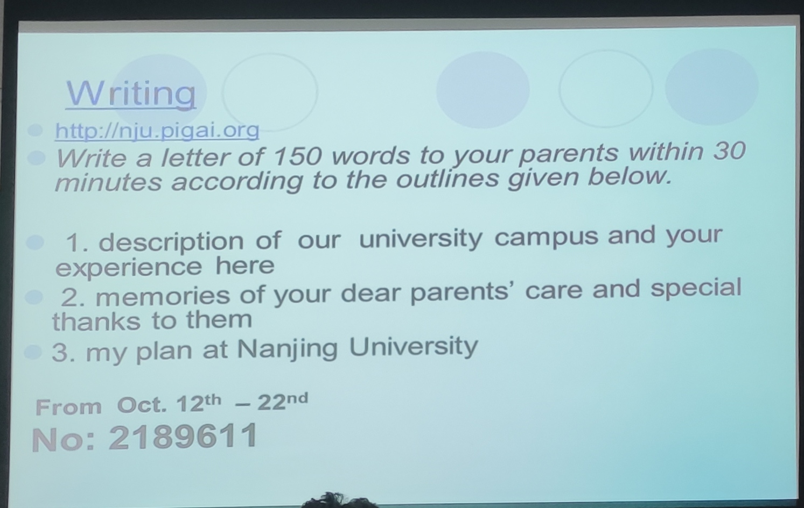

# 作文

Dear Mom and Dad,

How is everything going? I miss you very much. There has been a month since I came to Nanjing University where you and I visited last time. I know you want to know my school life so I will describe it for you.

First of all, I would like to give you the outlook of our university campus. Nanjing University is a place where you can see trees, greensward and shared bicycles everywhere so that its sky is very clean and beautiful. Furthermore, I spent several days trying most of dishes in different canteens in Nanjing University and I also finished military training, a wonderful experience.

In addition, I memory the care you sent to me in WeChat every night, which give me irreplaceable spirit to live and study independently. Besides, I have make a plan to schedule my school life including coding, studying and exercise. With the plan I believe that I will have colorful life in Nanjing University.

Above all, you don't need to worry me much, I think I can take care of myself. Best wishes to you.

Yours son

---

last but not least

spare no efforts to do