# Excel 数据比对

## 1. 准备工作

现在假设我们有两份表格, 一份是需要比对的比对表, 一份是拥有足够内容的数据库表.

我们要做的是, 比对数据库表和比对表对应姓名的行的号码是否一致.

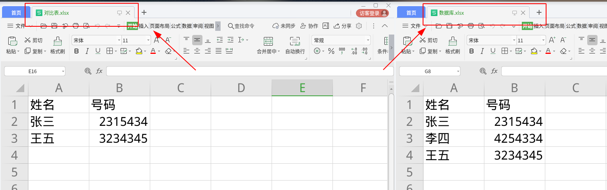

**为了避免对比表的数据遭到破坏, 我们要备份一个比对表.**

**为了避免对比表的数据遭到破坏, 我们要备份一个比对表.**

**为了避免对比表的数据遭到破坏, 我们要备份一个比对表.**

## 2. 复制数据

我们将数据库用到的行列复制到比对表中.

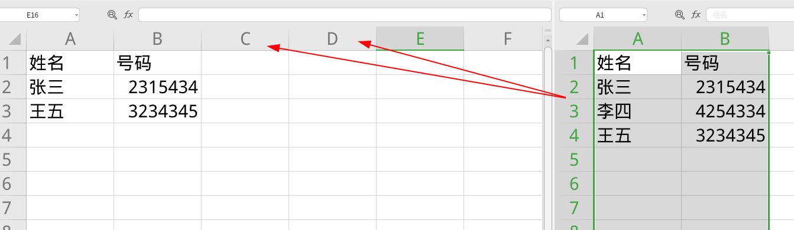

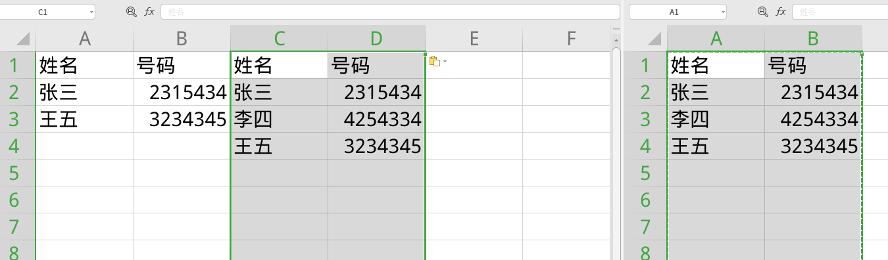

重新命名, 便于后续观察.

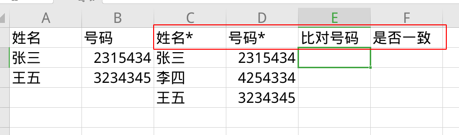

## 3. VLOOKUP 函数寻找数据

这一部分, 我们需要用到 VLOOKUP 函数, VLOOKUP 函数是 Excel 内置的一个单元格查找函数, 我们使用这个函数来匹配对应的数据.

VLOOKUP 函数究竟怎么写? 如图, 我们应该在单元格内输入 `=VLOOKUP(A2,C2:D2,2)`

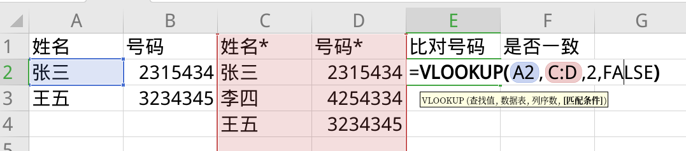

我们逐个分析这几个参数是什么意思:

1. `A2`: 这个参数代表了查找值, 一般来说, 就是 "姓名" 这一列数据, 而对于第二行第 A 列来说, 姓名位于 `A2`, 所以我们就填写 `A2`.
2. `C:D`: 这个参数代表了数据表, 即我们的搜寻范围. 因为我们复制的数据库表位于第 C 列和第 D 列, 所以这里我们填 `C:D`.
3. `2`: 这个参数, 代表了我们的显示结果应该是数据表里的第几列. 我们数据表填的 `C:D` 一共有两列, 我们需要的是第二列号码的数据, 所以这里我们填 `2`.
4. `FALSE`: 填写 FALSE 代表精确匹配, 这里我们填写的永远都是 `FALSE`.

最后回车, 发现两者已经一致了:

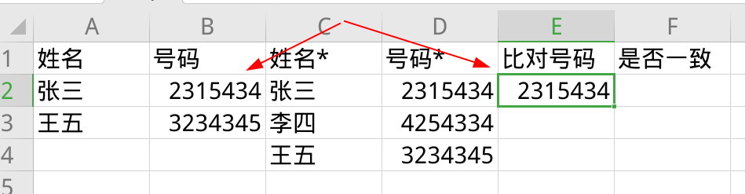

我们用小十字标向下拖拽, 就可以将这个表达式复制到同一列的表格中.

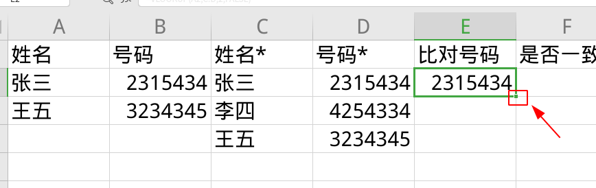

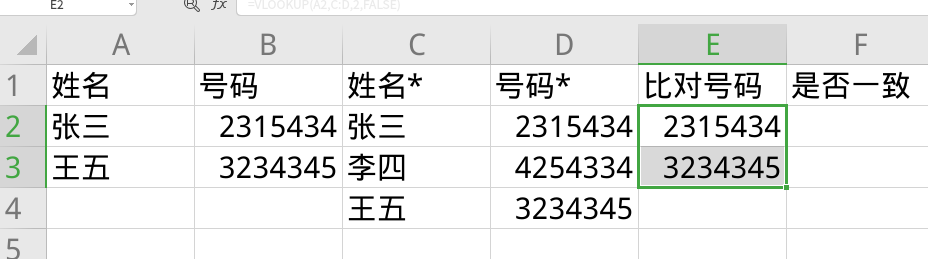

## 4. IF 函数比对数据

搜寻到正确的数据之后, 就需要进行比对. 一个一个数据比对十分麻烦, 十分伤眼睛, 也容易出错. 所以我们可以采用 IF 函数来比对数据, 简单且不易出错.

在是否一致的单元格中, 我们填入 `=IF(B2=E2,"√","不同")` 

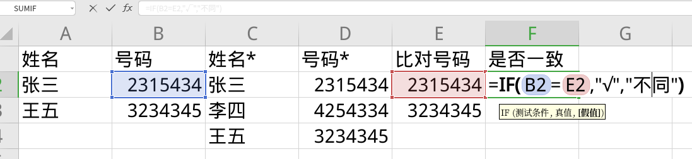

我们逐个分析这几个参数是什么意思:

1. `B2=E2`: 比较 `B2` 和 `E2` 这两个单元格是否相等. `B2` 单元格是原来的号码, `E2` 单元格是我们查找到的比对号码.
2. `"√"`: 相同时显示的内容, 这里采用 `√` 以便观察.
3. `"不同"`: 不同时显示的内容, 这里采用 `"不同"` 以便观察.

同样的, 回车, 拖拽, 我们看到效果如下:

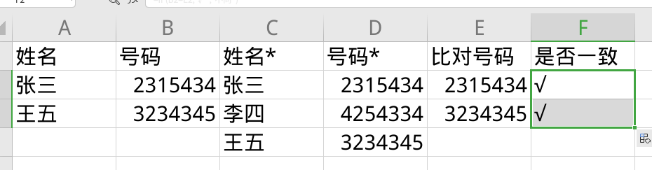

表明数据是一致的. 如果我们稍微修改一下 `B3` 单元格, 即王五的号码, 可以看出, 就出现了不同.

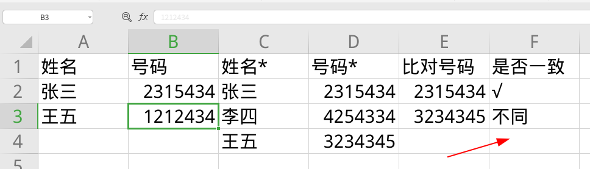

通过这种方式, 就可以很方便地比对数据了.

