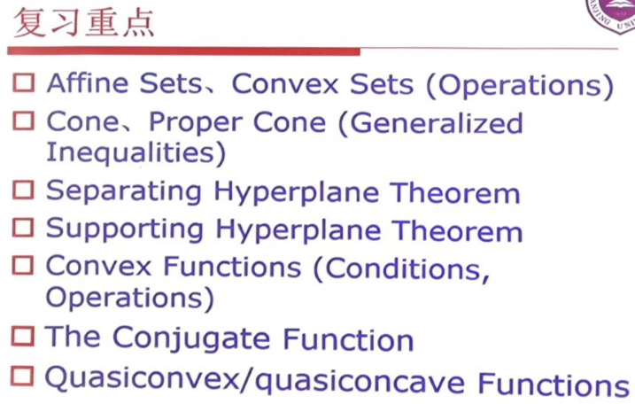
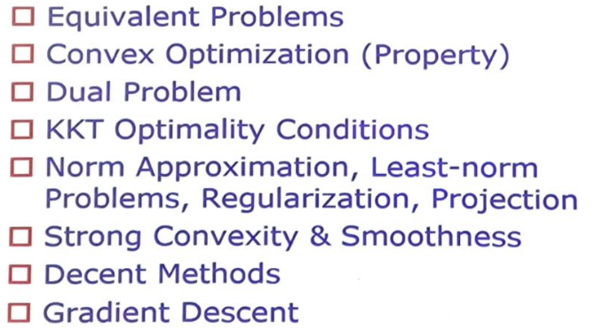

# 凸优化

## 复习重点

## 0. 前置知识

### 0.1 范数

- 非负性: $f(x)\geqslant 0$
- 正定性: 当且仅当 $x=0$ 时有 $f(x)=0$
- 齐次性: $f(tx)=|t|f(x)$
- 三角不等式: $f(x+y)\leqslant f(x)+f(y)$

对偶范数 $\|z\|_{*}=\sup \{z^{T}x|\|x\|\leqslant 1\}$, 因此有不等式 $z^{T}x\leqslant \|x\|\|z\|_{*}$

常见对偶范数存在关系 $\displaystyle \frac{1}{p}+\frac{1}{q}=1$

比如 $l_{2}$ 范数和 $l_{2}$ 范数自身是对偶范数.

还可以对矩阵定义算子范数:

$\|X\|_{a,b}=\sup \{\|Xu\|_{a}|\|u\|_{b}\leqslant 1\}$

当均为 Euclid 范数时, $X$ 的算子范数就是它的最大奇异值, 用 $\|X\|_{2}$ 表示, 称作谱范数

$\|X\|_{2}=\sigma_{\max}(X)=(\lambda_{\max}(X^{T}X))^{\frac{1}{2}}$

其对偶范数为奇异值之和, 称作核范数

$\|Z\|_{2*}=\sigma_1(Z)+\cdots+\sigma_{r}(Z)=tr(Z^{T}Z)^{\frac{1}{2}}$

$\displaystyle \|A\|_{F}=(\sum_{i=1}^{n}\sigma_{i}^{2})^{\frac{1}{2}}$

矩阵的 Frobenius 范数:

$\displaystyle \|X\|_{F}=(tr(X^{T}X))^{\frac{1}{2}}=(\sum_{i=1}^{m}\sum_{j=1}^{n}X_{ij}^{2})^{\frac{1}{2}}$

### 0.2 矩阵

$A$ 是对称矩阵记作 $A\in S^{n}$

$A$ 是半正定矩阵记作 $A\in S_{+}^{n}$

$A$ 是正定矩阵记作 $A\in S_{++}^{n}$

定义矩阵内积等于迹 $\left<A,B\right>=tr(A^{T}B)$

迹为对角线元素之和 $\displaystyle tr(A)=\sum_{i=1}^{n}a_{ii}$

特征值之和等于迹 $\displaystyle tr(A)=\sum_{i=1}^{n}\lambda_{i}$

迹的交换律 $tr(AB)=tr(BA)$

### 0.3 导数和梯度

导数, 记为 $Df(x)$, 定义为 $f(z)$ 近似为 $f(x)+Df(x)(z-x)$

梯度, 记为 $\nabla f(x)$, 定义为 $f(z)$ 近似为 $f(x)+\nabla f(x)^{T}(z-x)$

即 $\nabla f(x)=Df(x)^{T}$

- 对于 $\displaystyle f(x)=\frac{1}{2}x^{T}Px+q^{T}x+r$, 其中 $P\in S^{n}$, 有 $\nabla f(x)=Px+q$
- 对于 $\displaystyle f(X)=\log\det X$, 其中 $X\in S_{++}^{n}$, 有 $\nabla f(X)=X^{-1}$

### 0.4 链式法则

$Dh(x)=Dg(f(x))Df(x)$

也即有

$\nabla h(x)=\nabla f(x)\nabla g(f(x))$

### 0.5 二阶导数

$\displaystyle \nabla^{2}f(x)_{ij}=\frac{\partial^{2}f(x)}{\partial x_{i}\partial x_{j}}$

$\displaystyle \nabla^{2}g(x)=A^{T}\nabla^{2}f(Ax+b)A$

### 0.6 线性代数

$A$ 的值域记作 $\mathcal{R}(A)=\{Ax|x\in \mathbb{R}^{n}\}$

$\mathcal{R}(A)$ 的维度称作 $A$ 的秩.

$A$ 的零空间记作 $\mathcal{N}(A)=\{x|Ax=0\}$

$A$ 的正交补为 $A^{\perp}=\{x|z^{T}x=0 \text{ for all } z\in A\}$

一个基本结果为 $\mathcal{N}(A)=\mathcal{R}(A^{T})^{\perp}$

实对称矩阵 $A\in S^{n}$ 可因式分解为 $A=Q\Lambda Q^{T}$, 其中 $Q$ 为正交矩阵, $\Lambda$ 为对角线为特征值 $\lambda_{i}$ 的矩阵.

$A$ 的特征值分解为 $U\Sigma V^{T}$, 定义其伪逆为 $V\Sigma^{-1}U^{T}$

对于 $X=\begin{bmatrix} A & B \\ B^{T} & C \end{bmatrix}$ 的 Schur 补为 $S=C-B^{T}A^{-1}B$

## 1. 数学优化

### 1.1 优化问题

$
\begin{aligned}
\min \quad & f_0(x) \\
\mathrm{s.t.} \quad & f_{i}(x)\leqslant b_{i}
\end{aligned}
$

### 1.2 线性规划问题

目标函数和约束函数均为线性函数.

对于任意 $\alpha, \beta$, 有

$\displaystyle f_{i}(\alpha x+\beta y)=\alpha f_{i}(x)+\beta f_{i}(y)$

### 1.3 凸优化问题

目标函数和约束函数均为线性函数.

对于 $\alpha+\beta=1, \alpha\geqslant 0, \beta\geqslant 0$, 有

$\displaystyle f_{i}(\alpha x+\beta y)\leqslant \alpha f_{i}(x)+\beta f_{i}(y)$

### 1.4 最小二乘问题

$\displaystyle \min \|Ax-b\|_{2}^{2}=\sum_{i=1}^{k}(a_{i}^{T}x-b_{i})^{2}$

令梯度等于零

$2A^{T}(Ax-b)=0 \Rightarrow A^{T}Ax=A^{T}b \Rightarrow x=(A^{T}A)^{-1}A^{T}b$

$A\in \mathbb{R}^{k\times n}$, 则计算时间为 $n^{2}k$

### 1.5 线性规划问题

$
\begin{aligned}
\min \quad & c^{T}x \\
\mathrm{s.t.} \quad & a_{i}^{T}x\leqslant b_{i}
\end{aligned}
$

当 $m\geqslant n$ 时, 求解复杂度正比于 $n^{2}m$

Chebyshev 问题可以转化为线性规划问题.

### 1.6 凸优化问题

内点法可以在多项式时间内以给定精度求解凸优化问题.

## 2. 凸集

### 2.1 仿射集

任意 $x_1, x_2\in C$, 有 $\theta x_1+(1-\theta)x_2\in C$, 其中 $\theta\in \mathbb{R}$

我们称 $\theta_1x_1+\cdots+\theta_{k}x_{k}$ 为 $x_1,\cdots,x_{k}$ 的一个仿射组合, 其中 $\theta_1+\cdots+\theta_{k}=1$

$C$ 的仿射组合依然在 $C$ 中.

对于任意 $x_0\in C$, 我们有 $V=C-x_0$ 是一个子空间, 即对加法和数乘封闭.

线性方程组的解集是一个仿射集合, 反之亦然.

仿射包是包含 $C$ 最小的仿射集合, 记作 $\text{aff } C$

我们定义相对内部为 $C$ 在 $\text{aff } C$ 中的内部

$\text{relint } C=\{x\in C|B(x,r) \cap \text{aff } C\subseteq C \text{ for some } r > 0\}$

例如位于 $\mathbb{R}^{3}$ 中的一个正方形, 其内部为空, 但其相对内部却不为空.

### 2.2 凸集

任意 $x_1, x_2\in C$, 有 $\theta x_1+(1-\theta)x_2\in C$, 其中 $0\leqslant \theta\leqslant 1$

我们称 $\theta_1x_1+\cdots+\theta_{k}x_{k}$ 为 $x_1,\cdots,x_{k}$ 的一个凸组合, 其中 $\theta_1+\cdots+\theta_{k}=1$ 且 $\theta_{i}\geqslant 0$

$C$ 的凸组合依然在 $C$ 中.

我们称集合 $C$ 中所有点的凸组合的集合为凸包, 它是包含了 $C$ 的最小凸集, 记作 $\text{conv } C$

可以拓展到概率分布形式, 即 $\displaystyle E[x]=\int_{C}p(x)\mathrm{d}x\in C$

### 2.3 锥

任意 $x\in C, \theta\geqslant 0$, 有 $\theta x\in C$

即一堆从原点出发的射线的集合.

凸锥定义为任意 $x_1, x_2\in C, \theta_1, \theta_2\geqslant 0$, 有 $\theta_1x_1+\theta_2x_2\in C$

我们称 $\theta_1x_1+\cdots+\theta_{k}x_{k}$ 为 $x_1,\cdots,x_{k}$ 的一个凸组合, 其中 $\theta_{i}\geqslant 0$

锥包是包含 $C$ 的最小凸锥.

### 2.4 超平面

$\{x|a^{T}x=b\}$ 被称为超平面, 也可以写成 $\{x|a^{T}(x-x_0)=0\}$ 或 $x_0+a^{\perp}$

即与向量 $a$ 垂直的, 过 $x_0$ 的所有向量组成的超平面.

### 2.5 半空间

$\{x|a^{T}x\leqslant b\}$ 被称为半空间.

### 2.6 椭球

$\{x|(x-x_{c})^{T}P^{-1}(x-x_{c})\leqslant 1\}$, 其中 $P\in S_{++}^{n}$

### 2.7 范数锥

$\{(x,t)|\|x\|\leqslant t\}\subseteq \mathbb{R}^{n+1}$

### 2.8 多面体

多面体被定义为有限个等式和不等式的解集, 即有限个半空间和超平面的交集.

$\displaystyle P=\{x|Ax\preceq b, Cx=d\}$

### 2.9 单纯形

基于 $k+1$ 个仿射独立的向量构造的凸包, 是一个多面体, 被称为单纯形.

比如一维的线段, 二维的三角形.

单位单纯形: $x\succeq 0, 1^{T}x=1$

### 2.10 保凸运算

- 交集, 可以扩展到无穷个凸集的交集
  - 半正定锥
- 仿射函数, 即线性函数和一个常数的和
  - 伸缩 $kS$
  - 平移 $S+x_0$
  - 投影 $\{(x)|(x,y)\in S\}$
  - 集合的和 $S_1+S_2=\{x+y|x\in S_1, y\in S_2\}$
  - 集合的乘积 $S_1\times S_2$
  - 集合的部分和 $\{(x, y_1+y_2)|(x,y_1)\in S_1, (x,y_2)\in S_2\}$
- 线性分式
  - 透视 $P(z, t)=z / t$, 其中 $t\in \mathbb{R}_{++}$
  - 透视函数复合仿射函数得到线性分式函数

### 2.11 广义不等式

如果 $K$ 是闭的, 实的, 尖的凸锥, 则称为正常锥.

定义广义不等式为

$x\preceq_{K} y \Leftrightarrow y-x\in K$

$x\prec_{K} y \Leftrightarrow y-x\in \text{int } K$

常见的有非负象限和半正定锥. 前者常用于向量之间, 被称为分量不等式; 后者常用于矩阵之间, 称为矩阵不等式.

### 2.12 最小与极小元

对任意 $y\in S$, 均有 $x\preceq_{K}y$, 则称 $x$ 为 $S$ 的最小元, 最小元存在时是唯一的, 也可以定义为 $S\subseteq x+K$.

如果 $y\in S$ 且 $y\preceq_{K}x$ 可推出 $y=x$, 则称 $x$ 为 $S$ 的极小元, 极小元可以有很多个, 也可以定义为 $(x-K)\cap S=\{x\}$.

### 2.13 超平面分离定理

两个不相交的凸集可以找到一个超平面将它们分离.

分离为 $a^{T}x\geqslant b$ 对于 $x\in C$ 且 $a^{T}x\leqslant b$ 对于 $x\in D$

严格分离为 $a^{T}x>b$ 对于 $x\in C$ 且 $a^{T}x<b$ 对于 $x\in D$

其中至少一个为开集时, 逆定理成立.

### 2.14 支撑超平面定理

$x_0$ 是边界上一点 $x_0\in \text{bd }C=\text{cl }C \ \text{int }C$

若 $a\neq 0$ 且对任意 $x\in C$ 满足 $a^{T}x\leqslant a^{T}x_0$, 则称 $\{x|a^{T}(x-x_0)=0\}$ 为在点 $x_0$ 处的支撑超平面.

类比切线.

任何凸集的边界上任意一点均存在支撑超平面.

当 $C$ 具有非空内部且是闭的, 边界上每一点存在支撑超平面, 则是一个凸集.

### 2.15 对偶锥

$K^{*}=\{y|x^{T}y\geqslant 0, \forall x\in K\}$

$y\in K^{*}$ 当且仅当 $-y$ 是 $K$ 在原点的一个支撑超平面的法线.

与锥中任何一个向量均形成锐角或直角的向量组成的锥.

子空间的对偶锥是它的正交补.

非负象限的对偶锥是它自身.

半正定锥的对偶锥是它自身.

- $K^{*}$ 是闭凸锥
- $K_1\subseteq K_2$ 可得 $K_2^{*}\subseteq K_1^{*}$
- $K^{**}$ 是 $K$ 的凸包的闭包
- 正常锥的对偶锥也是正常锥

## 3.  凸函数

### 3.1 凸函数

$f(\theta x+(1-\theta)y)\leqslant \theta f(x)+(1-\theta)f(y)$

### 3.2 一阶条件

一阶可微, 定义域是凸集且 $f(y)\geqslant f(x)+\nabla f(x)^{T}(y-x)$

必要性:

对任意 $0<t\leqslant 1$ 有 $x+t(y-x)\in \text{dom }f$

有 $f(x+t(y-x))\leqslant (1-t)f(x)+tf(y)$

两边同时除 $t$ 得 $\displaystyle f(y)\geqslant f(x)+\frac{f(x+t(y-x))-f(x)}{t}$

令 $t\to 0$ 即可.

充分性:

令 $z=\theta x+(1-\theta)y$

则有 $f(x)\geqslant f(z)+f'(z)(x-z)$ 和 $f(y)\geqslant f(z)+f'(z)(y-z)$

两式相加即可.

一般情况, 令 $g(t)=f(ty+(1-t)x)$, 则 $g'(t)=\nabla f(ty+(1-t)x)^{T}(y-x)$

由 $g(1)\geqslant g(0)+g'(0)$ 可得 $f(y)\geqslant f(x)+\nabla f(x)^{T}(y-x)$

反之则用 $g(t)\geqslant g(\tilde{t})+g'(\tilde{t})(t-\tilde{t})$

即将高维 $f$ 转化为一维 $g$.

### 3.3 二阶条件

二阶可微, 定义域是凸集且 $\nabla^{2}f(x)\succeq 0$

### 3.4 例子

- 指数函数 $e^{ax}$
- 幂函数 $x^{a}$ 对于 $a\geqslant 1$ 或 $a\leqslant 0$ 在 $\mathbb{R}_{++}$
- 绝对值幂函数 $|x|^{p}$ 对于 $p\geqslant 1$
- 对数函数 $\log x$ 在 $\mathbb{R}_{++}$
- 负熵 $x\log x$ 在 $\mathbb{R}_{+}$
- 范数 $\|x\|$
- 最大值函数 $\max\{x_1,\cdots,x_{n}\}$ 在 $\mathbb{R}^{n}$
- 二次线性分式函数 $x^{2} / y$ 在 $\mathbb{R}\times \mathbb{R}_{++}$
  - Hessian 矩阵
- 指数和的对数 $\log(e^{x_1}+\cdots+e^{x_{n}})$ 在 $\mathbb{R}^{n}$
- 几何平均 $-(\prod_{i=1}^{n}x_{i})^{1/n}$ 在 $\mathbb{R}_{++}^{n}$
- 对数行列式 $\log\det X$ 在 $S_{++}^{n}$
  - $g(t)=f(Z+tV)$

### 3.5 下水平集

$C_{\alpha}=\{x\in \text{dom }f|f(x)\leqslant \alpha\}$

凸函数的下水平集是凸集. 反之则不然.

### 3.6 上境图

$\text{epi } f = \{(x,t)|x\in \text{dom }f, f(x)\leqslant t\}$

函数是凸函数当且仅当其上境图是凸集.

例如 $x^{T}Y^{-1}x\leqslant t$ 可以化作 Schur 补 $\begin{bmatrix} Y &x \\ x^{T} &t \\\end{bmatrix}\succeq 0$

### 3.7 保凸运算

- 非负加权求和 $f=w_1f_1+\cdots+w_{m}f_{m}$
  - $\displaystyle g(x)=\int_{A}w(y)f(x,y)\mathrm{d}y$
- 复合仿射映射 $g(x)=f(Ax+b)$
- 逐点最大 $f(x)=\max\{f_1(x), f_2(x)\}$
  - 分片线性函数, 一系列仿射函数的逐点最大函数
  - 最大 $r$ 个分量之和
- 逐点上确界 $\displaystyle g(x)=\sup_{y\in A}f(x,y)$, $f(x,y)$ 关于 $x$ 是凸函数
  - 集合的支撑函数 $\displaystyle S_{C}(x)=\sup_{y\in C}x^{T}y$
  - 到集合中最远点的距离 $\displaystyle f(x)=\sup_{y\in C}\|x-y\|$
  - 对称矩阵最大特征值 $\displaystyle f(X)=\sup\{y^{T}Xy|\|y\|_{2}=1\}$
  - 矩阵范数, 即矩阵最大奇异值 $\displaystyle f(X)=\|X\|_{2}=\sup\{u^{T}Xv|\|u\|_{2}=1, \|v\|_{2}=1\}$
- 复合 $f(x)=h(g(x))$
  - 标量复合 $h: \mathbb{R}\to \mathbb{R}, g: \mathbb{R}^{n}\to \mathbb{R}$
    - $f''(x)=h''(g(x))g'(x)^{2}+h'(g(x))g''(x)$
    - 先看 $h$ 是凸是凹, 定基调, 再看是否满足 $h'$ 与 $g''$ 同号
  - 矢量复合
    - $f''(x)=g'(x)^{T}\nabla^{2}h(g(x))g'(x)+\nabla h(g(x))^{T}g''(x)$
    - $h$ 是凸函数, 且每维分量 $h$ 非减, $g_{i}$ 是凸函数
    - $h$ 是凸函数, 且每维分量 $h$ 非增, $g_{i}$ 是凹函数
- 最小化 $\displaystyle g(x)=\inf_{y\in C}f(x,y)$, $f(x,y)$ 关于 $(x, y)$ 是凸函数
  - 到凸集的距离 $\mathrm{dist}(x, S)=\inf_{y\in S}\|x-y\|$
- 透视函数 $g(x,t)=tf(x/t)$

### 3.8 共轭函数

$\displaystyle f^{*}(y)=\sup_{x\in \text{dom } f} (y^{T}x-f(x))$

共轭函数是一系列仿射函数的逐点上确界, 因此也是凸函数.

如果可微, 则求解 $f'(x)=y$ 得 $x$ 代入即可.

- 仿射函数 $f(x)=ax+b$ 则 $f^{*}(a)=-b$
- 负对数函数 $f(x)=-\log x$ 则 $x=-1/y$ 且 $f^{*}(y)=-\log(-y)-1$
- 指数函数 $f(x)=e^{x}$ 则 $x=\log y$ 且 $f^{*}(y)=y\log y-y$
- 负熵函数 $f(x)=x\log x$ 则 $x=e^{y-1}$ 且 $f^{*}(y)=e^{y-1}$
- 严格凸二次函数 $f(x)=\frac{1}{2}x^{T}Qx, Q\in S_{++}^{n}$ 则 $x=Q^{-1}y$ 且 $f^{*}(y)=\frac{1}{2}yQ^{-1}y$
- 范数 $f^{*}(y)=0, \|y\|_{*}\leqslant 1$
- 范数平方 $f(x)=\frac{1}{2}\|x\|^{2}$ 则 $f^{*}(y)=\frac{1}{2}\|y\|_{*}^{2}$

Fenchel 不等式 (可微时即为 Young 不等式):

$\displaystyle f(x)+f^{*}(y)\geqslant x^{T}y$

例如 $x^{T}y\leqslant \frac{1}{2}x^{T}Qx+\frac{1}{2}y^{T}Q^{-1}y$

闭凸函数的两次共轭函数是自身, 即 $f^{**}=f$

### 3.9 拟凸函数

定义域和所有下水平集 $S_{\alpha}=\{x\in \text{dom }f|f(x)\leqslant \alpha\}$ 均为凸集的函数.

基本性质:

$f(\theta x+(1-\theta)y)\leqslant \max\{f(x), f(y)\}$

一阶条件:

$f(y)\leqslant f(x) \Rightarrow \nabla f(x)^{T}(y-x)\leqslant 0$

二阶条件:

$y^{T}\nabla f(x)=0 \Rightarrow y^{T}\nabla^{2}f(x)y\geqslant 0$

$f'(x)=0 \Rightarrow f''(x)\geqslant 0$

## 4. 优化问题

### 4.1 凸优化问题

$
\begin{aligned}
\min \quad & f_0(x) \\
\mathrm{s.t.} \quad & f_{i}(x)\leqslant 0, & i=1,2,\cdots,m \\
& Ax=b 
\end{aligned}
$

设 $f_0$ 为凸优化问题的目标函数, $X$ 为其可行集.

最优性准则:

$x\in X$ 是最优解, 当且仅当 $\nabla f_0(x)^{T}(y-x)\geqslant 0, \forall y\in X$

## 5. 对偶

### 5.1 Lagrange 对偶函数

标准形式优化问题:

$
\begin{aligned}
\min \quad & f_0(x) \\
\mathrm{s.t.} \quad & f_{i}(x)\leqslant 0, & i=1,2,\cdots,m \\
& h_{i}(x)=0 & i=1,2,\cdots,p
\end{aligned}
$

Lagrange 函数:

$\displaystyle L(x,\lambda,v)=f_0(x)+\sum_{i=1}^{m}\lambda_{i}f_{i}(x)+\sum_{i=1}^{p}v_{i}h_{i}(x)$

Lagrange 对偶函数:

$\displaystyle g(\lambda, v)=\inf_{x\in D}L(x,\lambda,v)=\inf_{x\in D}(f_0(x)+\sum_{i=1}^{m}\lambda_{i}f_{i}(x)+\sum_{i=1}^{p}v_{i}h_{i}(x))$

对偶函数总是凹函数, 因为是一系列仿射函数的逐点下确界.

对任何 $\lambda\succeq 0$ 和 $v$ 均有 $g(\lambda, v)\leqslant p^{*}$ 成立.

### 5.2 Lagrange 对偶问题

对偶问题:

$
\begin{aligned}
\max \quad & g(\lambda, v) \\
\mathrm{s.t.} \quad & \lambda\succeq 0
\end{aligned}
$

对偶问题是一个凸优化问题. 其对偶最优解 $(\lambda^{*}, v^{*})$ 也叫最优 Lagrange 乘子.

但是实际上 $g(\lambda,v)$ 存在隐式约束, 即它的非 $-\infty$ 定义域.

我们用 $d^{*}$ 表示 Lagrange 对偶问题的最优值, $p^{*}$ 表示原问题的最优值.

$p^{*}-d^{*}$ 为原问题的最优对偶间隙.

### 5.3 强对偶性

如果 $d^{*}=p^{*}$ 成立, 那么强对偶性成立.

Slater 条件:

如果原问题是凸优化问题, 并且满足 Slater 条件, 即

存在一点 $x\in \text{relint }D$ 使得 $f_{i}(x)<0$ 与 $Ax=b$ 成立, 也称为严格成立, 则强对偶性成立.

如果部分 $f_{i}(x)$ 是仿射函数, 则只需仿射函数 $f_{i}(x)\leqslant 0$ 即可.

### 5.4 KKT 最优性条件

如果强对偶性成立, 最优解必须满足 KKT 条件.

因为我们知道 $L(x,\lambda^{*},v^{*})$ 在 $x^{*}$ 处的导数必须为零, 即

$\displaystyle \nabla f_0(x^{*})+\sum_{i=1}^{m}\lambda_{i}^{*}\nabla f_{i}(x^{*})+\sum_{i=1}^{p}v_{i}^{*}\nabla h_{i}(x^{*})=0$

因此, 我们有 KKT 条件:

$
\begin{aligned}
f_{i}(x^{*})\leqslant 0, \quad & i=1,2,\cdots,m \\
h_{i}(x^{*})= 0, \quad & i=1,2, \cdots,p \\
\lambda_{i}^{*}\geqslant 0, \quad & i=1,2,\cdots,m \\
\lambda_{i}^{*}f_{i}(x^{*})=0, \quad & i=1,2,\cdots,m \\
\nabla f_0(x^{*})+\sum_{i=1}^{m}\lambda_{i}^{*}\nabla f_{i}(x^{*})+\sum_{i=1}^{p}v_{i}^{*}\nabla h_{i}(x^{*})=0, \quad
\end{aligned}
$

对于非凸问题, 最优解和 KKT 条件只是单向的.

对于凸问题, 满足 KKT 条件的点也是原问题和对偶问题的最优解, 是双向的.

## 6. 应用

### 6.1 范数逼近

$\min\|Ax-b\|$

### 6.2 强凸性

存在 $m>0$ 使得 $\nabla^{2}f(x)\succeq mI$, 则有

1. 二次下界不等式 $\displaystyle f(y)\geqslant f(x)+\nabla f(x)^{T}(y-x)+\frac{m}{2}\|y-x\|_{2}^{2}$
2. 次优性条件 $\displaystyle f(x)-p^{*}\leqslant \frac{1}{2m}\|\nabla f(x)\|_{2}^{2}$, 即梯度足够小, 则解接近最优
3. 上界 $\displaystyle \|x^{*}-x\|_{2}\leqslant \frac{2}{m}\|\nabla f(x)\|_{2}$

### 6.3 平滑性

存在 $M>0$ 使得 $\nabla^{2}f(x)\preceq MI$, 则有

1. 二次上界不等式 $\displaystyle f(y)\leqslant f(x)+\nabla f(x)^{T}(y-x)+\frac{M}{2}\|y-x\|_{2}^{2}$
2. 梯度上界 $\displaystyle \frac{1}{2M}\|\nabla f(x)\|_{2}^{2}\leqslant f(x)-p^{*}$

### 6.4 下降方法

一个优化点列 $x^{(k+1)}=x^{(k)}+t^{(k)}\Delta x^{(k)}$

此处 $\Delta x$ 是一个向量, 被称为步径或搜索方向; $t^{(k)}$ 被称为第 $k$ 次迭代的步进或步长.

只要不是最优点就成立 $f(x^{(k+1)})<f(x^{(k)})$

因此一个下降方法中的搜索方向必须满足 $\nabla f(x^{(k)})^{T}\Delta x^{(k)}<0$

即它和负梯度方向的夹角必须是锐角.

选取 $\Delta x=-\nabla f(x)$ 是一种很自然的选择, 相应的方法被称为梯度下降法.

选取 $t^{(k)}$ 的方法有精准直线搜索和回溯直线搜索.

精确直线搜索: $\displaystyle t=\argmin_{s\geqslant 0}f(x+s\Delta x)$

回溯直线搜索:

给定参数 $\alpha\in (0,0,5), \beta\in (0,1)$, 初始值 $t:=1$

如果 $f(x+t\Delta x)>f(x)+\alpha t\nabla f(x)^{T}\Delta x$, 则令 $t:=\beta t$

