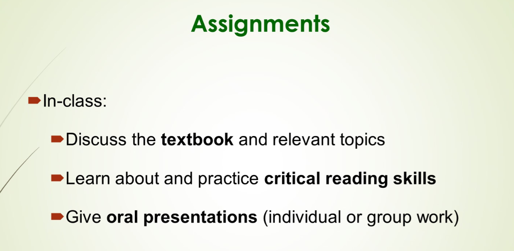
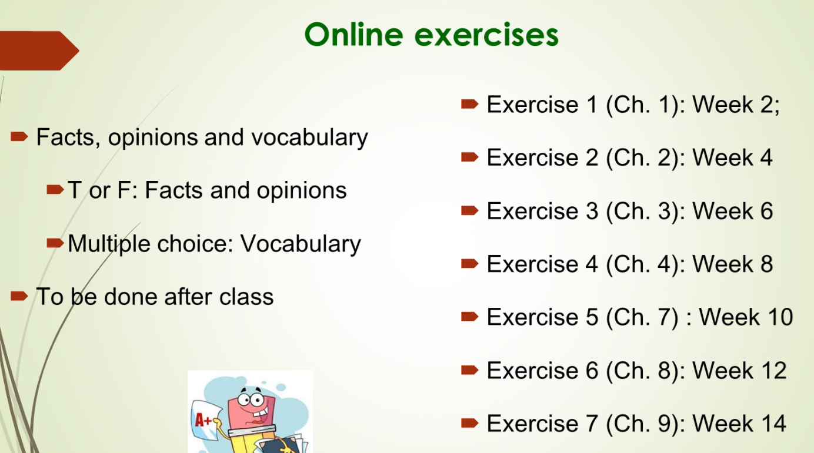
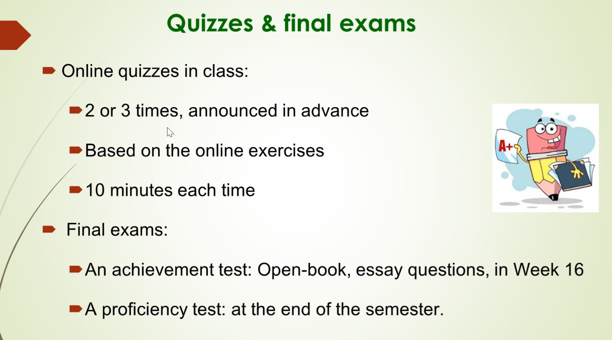
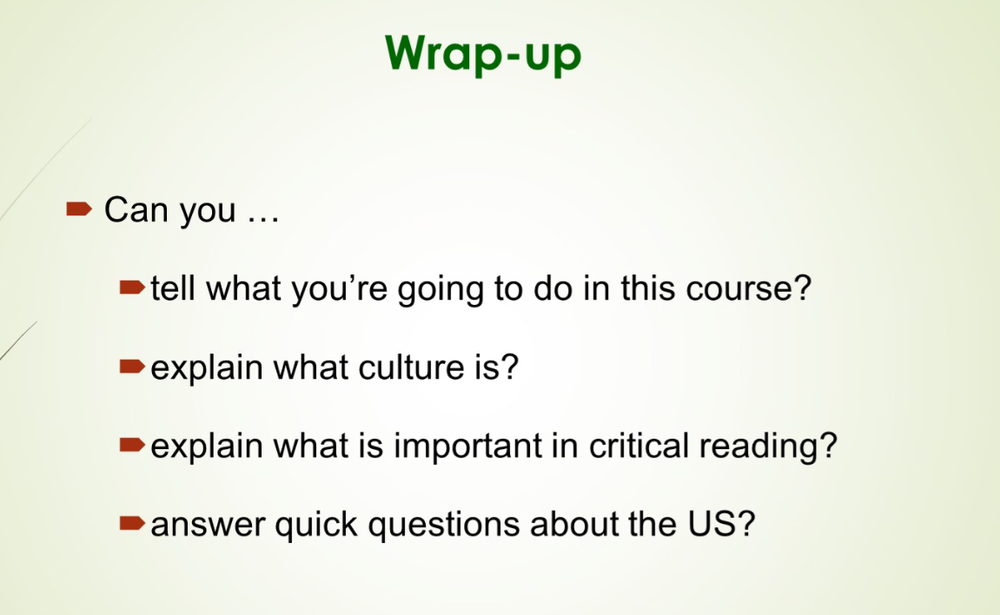

## Before you read

### Vocabulary: A

1. Yes. Different languages and different customs reveal the ethnic diversity.

2. Yes. For better experience in foreign countries, most people will plan to learn foreign languages.

3. I don't think so. With technology developing rapidly, it is possible that live in foreign country without learning foreign language.

4. I can search necessary information through the Internet.

5. English.

6. Yes. Because climate of a country affects the living quality.

### Vocabulary: B

1. convince
2. reveal
3. culture
4. job
5. participant

---

working: temporary

---

## Small size

1. lack of resources
2. difficulties of national defence

## Americans

1. They act contradictorily.

2. The United States is a country where immigrants gather.

3. Americans today are worried about racial discrimination.

## Chinese

1. Chinese act peacefully.

2. Chinese is a country where people fight for happiness.

3. Americans today are worried about poverty.

## Academic Word List (AWL)

