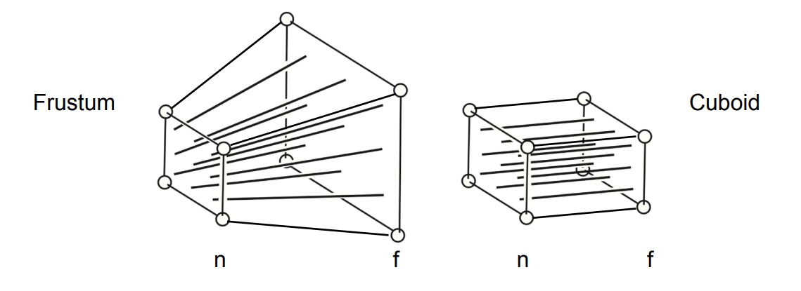

# 变换 (Transformation)

## 1. 旋转矩阵与正交矩阵

我们知道旋转 $\theta$ 角的矩阵是

$\mathbf{R}(\theta)=\begin{bmatrix} \cos\theta &-\sin\theta \\ \sin\theta &\cos\theta \\\end{bmatrix}$

而旋转 $-\theta$ 角的矩阵是

$\mathbf{R}(-\theta)=\begin{bmatrix} \cos\theta &\sin\theta \\ -\sin\theta &\cos\theta \\\end{bmatrix}=\mathbf{R}(\theta)^{T}$

根据定义我们又知道

$\mathbf{R}(-\theta)=\mathbf{R}(\theta)^{-1}$

所以可以看出 $\mathbf{R}(\theta)^{-1}=\mathbf{R}(\theta)^{T}$

所以我们又称旋转矩阵为 **正交矩阵**。

## 2. 绕任意轴旋转

沿着轴 $\mathbf{n}$ 旋转 $\alpha$ 角的矩阵：

$\mathbf{R}(\mathbf{n},\alpha)=\cos(\alpha)\mathbf{I}+(1-\cos(\alpha))\mathbf{n}\mathbf{n}^{T}+\sin(\alpha)\begin{bmatrix} 0 &-n_{z} &n_{y} \\ n_{z} &0 &-n_{x} \\ -n_{y} &n_{x} &0 \\\end{bmatrix}$

后面的那个矩阵是 $\mathbf{n}$ 的对偶矩阵。

## 3. 视角变换（View / Camera Transformation）

我们要让：

- 相机位置（Position）$\vec{e}$ 处于原点；
- 朝向（Look-at / gaze direction）$\hat{g}$ 为 $-z$ 轴；
- 向上方向（Up direction）$\hat{t}$ 为 $y$ 轴。

所以我们的 **视角变换矩阵** $\mathbf{M}_{view}$ 应该为：

1. 平移 $\vec{e}$ 到原点；
2. 旋转 $\hat{g}$ 到 $-z$ 轴；
3. 旋转 $\hat{t}$ 到 $y$ 轴；
4. 旋转 $\hat{g}\times \hat{t}$ 到 $x$ 轴。

所以 $\mathbf{M}_{view}=\mathbf{R}_{view}\mathbf{T}_{view}$，其中

$\mathbf{T}_{view}=\begin{bmatrix} 1 &0 &0 &-x_{e} \\ 0 &1 &0 &-y_{e} \\ 0 &0 &1 &-z_{e} \\ 0 &0 &0 &1 \\\end{bmatrix}$

$\mathbf{R}_{view}=\begin{bmatrix} x_{\hat{g}\times \hat{t}} & y_{\hat{g}\times \hat{t}}& z_{\hat{g}\times \hat{t}} & 0 \\ x_{t} & y_{t}& z_{t}& 0\\ x_{-g} &y_{-g} &z_{-g} &0 \\ 0 &0 &0 &1 \\\end{bmatrix}$, 由于 $\mathbf{R}_{view}^{-1}=\begin{bmatrix} x_{\hat{g}\times \hat{t}} & x_{t} & x_{-g} & 0 \\ y_{\hat{g}\times \hat{t}} & y_{t}& y_{-g}& 0\\ z_{\hat{g}\times \hat{t}} &z_{t} &z_{-g} &0 \\ 0 &0 &0 &1 \\\end{bmatrix}$

## 4. 正交投影（Orthographic projection）

通俗地来说，我们将视角变换到朝向 $-z$ 轴后，我们只要把任意一点的坐标中的 $z$ 坐标去掉，就成为正交投影了。但是这样做会损失很多信息，也不能表现出物体和物体之间的遮掩效果。

所以，我们定义 **正交投影** 为：

将一个 **立方体** $[l, r]\times [b, t]\times [f, n]$ 映射到标准立方体（canonical cube）$[-1,1]^{3}$ 上。

其中 $l$ 为 左（left），$r$ 为右（right），$b$ 为下（bottom），$t$ 为上（top），$f$ 为远（far），$n$ 为近（near）。

需要注意的是，由于我们视角是朝向 $-z$ 轴的，所以在数值上会有 $f < n$ 这个不等式。

我们可以通过一下步骤构造出变换矩阵。

1. 将立方体中心移至原点处；
2. 将立方体缩放到标准立方体大小。

$\mathbf{M}_{ortho}=\begin{bmatrix} \frac{2}{r-l} &0 &0 &0 \\ 0 &\frac{2}{t-b} &0 &0 \\ 0 &0 &\frac{2}{n-f} &0 \\ 0 &0 &0 &1 \\\end{bmatrix}\begin{bmatrix} 1 &0 &0 &-\frac{r+l}{2} \\ 0 &1 &0 &-\frac{t+b}{2} \\ 0 &0 &1 &-\frac{n+f}{2} \\ 0 &0 &0 &1 \\\end{bmatrix}$

## 5. 透视投影（Perspective projection）

我们打算将一个 **四角锥台**（Frustum）压缩成为一个立方体，然后在进行正交投影将其变为标准立方体，这一整个过程就是 **透视投影**。

我们主要研究前一个步骤，「从透视到正交」，即如何将四角锥台压缩成为一个立方体。我们给出以下三个规定：

- 近平面 $n$ 永远不变；
- 远平面 $f$ 上任意一点 $z$ 坐标值不变；
- 远平面中心点永远为 $(0, 0, f)$。（其实我们并不需要这条规定也能推导）

首先对四角锥台上任意一个点 $(x, y, z)$ 和其变换后的点 $(x', y', z')$，根据相似三角形性质我们可知

$\displaystyle x'=\frac{n}{z}x,\quad y'=\frac{n}{z}y$

注意，此时我们并不知道 $z'$ 的值为多少，我们只知道 $x',y'$ 的值，以实现「新平面大小与近平面相同」而达到「压缩成立方体」的效果。

以向量形式书写即为：

$\begin{bmatrix} x \\ y \\ z \\ 1 \\\end{bmatrix} \Rightarrow \begin{bmatrix} nx/z \\ ny/z \\ ? \\ 1 \\\end{bmatrix} = \begin{bmatrix} nx \\ ny \\ ? \\ z \\\end{bmatrix}$

所以我们初步获取变换矩阵的信息：

$\mathbf{M}_{persp\to ortho}=\begin{bmatrix} n &0 &0 &0 \\ 0 &n &0 &0 \\ ? & ?& ?&? \\ 0 & 0& 1&0 \\\end{bmatrix}$

注意最后一行是 $[0, 0, 1, 0]$ 而不是 $[0,0,0,1]$。

我们再使用「近平面 $n$ 永远不变」这一信息，也就是

$\begin{bmatrix} x \\ y \\ n \\ 1 \\\end{bmatrix} \Rightarrow \begin{bmatrix} x \\ y \\ n \\ 1 \\\end{bmatrix} = \begin{bmatrix} nx \\ ny \\ n^{2} \\ n \\\end{bmatrix}$

因为第三行的结果 $n^{2}$ 与 $x, y$ 取值无关，所以第三行可以记为 $\begin{bmatrix} 0 & 0 & A & B \\\end{bmatrix}$，那么有

$\begin{bmatrix} 0 & 0 & A & B \\\end{bmatrix}\begin{bmatrix} x \\ y \\ n \\ 1 \\\end{bmatrix}=An+B=n^{2}$

我们再使用「远平面 $f$ 上任意一点 $z$ 坐标值不变」这一信息，则可得

$\begin{bmatrix} x \\ y \\ f \\ 1 \\\end{bmatrix} \Rightarrow \begin{bmatrix} x' \\ y' \\ f \\ 1 \\\end{bmatrix} = \begin{bmatrix} fx' \\ fy' \\ f^{2} \\ f \\\end{bmatrix}$

所以我们又有

$\begin{bmatrix} 0 & 0 & A & B \\\end{bmatrix}\begin{bmatrix} x \\ y \\ f \\ 1 \\\end{bmatrix}=Af+B=f^{2}$

最后统一解得 $A=n+f, B=-nf$

也就是有

$\mathbf{M}_{persp\to ortho}=\begin{bmatrix} n &0 &0 &0 \\ 0 &n &0 &0 \\ 0 & 0& n+f & -nf \\ 0 & 0& 1&0 \\\end{bmatrix}$

那么还有一个问题：「近平面和远平面之间的点的 $z$ 坐标会如何变化？」

实际上，设 $(x',y',z')$ 是中间点 $(x,y,z)$ 映射后的点，对于这些中间点来说，我们有

$\begin{bmatrix} n &0 &0 &0 \\ 0 &n &0 &0 \\ 0 & 0& n+f & -nf \\ 0 & 0& 1&0 \\\end{bmatrix}\begin{bmatrix} x \\ y \\ z \\ 1 \\\end{bmatrix}=\begin{bmatrix}n x\\n y\\ z(f+n)-fn\\z\end{bmatrix}$

也就是说，新的 $z$ 坐标为

$\displaystyle z' = f + n - \frac{fn}{z}$，其中 $f<z<n<0$

我们令 $\displaystyle g(z)=z-z'=z+\frac{fn}{z}-f-n$，其中 $g(f)=g(n)=0$

求导得 $\displaystyle g'(z)=1-\frac{fn}{z^{2}}=\frac{z^{2}-fn}{z^{2}}$，当 $z=\sqrt{fn}$ 时 $g'(z)=g'(\sqrt{fn})=0$

而 $\displaystyle g'(f)=\frac{f(f-n)}{f^{2}}>0$， $\displaystyle g'(f)=\frac{n(n-f)}{n^{2}}<0$，注意此处 $f<n<0$

所以 $g(z)$ 先递增后递减，也就是有 $g(z)>0$，即有

$\displaystyle f+n-\frac{fn}{z}<z$ 即 $z'<z$

也就是新的 $z$ 坐标值更接近「远平面」，并且表达式的值只与 $z$ 有关，与 $x,y$ 无关，所以与近平面远平面平行的平面，映射后依然形成一个平面。

