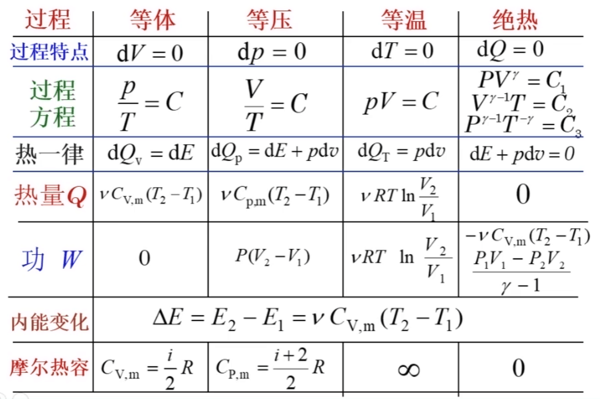

### 旋转坐标系

一般关系式: $\displaystyle(\frac{{\rm d}\boldsymbol{A}}{{\rm d}t})_S=(\frac{{\rm d}\boldsymbol{A}}{{\rm d}t})_{S'}+\boldsymbol{\omega}\times\boldsymbol{A}$

将位置矢量带入得速度: $\displaystyle\frac{{\rm d}\boldsymbol{r}}{{\rm d}t}=\frac{{\rm d}\boldsymbol{r}}{{\rm d}t'}+\boldsymbol{\omega}\times\boldsymbol{r}$

再带入得加速度: $\displaystyle\frac{{\rm d}\dot{\boldsymbol{r}}}{{\rm d}t}=\frac{{\rm d}\dot{\boldsymbol{r}}}{{\rm d}t'}+\boldsymbol{\omega}\times\dot{\boldsymbol{r}}=\frac{{\rm d}^2\boldsymbol{r}}{{\rm d}t'^2}+2\boldsymbol{\omega}\times\frac{{\rm d}\boldsymbol{r}}{{\rm d}t}+\boldsymbol{\omega}\times(\boldsymbol{\omega}\times\boldsymbol{r})$

### 伯努利方程

伯努利方程为 $\displaystyle p+\frac{1}{2}\rho v^2+\rho gz=C$, 其中 $C$ 为常量.

可以用于求流体力学里的压强. 同时可以解释伯努利现象.

### 旋转坐标系中的各种量

在旋转坐标系中:

* 角速度 $\dot\theta$ 的地位等同于惯性系的速度;
* 角加速度 $\ddot\theta$ 的地位等同于惯性系的加速度; 
* 转动惯量 $\displaystyle I=\int\rho^2{\rm d}m$ 的地位等同于惯性系的质量;
* 力矩 $\boldsymbol{F}\times\boldsymbol{r}$ 的地位等同于惯性系里的力;
* 角动量 $L=r×p=r×mv=mr×v$ 的地位等同于惯性系的动量;
* 转动动能 $\displaystyle E=\frac{1}{2}I\dot\theta^2$.

角动量大小 $L=|r×p|=|r×mv|=m|r×v|=2mS'$.

并且我们有角动量定理: 质点所受的合外力矩等于它的角动量对时间的变化率.

类似牛顿第二定律: $\displaystyle\boldsymbol{F}\times\boldsymbol{r}=I\ddot\theta=\int\rho{\rm d}m \ddot\theta$

圆环以直径为轴旋转时的转动惯量为 $\displaystyle I=2\int_0^\pi\frac{m}{2\pi R}(R\sin\theta)^2{\rm d}\theta=\frac{1}{2}mR^2$

圆球的转动惯量为: $\displaystyle I=\int{\rm d}m(r\sin\theta)^2=\int\frac{m}{\frac{4}{3}\pi R^3}[2\pi(r\sin\theta)r{\rm d}r{\rm d}\theta](r\sin\theta)^2=\frac{2}{5}mR^2$

木棍沿着中心的转动惯量为: $\displaystyle I=\int_{-\frac{l}{2}}^{\frac{l}{2}}\frac{m}{l}{\rm d}xx^2=\frac{1}{12}ml^2$

平行轴定理, 可以实现两个不同的平行轴之间转动惯量的转换, 其中 $I_C$ 为经过质心的转轴的转动惯量, $d$ 为两个轴之间的距离: $I=I_C+md^2$

使用平行轴定理可知, 木棍沿着端点的轴的转动惯量为: $\displaystyle I=\frac{1}{12}ml^2+m(\frac{l}{2})^2=\frac{1}{3}ml^2$

### 两体系统

对于只有两质点之间相互作用的系统, 有运动方程:

$m_1\boldsymbol{\ddot{r}}_1=-f(r)\boldsymbol{r}$, $m_2\boldsymbol{\ddot{r}}_2=f(r)\boldsymbol{r}$, 其中 $\boldsymbol{r}=\boldsymbol{r}_1-\boldsymbol{r}_2$

进而有 $m_1\boldsymbol{\ddot{r}}_1+m_2\boldsymbol{\ddot{r}}_2=0$ 和 $\displaystyle \boldsymbol{\ddot{r}}=\boldsymbol{\ddot{r}}_1-\boldsymbol{\ddot{r}}_2=-\left( \frac{1}{m_1}+\frac{1}{m_2} \right)f(r)\boldsymbol{r}$

定义约化质量 $\displaystyle\mu=\frac{m_1m_2}{m_1+m_2}$, 质心 $m_C=m_1+m_2, m_C\boldsymbol{r}_C=m_1\boldsymbol{r}_1+m_2\boldsymbol{r}_2$

则我们可以将运动方程写作 $\boldsymbol{\ddot{r}}_C=0, \mu\boldsymbol{\ddot{r}}=-f(r)\boldsymbol{r}$

解方程组, 就可以很容易地讨论两个质点的运动:

$\displaystyle\boldsymbol{r}_1=\frac{m_2}{m_1+m_2}\boldsymbol{r}+\boldsymbol{r}_C, \boldsymbol{r}_2=\frac{m_1}{m_1+m_2}\boldsymbol{r}+\boldsymbol{r}_C$

### 波动方程

#### 柔软绳上的横波

只需要记住:

$\displaystyle \frac{\partial^2u}{\partial x^2}-\frac{1}{v^2}\frac{\partial^2u}{\partial t^2}=0, v=\sqrt{\frac{F_T}{\rho}}$

$u$ 为质点的位移, $x$ 为质点的位置, $t$ 为时间, $v$ 为波传播的速度, $F_T$ 为绳子的张力, $\rho$ 为绳子的密度. 

#### 驻波

驻波也可以看作是两频率相等方向相反行波的叠加, 振动最弱点称为波节或节点而振动最强为波腹或反节点.

### 洛伦茨变换

$
\begin{cases}
x'=\gamma(x-ut) \\
y'=y \\
z'=z \\
t'=\gamma(t-\frac{u}{c^2}x) \\
\end{cases}
$

### 热力学

- 热力学第零定律定义了温度这一物理量, 指出了相互接触的两个系统, 热流的方向.
- 热力学第一定律指出内能这一物理量的存在, 并且与系统整体运动的动能和系统与环境相互作用的势能是不同的, 区分出热与功的转换.
- 热力学第二定律涉及的物理量是温度和熵. 熵是研究不可逆过程引入的物理量, 表征系统透过热力学过程向外界最多可以做多少热力学功.
- 热力学第三定律认为, 不可能透过有限过程使系统冷却到绝对零度.

卡诺循环 (Carnot cycle) 是只有两个热源 (一个高温热源温度 T1 和一个低温热源温度 T2) 的简单循环. 由于工作物质只能与两个热源交换热量, 所以可逆的卡诺循环由两个等温过程和两个绝热过程组成. 

<!--  -->

$\displaystyle \Delta S=\left( \int_{333}^{T_{f}}+\int_{T_{f}}^{288} \right) \frac{mc\mathrm{d}T}{T}+\frac{\Delta Q_{s}}{T_{s}}$

### 麦克斯韦方程组

高斯电场定律说穿过闭合曲面的电通量正比于这个曲面包含的电荷量. $\displaystyle \oiint D\cdot \mathrm{d}S=q$

高斯磁场定律说穿过闭合曲面的磁通量恒等于0. $\displaystyle \oiint B\cdot \mathrm{d}S=0$

法拉第定律说穿过曲面的磁通量的变化率等于感生电场的环流. $\displaystyle \oint E\cdot \mathrm{d}l=-\frac{\mathrm{d}}{\mathrm{d}t}\int B\cdot \mathrm{d}S$

安培-麦克斯韦定律说穿过曲面的电通量的变化率和曲面包含的电流等于感生磁场的环流. $\displaystyle \oint H\cdot \mathrm{d}l= I$

还有电矢量和磁矢量的构成关系: $\displaystyle D=\varepsilon_0 E+P; \quad H=\frac{1}{\mu_0}B-M$

安培环路定律的应用: $\displaystyle B=\frac{\mu_0}{4\pi}\oint \frac{I\mathrm{d}l\times r}{r^{3}}$, 对一根通电长导线即为 $\displaystyle B=\frac{\mu_0}{4\pi}\cdot \frac{2I}{r}$.

然后麦克斯韦方程组: $\begin{cases} \displaystyle \oiint E\cdot \mathrm{d}S=\frac{Q}{\varepsilon_0} \\ \displaystyle \oiint B\cdot \mathrm{d}S=0 \\ \displaystyle \oint E\cdot \mathrm{d}l=-\frac{\mathrm{d}}{\mathrm{d}t}\int B\cdot \mathrm{d}S \\ \displaystyle \oint B\cdot \mathrm{d}l=\mu_0 I+\mu_0\varepsilon_0\frac{\mathrm{d}}{\mathrm{d}t}\int E\cdot \mathrm{d}S \end{cases}$

微分形式:

对于简单介质:

$B=\mu H, D=\varepsilon E, \mu=\mu_0\mu_{r}, \varepsilon=\varepsilon_0\varepsilon_{r}$

方程组变为:

$\begin{cases} \nabla \cdot D=\rho_{f} \\ \nabla \cdot B=0 \\ \displaystyle  \nabla \times E=-\frac{\partial B}{\partial t} \\ \displaystyle  \nabla \times H=J_{f}+\frac{\partial D}{\partial t} \end{cases} \Rightarrow \begin{cases} \displaystyle  \nabla \cdot E=\frac{\rho_{f}}{\varepsilon_0} \\ \nabla \cdot B=0 \\ \displaystyle  \nabla \times E=-\frac{\partial B}{\partial t} \\ \displaystyle  \nabla \times B=\mu_0 J_{f}+\mu_0\varepsilon_0\frac{\partial E}{\partial t} \end{cases}$

其中 $\nabla \cdot E$ 代表散度 $\displaystyle \nabla \cdot E=\text{div}(E)=\lim_{\Delta V \to 0}\frac{1}{\Delta V}\oiint E\cdot \mathrm{d}S$ 也可以写成 $\displaystyle \nabla \cdot E=\frac{\partial E_{x}}{\partial x}+\frac{\partial E_{y}}{\partial y}$

散度就是通过无穷小闭合曲面的通量与闭合曲面体积之比.

($\displaystyle \nabla =\frac{\partial}{\partial x}\vec{x}+\frac{\partial}{\partial y}\vec{y}$ 且 $E=E_{x}\vec{x}+E_{y}\vec{y}$ 所以有 $\displaystyle \nabla \cdot E=\frac{\partial E_{x}}{\partial x}+\frac{\partial E_{y}}{\partial y}$)

旋度的公式 $\displaystyle \text{curl}(E)=\nabla \times E=\lim_{\Delta S \to \infty 0}\frac{1}{\Delta S}\oint E\cdot \mathrm{d}l$

旋度就是无穷小非闭合曲面的环流和这个曲面的面积之比.

这里的 $J$ 是经过某个截面的电流密度, 即 $\displaystyle J=\frac{\mathrm{d}I}{\mathrm{d}S}$.

### 能量量子化

能量密度仅是温度的函数, 否则, 若还与空腔材料形状等因素有关, 会违背热力学第二定律, 让永动机成为可能.

饱和光电流正比于入射光强. 最大初动能并不依赖于入射光强, 而是依赖于光的频率, 且存在一个截止频率nC, 低于这一频率, 不管多强的入射光都不能激发光电子, 高于这一频率不管多弱的入射光都能激发出光电子. 就发射时间而言，通常辐照 $10^{–9}$ s 后即有光电子出射. 若按照波动理论, 这一时间太短了以至无法解释.

光子能量: $E=hv$

光电效应: $hv-\phi=T_{\text{max}}$, 其中 $\phi$ 叫做金属表面的功函数.

爱因斯坦关于光电效应的理论揭示了光的粒子性. 光既有波动方面又有粒子方面──波粒二象性. 光在固体中可以导致释放束缚载流子使电导增加, 是为内光效应. 还有释放核子的核光效应. 

里德伯发现了: $\displaystyle \frac{1}{\lambda}=R_{\infty}\left( \frac{1}{m^{2}}-\frac{1}{n^{2}} \right)$, 当 $m=2$ 时即为巴耳末系.

### 物质波

光的波粒二象性: $\displaystyle E=hv;\quad p=\frac{hv}{c}=\frac{h}{\lambda}=\hbar k$

德布罗意赋予了以动量 $p$ 运动的粒子一个波长 $\displaystyle \lambda=\frac{h}{p}$

海森堡不确定关系: $\displaystyle \Delta x\cdot \Delta p\geqslant \frac{1}{2}\hbar$

另一个重要的不确定关系: $\displaystyle \Delta E\cdot \Delta t\geqslant \frac{1}{2}\hbar$

### 薛定谔方程

$\displaystyle i\hbar\frac{\partial}{\partial t}\Psi=-\frac{\hbar^{2}}{2m}\nabla^{2}\Psi$ 或加上势能 $\displaystyle i\hbar\frac{\partial}{\partial t}\Psi=-\frac{\hbar^{2}}{2m}\nabla^{2}\Psi+U\Psi$

其中 $\Psi$ 是波函数, 是概率波, $|\Psi|^{2}=\Psi^*\Psi$ 是概率密度.

### 核力

有关核力的知识如下: 

- 核力是吸引力, 以此克服库仑力而形成核. 在极小的距离(£ 0.4fm) 内是
排斥的.
- 核力是已知的最强的力. 
- 力程非常短, 有饱和性──每一核子只能和少数核子相互作用. 
- 在核子之间: n–p(电荷独立性), n–n, p–p(电荷对称性)核力都一样.

核中的核子就像原子中的电子, 它们有如下特性:

- 核子在一个势场中运动, 这个势场由所有其他核子的运动决定.
- 核子的运动状态由一组量子数定义.
- 核子遵守泡利不相容原理.
- 核子有自己的核子态(n, p 分别处理).
- 核子几乎不碰撞.

### 轻子和夸克

我们已经知道了电子, 光子, 质子, 中子和中微子等粒子. 我们也知道核力牵涉到强作用, $\beta$ 衰变牵涉到弱相互作用.

虽然当前最新的概念中轻子和夸克才是基本粒子, 但很多人仍由于
方便或习惯称很多粒子为基本粒子. 盖尔曼由于在关于基本粒子及其相互作用方面的贡献和发现而获 1969 年诺贝尔奖. 根据盖尔曼的方案, 基本粒子可以按照它们的质量, 寿命, 自旋(费米子或玻色子), 相互作用以及粒子──反粒子等而分类. 首先按照质量分, 我们有: 光子, 轻子, 介子和重子, 重子又可分为核子和超子.

最后，我们有以下 3 类基本粒子:

(1) 轻子 自旋 s = 1/2. 轻子的英文 lepton 来源于希腊词, 意思是轻. 因为最早知道的轻子包括电子、中微子、m子和第二类中微子都很轻. 现在我们知
道"轻"不是轻子的本质特性, 因为存在相当重的轻子t, 其质量是核子的两倍. 
(2) 夸克 s = 1/2. 也称为层子(stratum), 以强调它也只是在现在的认识水
平上是基本的. 它们可以组成强子, 如表 30.2 所示. 夸克构成重子和介子.
(3) 场量子 电磁作用-光子, 强作用-胶子, 弱作用, 引力作用-引力子.

