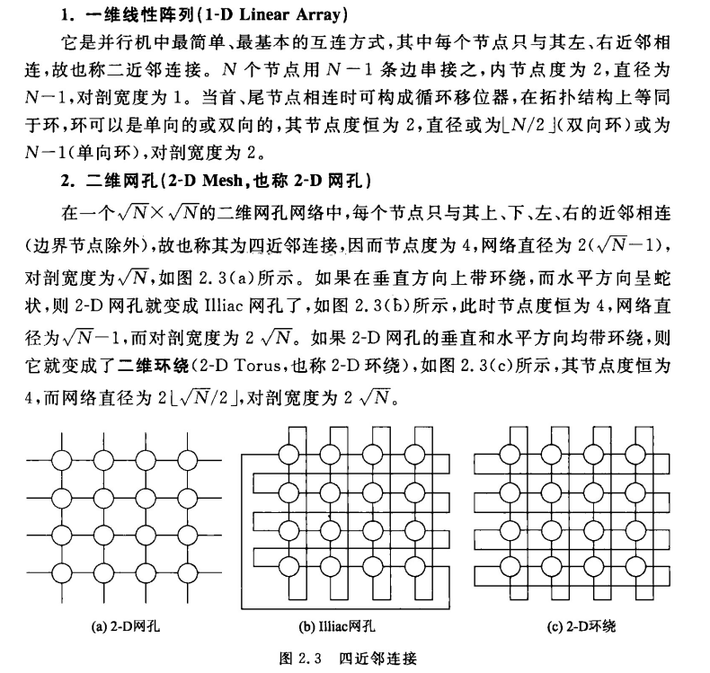
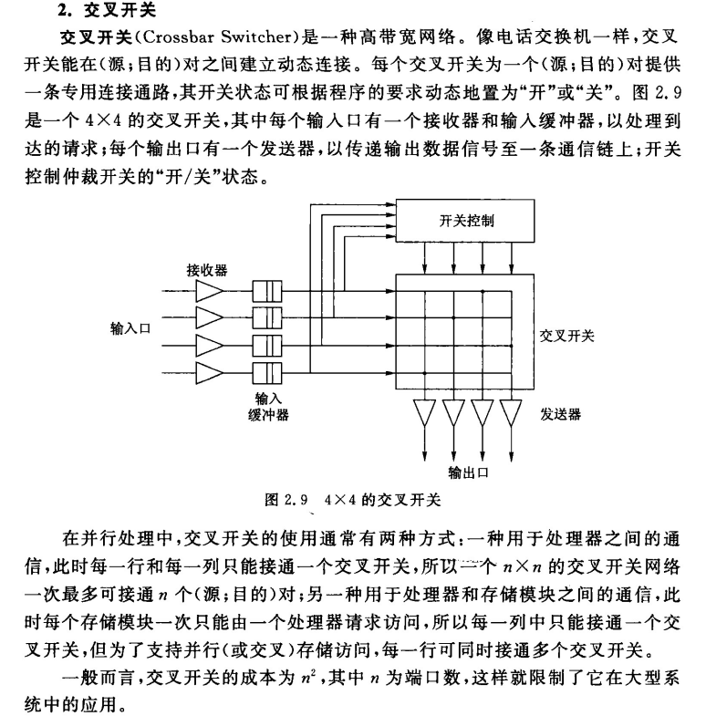
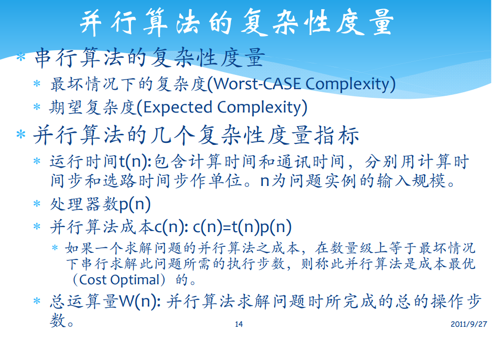
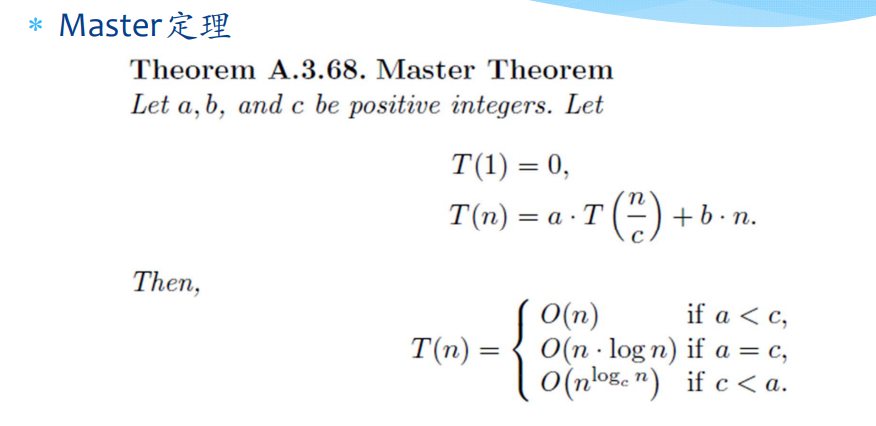
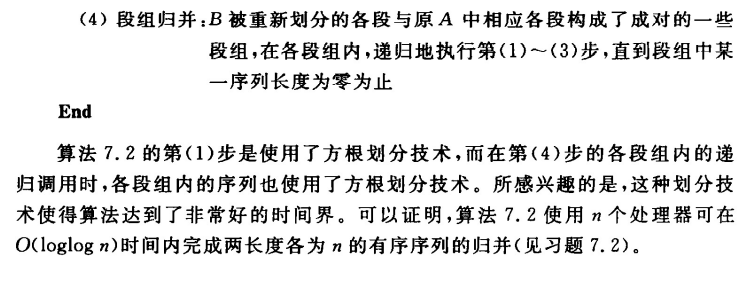
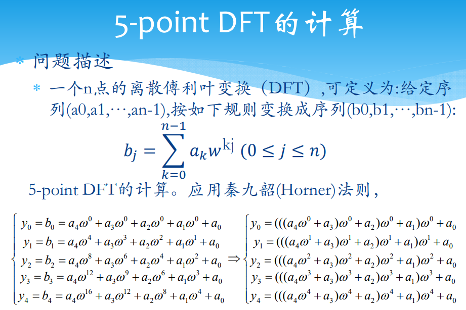
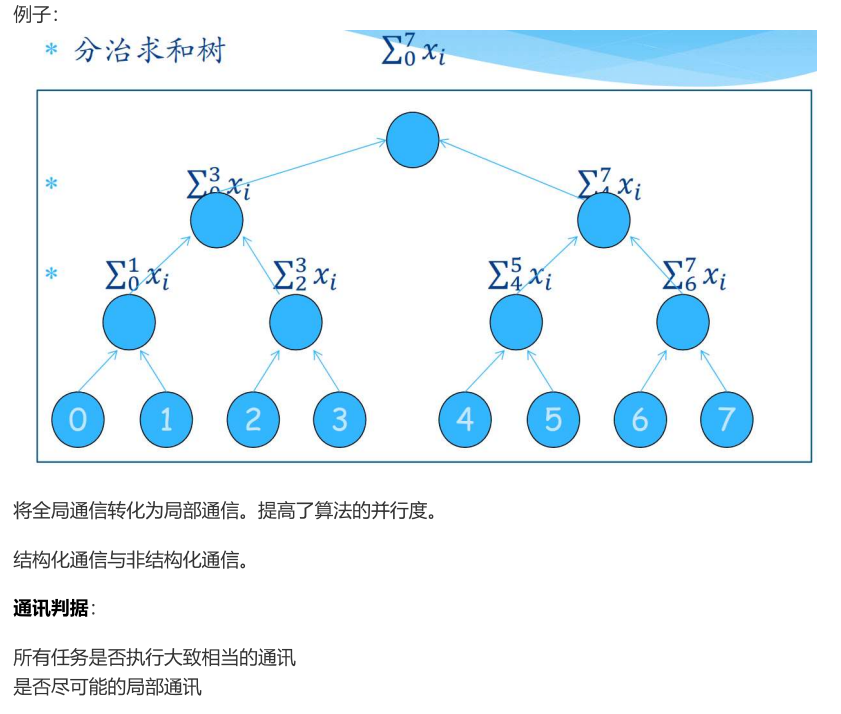

# 并行计算

## 第一章: 并行计算的基础

- 系统互连
    - 不同带宽与距离的互连技术
    - 总线
        - 处理器总线, 局部总线 (存储器总线), I/O 总线 (系统总线)
    - SAN: 系统域⽹络
    - LAN: 局域⽹络
    - MAN: 都域⽹
    - WAN: ⼴域⽹

- 网络性能指标
    - 节点度 (Node Degree): 射⼊或射出⼀个节点的边数. 在单向⽹络中, ⼊射和出射边之和称为节点度.
    - ⽹络直径 (Network Diameter): ⽹络中任何两个节点之间的最长距离, 即最⼤路径数.
    - 对剖宽度 (Bisection Width): 对分⽹络各半所必须移去的最少边数.
    - 对剖带宽 ( Bisection Bandwidth): 每秒钟内, 在最小的对剖平面上通过所有连线的最⼤信息位 (或字节) 数
    - 如果从任⼀节点观看⽹络都⼀样, 则称⽹络为对称的 (Symmetry).
- 静态互连⽹络
    - 处理单元间有着固定连接的⼀类⽹络, 在程序执⾏期间, 这种点到点的链接保持不变.
    - 典型的静态⽹络有⼀维线性阵列, ⼆维⽹孔, 树连接, 超立⽅⽹络, 立⽅环, 洗牌交换⽹, 蝶形⽹络等.
- 动态⽹络
    - 用交换开关构成的, 可按应用程序的要求动态地改变连接组态.
    - 典型的动态⽹络包括总线, 交叉开关和多级互连⽹络等.

**静态互连网络:**

**动态互连网络:**

- 总线:
    - 总线实际上是连接处理器, 存储模块和 I/O 外围设备等的⼀组导线和插座.
    - 总线系统用以主设备 (如处理器) 和从设备 (如存储器) 之间的数据传输.
    - 目前已有很多总线标准: PCI, VME, Multics, Sbus, MicroChannel.
    - 多处理机总线系统的主要问题包括总线仲裁, 中断处理, 协议转换, 快速同步, ⾼速缓存⼀致性协议, 分事务, 总线桥和层次总线扩展等

- 以太⽹
    - 以太⽹ (Ethernet) 是⼀种计算机局域⽹组⽹技术. IEEE 制定的 IEEE 802.3 标准给出了以太⽹的技术标准. 它规定了包括物理层的连线, 电信号和介质访问层协议的内容. 以太⽹是当前应用最普遍的局域⽹技术. 它很⼤程度上取代了其他局域⽹标准, 如令牌环⽹ (token ring), FDDI 和 ARCNET.
    - 以太⽹的标准拓扑结构为总线型拓扑, 但目前的快速以太⽹ (100BASE-T, 1000BASE-T 标准) 为了最⼤程度的减少冲突, 最⼤程度的提⾼⽹络速度和使用效率, 使用交换机 (Switch hub) 来进⾏⽹络连接和组织, 这样, 以太⽹的拓扑结构就成了星型, 但在逻辑上, 以太⽹仍然使用总线型拓扑和 CSMA/CD (Carrier Sense Multiple Access/Collision Detect 即带冲突检测的载波监听多路访问) 的总线争用技术.

**Flynn 分类法:**

- Flynn 分类法
    - SISD: 传统的顺序执⾏的计算机在同⼀时刻只能执⾏⼀条指令 (即只有⼀个控制流), 处理⼀个数据 (即只有⼀个数据流), 因此被称为单指令流单数据流计算机 (Single Instruction Single Data, SISD).
    - MIMD: ⽽对于⼤多数并⾏计算机⽽⾔, 多个处理单元都是根据不同的控制流程执⾏不同的操作, 处理不同的数据, 因此, 它们被称作是多指令流多数据流计算机, 即 MIMD (Multiple Instruction Multiple Data, MIMD) 计算机. 
    - SIMD: 曾经在很长⼀段时间内成为超级并⾏计算机主流的向量计算机除了标量处理单元之外, 最重要的是具有能进⾏向量计算的硬件单元. 在执⾏向量操作时, ⼀条指令可以同时对多个数据 (组成⼀个向量) 进⾏运算, 这就是单指令流多数据流 (Single Instruction Multiple Data, SIMD) 的概念. 因此, 我们将向量计算机称为 SIMD 计算机. 
    - MISD: 第四种类型即所谓的多指令流单数据 (Multiple Instruction Single Data, MISD) 计算机. 在这种计算机中, 各个处理单元组成⼀个线性阵列, 分别执⾏不同的指令流, ⽽同⼀个数据流则顺次通过这个阵列中的各个处理单元. 这种系统结构只适用于某些特定的算法. 

**并行计算机结构模型:**

- 并行计算机结构模型
    - PVP: 并行向量处理器
    - SMP: 对称多处理器
    - MPP: 多并行处理器
    - DSM: 分布式共享内存
    - COW: 工作站机群
- SMP, MPP, DSM 和 COW 并⾏结构渐趋⼀致.
    - ⼤量的节点通过⾼速⽹络互连起来
    - 节点遵循 Shell 结构: 用专门定制的 Shell 电路将商用微处理器和节点的其它部分（包括板级 Cache, 局存, NIC 和 DISK）连接起来. 优点是 CPU 升级只需要更换 Shell
- UMA（Uniform Memory Access）模型是均匀存储访问模型的简称.
    - 物理存储器被所有处理器均匀共享;
    - 所有处理器访问任何存储字取相同的时间;
    - 每台处理器可带私有⾼速缓存;
    - 外围设备也可以⼀定形式共享. 
- NUMA (Nonuniform Memory Access) 模型是非均匀存储访问模型的简称.
    - 被共享的存储器在物理上是分布在所有的处理器中的, 其所有本地存储器的集合就组成了全局地址空间;
    - 处理器访问存储器的时间是不⼀样的;访问本地存储器LM或群内共享存储器CSM较快, ⽽访问外地的存储器或全局共享存储器GSM较慢(此即非均匀存储访问名称的由来);
    - 每台处理器照例可带私有⾼速缓存, 外设也可以某种形式共享. 
- COMA (Cache-Only Memory Access) 模型是全⾼速缓存存储访问的简称.
    - 各处理器节点中没有存储层次结构, 全部⾼速缓存组成了全局地址空间;
    - 利用分布的⾼速缓存目录D进⾏远程⾼速缓存的访问;
    - COMA中的⾼速缓存容量⼀般都⼤于2 级⾼速缓存容量;
    - 使用COMA时, 数据开始时可任意分配, 因为在运⾏时它最终会被迁移到要用到它们的地⽅
- CC-NUMA（Coherent-Cache Nonuniform Memory Access）模型是⾼速缓存⼀致性非均匀存储访问模型的简称.
    - ⼤多数使用基于目录的⾼速缓存⼀致性协议;
    - 保留SMP结构易于编程的优点, 也改善常规SMP的可扩放性;
    - CC-NUMA实际上是⼀个分布共享存储的DSM多处理机系统;
    - 它最显著的优点是程序员⽆需明确地在节点上分配数据, 系统的硬件和软件开始时自动在各节点分配数据, 在运⾏期间, ⾼速缓存⼀致性硬件会自动地将数据迁移⾄要用到它的地⽅. 
- NORMA（No-Remote Memory Access）模型是非远程存储访问模型的简称.
    - 所有存储器是私有的;
    - 绝⼤数NORMA都不支持远程存储器的访问;
    - 在DSM中, NORMA就消失了. 

## 第三章: 并行计算性能评测

## 第四章: 并行算法与并行计算模型

**求取最大值算法:**

**计算前缀和:**

**表达:**

**模型:**

## 第五章: 并行算法的一般设计方法

## 第六章: 并行算法常用设计技术

## 第七章: 并行算法的一般设计过程

- 设计并行算法的四个阶段
    - 划分 (Partitioning): 分解成小的任务, 开拓并发性;
    - 通讯 (Communication): 确定诸任务间的数据交换, 监测划分的合理性;
    - 组合 (Agglomeration): 依据任务的局部性, 组合成更大的任务;
    - 映射 (Mapping): 将每个任务分配到处理器上, 提高算法的性能.

**映射:**

## 第八章: 基本通讯操作

## MapReduce

https://blog.csdn.net/qq_38684427/article/details/109466435