<style>
h1 {
    text-align: center;
}
h2, h3 {
    page-break-after: avoid; 
}
.center {
    margin: 0 auto;
    width: fit-content;
    margin-top: 2em;
    padding-top: 0.5em;
    padding-bottom: 0.5em;
    margin-bottom: 2em;
}
.title {
    font-weight: bold;
    border-top-style: solid;
    border-bottom-style: solid;
}
.newpage {
    page-break-after: always
}
@media print {
    @page {
        margin: 3cm;
    }
}
</style>

<h1 style="margin-top: 4em">
数字图像处理实验报告
</h1>

# <h1 class="center title">实验一：直方图均衡化</h1>

<div class="center">
<h3>院系：人工智能学院</h3>
<h3>姓名：方盛俊</h3>
<h3>学号：201300035</h3>
<h3>邮箱：201300035@smail.nju.edu.cn</h3>
<h3>时间：2022年9月29日</h3>
</div>

<div class="newpage"></div>

<!-- 生成目录 -->

## <h1>目录</h1>

[TOC]

<div class="newpage"></div>

<!-- 文章主体内容 -->

## 一、实现细节

### 1. 图像类的封装

本次实验我采用了 Python 语言进行代码的编写, 共计编写了 355 行代码, 其中用到了两个包: `numpy` 和 `matplotlib`.

- `numpy`: 用于在 Python 中进行快速的矩阵运算.
- `matplotlib`: 用于加载和显示图片.

为了方便后续进行图片处理, 图片显示和图片对比, 我首先封装了一个 `Image` 类, 其中重要的接口 (以及部分实现) 如下:

```python
class Image:
    '''
    图像类, 里面包括了图像初始化, 显示, 获取直方图, 直方图均衡化等方法
    '''

    def __init__(self, image: np.ndarray, *, gray_level=256) -> None:
        '''
        初始化图像, 传入图像矩阵 image
        还可以输入灰阶 gray_level, 默认为 256
        '''
        # 保存输入参数
        self._image = image
        self._gray_level = gray_level
        # ...

    def show(self) -> None:
        '''
        显示图像
        '''
        plt.figure(figsize=(20, 20))
        plt.imshow(self._image, cmap='gray' if self._is_gray_image else None)
        plt.show()

    def compare_with(self, before: Image) -> None:
        '''
        与前一张图像进行对比显示
        '''
        plt.figure(figsize=(20, 20))
        plt.subplots_adjust(wspace=0.5, hspace=1.0)
        # 显示两张图像
        plt.subplot(1, 2, 1)
        plt.title('Before')
        plt.imshow(before.get_image(),
                   cmap='gray' if before._is_gray_image else None)
        plt.subplot(1, 2, 2)
        plt.title('After')
        plt.imshow(self.get_image(),
                   cmap='gray' if self._is_gray_image else None)
        plt.show()

    def hist(self) -> np.ndarray:
        '''
        获取图像的直方图. 如果是灰度图像, 返回一维数组, 如果是彩色图像, 返回二维数组
        '''
        # ...

    def show_hist(self) -> None:
        '''
        显示图像的直方图
        '''
        # ...

    def compare_hist_with(self, before: Image):
        '''
        与前一张图的直方图进行对比
        '''
        # ...

    def histeq(self, *, method='gray') -> Image:
        '''
        进行图像直方图均衡化, 计算公式为 s = T(r) = round((L-1) * sum(p[0:r]) / N * M)
        对彩色图像进行直方图均衡化的方法有两种:
            1. 分通道灰度图像直方图均衡化
            2. HSI 空间直方图均衡化
        '''
        # ...
```

凭借这个经过精细封装的 `Image` 类, 我们就可以很简单地编写简洁的测试代码:

```python
# 灰色图像直方图均衡化
# 图像加载
img = Image(mpimg.imread('../asset/image/gray.jpg'))
# 显示直方图
img.show_hist()
# 比较图像
img.histeq().compare_with(img)
# 比较直方图
img.histeq().compare_hist_with(img)

# 彩色图像直方图均衡化
img = Image(mpimg.imread('../asset/image/color.jpg'))
img.histeq().compare_with(img)
img.histeq().compare_hist_with(img)
# 基于 HSI 色彩空间的直方图均衡化
img.histeq(method='hsi').compare_with(img)
img.histeq(method='hsi').compare_hist_with(img)
```

### 2. 灰度图像直方图均衡化

灰度图像直方图均衡化的步骤为:

第一步为计算出直方图, 即图像中 **不同灰度值的像素点的个数**, 最后结果 $p_r(r_k)$ 为长度为 $L$ 的一维数组.

第二步为基于直方图计算出一个能让变换后图像的直方图均衡化的变换函数 $s_k = T(r_k)$, 这一步是直方图均衡化的关键.

第三步为对旧图像中的每一个像素点, 从像素点原先的灰度值通过 $s_k = T(r_k)$ 转换到新的灰度值, 进而形成新的直方图均衡化后的图像.

使用数学公式进行表示即为:

1. 计算灰度概率 (直方图): $\displaystyle p_r(r_k) = \frac{n_k}{MN}, k=0,1,2,\cdots,L-1$
2. 计算变换: $\displaystyle s_k = T(r_k) = (L-1)\sum_{j=0}^{k}p_r(r_j)$
3. 对图像进行变换: $s(x,y) = T(r(x,y))$

基于该原理, 我的实现代码为:

```python
def get_hist_from_gray_image(gray_image: np.ndarray, *, gray_level=256) -> np.ndarray:
    '''
    获取灰度图像的直方图, 返回一个一维数组, 灰阶默认为 256, 数组的每个元素对应图像的每个灰度级的像素个数
    '''
    # 循环版本 (速度慢)
    # hist = np.zeros(gray_level)
    # for i in range(gray_image.shape[0]):
    #     for j in range(gray_image.shape[1]):
    #         hist[gray_image[i][j]] += 1

    # 矩阵版本 (速度快)
    hist = np.bincount(gray_image.flatten(), minlength=gray_level)
    return hist

def histeq_for_gray_image(image, *, gray_level=256) -> np.ndarray:
    '''
    进行灰度图像直方图均衡化, 计算公式为 s = T(r) = round((L-1) * sum(p[0:r]) / N * M)
    '''
    # 计算直方图
    hist = Image.get_hist_from_gray_image(image, gray_level=gray_level)
    # 计算累积直方图
    cum_hist = np.zeros(gray_level)
    cum_hist[0] = hist[0]
    for i in range(1, gray_level):
        cum_hist[i] = cum_hist[i - 1] + hist[i]
    # 计算映射函数
    s = (((gray_level - 1) /
            (image.shape[0] * image.shape[1])) * cum_hist).astype(np.uint8)
    # 映射
    new_image = np.zeros(
        image.shape, dtype=np.uint8 if gray_level <= 256 else np.uint16)
    for i in range(image.shape[0]):
        for j in range(image.shape[1]):
            new_image[i][j] = s[image[i][j]]
    return new_image
```

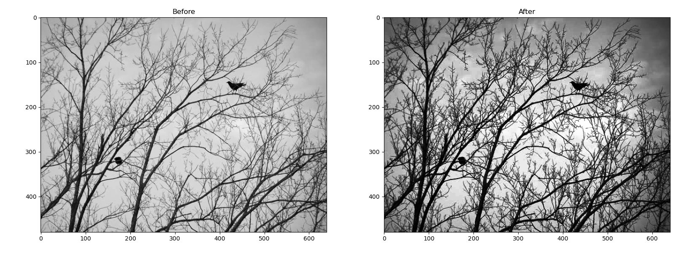

### 3. 彩色图像直方图均衡化

#### 3.1 分通道彩色图像直方图均衡化

彩色图像和灰度图像的区别就是, 彩色图像拥有红绿蓝 (RGB) 三个通道的图像数据, 即图像的每个一像素点都拥有 RGB 三种颜色的强度值, 甚至可以理解为红绿蓝三个灰度图像的的叠加.

基于这种理解, 我们可以很简单地得出一个彩色图像直方图均衡化的方法: 对 RGB 三个通道的灰度图像分别进行直方图均衡化, 最后合并起来, 就得到了分通道彩色图像直方图均衡化的方法.

简单地用代码书写就是:

```python
new_image = np.zeros(self._image.shape)
for i in range(3):
    new_image[:, :, i] = self.histeq_for_gray_image(self._image[:, :, i])
```

但是这样做会有一个明显的问题, 那就是直方图均衡化后的彩色图像的色调会明显地发生偏移. 如下图, 本来原图是完全的冷色调, 但是在直方图均衡化后色调发生了偏移, 呈现出了一部分的暖色调, 这和我们进行直方图均衡化的预期不符.
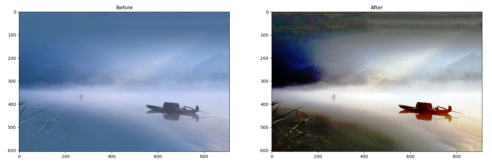

#### 3.2 HSI 彩色模型

我们对彩色图像进行直方图均衡化的预期是, 在不改变图像整体色调等其他因素的情况下, 让彩色图像的 "亮度" 分布得更为均匀, 借此让图像更好地显示出细节, 提高图像的质量.

因此, 我们需要将 RGB 彩色模型转换为另一个彩色模型, 这个彩色模型需要将 "亮度", 或者说像素点色彩的 **强度** (Intensity), 从原来的彩色模型中抽离出来. HSI 彩色模型就是这么一个模型, 每个像素点分别由 **色调**, **饱和度** 和 **强度** 三个分量来进行描述.

我们先假设我们有着一个标准的单位 RGB 彩色立方体, 坐标轴 $(0, 0, 0)$ 的点为纯黑色, 坐标轴 $(1, 1, 1)$ 的点为纯白色, 依次类推, 立方体里的每一个点都代表了 RGB 色彩空间里的一种色彩, 并且从 $(0, 0, 0)$ 到 $(1, 1, 1)$ 这一条对角线上的点都是灰色点.

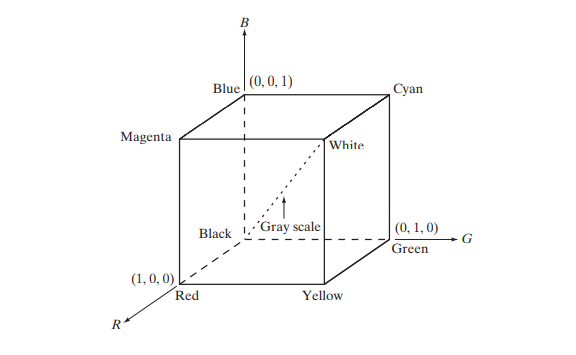

我们将立方体的黑色点放到最底端, 白色点放在最顶端, 连接白色点与黑色点, 便拥有了一条强度轴, 最低端的黑色点强度为 $0$, 最顶部的白色点强度为 $1$. 然后对于立方体上的任意一个色彩点, 只需要通过该点作一个垂直于强度轴的平面, 平面与强度轴的交点就是该色彩点的 **强度值**.

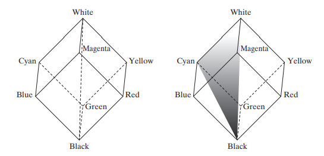

在拆分出强度值这一个分量后, 我们还需要考虑另外两个分量. 对于任何一个垂直于强度轴的平面, 我们可以建立一个极坐标系, 极坐标系中的角度对应 **色调**, 而极坐标系中的距离就是 **饱和度**. 形象化地描述, 色调是描述一种纯色 (纯黄色, 纯红色, 纯紫色等) 的分量, 而饱和度是一种纯色被白光稀释的程度.

从 RGB 到 HSI 彩色模型的转换公式为:

$H = \begin{cases}
    \theta, & B \le G \\
    360 - \theta, & B > G
\end{cases}$

$\displaystyle \theta = \arccos \left\{ \frac{\frac{1}{2}[(R-G)+(R-B)]}{[(R-G)^{2}+(R-B)(G-B)]^{\frac{1}{2}}} \right\} $

$\displaystyle S = 1 - \frac{3}{(R + G + B)}[\min (R, G, B)]$

$\displaystyle I = \frac{1}{3}(R + G + B)$

借此概念, 我们能够实现从 RGB 到 HSI 彩色模型的转换, 也可以实现从 HSI 到 RGB 彩色模型的转换.

```python
def RGB2HSI(image: np.ndarray, *, gray_level=256) -> np.ndarray:
    '''
    将 RGB 图像矩阵转换为 HSI 图像矩阵 (强度和饱和度会被转化为 0 到 1 之间的浮点数)
    1. H = theta if B <= G else 360 - theta
        theta = arccos(0.5 * (R - G + R - B) / sqrt((R - G)^2 + (R - B) * (G - B)))
    2. S = 1 - 3 / (R + G + B) * min(R, G, B)
    3. I = (R + G + B) / 3
    '''
    # RGB 矩阵
    R, G, B = image[:, :, 0] / (gray_level - 1), image[:, :, 1] / \
        (gray_level - 1), image[:, :, 2] / (gray_level - 1)
    # 1. 计算 Hue 色调分量, 分母加上一个小分量避免除 0
    theta = np.arccos(0.5 * (R - G + R - B) /
                        (np.sqrt((R - G) ** 2 + (R - B) * (G - B)) + 1e-10))
    H = np.where(B <= G, theta, 2 * np.pi - theta)
    # 2. 计算 Saturation 饱和度分量
    S = 1 - 3 / (R + G + B + 1e-10) * np.min([R, G, B], axis=0)
    # 3. 计算 Intensity 强度分量
    I = (R + G + B) / 3
    # 综合
    HSI = np.dstack([H, S, I])
    return HSI

def HSI2RGB(image: np.ndarray, *, gray_level=256) -> np.ndarray:
    '''
    将 HSI 图像矩阵转换为 RGB 图像矩阵
    1. 位于 RG 扇区 (0 <= H < 120) 时:
        B = I * (1 - S)
        R = I * (1 + S * cos(H) / cos(60 - H))
        G = 3 * I - (R + B)
    1. 位于 GB 扇区 (120 <= H < 240) 时:
        R = I * (1 - S)
        G = I * (1 + S * cos(H - 120) / cos(180 - H))
        B = 3 * I - (R + G)
    1. 位于 BR 扇区 (240 <= H < 360) 时:
        G = I * (1 - S)
        B = I * (1 + S * cos(H - 240) / cos(300 - H))
        R = 3 * I - (G + B)
    '''
    # 矩阵版本 (速度快)
    # HSI 矩阵
    H, S, I = image[:, :, 0], image[:, :, 1], image[:, :, 2]
    # 计算 RGB 分量
    R = np.where(H < 2 / 3 * np.pi, I * (1 + S * np.cos(H) / (np.cos(np.pi / 3 - H) + 1e-10)),
                    np.where(H < 4 / 3 * np.pi, I * (1 - S),
                            3 * I - (I * (1 - S) + I * (1 + S * np.cos(H - 4 / 3 * np.pi) / (np.cos(5 * np.pi / 3 - H) + 1e-10)))))
    G = np.where(H < 2 / 3 * np.pi, 3 * I - (I * (1 - S) + I * (1 + S * np.cos(H) / (np.cos(np.pi / 3 - H) + 1e-10))),
                    np.where(H < 4 / 3 * np.pi, I * (1 + S * np.cos(H - 2 / 3 * np.pi) / (np.cos(np.pi - H) + 1e-10)),
                            I * (1 - S)))
    B = np.where(H < 2 / 3 * np.pi, I * (1 - S),
                    np.where(H < 4 / 3 * np.pi, 3 * I - (I * (1 - S) + I * (1 + S * np.cos(H - 2 / 3 * np.pi) / (np.cos(np.pi - H) + 1e-10))),
                            I * (1 + S * np.cos(H - 4 / 3 * np.pi) / (np.cos(5 * np.pi / 3 - H) + 1e-10))))
    # 截断到 0 和 1 之间
    RGB = np.dstack([R, G, B])
    RGB = np.where(RGB < 0, 0, RGB)
    RGB = np.where(RGB > 1, 1, RGB)
    RGB = (RGB * (gray_level - 1)
            ).astype(np.uint8 if gray_level <= 256 else np.uint16)

    # # 循环版本 (速度慢)
    # # HSI 矩阵
    # H, S, I = image[:, :, 0], image[:, :, 1], image[:, :, 2]
    # RGB = np.zeros(
    #     image.shape, dtype=np.uint8 if gray_level <= 256 else np.uint16)
    # for i in range(image.shape[0]):
    #     for j in range(image.shape[1]):
    #         if H[i][j] < 2 / 3 * np.pi:
    #             _H = H[i][j]
    #             B = I[i][j] * (1 - S[i][j])
    #             R = I[i][j] * (1 + S[i][j] * np.cos(_H) /
    #                            (np.cos(np.pi / 3 - _H) + 1e-10))
    #             G = 3 * I[i][j] - (R + B)
    #         elif H[i][j] < 4 / 3 * np.pi:
    #             _H = H[i][j] - 2 / 3 * np.pi
    #             R = I[i][j] * (1 - S[i][j])
    #             G = I[i][j] * (1 + S[i][j] * np.cos(_H) /
    #                            (np.cos(np.pi / 3 - _H) + 1e-10))
    #             B = 3 * I[i][j] - (R + G)
    #         else:
    #             _H = H[i][j] - 4 / 3 * np.pi
    #             G = I[i][j] * (1 - S[i][j])
    #             B = I[i][j] * (1 + S[i][j] * np.cos(_H) /
    #                            (np.cos(np.pi / 3 - _H) + 1e-10))
    #             R = 3 * I[i][j] - (G + B)
    #         # 预防溢出
    #         R = max(0, min(R, 1))
    #         G = max(0, min(G, 1))
    #         B = max(0, min(B, 1))
    #         # 最后统合
    #         RGB[i][j][:] = np.array([R, G, B]) * (gray_level - 1)
    return RGB
```

#### 3.3 基于 HSI 彩色模型的直方图均衡化

我们可以将图像从 RGB 彩色模型转化为 HSI 彩色模型, 然后单独对强度分量进行直方图均衡化, 最后再恢复到 RGB 彩色模型, 就能得到不错的直方图均衡后的彩色图像.

具体代码如下所示:

```python
HSI = self.RGB2HSI(self._image)
H, S, I = HSI[:, :, 0], HSI[:, :, 1], HSI[:, :, 2]
# 单独对 Intensity 强度分量进行直方图均衡化
# 转换为整数灰阶图像矩阵
I = (I * (self._gray_level - 1)
        ).astype(np.uint8 if self._gray_level <= 256 else np.uint16)
I = self.histeq_for_gray_image(I, gray_level=self._gray_level)
# 转换为浮点数强度图像矩阵
I = I / (self._gray_level - 1)
# 恢复 HSI 矩阵
HSI = np.dstack([H, S, I])
new_image = self.HSI2RGB(HSI)
```

可以看出, 最后转换后的彩色图像色调没有发生偏移, 效果比分通道进行直方图均衡化更好.

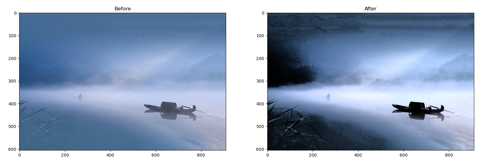


## 二、结果

### 1. 实验设置

本次实验我采用了 Python 语言进行代码的编写, 共计编写了 355 行代码, 其中用到了两个包: `numpy` 和 `matplotlib`.

而用到的图像有 (位于 `asset/image`):

- `gray.jpg`
- `color.jpg`
- `boat.jpg`
- `genshin.jpg`
- `night.jpg`

并且分别对这些图片进行了直方图计算与显示, 直方图均衡化, 基于 HSI 的直方图均衡化等操作.

具体代码为:

```python
# 灰色图像直方图均衡化
# 图像加载
img = Image(mpimg.imread('../asset/image/gray.jpg'))
# 显示直方图
img.show_hist()
# 比较图像
img.histeq().compare_with(img)
# 比较直方图
img.histeq().compare_hist_with(img)

# 彩色图像直方图均衡化
img = Image(mpimg.imread('../asset/image/color.jpg'))
img.histeq().compare_with(img)
img.histeq().compare_hist_with(img)
# 基于 HSI 色彩空间的直方图均衡化
img.histeq(method='hsi').compare_with(img)
img.histeq(method='hsi').compare_hist_with(img)

# 实验介绍文档中使用的图片
img = Image(mpimg.imread('../asset/image/boat.jpg'))
img.histeq().compare_with(img)
img.histeq().compare_hist_with(img)
img.histeq(method='hsi').compare_with(img)
img.histeq(method='hsi').compare_hist_with(img)

############################################################

# 其他图片
img = Image(mpimg.imread('../asset/image/genshin.jpg'))
img.histeq().compare_with(img)
img.histeq().compare_hist_with(img)
img.histeq(method='hsi').compare_with(img)
img.histeq(method='hsi').compare_hist_with(img)

img = Image(mpimg.imread('../asset/image/night.jpg'))
img.histeq().compare_with(img)
img.histeq().compare_hist_with(img)
img.histeq(method='hsi').compare_with(img)
img.histeq(method='hsi').compare_hist_with(img)
```

### 2. 实验结果

(选取部分结果)

`gray.jpg` 直方图:

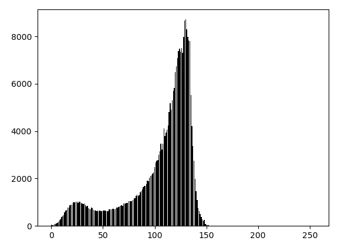

`gray.jpg` 直方图均衡化:


`color.jpg` 分通道直方图均衡化:

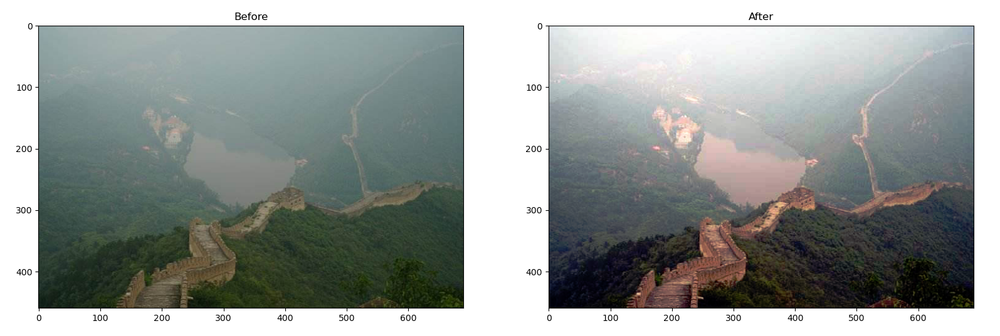

`color.jpg` 分通道直方图均衡化后直方图对比:

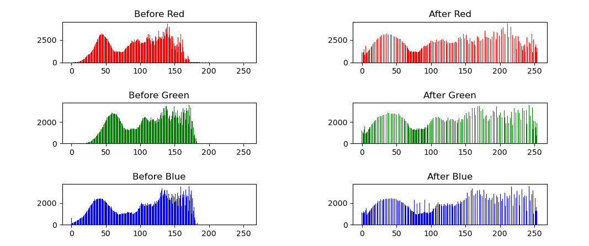

`color.jpg` 基于 HSI 直方图均衡化:

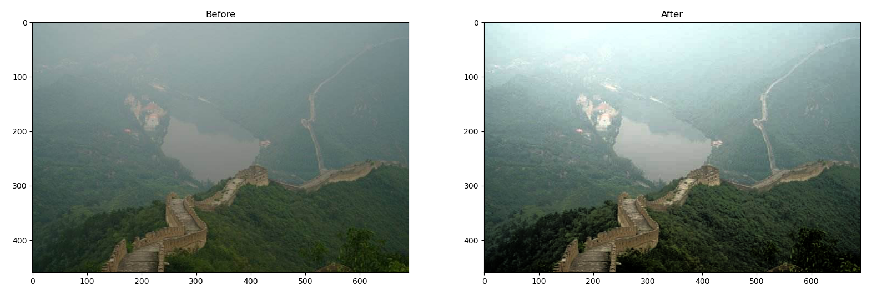

`color.jpg` 基于 HSI 直方图均衡化后直方图对比:

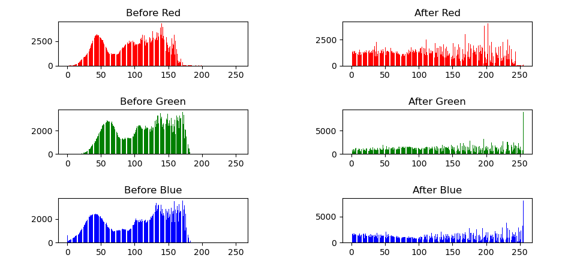

`boat.jpg` 分通道直方图均衡化:


`boat.jpg` 基于 HSI 直方图均衡化:


## 三、实验中所碰到的问题

在这次实验中, 我碰到了一个棘手的 BUG, 就是彩色图像进行直方图均衡化之后, 会出现一个出乎意料的结果. 例如下方的右图, 出现了大面积的黄色, 明显存在着问题.

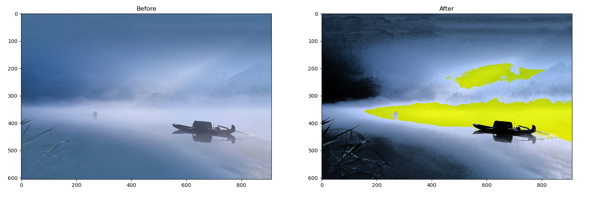

我先是提取了 (150, 150) 和 (350, 350) 这两个坐标点的像素值. 经过分析后我发现, 前者的直方图均衡化结果正确, 而后者的直方图均衡化结果错误. 再经过分析, 我发现这很可能是从 HSI 转回 RGB 过程中发生的错误. 

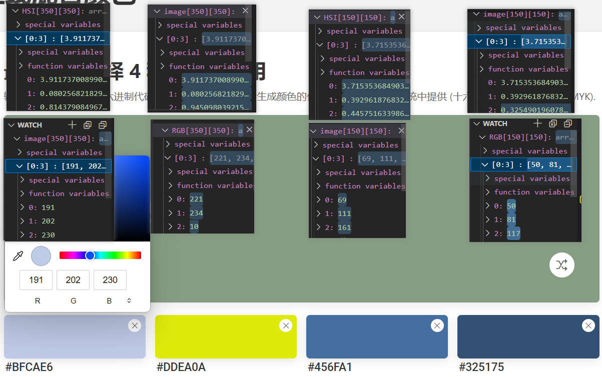

经过具体的定位, 我发现了原因. 彩色图像的像素点强度值, 在直方图均衡化之后, 恢复到原来的 RGB 分量后, 部分分量的数值可能会超过 255, 例如该点的 266, 就超出了 255 的上限, 导致转为 uint8 类型时发生了溢出, 从 266 被截断成了 11. 这导致蓝色分量从极高变为了极低, 最后让画面大面积地呈现出了黄色.

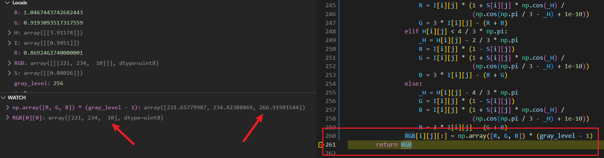

要修复这个问题也非常简单, 只需要在图像大于上限或小于下限时, 截断到 0 和 255 之间就行. 经过修改后的直方图均衡化效果恢复了正常.

