<style>
h1 {
    text-align: center;
}
h2, h3 {
    page-break-after: avoid; 
}
.center {
    margin: 0 auto;
    width: fit-content;
    margin-top: 2em;
    padding-top: 0.5em;
    padding-bottom: 0.5em;
    margin-bottom: 2em;
}
.title {
    font-weight: bold;
    border-top-style: solid;
    border-bottom-style: solid;
}
.newpage {
    page-break-after: auto;
}
@media print {
    .markdown-preview {
        padding: 2em calc(50% - 350px + 2em) !important;
    }
    @page {
        margin: 3cm;
    }
}
</style>

<h1 style="margin-top: 4em">
数字图像处理实验报告
</h1>

# <h1 class="center title">实验三：边缘检测和边缘连接</h1>

<div class="center">
<h3>院系：人工智能学院</h3>
<h3>姓名：方盛俊</h3>
<h3>学号：201300035</h3>
<h3>邮箱：201300035@smail.nju.edu.cn</h3>
<h3>时间：2022 年 12 月 14 日</h3>
</div>

<div class="newpage"></div>

<!-- 生成目录 -->

## <h1>目录</h1>

[TOC]

<div class="newpage"></div>

<!-- 文章主体内容 -->

## 一、边缘检测

### 1.1 梯度阈值化边缘检测算法

进行边缘检测的一种最简单的方式便是梯度阈值化.

只需要三个步骤:

1. 通过 Sobel 算子计算水平和垂直方向的梯度 $g_x$ 和 $g_y$;
1. 通过欧氏距离或曼哈顿距离函数算出 $g$;
3. 保留超过最大值的阈值的像素.

对应代码如下:

```python
# 梯度阈值化边缘检测
def my_gradient_thresholding(img: np.ndarray, threshold=200):
    '''
    梯度阈值化边缘检测    
    :param img: 灰度图像
    :param threshold: 阈值, 范围为 [0, 255]
    '''
    img = img.astype(np.float32)
    # 通过 Sobel 算子计算水平和垂直方向的梯度
    img_gx = cv.Sobel(img, cv.CV_32F, 1, 0, ksize=3)
    img_gy = cv.Sobel(img, cv.CV_32F, 0, 1, ksize=3)
    img_g = np.sqrt(img_gx ** 2 + img_gy ** 2)
    img_g[img_g < threshold] = 0
    img_g[img_g >= threshold] = 255
    return img_g.astype(np.uint8)
```

对 `rubberband_cap.png` 图像处理结果如下:

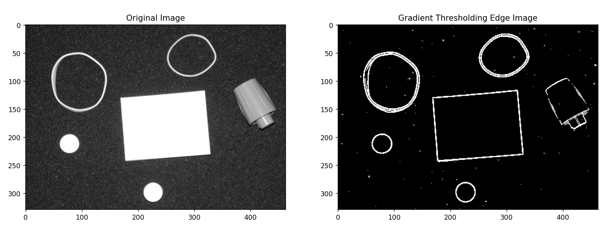

可见拥有一定的效果, 不过会存在一些噪声的干扰, 并且边缘较粗, 部分边缘断开了, 也没有连接.


### 1.2 均值滤波器平滑边缘检测算法

为了避免噪声的干扰, 我们可以先使用均值滤波器对图像进行平滑处理, 减轻噪声的影响.

因此在需要在梯度阈值化边缘检测的基础上, 加上一个步骤:

1. 使用均值滤波器对图像进行平滑处理;
2. 通过 Sobel 算子计算水平和垂直方向的梯度 $g_x$ 和 $g_y$;
2. 通过欧氏距离或曼哈顿距离函数算出 $g$;
3. 保留超过最大值的阈值的像素.

对 `rubberband_cap.png` 图像处理结果如下:

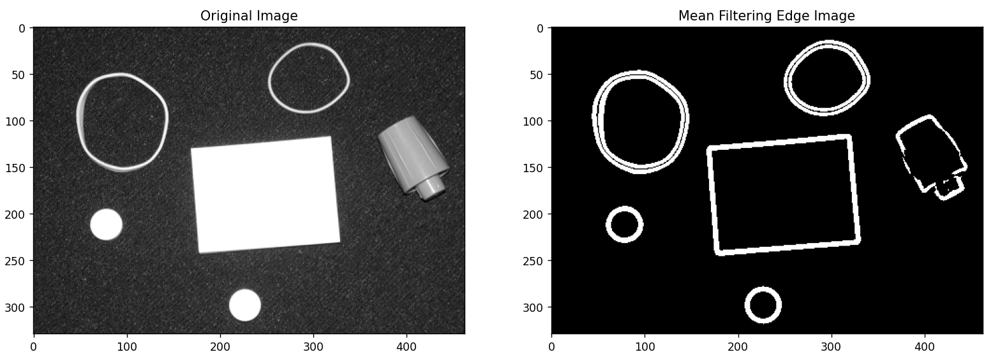

相比于原来的梯度阈值化方法, 经过均值滤波器进行平滑处理后, 基本消除了大部分的噪声. 但是依然存在着一些问题, 例如边缘较粗, 部分边缘断开了, 也没有连接.


### 1.3 Marr-Hildreth 边缘检测算法

由于灰度变化和图像尺度有关, 我们需要用不同尺寸的算子.

灰度变化会影响导数:

- 一阶导数出现波峰或波谷
- 二阶导数出现零交叉

理想的检测器具备如下功能:

- 能够近似 1 阶或 2 阶导数
- 能够被调整以在不同尺寸上起作用
- 大的算子检测模糊边缘、小的算子检测细节

因此这里我们基于这些想法, 实现 Marr-Hildreth 算法边缘检测.

具体的步骤如下:

1. 使用 $n \times n$ 的高斯低通滤波器平滑图像;
    1. 通过 $\sigma$ 获取 $n$, 其中 $n$ 为大于 $6\sigma$ 的最小奇数;
    2. 滤波器通过对高斯函数 $G(x) = \exp(-\frac{x^{2}+y^{2}}{2\sigma^{2}})$ 采样得到;
    3. 使用 $n \times n$ 的高斯低通滤波器平滑图像;
2. 使用拉普拉斯算子计算图像的二阶导数;
3. 寻找上述结果的零交叉, 得到最终结果;
    1. 找到图像的零交叉, 以每个像素为中心的 3 * 3 邻域内的像素值;
    2. 检查四种方向上的情况: 左右, 上下, 左上右下, 左下右上;
    3. 如果至少有两种情况满足条件, 则认为该像素是边缘像素, 条件为:
        1. 该方向上的两个相邻像素符号相反;
        2. 该方向上的两个相邻像素符号之差的绝对值大于某阈值.

我实现的代码如下:

```python
# marr-hildreth 算法边缘检测
def my_marr_hildreth(img: np.ndarray, sigma=4.0, threshold=0.04):
    '''
    marr-hildreth 算法边缘检测
    :param img: 灰度图像
    :param sigma: 高斯滤波器的标准差
    :param threshold: 阈值, 范围为 [0.01, 0.1], 默认值为 0.04
    '''
    # 转换到 [0, 1] 范围
    img = img.astype(np.float32) / 255
    # 通过 sigma 获取高斯滤波器的大小
    n = int(6 * sigma)
    n = n if n % 2 == 1 else n + 1
    # 使用 n * n 的高斯滤波器对图像进行滤波
    kernel = cv.getGaussianKernel(n, sigma)
    kernel = kernel * kernel.T
    img = cv.filter2D(img, -1, kernel)
    # 使用拉普拉斯算子计算图像的二阶导数
    img_lap = cv.Laplacian(img, -1)
    # 找到图像的零交叉, 以每个像素为中心的 3 * 3 邻域内的像素值
    # 有 4 种要测试的情况: 左右, 上下, 左上右下, 左下右上
    # 如果至少有两种情况满足, 则认为该像素是边缘像素
    img_g = np.zeros(img.shape, np.uint8)
    # 阈值为最大值的相应倍数
    threshold = threshold * np.abs(img_lap).max()
    # 四个方向
    direction = [(0, 1), (1, 0), (1, 1), (1, -1)]
    # # 循环形式
    # for i in range(1, img.shape[0] - 1):
    #     for j in range(1, img.shape[1] - 1):
    #         count = 0
    #         # 四个方向
    #         for dx, dy in direction:
    #             if img_lap[i - dy, j - dx] * \
    #                   img_lap[i + dy, j + dx] < 0:
    #                 if abs(img_lap[i, j - 1] - \
    #                       img_lap[i, j + 1]) > threshold:
    #                     count += 1
    #             if count >= 2:
    #                 img_g[i, j] = 255
    #                 break
    # 非循环形式改写
    counts = np.zeros(img.shape, np.uint8)
    for dx, dy in direction:
        imgA = img_lap[1 - dy: None if -1 - dy == 0 else -1 - dy, \
            1 - dx: None if -1 - dx == 0 else -1 - dx]
        imgB = img_lap[1 + dy: None if -1 + dy == 0 else -1 + dy, \
            1 + dx: None if -1 + dx == 0 else -1 + dx]
        counts[1:-1, 1:-1] += (imgA * imgB < 0).astype(np.uint8) * \
            (np.abs(imgA - imgB) > threshold).astype(np.uint8)
    img_g[counts >= 2] = 255
    return img_g
```

其中值得注意的是, 在 Python 中直接写循环会导致性能较差, 所以我们应该将其转写成 Numpy 矩阵操作形式.

其中寻找零交叉原来的循环形式为:

```python
# 循环形式
for i in range(1, img.shape[0] - 1):
    for j in range(1, img.shape[1] - 1):
        count = 0
        # 四个方向
        for dx, dy in direction:
            if img_lap[i - dy, j - dx] * \
                    img_lap[i + dy, j + dx] < 0:
                if abs(img_lap[i, j - 1] - \
                        img_lap[i, j + 1]) > threshold:
                    count += 1
            if count >= 2:
                img_g[i, j] = 255
                break
```

我们可以进行等价的 Numpy 矩阵操作形式改写:

```python
# 非循环形式改写
counts = np.zeros(img.shape, np.uint8)
for dx, dy in direction:
    imgA = img_lap[1 - dy: None if -1 - dy == 0 else -1 - dy, \
        1 - dx: None if -1 - dx == 0 else -1 - dx]
    imgB = img_lap[1 + dy: None if -1 + dy == 0 else -1 + dy, \
        1 + dx: None if -1 + dx == 0 else -1 + dx]
    counts[1:-1, 1:-1] += (imgA * imgB < 0).astype(np.uint8) * \
        (np.abs(imgA - imgB) > threshold).astype(np.uint8)
img_g[counts >= 2] = 255
```

这样一来, 运行效率就会大大提升.

对 `rubberband_cap.png` 图像处理结果如下:

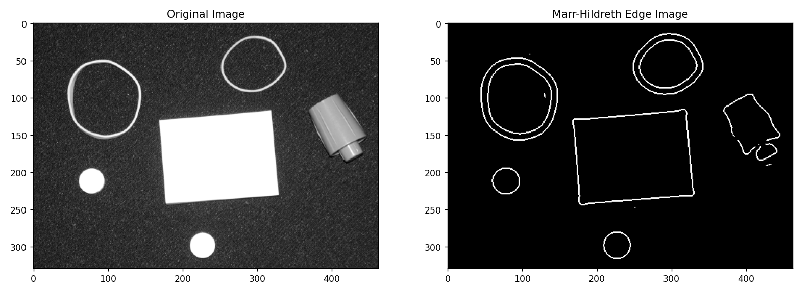

可以看出, Marr-Hildreth 算法边缘检测噪声较少, 并且有一个很好的优点, 即边缘较细, 基本上维持在了一两个像素的宽度.

但是依然存在一些问题, 例如依然存在噪声, 部分边缘没有连接起来.


### 1.4 Canny 边缘检测算法

相较于 Marr-Hildreth 边缘检测算法, Canny 边缘检测算法更为复杂, 但是在多数情况下效果也会更好.

Canny 边缘检测算法具体的步骤为:

1. 使用 $n \times n$ 的高斯低通滤波器平滑图像
    1. 通过 $\sigma$ 获取 $n$, 其中 $n$ 为大于 $6\sigma$ 的最小奇数;
    2. 滤波器通过对高斯函数 $G(x) = \exp(-\frac{x^{2}+y^{2}}{2\sigma^{2}})$ 采样得到;
    3. 使用 $n \times n$ 的高斯低通滤波器平滑图像.
2. 计算滤波后图像的梯度
    1. 使用 Sobel 算子计算滤波后图像的梯度 $g_x$ 和 $g_y$;
    2. 梯度大小 $g(x, y) = \sqrt{g_x^{2}+g_y^{2}}$;
    3. 梯度方向 $\theta(x, y) = \tan^{-1}(g_y / g_x)$.
3. 非最大抑制
    1. 目的: 把梯度生成的粗边缘变细;
    2. 让梯度 (边缘法线) 方向离散化:
        1. 4 中边缘方向: 0°, 45°, 90°, 135°;
        2. 如下图所示, 将连续的边缘法线方向离散化;
        3. 确定与 $\theta(x, y)$ 最接近的方向 $d_k$;
    3. 如果 $g(x, y)$ 的值比在 $d_k$ 方向的任一邻居数值小:
        1. 则对其抑制, $g_{N}(x, y) = 0$;
        2. 若 $g(x, y)$ 大于两个邻居, 则 $g_{N}(x, y) = g(x, y)$.
4. 滞后阈值
    1. 目的: 减少伪边缘点;
    2. 设定两个阈值: 低阈值 $T_{L}$ 和高阈值 $T_{H}$;
    3. 低阈值与高阈值比值最好为: 1: 2 或 1: 3;
    4. 使用高阈值 $T_{H}$ 阈值化
        1. 强边缘点: $g_{NH}(x, y) = g_{N}(x, y) \ge T_{H}$
    5. 使用低阈值 $T_{L}$ 阈值化
        1. $g_{NL}(x, y) = g_{N}(x, y) \ge T_{L}$
    6. 去掉 $g_{NL}$ 与 $g_{NH}$ 中的重复点
        1. 弱边缘点: $g_{NL}(x, y) = g_{NL}(x, y) - g_{NH}(x, y)$
5. 连通性分析
    1. 遍历 $g_{NH}$ 中的每一个点 $p$;
        1. 保留 $g_{NL}$ 中与 $p$ 连通 (如 8 连通) 的点;
    2. 去掉 $g_{NL}$ 中剩余的点;
    3. 合并 $g_{NH}$ 和 $g_{NL}$ 得到最终结果.

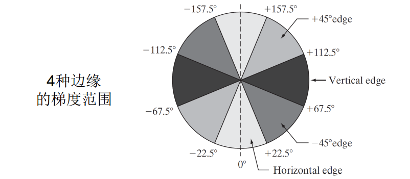

Canny 边缘检测算法的过程较为复杂, 实现起来也要多多注意, 我在实现的过程中就碰到了几个粗心导致的 bug, 不过最后所幸都解决了.

最后的代码如下:

```python
# canny 算法边缘检测
def my_canny(img: np.ndarray, sigma=4.0, threshold1=0.05, threshold2=0.15):
    '''
    canny 算法边缘检测
    :param img: 灰度图像
    :param sigma: 高斯滤波器的标准差
    :param threshold1: 阈值 1, 默认值为 0.05
    :param threshold2: 阈值 2, 默认值为 0.15
    '''
    # 转换到 [0, 1] 范围
    img = img.astype(np.float32) / 255
    # 通过 sigma 获取高斯滤波器的大小
    n = int(6 * sigma)
    n = n if n % 2 == 1 else n + 1
    # 使用 n * n 的高斯滤波器对图像进行滤波
    kernel = cv.getGaussianKernel(n, sigma)
    kernel = kernel * kernel.T
    img = cv.filter2D(img, -1, kernel)
    # 计算梯度幅度和方向
    img_gx = cv.Sobel(img, -1, 1, 0)
    img_gy = cv.Sobel(img, -1, 0, 1)
    img_g = np.sqrt(img_gx ** 2 + img_gy ** 2)
    img_theta = np.arctan2(img_gy, img_gx)
    # 将角度转换到 [-180, 180) 范围
    img_theta = np.rad2deg(img_theta)
    # 转换到四个方向
    img_theta[(img_theta >= -22.5) & (img_theta < 22.5)] = 0
    img_theta[(img_theta >= 157.5) | (img_theta < -157.5)] = 0
    img_theta[(img_theta >= 22.5) & (img_theta < 67.5)] = 45
    img_theta[(img_theta >= -157.5) & (img_theta < -112.5)] = 45
    img_theta[(img_theta >= 67.5) & (img_theta < 112.5)] = 90
    img_theta[(img_theta >= -112.5) & (img_theta < -67.5)] = 90
    img_theta[(img_theta >= 112.5) & (img_theta < 157.5)] = 135
    img_theta[(img_theta >= -67.5) & (img_theta < -22.5)] = 135
    # 方向映射到 dx, dy
    directions = {
        0: (1, 0),
        45: (1, 1),
        90: (0, 1),
        135: (1, -1)
    }
    # 非极大值抑制
    img_gn = np.zeros(img_g.shape, np.float32)
    # # 循环形式
    # for i in range(1, img_gn.shape[0] - 1):
    #     for j in range(1, img_gn.shape[1] - 1):
    #         # 如果小于其中一个邻居, 则抑制 gn(x, y) = 0
    #         # 否则 gn(x, y) = g(x, y)
    #         dx, dy = directions[img_theta[i, j]]
    #         value1 = img_g[i - dy, j - dx]
    #         value2 = img_g[i + dy, j + dx]
    #         if img_g[i, j] < value1 or img_g[i, j] < value2:
    #             img_gn[i, j] = 0
    #         else:
    #             img_gn[i, j] = img_g[i, j]
    # 非循环形式
    for theta, (dx, dy) in directions.items():
        imgA = img_g[1 - dy: None if -1 - dy == 0 else -1 - dy, \
            1 - dx: None if -1 - dx == 0 else -1 - dx]
        imgB = img_g[1 + dy: None if -1 + dy == 0 else -1 + dy, \
            1 + dx: None if -1 + dx == 0 else -1 + dx]
        img_gn[1: -1, 1: -1] = img_gn[1: -1, 1: -1] + \
        ((img_g[1: -1, 1: -1] >= imgA) & (img_g[1: -1, 1: -1] >= imgB) & \
            (img_theta[1: -1, 1: -1] == theta)) * img_g[1: -1, 1: -1]
    # 对阈值进行处理
    threshold1 = threshold1 * np.max(img_gn)
    threshold2 = threshold2 * np.max(img_gn)
    # 进行双阈值处理, 减少伪边缘点
    img_gnh = np.zeros(img_g.shape, np.uint8)
    img_gnh[img_gn >= threshold2] = 1
    img_gnl = np.zeros(img_g.shape, np.uint8)
    img_gnl[img_gn >= threshold1] = 1
    # 相减得到弱边缘点
    img_gnl = img_gnl - img_gnh
    # 遍历 gnh 中的每一个点 p, 保留与 gnh 8 连通的 gnl 点
    img_merged = img_gnh.copy()
    # 8 连通方向
    directions = [(0, 1), (1, 1), (1, 0), (1, -1), (0, -1), \
        (-1, -1), (-1, 0), (-1, 1)]
    # # 循环形式
    # for i in range(1, img_merged.shape[0] - 1):
    #     for j in range(1, img_merged.shape[1] - 1):
    #         if img_merged[i, j] == 1:
    #             for dx, dy in directions:
    #                 if img_gnl[i + dy, j + dx] == 1:
    #                     img_merged[i + dy, j + dx] = 1
    # 非循环形式
    for dx, dy in directions:
        img_merged[1 + dy: None if -1 + dy == 0 else -1 + dy, \
            1 + dx: None if -1 + dx == 0 else -1 + dx] = \
            img_merged[1 + dy: None if -1 + dy == 0 else -1 + dy, \
                1 + dx: None if -1 + dx == 0 else -1 + dx] | \
            img_gnl[1 + dy: None if -1 + dy == 0 else -1 + dy, \
                1 + dx: None if -1 + dx == 0 else -1 + dx] * \
            img_gnh[1: -1, 1: -1]
    return img_merged * 255
```

其中依然值得注意的是, 有两处循环我们可以改为矩阵形式:

非最大抑制的循环形式:

```python
# 非极大值抑制
img_gn = np.zeros(img_g.shape, np.float32)
# 循环形式
for i in range(1, img_gn.shape[0] - 1):
    for j in range(1, img_gn.shape[1] - 1):
        # 如果小于其中一个邻居, 则抑制 gn(x, y) = 0
        # 否则 gn(x, y) = g(x, y)
        dx, dy = directions[img_theta[i, j]]
        value1 = img_g[i - dy, j - dx]
        value2 = img_g[i + dy, j + dx]
        if img_g[i, j] < value1 or img_g[i, j] < value2:
            img_gn[i, j] = 0
        else:
            img_gn[i, j] = img_g[i, j]
```

我们可以修改为等价的矩阵操作形式:

```python
# 非极大值抑制
img_gn = np.zeros(img_g.shape, np.float32)
# 非循环形式
for theta, (dx, dy) in directions.items():
    imgA = img_g[1 - dy: None if -1 - dy == 0 else -1 - dy, \
        1 - dx: None if -1 - dx == 0 else -1 - dx]
    imgB = img_g[1 + dy: None if -1 + dy == 0 else -1 + dy, \
        1 + dx: None if -1 + dx == 0 else -1 + dx]
    img_gn[1: -1, 1: -1] = img_gn[1: -1, 1: -1] + \
        ((img_g[1: -1, 1: -1] >= imgA) & (img_g[1: -1, 1: -1] >= imgB) & \
            (img_theta[1: -1, 1: -1] == theta)) * img_g[1: -1, 1: -1]
```

以及连通性分析的循环形式:

```python
# 8 连通方向
directions = [(0, 1), (1, 1), (1, 0), (1, -1), (0, -1), \
    (-1, -1), (-1, 0), (-1, 1)]
# 循环形式
for i in range(1, img_merged.shape[0] - 1):
    for j in range(1, img_merged.shape[1] - 1):
        if img_merged[i, j] == 1:
            for dx, dy in directions:
                if img_gnl[i + dy, j + dx] == 1:
                    img_merged[i + dy, j + dx] = 1
```

我们可以修改为等价的矩阵操作形式:

```python
# 8 连通方向
directions = [(0, 1), (1, 1), (1, 0), (1, -1), (0, -1), \
    (-1, -1), (-1, 0), (-1, 1)]
# 非循环形式
for dx, dy in directions:
    img_merged[1 + dy: None if -1 + dy == 0 else -1 + dy, \
        1 + dx: None if -1 + dx == 0 else -1 + dx] = \
        img_merged[1 + dy: None if -1 + dy == 0 else -1 + dy, \
            1 + dx: None if -1 + dx == 0 else -1 + dx] | \
        img_gnl[1 + dy: None if -1 + dy == 0 else -1 + dy, \
            1 + dx: None if -1 + dx == 0 else -1 + dx] * \
        img_gnh[1: -1, 1: -1]
```

将循环改为等价的矩阵操作形式后, 执行效率是之前的几十倍.

对 `rubberband_cap.png` 图像处理结果如下:

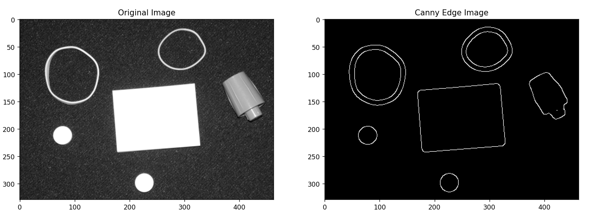

可以看出, Canny 算法边缘检测几乎没有噪声, 并且边缘较细, 维持了一个像素的边缘宽度, 并且所有物体的边缘均连接在了一起, 可以说到达了我们预期的效果.


## 二、边缘连接

### 2.1 边缘连接算法

我们之所以需要边缘连接, 是因为边缘检测的结果并不完美, 其存在以下的问题:

- 存在噪声;
- 不均匀照明导致的边缘间断;
- 虚假的灰度值不连续;

我们难以直接使用边缘检测的结果, 还有一个十分重要的原因, 即为边缘检测实际上以一种 **低级处理**, 而边缘连接是一种 **中级处理**:

1. 边缘检测输入一副 $p \times q$ 大小的灰度图像, 输出仍然为一副 $p \times q$ 大小的二值图像, 本质上仍然是 **低级处理**;
2. 边缘连接输入一副 $p \times q$ 大小的图像 (通常为二值图像), 输出的是一系列像素点对组成的 $m \times 2$ 的矩阵, 已经不再是低级处理, 而是 **中级处理**.

我们首先得明确边缘连接的定义.

边缘连接是指, 将边缘像素组合成有意义的边缘或区域边界. 输入一副 $p \times q$ 大小的图像 (通常为二值图像), 可能还会输入一个起始点, 输出的是一系列像素点对组成的 $m \times 2$ 的矩阵. 我们将这一系列点对连接起来, 就能够基本复原图像中一个物体的边缘.

常见的边缘连接算法有下列这些:

1. 局部处理
2. 区域处理
3. 全局处理（使用霍夫变换）

但是它们均有其优点, 也有其缺点, 我们会在下一节分析.

并且我发现, Matlab 中的 `bwtraceboundary` 函数的实现可能不是上述的任何一种边缘连接算法.


### 2.2 已有的边缘连接算法的优缺点

#### 2.2.1 局部处理边缘连接算法

局部处理边缘连接算法大体上是分析每个候选点 $(x, y)$ 邻域内像素的特点, 并将依据某准则相似的点连接起来.

常见的判断准则有:

1. 基于梯度大小判断相似;
    1. $|M(s, t) - M(x, y)| \le E$;
    2. $(s, t)$ 在 $(x, y)$ 的邻域内;
2. 基于梯度方向判断相似;
    1. $|\theta(s, t) - \theta(x, y)| \le E$;
    2. $(s, t)$ 在 $(x, y)$ 的邻域内;

但是这种计算方法复杂度较高, 并且存在一个问题:

**局部处理边缘连接算法不是二值图像, 而是原始的灰度图像**.

这其实和我们想实现的 **输入为二值图像** 的边缘连接算法想法不符, 因此我舍弃了这种方法.

#### 2.2.2 区域处理边缘连接算法

区域处理边缘连接算法有以下特点:

前提:

- 感兴趣区域的位置已知;
- 预先知道属于边界的像素点;

目标: 基于区域连接像素, 近似区域边界.

方法:

- 函数近似
    - 为已知点拟合一条2维曲线
- 多边形近似
    - 实现容易、捕捉基本形状特征、表示简单

这其实和我们想实现的的边缘连接算法想法依旧不符, 我们其实并没有预先知道, **属于感兴趣区域的位置边界的像素点**.

这是一个决定性的缺陷, 因此我也舍弃了这种方法.

#### 2.2.3 全局处理边缘连接算法

由于我们没有边缘先验知识, 因此也许我们可以考虑全局处理边缘连接算法.

利用全局性质判断是否为边缘像素的步骤:

1. 指定感兴趣的几何形状;
2. 判断边缘像素集合是否满足该形状.

例如我们可以指定一条直线的形状, 然后使用 **霍夫变换** 来实现参数的选取.

除了直线, 我们同样可以使用霍夫变换的方式, 拓展到直线以外的曲线, 例如圆形和椭圆形.

基于霍夫变换的全局处理边缘连接算法事实上对于预先知道几何形状的情形很有诱惑力.

但是有优点也有缺点, 由于复杂的几何形状很难进行霍夫变换, 而且 **我们很可能并没有预先知道几何形状**, 例如我们目前需要实现的边缘连接算法.

这同样是一个决定性的缺陷, 因此我也舍弃了这种方法.


### 2.3 基于游走模型的边缘连接算法

至此, 书上和讲义上提到的三种都被我否决了, 我并没有实现这三种方法中的任何一种.

我希望实现的边缘连接算法是这样的:

- 边缘连接算法的输入:
    - 一张 $p \times q$ 大小的二值图像;
    - 在二值图像上非零的边缘起始点 $(x_0, y_0)$;
- 边缘连接算法的输出:
    - $m \times 2$ 大小的像素点值对组成的矩阵;
    - 将这一系列像素点值对按顺序连接后便能得到物体的边缘.

我在网络上搜寻了一下相关的资料, 然后并没有发现什么像样的资料, 最后我放弃了, 决定实现一个自己构想的 **基于游走模型的边缘连接算法**.

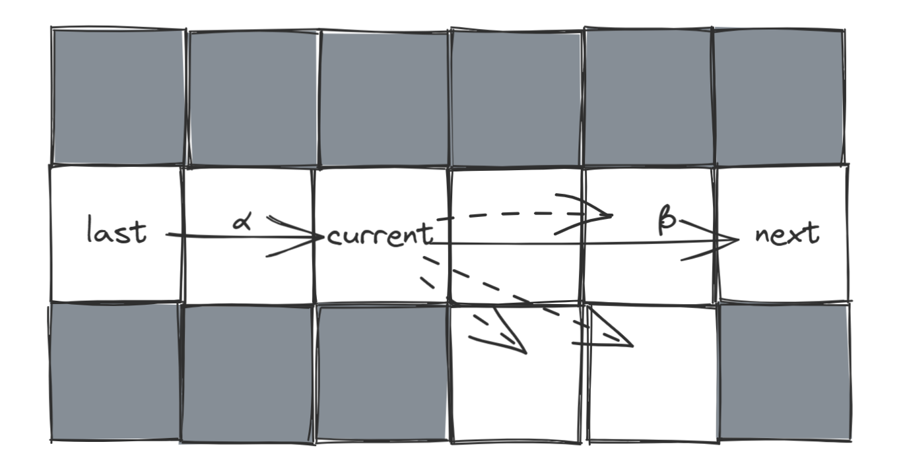

如图所示, 我们使用三个变量 `last`, `current` 和 `next` 来说明这个基于游走模型的边缘连接算法.

我们从初始点 $(x_0, y_0)$ 开始, 以任意一个方向开始游走, 例如我选定了 $(dx, dy) = (1, 1)$ 这个方向开始游走.

下一步要游走到的位置 `next` 是通过 `last` 和 `current` 来选定的. 我们将 `current` 周围的 $n \times n$ 的领域范围的点均作为下一步游走的候选点. 这里的 $n$ 与容许的最大间断点的最大距离有关, 可以作为参数由用户来自定义输入.

我们令向量 $\alpha = \mathrm{current} - \mathrm{last}$, 向量 $\beta = \mathrm{next} - \mathrm{current}$, 其中 `next` 需要遍历所有的候选点, 并且只遍历在二值图像中不为零的点, 如图所示, 黑色点为 $0$, 我们不进行遍历, 白色点为 $1$, 我们将它们作为候选点遍历.

我们选择让向量点乘 $\alpha \cdot \beta$ 所得值最大的候选点作为下一步的 `next`, 即

$$
\displaystyle \mathrm{next}_{\mathrm{opt}} = \argmax_{\mathrm{next}} \alpha \cdot \beta
$$

就这种不断遍历游走, 直到 `next` 回到了原点 $(x_0, y_0)$ 附近 (在 $n / 2$ 范围内) 结束. 将途中所有的游走点记录下来, 便得到了最终的 $(m, 2)$ 大小的结果.

通过这种方法, 对于间隔在 $n / 2$ 以内的边缘间断, 也可以连接起来, 而且实现起来也比较方法, 不需要任何的先验知识, 也可以处理复杂的几何图像.

注意, 即使是不闭合的曲线, 也可以使用这种游走方法识别, 但是最后结果会存在重复的线段, 即从起点到终点, 又从终点回到起点.

并且我们可以使用 Numpy 矩阵的方法优化对应的代码, 具体代码如下:

```python
# 边缘连接函数
def edge_link(binary_img: np.ndarray, origin: tuple, k=5) -> np.ndarray:
    '''
    边缘连接函数
    :param binary_img: 二值图像, 0 和 1 或者 0 和 255 均可
    :param origin: 起始点坐标 (y, x), 可以通过 imtool 获取
    :param k: 间断点的最大距离, 默认为 3
    :return: 边缘连接后的二值图像, shape 为 (n, 2)
    '''
    origin = tuple(origin)
    if binary_img[origin] == 0:
        return np.array([])
    # 将二值图像中的 255 转换为 1
    if binary_img[origin] == 255:
        binary_img = binary_img // 255
    # 获取 n
    n = 2 * k + 1
    # 为原图像添加边界, 防止越界
    img = np.pad(binary_img, n, 'constant', constant_values=0)
    # 结果的点集
    result = [origin]
    # 选一个任意的 "上一点"
    last = (origin[0] - 1, origin[1] - 1)
    # 当前点为起始点
    current = origin
    # 构造一个 n * n 的矩阵, 例如为 [[-1, -1, -1], [0, 0, 0], [1, 1, 1]]
    mat_dy = np.arange(-k, k + 1).reshape(n, 1)
    mat_dy = np.repeat(mat_dy, n, axis=1)
    mat_dx = mat_dy.T
    # 若当前点与起始点不相等且临近于 k + 1, 则终止循环
    # 用一个循环计数, 终止循环
    loop_count = 0
    while loop_count < 200 and (last == origin or current == origin or \
            (abs(current[0] - origin[0]) + \
                abs(current[1] - origin[1])) > k + 1):
        loop_count += 1
        # 通过向量点乘找到当前点的下一个点, 并且使用原点对结果进行矫正
        dist = mat_dy * (current[0] - last[0]) + \
            mat_dx * (current[1] - last[1])
        # 将 img 中为 0 的部分置为最小值
        dist[img[current[0] + k + 1:current[0] + k + 1 + n, \
            current[1] + k + 1:current[1] + k + 1 + n] == 0] = -256
        # 将 dist 中间 k * k 的矩阵也设为最小值
        dist[k - 1: n - k + 1, k - 1: n - k + 1] = -256
        # 找到 dist 中最大的值的索引
        next = np.unravel_index(np.argmax(dist), dist.shape)
        # 如果最大值为 -256, 则说明没有下一个点, 终止循环
        if dist[next] == -256:
            break
        # 将当前点设为下一个点
        last = current
        current = (current[0] + next[0] - k, current[1] + next[1] - k)
        # 加入结果集
        result.append(current)
    result.append(origin)
    return np.array(result)
```

我对 `rubberband_cap.png` 使用该边缘连接算法, 并对 8 个不同的边缘选取了 8 个起始点, 进行识别, 代码如下:

```python
background = np.zeros(img_grey.shape)
plt.imshow(background, cmap = 'gray')
bxpc1 = edge_link(img_edge, (131, 377), k=k)
plt.plot(bxpc1[:, 1], bxpc1[:, 0], 'r-')
bxpc2 = edge_link(img_edge, (126, 217), k=k)
plt.plot(bxpc2[:, 1], bxpc2[:, 0], 'g-')
bxpc3 = edge_link(img_edge, (282, 223), k=k)
plt.plot(bxpc3[:, 1], bxpc3[:, 0], 'b-')
bxpc4 = edge_link(img_edge, (204, 63), k=k)
plt.plot(bxpc4[:, 1], bxpc4[:, 0], 'y-')
bxpc5 = edge_link(img_edge, (55, 62), k=k)
plt.plot(bxpc5[:, 1], bxpc5[:, 0], 'c-')
bxpc6 = edge_link(img_edge, (60, 71), k=k)
plt.plot(bxpc6[:, 1], bxpc6[:, 0], 'm-')
bxpc7 = edge_link(img_edge, (30, 264), k=k)
plt.plot(bxpc7[:, 1], bxpc7[:, 0], '-', color='orange')
bxpc8 = edge_link(img_edge, (41, 326), k=k)
plt.plot(bxpc8[:, 1], bxpc8[:, 0], '-', color='olive')
plt.title('Edge Link Image')
```

所得图像如下:

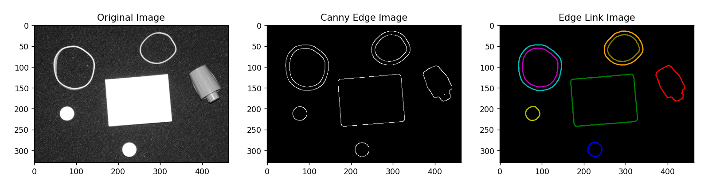

可见, 将 Canny 边缘检测算法和基于游走模型的边缘连接算法组合起来, 能够得到十分优异的效果.


## 三、效果展示

### 3.1 rubberband_cap.png


### 3.2 building_original.jpg

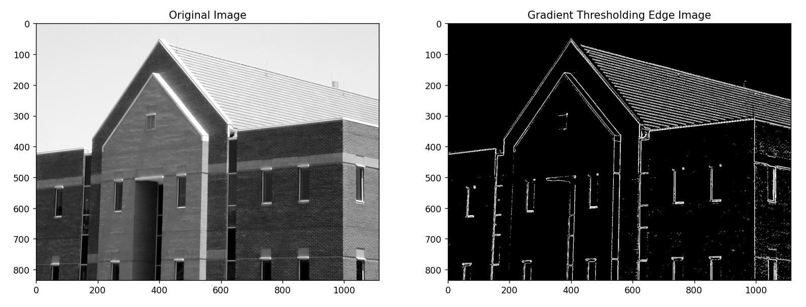

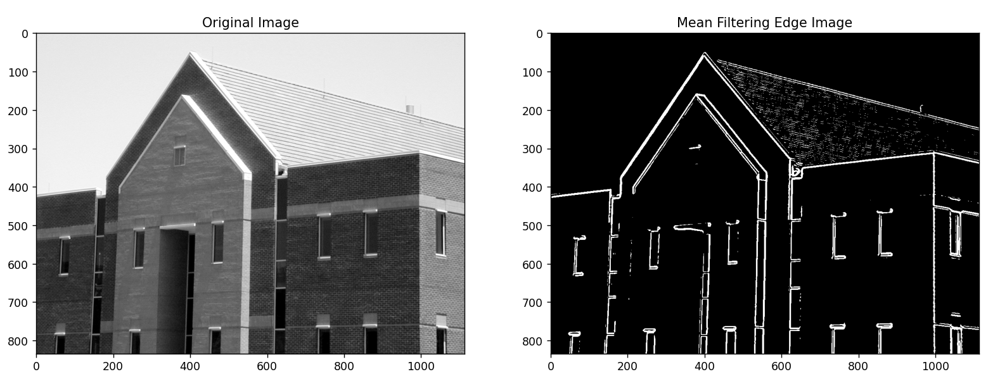

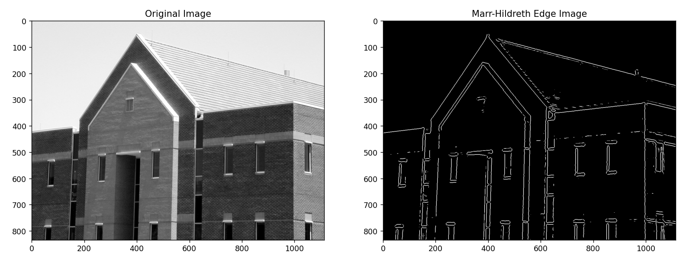


### 3.3 ayu.jpg

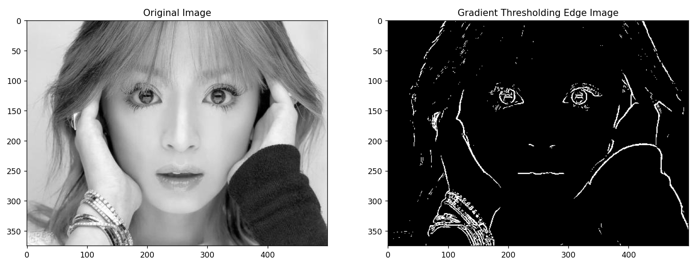

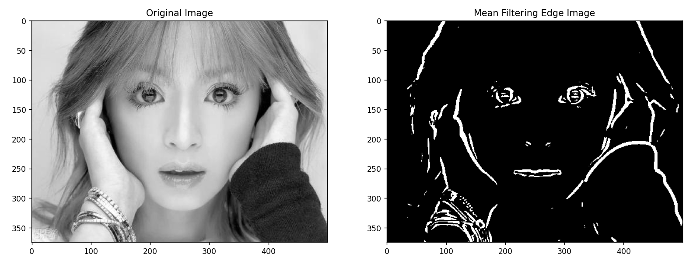

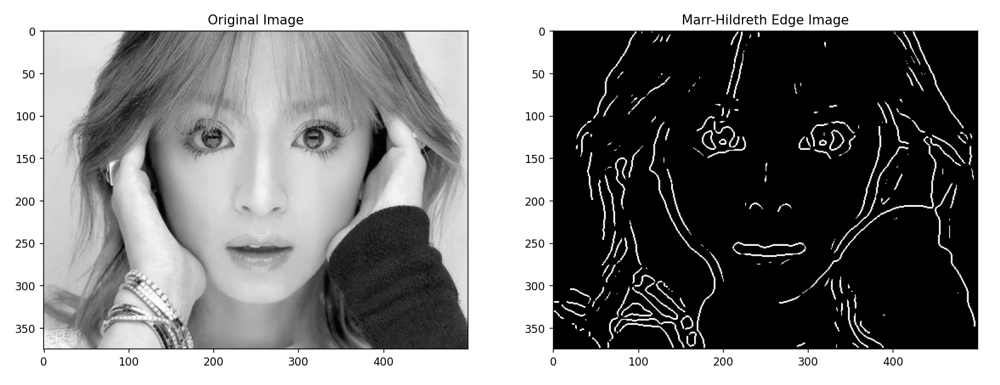

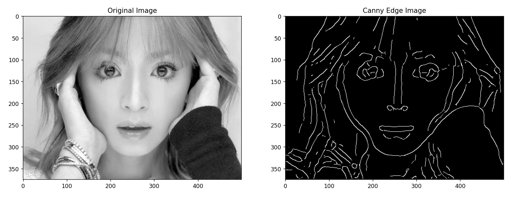

### 3.4 giraffe.jpg

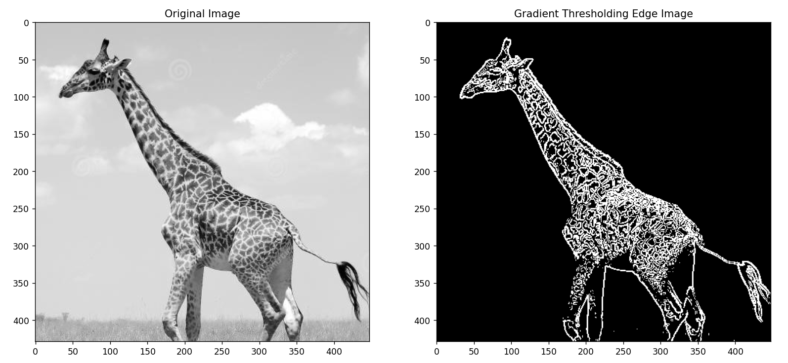

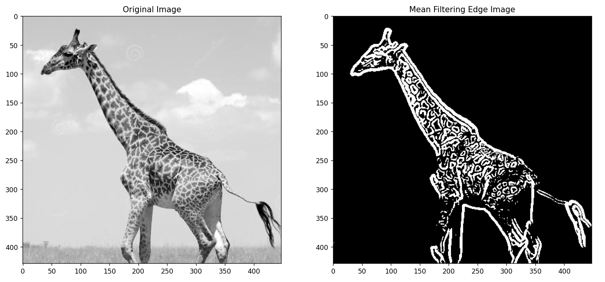

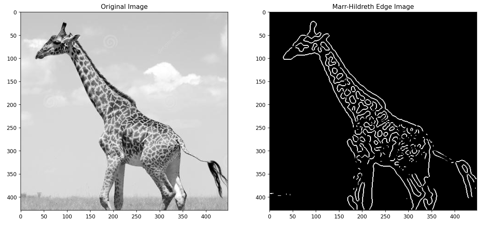

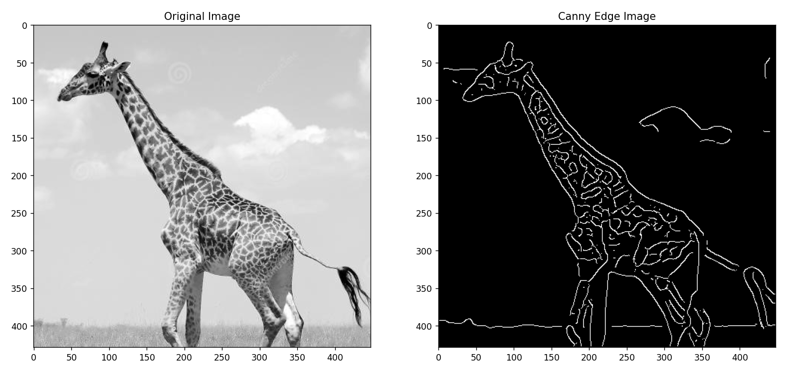

### 3.5 leaf.jpg

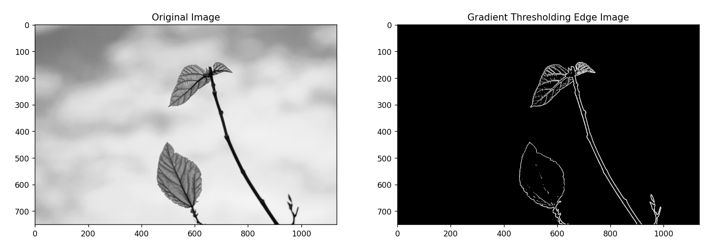

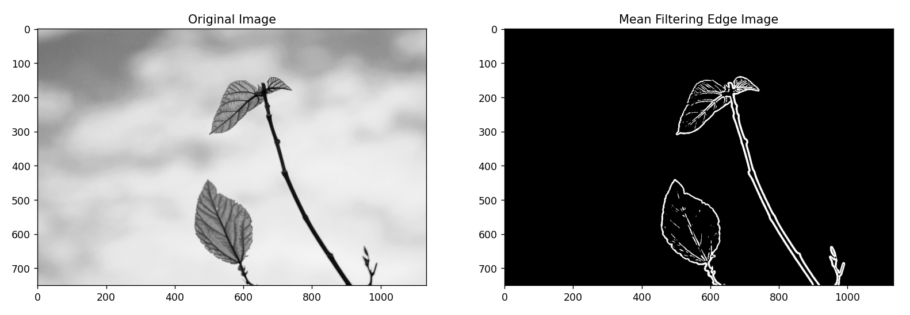

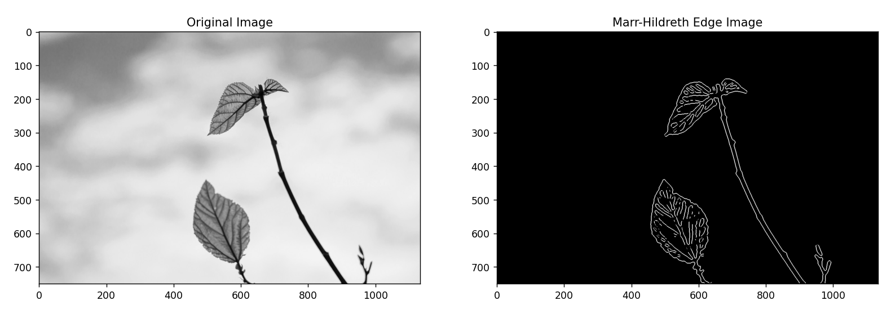

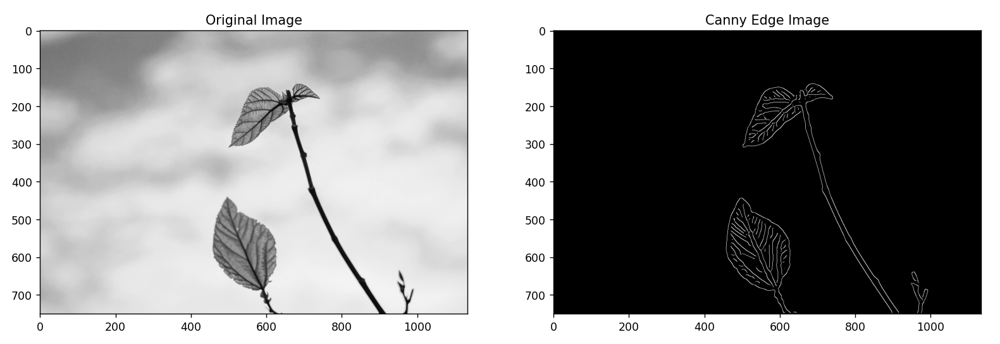

### 3.6 noise.jpg

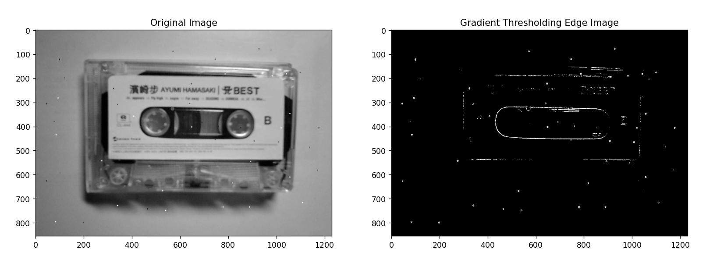

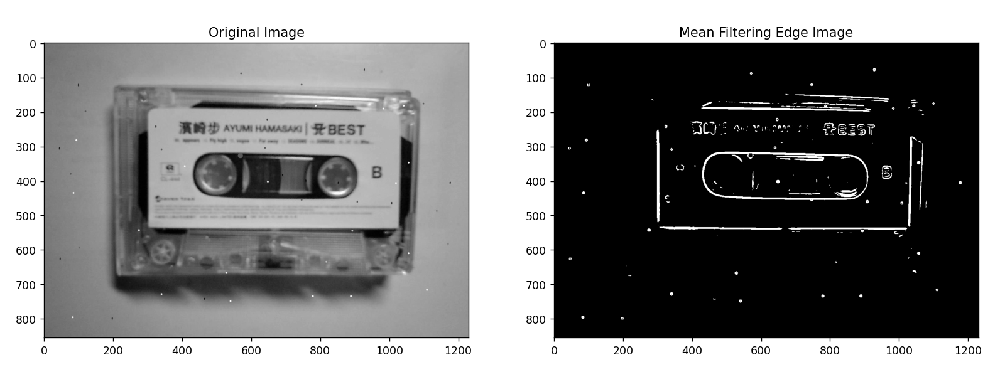

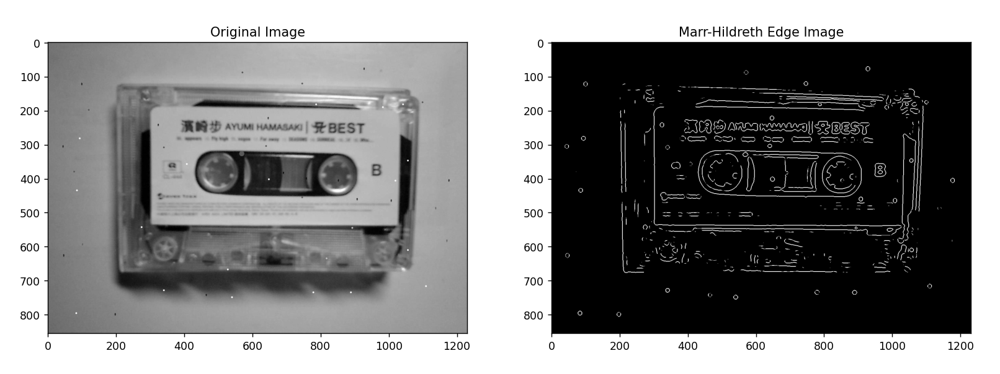


### 3.7 边缘连接


