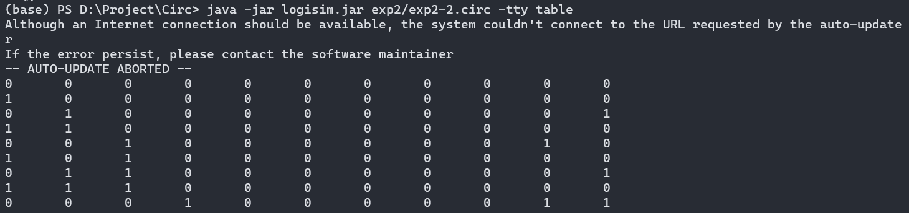

<style>
h1 {
    text-align: center;
}
h2, h3 {
    page-break-after: avoid; 
}
.center {
    margin: 0 auto;
    width: fit-content;
    margin-top: 2em;
    padding-top: 0.5em;
    padding-bottom: 0.5em;
    margin-bottom: 2em;
}
.title {
    font-weight: bold;
    border-top-style: solid;
    border-bottom-style: solid;
}
.newpage {
    page-break-after: always
}
@media print {
    @page {
        margin: 3cm;
    }
}
</style>

<h1 style="margin-top: 4em">
数字电路与数字系统实验报告
</h1>

# <h1 class="center title">实验二: 组合逻辑电路</h1>

<div class="center">
<h3>院系：人工智能学院</h3>
<h3>姓名：方盛俊</h3>
<h3>学号：201300035</h3>
<h3>班级：人工智能 20 级 2 班</h3>
<h3>邮箱：201300035@smail.nju.edu.cn</h3>
<h3>时间：2021年4月7日</h3>
</div>

<div class="newpage"></div>

<!-- 生成目录 -->

## <h1>目录</h1>

[TOC]

<div class="newpage"></div>

<!-- 文章主体内容 -->

## 一、实验目的

1. 掌握使用 Logisim 软件设计、实现组合逻辑电路的方法
2. 熟练应用 Logisim 输入、输出部件
3. 掌握译码器、编码器、多路选择器的设计方法和实现步骤
4. 学习组合逻辑电路的级联方法

## 二、 实验环境 / 器材

**Logisim-ITA V2.16.1.2**

https://sourceforge.net/projects/logisimit/

**头歌线上评测平台**

https://www.educoder.net/classrooms/10924/

## 三、实验内容

### 1. 3 - 8 译码器

#### (a) 实验原理

**译码器 (decoder):** 一种多输入, 多输出的组合电路.

最常见的是 $n-2^n$ 译码器, 输入为 $n$ 位二进制编码, 输出为 $2^n$ 中取 $1$ 码.

* 为多输入端, 多输出端电路,且输入端数比输出端数少
* 电路功能反映输入编码与输出编码之间的映射关系
* 通常输出编码采用 $2^n$ 中取 $1$ 码，即单热点 (one-hot) 编码
* 可以通过使能端 $En$ 来控制电路实现映射功能

下图所示的是 3 - 8 译码器原理图.


输入信号 $G_1, G_2A_L, G_2B_L$ 为使能端. 其中 $G_1$ 为高电有效, $G_2A_L, G_2B_L$ 为低电平有效 (在本题中似乎没什么用处). 

输入信号 $A, B, C$ 为二进制编码, 最高位为 $C$, 最低位为 $A$, 高电平有效.

输出信号 $Y_{0L}$ 至 $Y_{7L}$ 可以视为数字 0 - 7 的指示位, 低电平有效.

#### (b) 实验步骤

1. 先放入 8 个输入引脚数为 4 的非门和一个输入引脚数为 3 的与门.
2. 再放入七个非门.
3. 安装原理图小心翼翼地连好线.

**最后结果如下:**


#### (c) 仿真验证

按下 `Ctrl + K` 开始本地仿真, 结果良好.


运行代码

``` sh
java -jar logisim.jar exp2/exp2-1.circ -tty table
```


可见也有正常的输出.

#### (d) 实验结果

通过了头歌平台的验证.


### 2. 8 - 3 优先编码器

#### (a) 实验原理

**编码器 (encoder)**: 译码器的逆向电路, 即输出是输入信号的二进制编码.

最常见是 $2^n-n$ 编码器，也称为二进制编码器, 有着 $2^n$ 个输入端, $n$ 个输出端.

下图所示的是 8 - 3 优先编码器原理图. 


多个输入可同时为1, 但只对优先级最高的输入进行编码输出

常见优先级顺序为 $I_0 > I_1 > I_2 > I_3 > I_4 > I_5 > I_6 > I_7$

输入信号从 $I_0$ 至 $I_7$ 为高电平有效, 可以视作数字 $0$ 至数字
$7$ 的指示位. 

输出信号为二进制编码结果, 编码的最高位为 $O_0$，最低位为 $O_2$.

#### (b) 实验步骤

1. 依次放入 7 个输入引脚数不同的与门和 3 个4输入或门, 其中与门除了底部的输入, 均要做一次翻转.


2. 进行小心翼翼的连线.


#### (c) 仿真验证

按下 `Ctrl + K` 开始本地仿真, 结果良好.


运行代码

``` sh
java -jar logisim.jar exp2/exp2-2.circ -tty table
```



可见也有正常的输出.

#### (d) 实验结果

通过了头歌平台的验证.


### 3. 4 选 1 多路选择器

#### (a) 实验原理

**2 - 路选择器**有两个输入端和一个输出端, 有一个控制端, 用于控制
选择哪一路输出.

公式如下:

$$
F=A\cdot\overline{S} + B\cdot S
$$

2 - 路选择器的符号和逻辑电路如下:


**4 选 1 选择器**可以由多个 2 选 1 选择器组成, 并且这种级联可以继续扩展.


#### (b) 实验步骤

1. 使用 2 个与门和 1 个或门, 搭建 2 - 路选择器.


2. 使用 3 个 2 - 路选择器进行多层次级联, 搭建 4 - 路选择器.


#### (c) 仿真验证

按下 `Ctrl + K` 开始本地仿真, 结果良好.


运行代码

``` sh
java -jar logisim.jar exp2/exp2-1.circ -tty table
```


可见也有正常的输出.

#### (d) 实验结果

通过了头歌平台的验证.


## 四、实验中遇到的问题和解决方法

### 1. 不知道如何给逻辑门的输入引脚加入"非", 即小圆圈

本来我的打算直接拿非门来当输入引脚的非, 就像这样:


非常地不美观.

经过助教提醒, 可以在逻辑门的设置位置, 将 **"反转"** 选为 **"是"**,


即可和电路图一样, 拥有美观的输入引脚"非".


### 2. 在顶层模块中不能使用 "手指" 更改输入引脚的内容

在**顶层模块**中, 我像在子模块中一样, 自然而然地想要用 "手指" 更改输入引脚的内容.

但出乎我意料的是, 没有任何反应, 我一度怀疑是不是卡死了. 发现电脑没问题之后, 我开始迷惑不解.


询问过身边的同学后, 我才知道, 在顶层模块中是不能用 "手指" 点输入引脚的, 只能用另一种方式更改输入引脚: **使用 "手指" 点击时钟.**


每点一次, 时钟信号就会改变一次, 和 `Ctrl + K` 之后时钟信号周期性改变的效果是一样的.

所以, 要在**顶层模块**更改输入引脚内容, 有两种办法:

1. **使用 "手指" 点击时钟**
2. **按下 `Ctrl + K`, 让时钟自己周期性改变**

