

<h1 style="margin-top: 4em">
数字电路与数字系统实验报告
</h1>

# <h1 class="center title">实验三: 时序逻辑电路</h1>

<h3>院系：人工智能学院</h3>
<h3>姓名：方盛俊</h3>
<h3>学号：201300035</h3>
<h3>班级：人工智能 20 级 2 班</h3>
<h3>邮箱：201300035@smail.nju.edu.cn</h3>
<h3>时间：2021年5月8日</h3>

<!-- 生成目录 -->

## <h1>目录</h1>

[TOC]

<!-- 文章主体内容 -->

## 一, 实验目的

1. 掌握使用 Logisim 软件设计, 实现时序逻辑电路的方法
2. 掌握触发器, 计数器的设计方法和实现步骤
3. 学习寄存器和寄存器堆的设计和实现方法
4. 学习移位寄存器的设计原理和实现方法

## 二, 实验环境 / 器材

**Logisim-ITA V2.16.1.2**

https://sourceforge.net/projects/logisimit/

**头歌线上评测平台**

https://www.educoder.net/classrooms/10924/

## 三, 实验内容

### 1. D 触发器

#### (a) 实验原理

**D 锁存器:** 只有一个数据输入端 D, 称为 D 锁存器, 也称为透明锁存器.

* C = 0 时, 输出状态不变.
* C = 1 时
  * D = 1 时, Q = 1
  * D = 0 时, Q = 0

电路原理图:

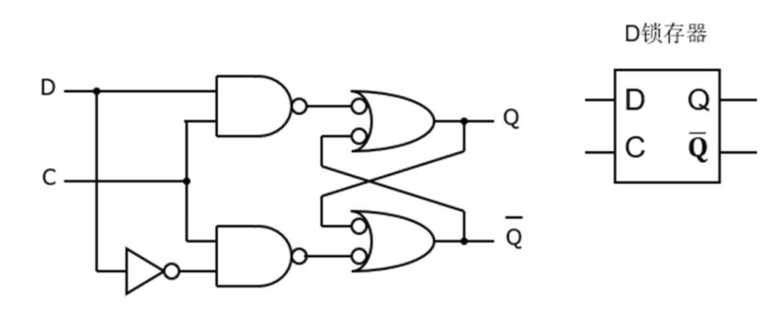

**D 触发器:** 由一对主, 从 D 锁存器构成, 只在时钟周期到来的时候触发.

电路原理图:

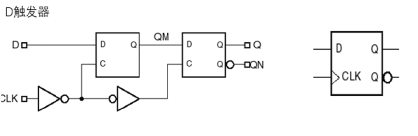

**带使能端 EN 的 D 触发器**: 通过使能端EN信号来控制是否在时钟信号的触发边沿进行数据的存储.

电路原理图:

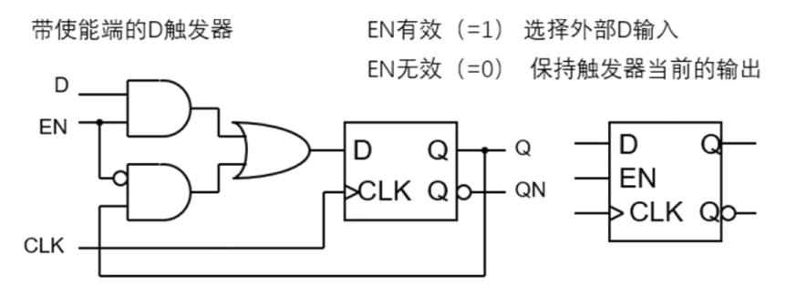

#### (b) 实验步骤

1. 按照电路原理图构造出 D 锁存器, 注意这是时序逻辑电路.

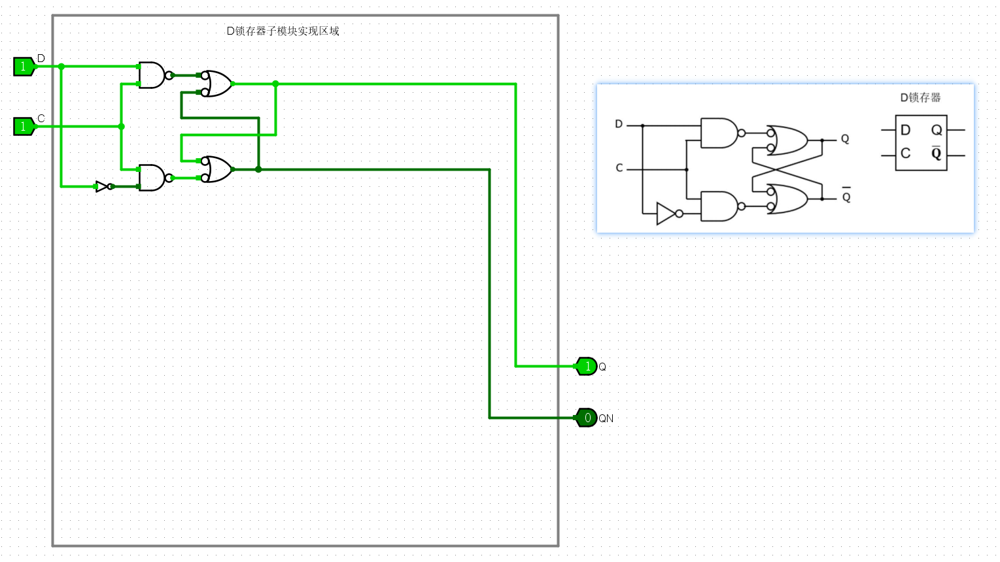

2. 在 D 锁存器的基础上搭建出 D 触发器.

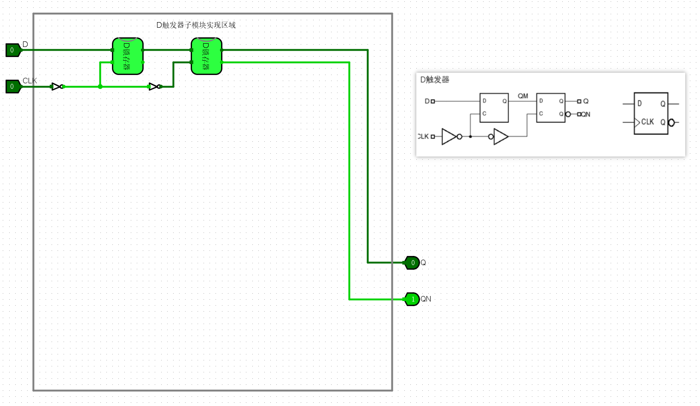

3. 在 D 触发器的基础上, 增加使能端 EN.

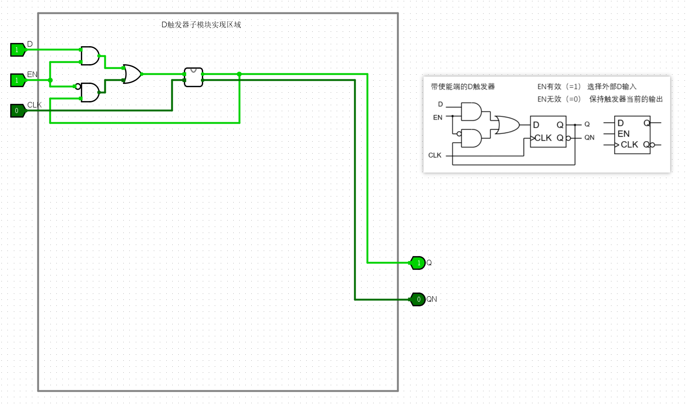

#### (c) 仿真验证

按下 `Ctrl + K` 开始本地仿真, 结果良好.

**最后结果如下:**

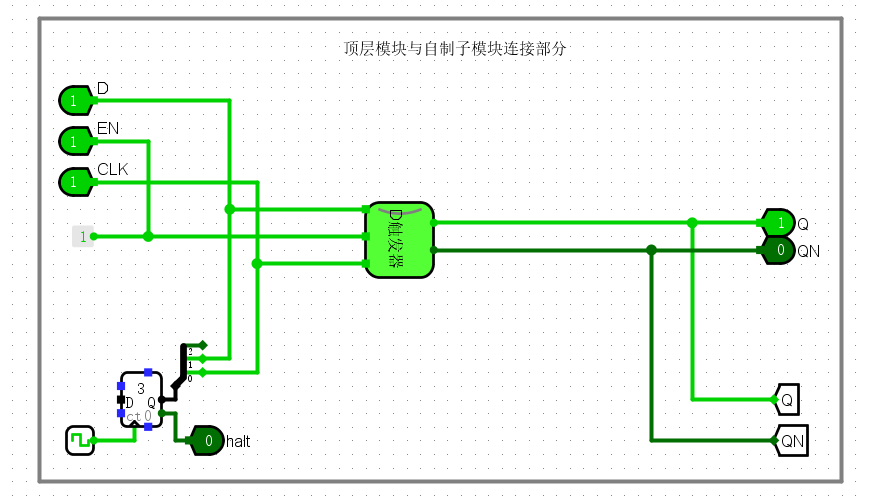

#### (d) 实验结果

通过了头歌平台的验证.

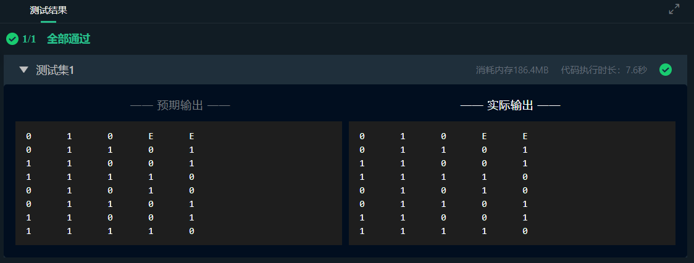

### 2. 4 位行波加法计数器

#### (a) 实验原理

**T触发器:** 在每个时钟脉冲的触发边沿都会改变状态, 基于 D 触发器实现, 可用于实现计数器, 分频器等功能.

电路原理图:

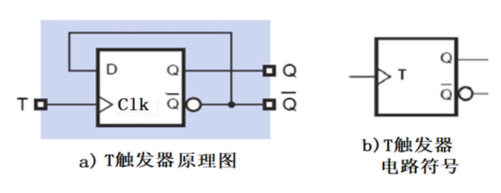

**异步行波加法计数器:** 利用 T 触发器实现, 激励输入像波浪一样由低位向高位传递, 每个时钟周期传送一次.

电路原理图:

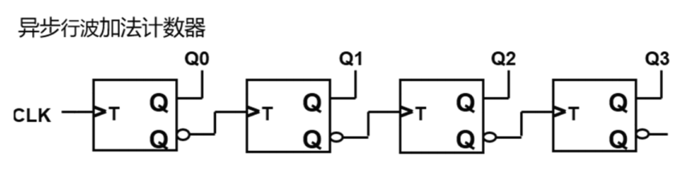

#### (b) 实验步骤

1. 利用 Logisim 里自带的 D 触发器实现 T 触发器.

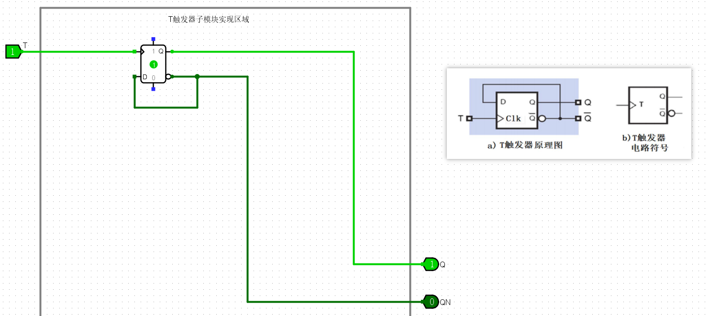

2. 使用三个 T 触发器实现 4 位行波加法计数器.

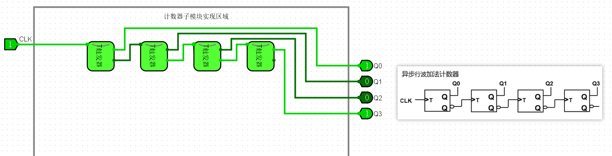

#### (c) 仿真验证

按下 `Ctrl + K` 开始本地仿真, 结果良好.

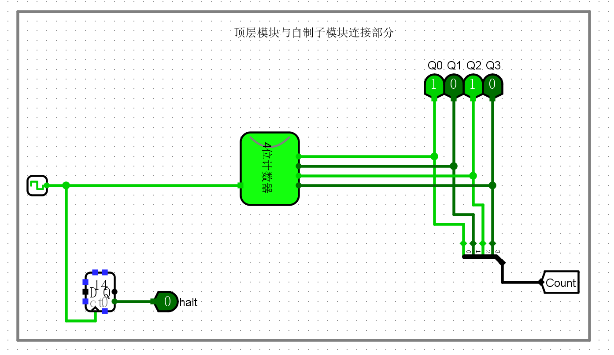

#### (d) 实验结果

通过了头歌平台的验证.

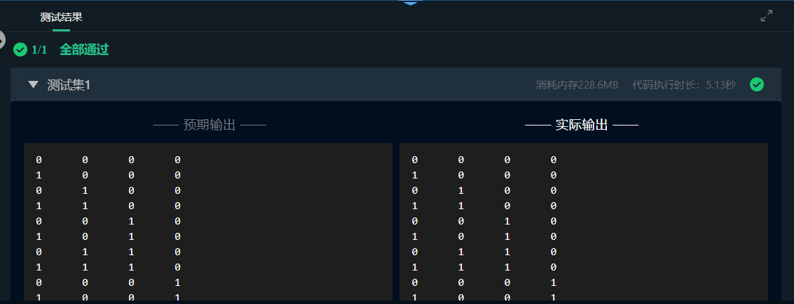

### 3. 4 位通用移位寄存器

#### (a) 实验原理

**寄存器:** 寄存器是用来暂存信息的逻辑部件, 寄存器可直接由若干个触发器组成.

* S1S0 = 00: 保持
* S1S0 = 01: 上移
* S1S0 = 10: 下移
* S1S0 = 11: 加载

**4 位通用移位寄存器:** 具有数据左移, 数据右移, 数据保持和数据载入功能.

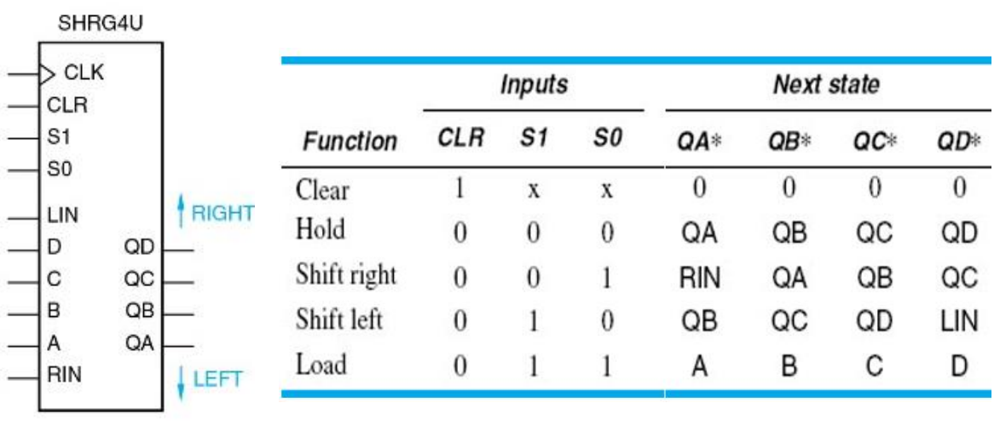

输入端为 A,  B, C, D, CLK, CLR, LIN, RIN, S0, S1, 输出端为 QA, QB, QC, QD (请注意在移位时, QA 为最左端, QD 为最右端). 当做右移操作时, 在最左端上补位 RIN, 当做左移操作时, 在最右端上补位 LIN.

电路结构图较为复杂, 如下:

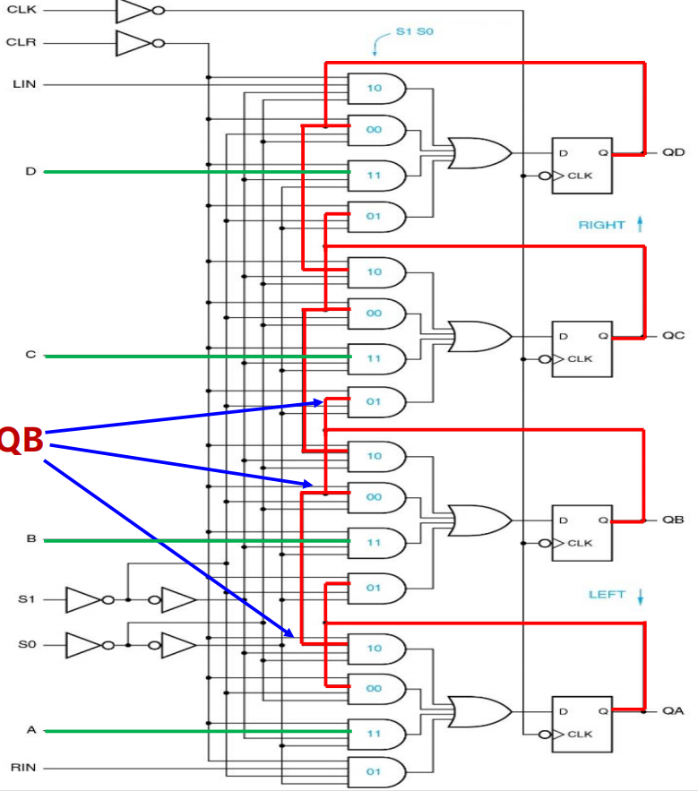

#### (b) 实验步骤

1. 将逻辑门放置完毕, 将输入的线进行重新排列. 使用复制粘贴功能, 将较为规律的部分完成.

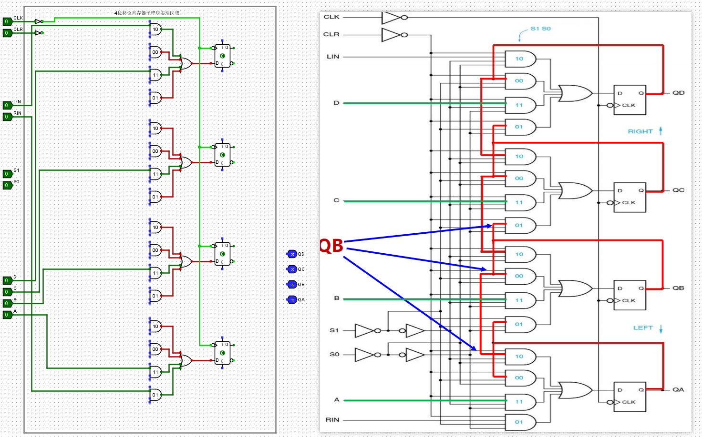

2. 将**红线**标注的时序逻辑电路部分连线. (在后续修改了一点小错误)

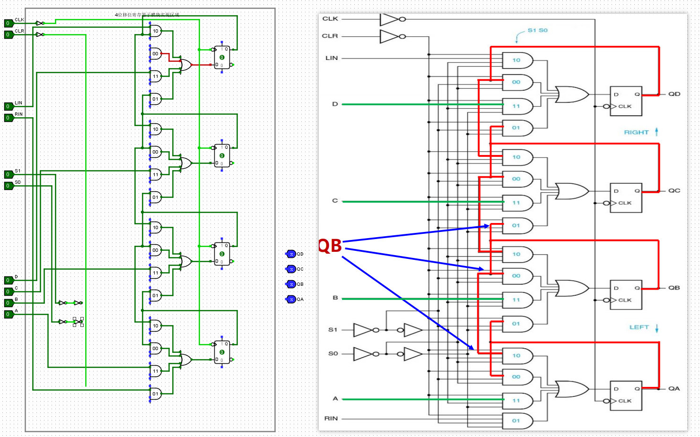

3. 将剩下最为繁杂的部分一根一根地连线.

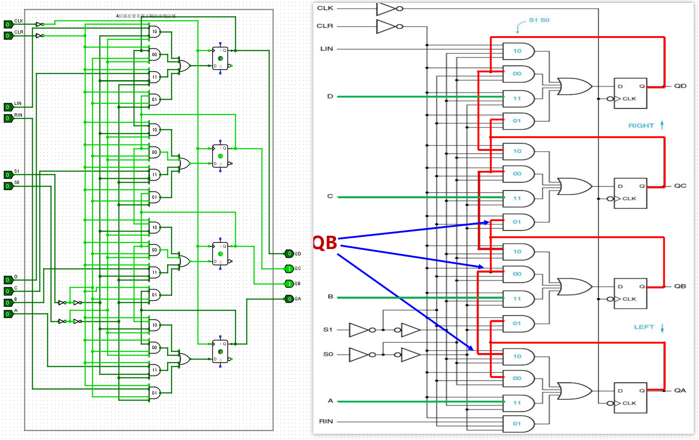

#### (c) 仿真验证

按下 `Ctrl + K` 开始本地仿真, 结果良好.

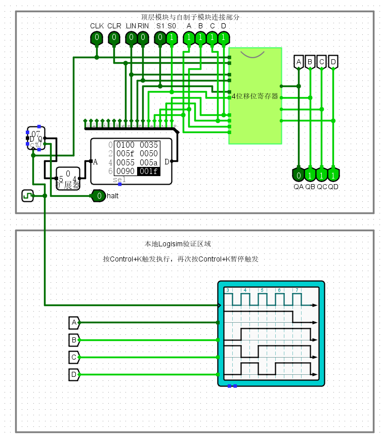

#### (d) 实验结果

通过了头歌平台的验证.

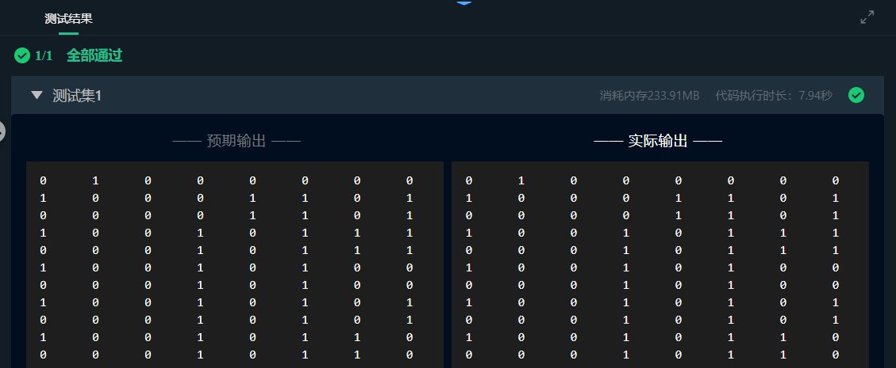

## 四, 实验中遇到的问题和解决方法

### 1. 上升沿和下降沿的问题

在 4 位通用移位寄存器搭建的过程中, 按照电路图将所有上升沿改为了下降沿, 导致没有通过头歌平台的测试.

解决办法: 将上升沿改回了下降沿.