<style>
h1 {
    text-align: center;
}
h2, h3 {
    page-break-after: avoid; 
}
.center {
    margin: 0 auto;
    width: fit-content;
    margin-top: 2em;
    padding-top: 0.5em;
    padding-bottom: 0.5em;
    margin-bottom: 2em;
}
.title {
    font-weight: bold;
    border-top-style: solid;
    border-bottom-style: solid;
}
.newpage {
    page-break-after: always
}
@media print {
    @page {
        margin: 3cm;
    }
}
</style>

<h1 style="margin-top: 4em">
数字电路与数字系统实验报告
</h1>

# <h1 class="center title">实验四: 算术逻辑部件</h1>

<div class="center">
<h3>院系：人工智能学院</h3>
<h3>姓名：方盛俊</h3>
<h3>学号：201300035</h3>
<h3>班级：人工智能 20 级 2 班</h3>
<h3>邮箱：201300035@smail.nju.edu.cn</h3>
<h3>时间：2021年5月19日</h3>
</div>

<div class="newpage"></div>

<!-- 生成目录 -->

## <h1>目录</h1>

[TOC]

<div class="newpage"></div>

<!-- 文章主体内容 -->

## 一, 实验目的

1. 掌握使用 Logisim 软件设计, 实现算术逻辑部件的方法
2. 学习 4 位先行进位加法器 CLA 和先行进位逻辑单元 CLU 的设计原理和实现方法
3. 学习 16 位先行进位加法器及相关标志位的设计原理和实现方法
4. 学习基本算术逻辑部件的设计原理和实现方法, 实现 6 种操作的 ALU 器件

## 二, 实验环境 / 器材

### Logisim-ITA V2.16.1.2

https://sourceforge.net/projects/logisimit/

### 头歌线上评测平台

https://www.educoder.net/classrooms/10924/

## 三, 实验内容

### 1. 4 位先行进位加法器

#### (a) 实验原理

**1 位全加器 (FA):** 有两个位输入 X, Y 和进位输入 Cin, 输出加法计算结果 F, 进位传递位 P 和进位生成位 G.

其中逻辑表达式为

``` c
F = X ^ Y ^ Cin
P = X | Y
G = X & Y
```

电路图:

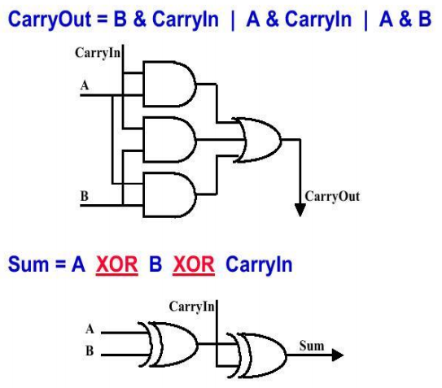

**先行进位部件 (CLU):** 输入为 4 位进位传递信号 P1, P2, P3, P4, 4 位进位生成信号 G1, G2, G3, G4, 和一位进位输入 Cin (同 C0); 其输出为四位进位信号 C1, C2, C3, C4. 

电路图:

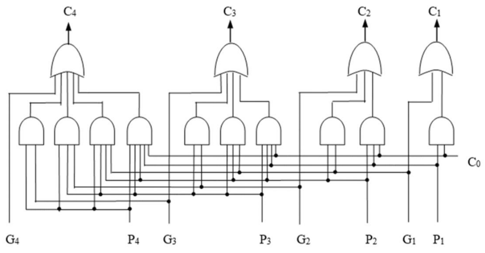

**4 位 CLA:** 由 4 个 FA 和一个 4 位 CLU 组成, 实现四位的加法功能.

电路图:

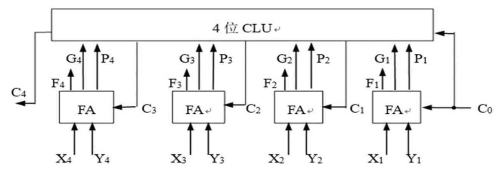


#### (b) 实验步骤

1. 先将 1 位全加器根据逻辑表达式搭建完毕.

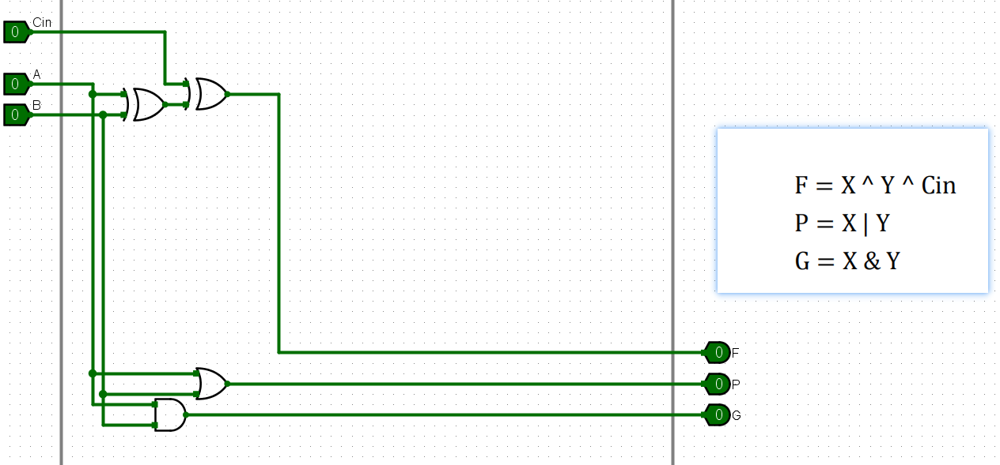

2. 再制作 CLU 模块.

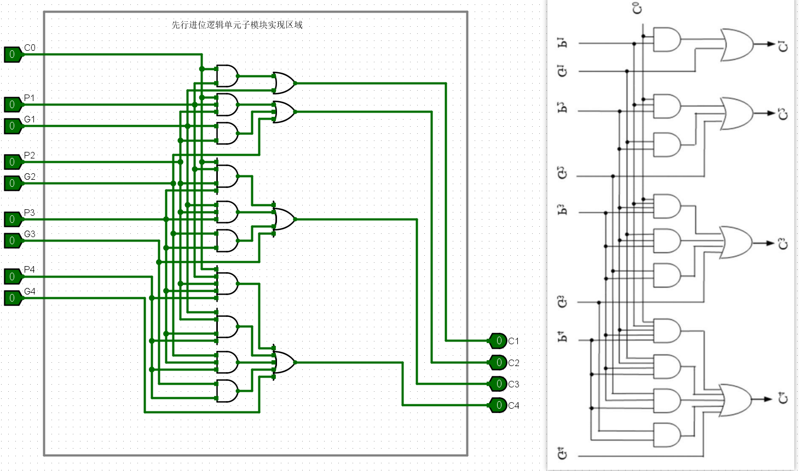

3. 基于 FA 和 CLU 制作 CLA.

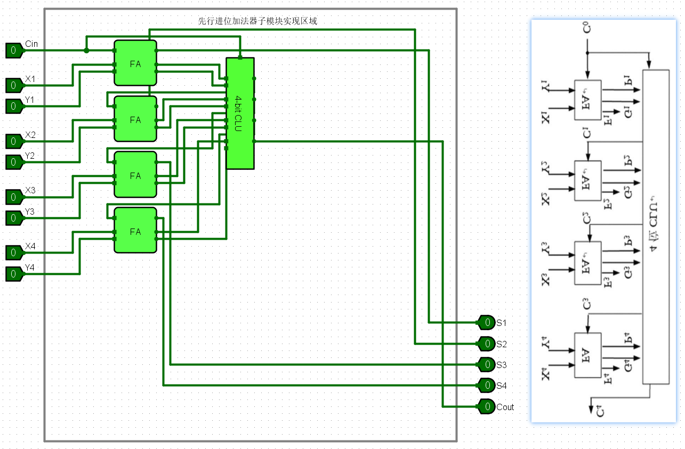


#### (c) 仿真验证

按下 `Ctrl + K` 开始本地仿真, 结果良好.

**最后结果如下:**

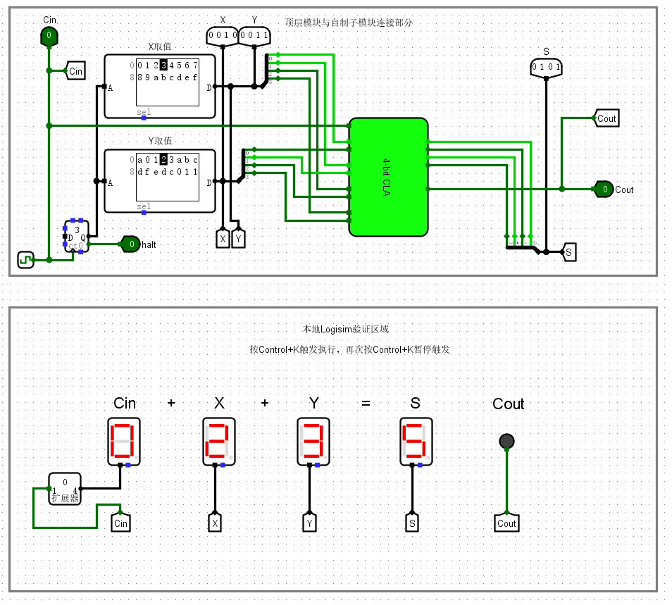

#### (d) 实验结果

通过了头歌平台的验证.


### 2. 16 位先行进位加法器

#### (a) 实验原理

**组间先行进位函数逻辑单元:** 其输入为 4 位进位传递信号 P1, P2, P3, P4 和 4 位进位生成信号 G1, G2, G3, G4, 输出为组间进位传递信号 Pg 和组间进位生成信号 Gg.

逻辑表达式为:

$
\begin{aligned}
Gg&=G_4+P_4\cdot G_3+P_4\cdot P_3\cdot G_2+P_4\cdot P_3\cdot P_2\cdot P_1 \\
Pg&=P_4\cdot P_3\cdot P_2\cdot P_1 \\
\end{aligned}
$

**16 位先行进位加法器:** 通过 4 位 CLA 和组间先行进位函数逻辑单元组合形成.

电路原理图:

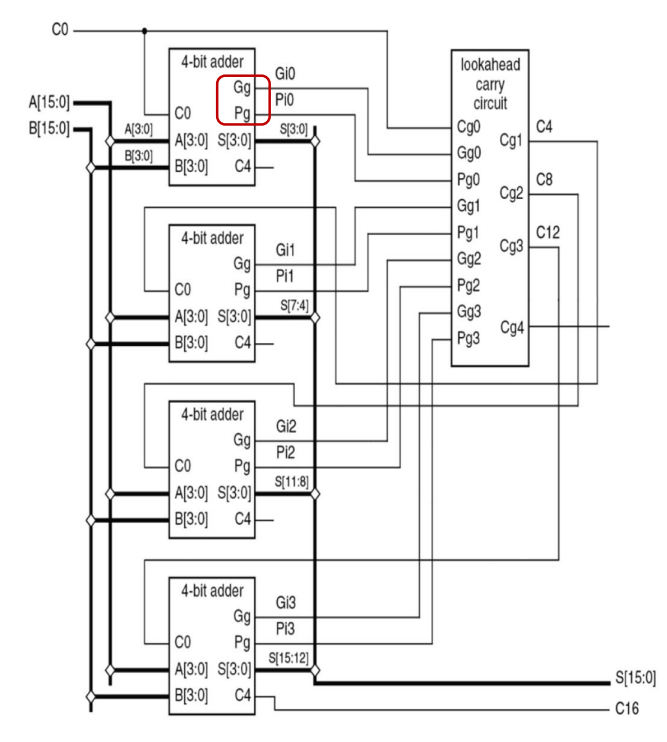

#### (b) 实验步骤

1. 引入 `exp4-1.circ` 的组件.

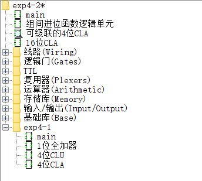

2. 根据逻辑表达式组建组间先行进位函数逻辑单元.

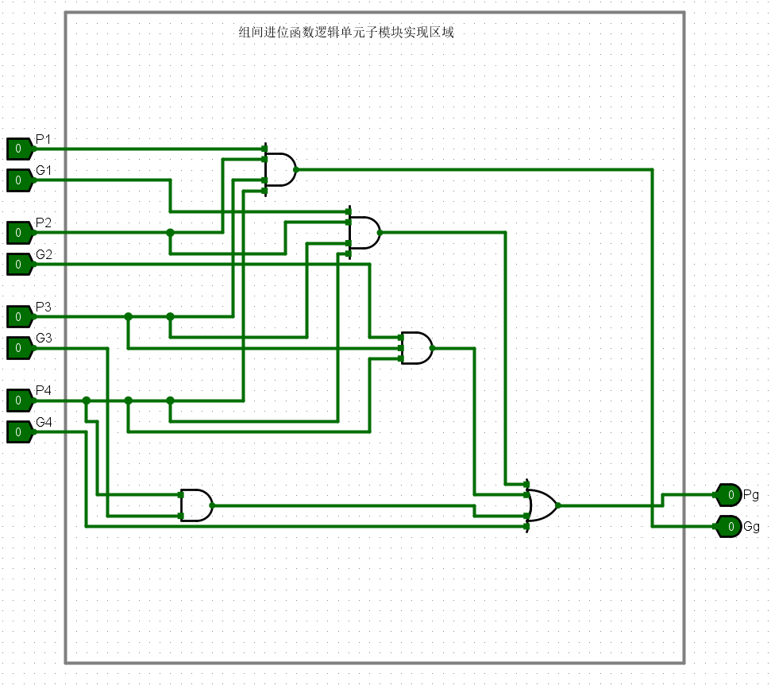

3. 修改 CLA 为可级联的的 4 位 CLA.

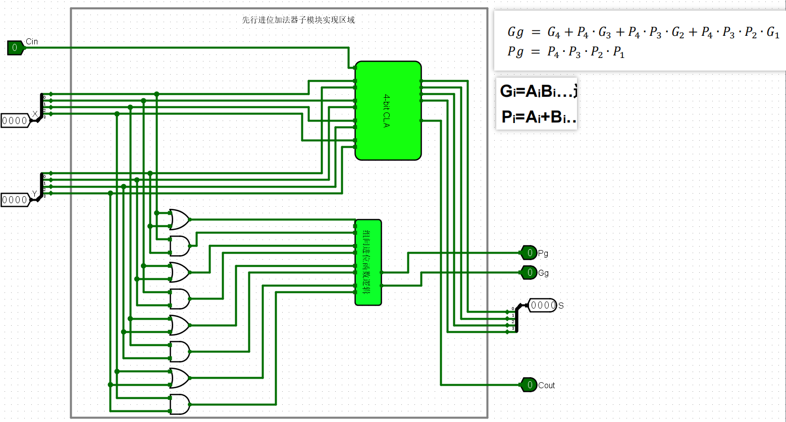

4. 使用 4 位 CLA 搭建 16 位先行进位加法器.

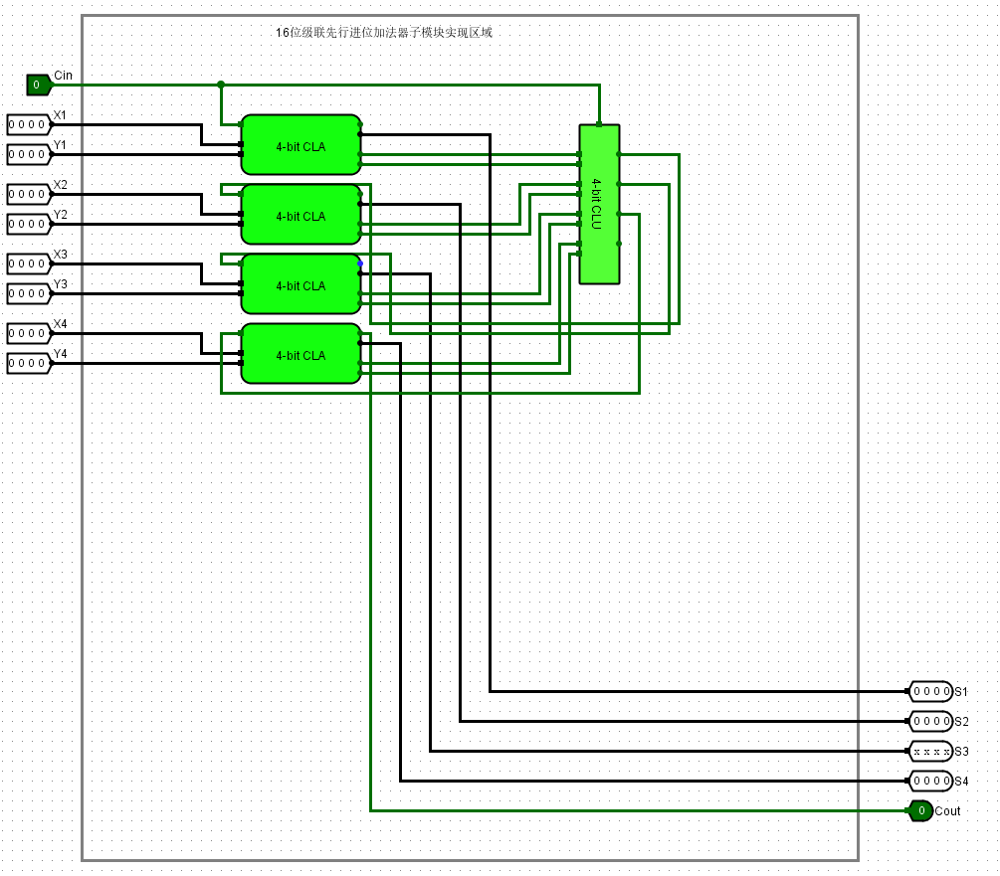

#### (c) 仿真验证

按下 `Ctrl + K` 开始本地仿真, 结果良好.

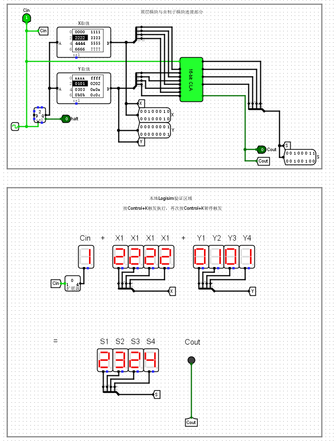


### 3. 算术逻辑部件 (ALU)

#### (a) 实验原理

**4 位带标志位加法器:** 输入为两个 4 位操作数 X1, X2, X3, X4, Y1, Y2, Y3, Y4 (由低位到高位, 同图中 A0~A3, B0~B3) , 进位 Cin; 输出为 4 位计算结果 S (同图中 F) , 最高位进位 Cout, 溢出标志位 OF, 符号标志位 SF, 零标志位 ZF, 进/借位标志位 CF. 

电路图如下:

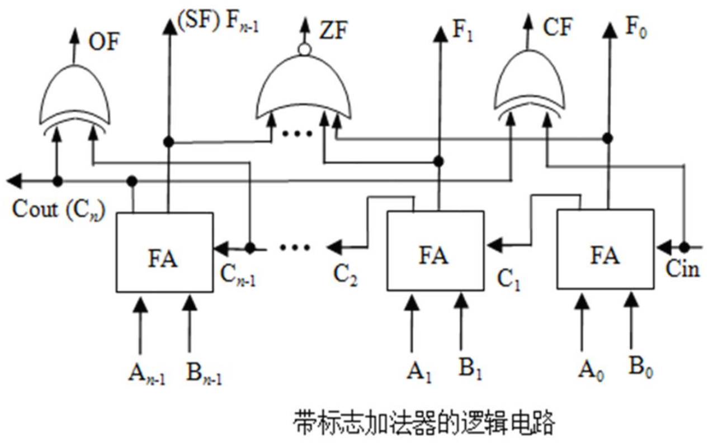

**ALU:** 有一个操作控制端 (ALUop), 用来决定 ALU 所执行的处理功能. ALUop 的位数 k 决定了操作的种类例如, 当位数 k 为 3 时, ALU 最多只有 23 = 8 种操作. 这里我们支持 6 种操作 (add, slt, sltu, sub, or, srcB)

操作对应的表格:

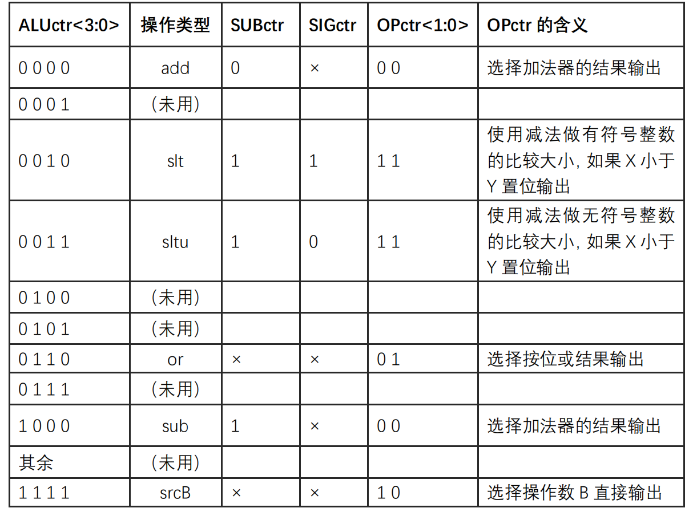

电路图如下:


#### (b) 实验步骤

1. 借助 Logisim 自带的 FA 构建 4 位 带标志位加法器.

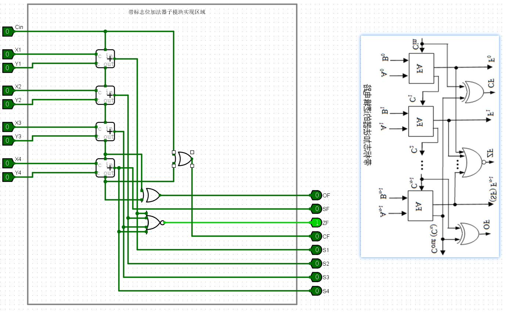

2. 基于带标志位加法器实现 ALU.


#### (c) 仿真验证

按下 `Ctrl + K` 开始本地仿真, 结果良好.

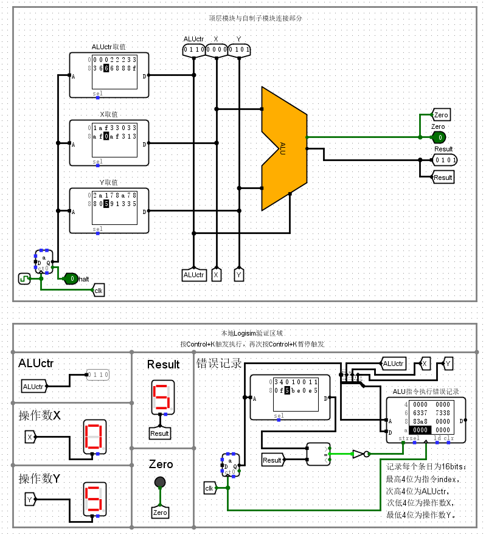

#### (d) 实验结果

通过了头歌平台的验证.

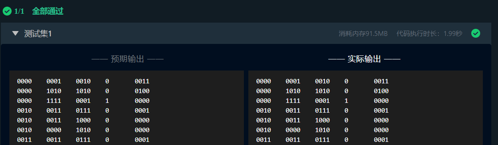

## 四, 实验中遇到的问题和解决方法

### 1. 对于 Logisim 器件不熟悉

**问题:** 一开始不清楚异或门阵列和或门阵列要怎么实现. 

**解决办法:** 只需要将门电路的数据位宽调为 4 即可.

**问题:** 分线器使用不当.

**解决方法:** 分线端口数和位宽均调为 4 即可, 这代表着 4 位编码器或 4 位译码器.

### 2. 未看清楚题目

题目中的红圈没看明白是什么意思, 实际上是取非的意思.