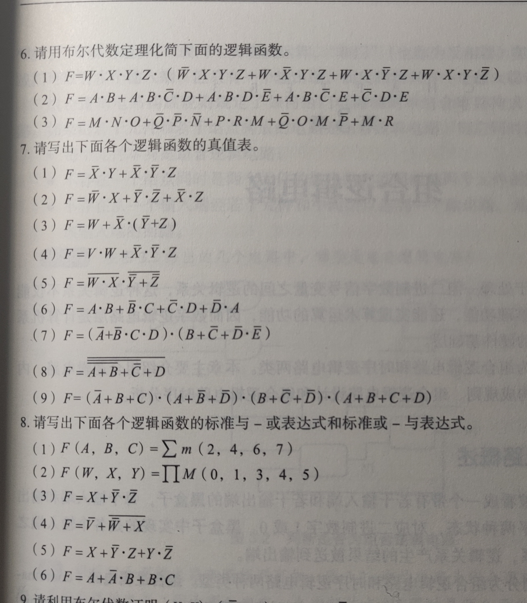

习题 3、5、6(1)、7(5)、7(8)、8(1)、8(2)、8(4)、12、13(2)、13(5)

<!-- 

 -->

# 第二章

## 3.

### T2: 空元素

| $X$ | $X+1$ | $X\cdot 0$ |
| --- | ----- | ---------- |
| 0   | 1     | 0          |
| 1   | 1     | 0          |

$\therefore X+1=1, X\cdot 0=0$

### T3: 同一律

| $X$ | $X+X$ | $X\cdot X$ |
| --- | ----- | ---------- |
| 0   | 0     | 0          |
| 1   | 1     | 1          |

$\therefore X+X=X, X\cdot X=X$

### T4: 还原律

| $X$ | $\overline{X}$ | $\overline{\overline{X}}$ |
| --- | -------------- | ------------------------- |
| 0   | 1              | 0                         |
| 1   | 0              | 1                         |

$\therefore \overline{\overline{X}}=X$

### T5: 互补律

| $X$ | $X+\overline{X}$ | $X\cdot \overline{X}$ |
| --- | ---------------- | --------------------- |
| 0   | 1                | 0                     |
| 1   | 1                | 0                     |

$\therefore X+\overline{X}=1, X\cdot \overline{X}=0$

## 5.

未处理好优先级问题.

$X+Y\cdot Z$ 的反应该是 $\overline{X}\cdot (\overline{Y}+\overline{Z})$

## 6.(1)

$$
\begin{aligned}
F
=\ &W\cdot X\cdot Y\cdot Z\cdot (\overline{W}\cdot X\cdot Y\cdot Z+W\cdot \overline{X}\cdot Y\cdot Z+W\cdot X\cdot \overline{Y}\cdot Z+W\cdot X\cdot Y\cdot \overline{Z}) \\
=\ &(W\cdot \overline{W})\cdot X\cdot Y\cdot Z\cdot X\cdot Y\cdot Z+W\cdot (X\cdot \overline{X})\cdot Y\cdot Z\cdot W\cdot Y\cdot Z \\
&+W\cdot X\cdot (Y\cdot \overline{Y})\cdot Z\cdot W\cdot X\cdot Z+W\cdot X\cdot Y\cdot W\cdot X\cdot Y\cdot (Z\cdot \overline{Z}) \\
=\ &0
\end{aligned}
$$

## 7.

### (5)

$F=\overline{W\cdot X}\cdot \overline{\overline{Y}+\overline{Z}}$

| W | X | Y | Z | $\overline{W\cdot X}$ | $\overline{\overline{Y}+\overline{Z}}$ | F |
|---|---|---|---|---|---|---|
| 0 | 0 | 0 | 0 | 1 | 0 | 0 |
| 0 | 0 | 0 | 1 | 1 | 0 | 0 |
| 0 | 0 | 1 | 0 | 1 | 0 | 0 |
| 0 | 0 | 1 | 1 | 1 | 1 | 1 |
| 0 | 1 | 0 | 0 | 1 | 0 | 0 |
| 0 | 1 | 0 | 1 | 1 | 0 | 0 |
| 0 | 1 | 1 | 0 | 1 | 0 | 0 |
| 0 | 1 | 1 | 1 | 1 | 1 | 1 |
| 1 | 0 | 0 | 0 | 1 | 0 | 0 |
| 1 | 0 | 0 | 1 | 1 | 0 | 0 |
| 1 | 0 | 1 | 0 | 1 | 0 | 0 |
| 1 | 0 | 1 | 1 | 1 | 1 | 1 |
| 1 | 1 | 0 | 0 | 0 | 0 | 0 |
| 1 | 1 | 0 | 1 | 0 | 0 | 0 |
| 1 | 1 | 1 | 0 | 0 | 0 | 0 |
| 1 | 1 | 1 | 1 | 0 | 1 | 0 |

### (8)

$F=\overline{\overline{\overline{A+B}+\overline{C}}+D}$

| A | B | C | D | $\overline{A+B}$ | $\overline{\overline{A+B}+\overline{C}}$ | F |
|---|---|---|---|---|---|---|
| 0 | 0 | 0 | 0 | 1 | 0 | 1 |
| 0 | 0 | 0 | 1 | 1 | 0 | 0 |
| 0 | 0 | 1 | 0 | 1 | 0 | 1 |
| 0 | 0 | 1 | 1 | 1 | 0 | 0 |
| 0 | 1 | 0 | 0 | 0 | 0 | 1 |
| 0 | 1 | 0 | 1 | 0 | 0 | 0 |
| 0 | 1 | 1 | 0 | 0 | 1 | 0 |
| 0 | 1 | 1 | 1 | 0 | 1 | 0 |
| 1 | 0 | 0 | 0 | 0 | 0 | 1 |
| 1 | 0 | 0 | 1 | 0 | 0 | 0 |
| 1 | 0 | 1 | 0 | 0 | 1 | 0 |
| 1 | 0 | 1 | 1 | 0 | 1 | 0 |
| 1 | 1 | 0 | 0 | 0 | 0 | 1 |
| 1 | 1 | 0 | 1 | 0 | 0 | 0 |
| 1 | 1 | 1 | 0 | 0 | 1 | 0 |
| 1 | 1 | 1 | 1 | 0 | 1 | 0 |

## 8.

### (1)

积之和表达式: $F(A,B,C)=\overline{A}\cdot B\cdot \overline{C}+A\cdot \overline{B}\cdot \overline{C}+A\cdot B\cdot \overline{C}+A\cdot B\cdot C$

和之积表达式: $F(A,B,C)=(A+B+C)\cdot (A+B+\overline{C})\cdot (A+\overline{B}+\overline{C})\cdot (\overline{A}+B+\overline{C})$

### (2)

积之和表达式: $F(W,X,Y)=\overline{W}\cdot X\cdot \overline{Y}+W\cdot X\cdot \overline{Y}+W\cdot X\cdot Y$

和之积表达式: $F(W,X,Y)=(W+X+Y)\cdot (W+X+\overline{Y})\cdot (W+\overline{X}+\overline{Y})\cdot (\overline{W}+X+Y)\cdot (\overline{W}+X+\overline{Y})$

### (4)

积之和表达式: $F=\overline{V}+W\cdot \overline{X}$

和之积表达式: $F=\overline{V}+W\cdot \overline{X}=(\overline{V}+W)\cdot (\overline{V}+\overline{X})$

## 12.

### (1)

对于 2 输入与非门 $\text{nand}=\overline{x\cdot y}$:

$\text{not}(x)=\text{nand}(x,1)=\overline{x\cdot 1}=\overline{x}$

$\text{and}(x,y)=\text{not}(\text{nand}(x,y))=\overline{\overline{x\cdot y}\cdot 1}=x\cdot y$

$\text{or}(x,y)=\text{nand}(\text{not}(x), \text{not}(y))=\overline{\overline{x\cdot 1}\cdot \overline{y\cdot 1}}=x+y$

$\therefore$ 2 输入与门,  2 输入或门以及反向器都能由 2 输入与非门表示

$\therefore$ 2 输入与非门能构成逻辑门的完全集

### (2)

对于 2 输入异或门 $\text{xor}=x\cdot \overline{y}+\overline{x}\cdot y$:

异或可以看作是模 2 加法.

任意一个仅由 $x,y,0,1$ 和异或运算组成的 2 输入逻辑函数, 
都可以表示成若干个 $x,y,0,1$ 的模 2 加法, 即

$F=m_1x+m_2y+m_3\cdot 1+m_4\cdot 0=m_1x+m_2y+m_3\qquad(\mod 2\quad)$

若异或运算能构成逻辑门的完全集, 那么一定能表示出与门:

| X | Y | F |
|---|---|---|
| 0 | 0 | 0 |
| 0 | 1 | 0 |
| 1 | 0 | 0 |
| 1 | 1 | 1 |

带入可得

$
\begin{cases}
m_3=0 \\
m_2+m_3=0 \\
m_1+m_3=0 \\
m_1+m_2=1 \\
\end{cases}
\qquad(\mod 2\quad)
$

四个条件不可能同时满足, 产生矛盾

$\therefore$ 2 输入异或门不能作为逻辑门的完全集

## 13.

### (2)

$\therefore F=\overline{W}\cdot X+\overline{X}\cdot \overline{Y}\cdot Z+X\cdot Y$

$\therefore F=\overline{\overline{\overline{W}\cdot X+\overline{X}\cdot \overline{Y}\cdot Z+W\cdot X\cdot Y}}=\overline{\overline{W\cdot \overline{X}}\cdot \overline{\overline{X}\cdot \overline{Y}\cdot Z}\cdot \overline{W\cdot X\cdot Y}}$

### (5)

$\therefore F=\overline{B}+\overline{A}\cdot C\cdot D+A\cdot B\cdot \overline{D}$

$\therefore F=\overline{B\cdot \overline{\overline{A}\cdot C\cdot D}\cdot \overline{A\cdot B\cdot \overline{D}}}$

