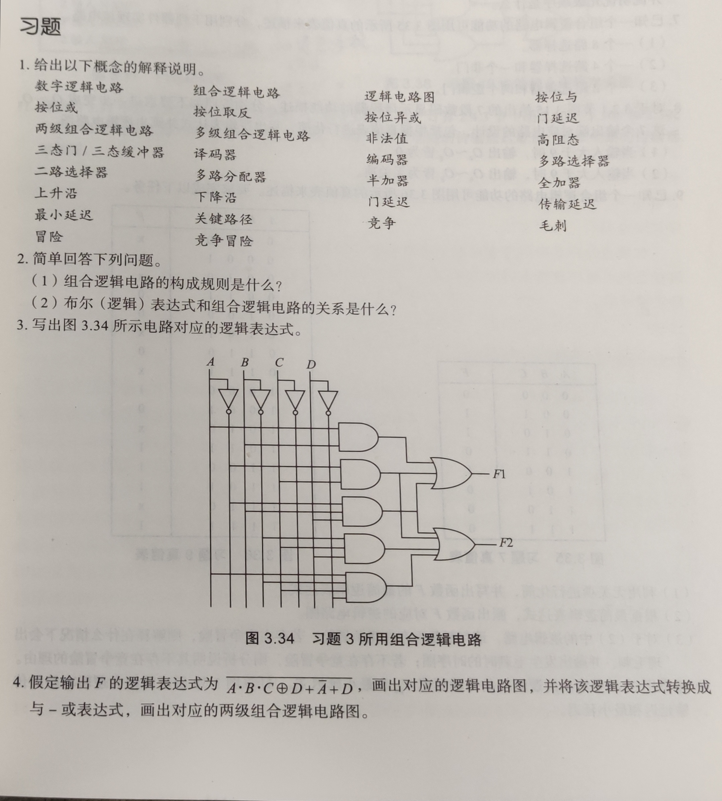
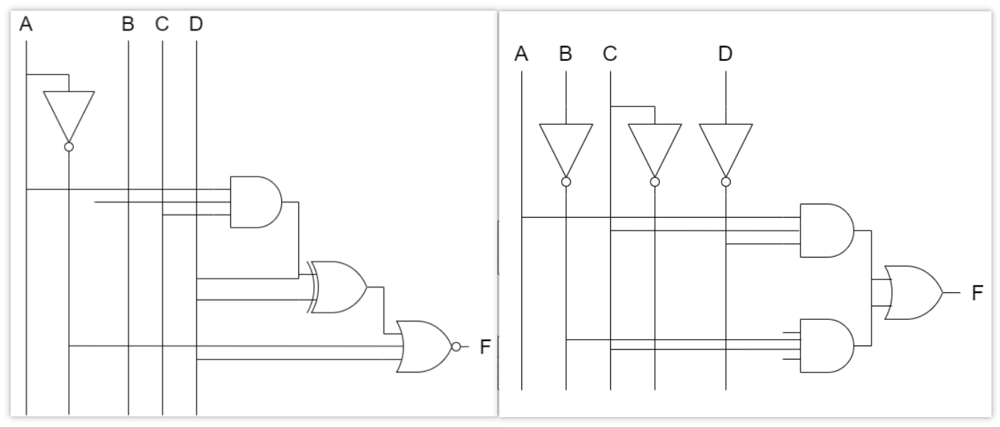
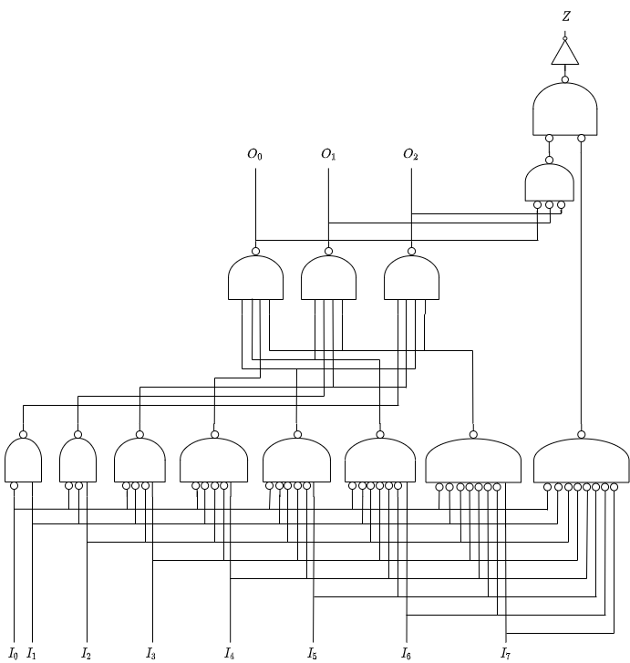
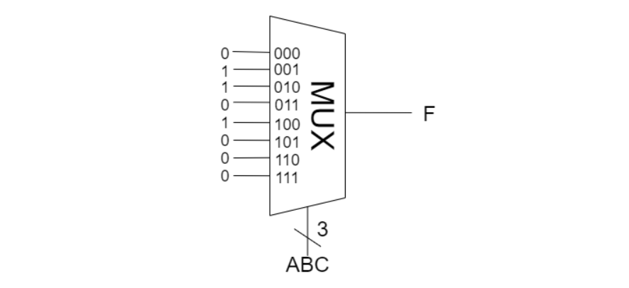
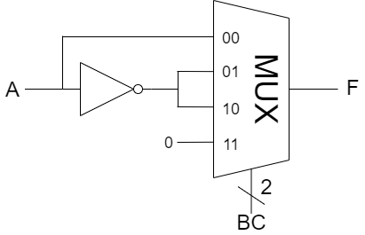
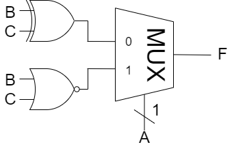
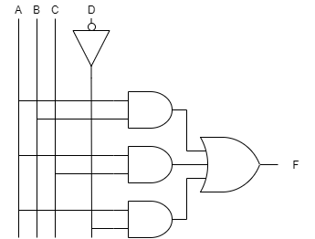
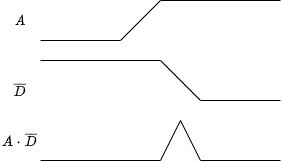

# 第三章作业

<!-- 

 -->

习题3、4、6、7、9、11

## 3.

$F_1=AB+\overline{A}C+\overline{A}BD$

$F_2=\overline{A}C+\overline{A}BD+\overline{B}CD+A\overline{B}C\overline{D}$

## 4.

| A | B | C | D | $\overline{A\cdot B\cdot C\oplus D+\overline{A}+D}$ |
|---|---|---|---|-----|
| 0 | 0 | 0 | 0 | 0 |
| 0 | 0 | 0 | 1 | 0 |
| 0 | 0 | 1 | 0 | 0 |
| 0 | 0 | 1 | 1 | 0 |
| 0 | 1 | 0 | 0 | 0 |
| 0 | 1 | 0 | 1 | 0 |
| 0 | 1 | 1 | 0 | 0 |
| 0 | 1 | 1 | 1 | 0 |
| 1 | 0 | 0 | 0 | 1 |
| 1 | 0 | 0 | 1 | 0 |
| 1 | 0 | 1 | 0 | 1 |
| 1 | 0 | 1 | 1 | 0 |
| 1 | 1 | 0 | 0 | 1 |
| 1 | 1 | 0 | 1 | 0 |
| 1 | 1 | 1 | 0 | 0 |
| 1 | 1 | 1 | 1 | 0 |

$\therefore F=A\cdot \overline{C}\cdot \overline{D}+A\cdot \overline{B}\cdot C\cdot \overline{D}$

## 6.

## 7.

### (1)

### (2)

### (3)

## 9.

### (1)

将真值表上半部分的无关项真值都看作 $0$, 下半部分的无关项真值都看作 $1$.

$\therefore F=A\cdot (\overline{A}+B+C+\overline{D})=A\cdot B+A\cdot C+A\cdot \overline{D}$

### (2)

### (3)

存在竞争冒险.

路径 $A, B, C$ 的路径延迟是相同的, 可以只分析 $A$ 与 $\overline{D}$ 路径.

如图, 当 $A$ 由低电位转为高电位, $\overline{D}$ 由高电位转为低电位时, 会发生毛刺现象.

## 11.

### (a)

$T_{pd}=40+55=95 \ (\text{ps})$

$T_{cd}=25 \ (\text{ps})$

### (b)

$T_{pd}=40+15+15+55=125 \ (\text{ps})$

$T_{cd}=15+15+25=55 \ (\text{ps})$

### (c)

$T_{pd}=30+45=75 \ (\text{ps})$

$T_{cd}=15+25=40 \ (\text{ps})$

传输延迟最长的是 2.30b, 传输延迟最短的是 2.30c.