# 第四章作业

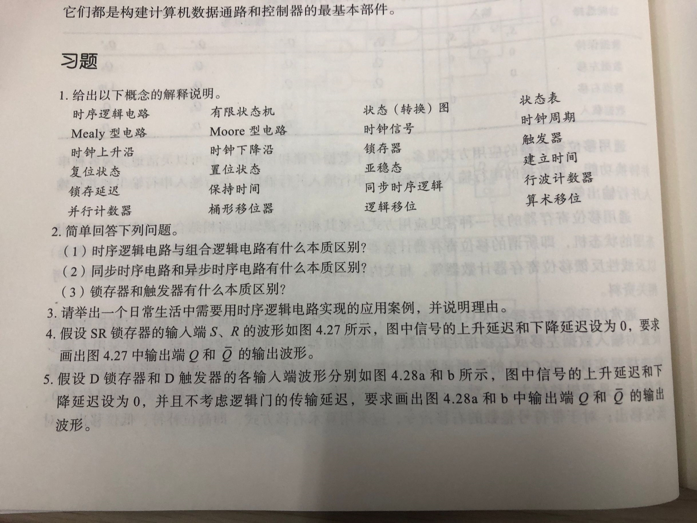

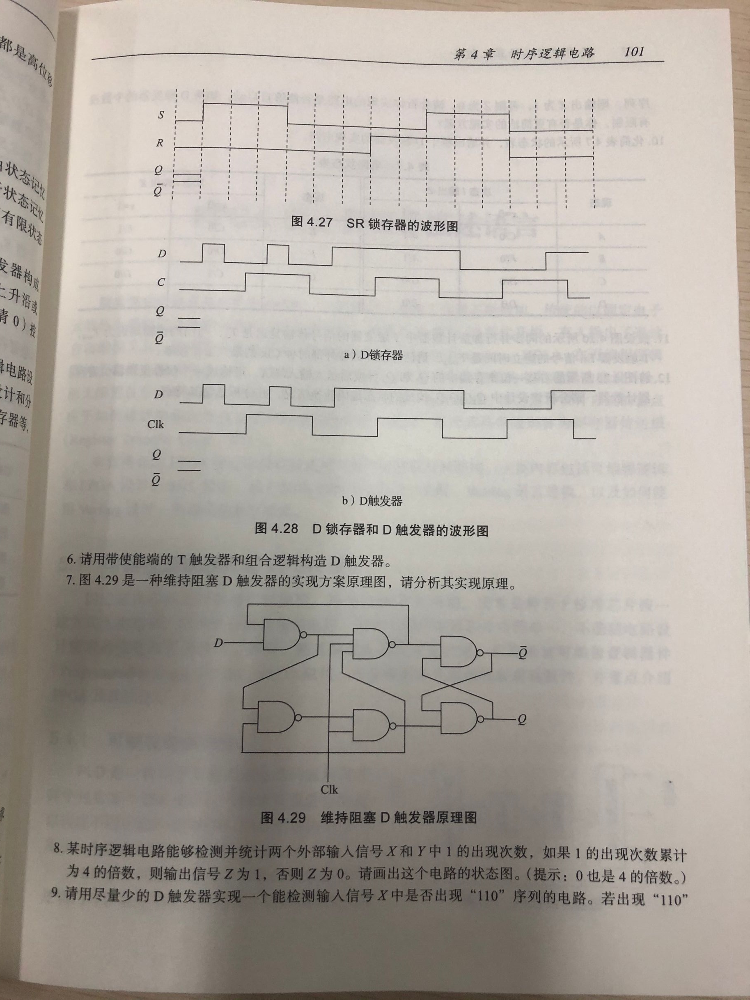

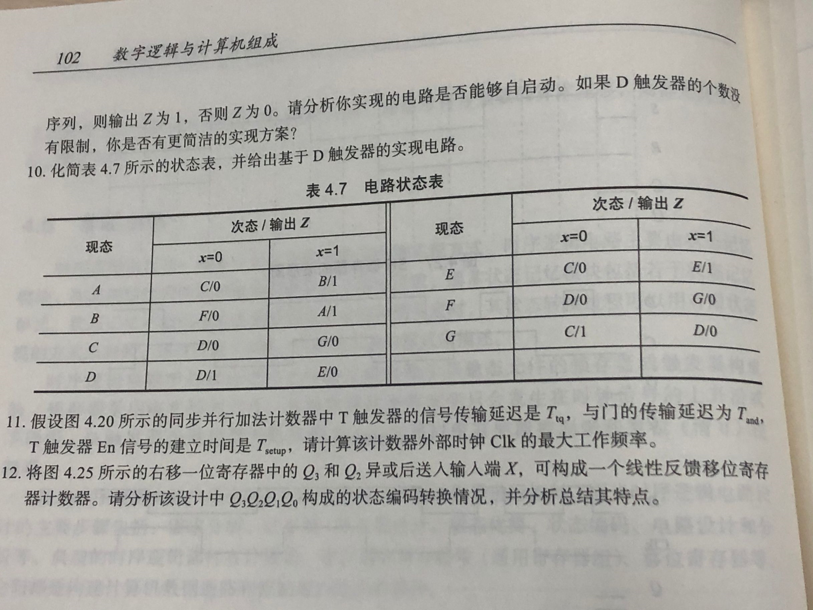

## 1.

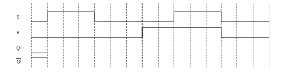

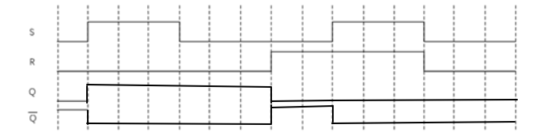

## 2.

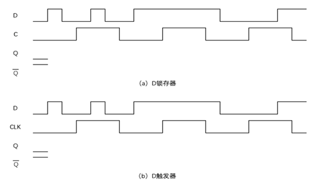

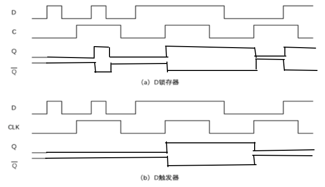

## 3.

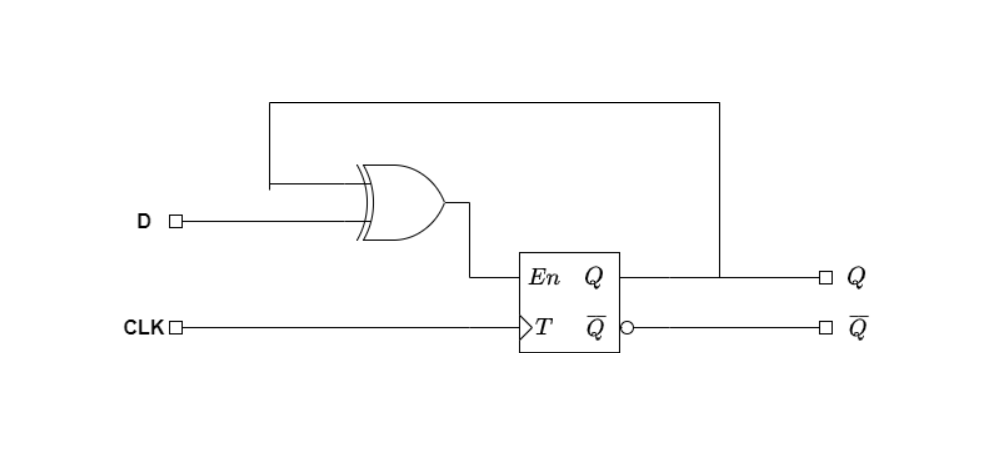

## 4.

**题目:** 请用尽量少的D触发器实现一个能检测输入信号X中是否出现"110"序列的电路. 若出现"110"序列, 则输出Z为1, 否则Z为0. 请分析你实现的电路是否能够自启动. 如果D触发器的个数没有限制, 你是否有更简洁的实现方案?

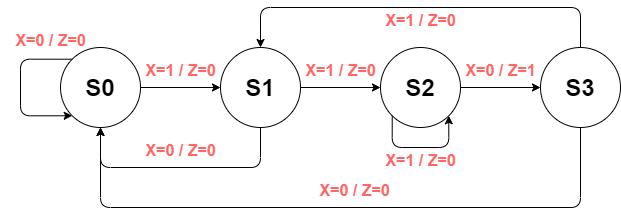

**对应状态表:**

| 现态 | X=0 | X = 1|
|-----|------|------|
| S0  | S0/0 | S1/0 |
| S1  | S0/0 | S2/0 |
| S2  | S3/1 | S2/0 |
| S3  | S0/0 | S1/0 |

**合并状态表:**

| 现态 | X=0 | X = 1|
|-----|------|------|
| S0  | S0/0 | S1/0 |
| S1  | S0/0 | S2/0 |
| S2  | S0/1 | S2/0 |

**采用相邻法寻求次优编码方案:**

* 准则 1: 若两个状态的次态相同, 则其对应编码应尽量相邻
* 准则 2: 同一个现态的各个次态其编码应尽量相邻
* 准则 3: 若两个现态的输出相同, 则它们的编码应尽量相邻

可得

* 根据准则 1, S1 和 S2 可相邻
* 根据准则 2, S0 和 S1, S0 和 S2 可相邻
* 根据准则 3, S0 和 S1 可相邻

可选择 S0 和 S1 相邻, S1 和 S2 相邻.

得到编码: S0: 00, S1: 01, S2: 11.

**生成状态转移表:**

| Y1Y0| X=0 | X = 1|
|-----|------|------|
| 00  | 00/0 | 01/0 |
| 01  | 00/0 | 11/0 |
| 11  | 00/1 | 11/0 |

其中对应的值为 $Y_1^* Y_0^* / Z$

可得次态逻辑函数

$Y_1^*=\overline{Y_1}\cdot Y_0\cdot X+Y_1\cdot Y_0\cdot X=Y_0\cdot X$

$Y_0^*=Y_0\cdot X+\overline{Y_1}\cdot \overline{Y_0}\cdot X$

引入无关编码 $Y_1Y_0 / X=10 / 1$ 可得

$Y_0^*=Y_0\cdot X+\overline{Y_1}\cdot \overline{Y_0}\cdot X+Y_1\cdot \overline{Y_0}\cdot X=Y_0\cdot X+\overline{Y_0}\cdot X=X$

输出函数为

$Z=Y_1\cdot Y_0\cdot X+Y_1\cdot \overline{Y_0}\cdot X=Y_1\cdot X$

**采用 D 触发器:**

$D_1=Y_1^*=Y_0\cdot X$

$D_0=Y_0^*=X$

$Z=Y_1\cdot X$

**画出逻辑电路图:**

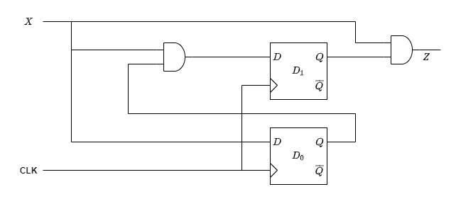

**进行电路设计与分析:**

当处于未用状态 $10$ 时, 可知

若输入 $X=0$, 则次态 $Y_1^*Y_0^*=00$, 输出 $Z=0$

若输入 $X=1$, 则次态 $Y_1^*Y_0^*=01$, 输出 $Z=1$

可以看出, 经过一个时钟周期就能进入正常工作状态, 但是, 当输入 $X=1$ 时, 输出 $Z=1$, 时错误输出, **不能够正常地自启动**.

要实现自启动, 则要重新设计输出模块, 令 $Z=Y_1\cdot Y_0\cdot X$ 即可.

**若 D 触发器没有限制:**

更简洁的方案是使用移位寄存器与组合逻辑电路, 如图:

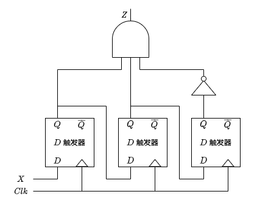

## 5.

题目: 假设图 4.20 所示的 4 位同步并行加法计数器中 T 触发器的信号传输延迟是 $T_{tq}$, 与门的传输延迟为 $T_{and}$, T触发器 $E_n$ 信号的建立时间是 $T_{setup}$, 请计算该计数器外部时钟 Clk 的最大工作频率.

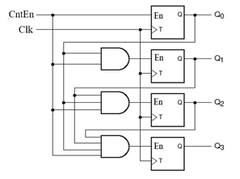

$\therefore T_{Clk}\geq T_{tq}+T_{and}+T_{setup}$

外部时钟最大工作频率为 $\displaystyle f=\frac{1}{T_{Clk}}=\frac{1}{T_{tq}+T_{and}+T_{setup}}$

## 6.

题目: 将图 4.25 所示的右移一位寄存器中 $Q3$ 和 $Q2$ 异或后送入输入端 $X$, 可构成一个线性反馈移位寄存器计数器. 请分析该设计中 $Q_3Q_2Q_1Q_0$ 构成的状态编码转移情况, 并分析总结其特点. 

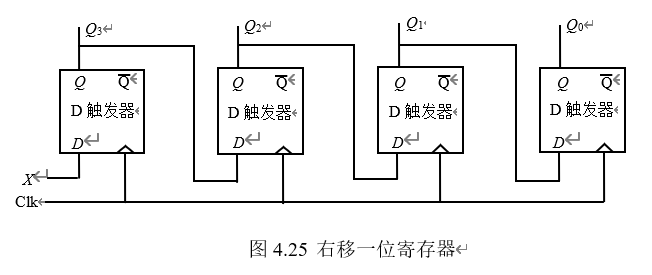

**当 $Q_3Q_2Q_1Q_0=00XX$ 时:**

状态转移依次为:

$00XX \to 000X \to 0000 \to \cdots \to 0000 \to \cdots$

在转移两次后恒为 $0000$.

**当 $Q_3Q_2Q_1Q_0=01XX$ 时:**

状态转移依次为:

$01XX \to 101X \to 1101 \to 0110 \to 1011 \to 1101 \to \cdots $

在转移两次后会进入 $(1101 \to 0110 \to 1011) \to (1101 \to \cdots)$ 的循环.

**当 $Q_3Q_2Q_1Q_0=10XX$ 时:**

状态转移依次为:

$10XX \to 110X \to 0110 \to 1011 \to 1101 \to 0110 \to \cdots $

在转移两次后会进入 $(0110 \to 1011 \to 1101) \to (0110 \to \cdots)$ 的循环.

**当 $Q_3Q_2Q_1Q_0=11XX$ 时:**

状态转移依次为:

$11XX \to 011X \to 1011 \to 1101 \to 0110 \to 1011 \to \cdot$

在转移两次后会进入 $(1011 \to 1101 \to 0110) \to (1011 \to \cdots)$ 的循环.
