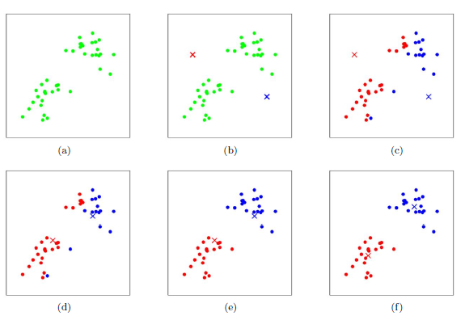
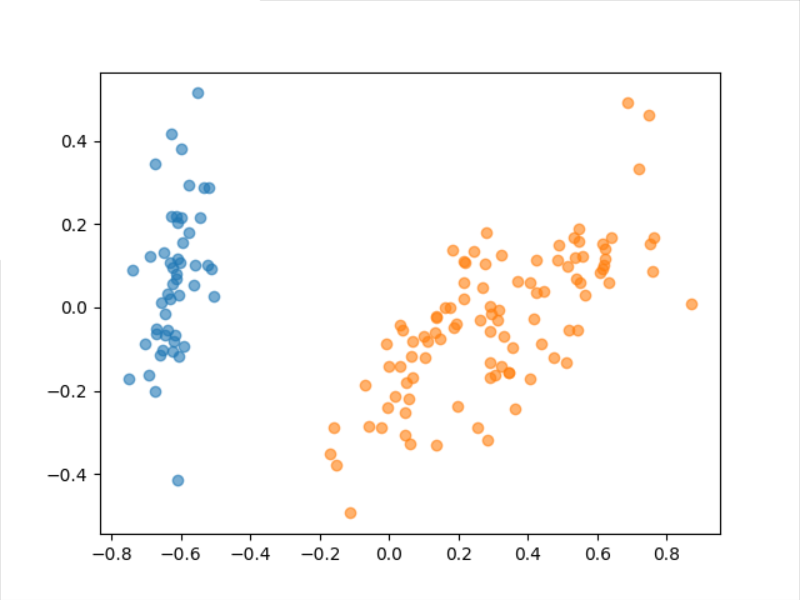

---
puppeteer:
  format: "A4"
  printBackground: true
---

# k-means 聚类算法

<style>
img {
    margin: 0 auto; 
    display: block;
}
</style>

## 0. 目录

[TOC]


## 1. 概念

K-means 算法是一种无监督学习的聚类算法, 其基本思想是, 在几何空间上靠得越近的点就越相似.

## 2. 步骤

1. 将数据集归一化, 即将数据范围变为 $[0,1]$, 用于保证欧氏距离计算的准确性.
2. 选择 $k$ 个初始点, 用这 $k$ 个和样本维度相等的初始点作为聚类的中心点 (质点), 记作 $a_{i}, i=1,2,\cdots,k$.
3. 对数据集中每一个样本 $x_{i}$ 计算它到这 $k$ 个样本之间的距离, 并将其分到距离最近的中心点对应的类别中. 然后形成 $k$ 个聚类 $C_{i}$.
4. 对于每一个聚类 $C_{i}$, 重新计算它的聚类中心 $\displaystyle a_{i}=\frac{1}{|C_{i}|}\sum_{x\in C_{i}}x$, 即聚类里所有点的质心.
5. 重复第 3. 步骤, 直至这 $k$ 个中心点稳定, 不再变化.
6. 这 $k$ 个新中心点所对应的分类即无监督学习分类结果.

类似过程如图所示.



## 3. 实现

``` python
from typing import Tuple
from sklearn import datasets  # 读取 sklearn 自带的数据集
from sklearn.decomposition import PCA  # PCA 降维
import matplotlib.pyplot as plt  # 用于可视化分析
import numpy as np

iris = datasets.load_iris()  # 读取 iris 数据集
X = iris.data 
y = iris.target

# 归一化
X = (X - X.min(axis=0)) / (X.max(axis=0) - X.min(axis=0))

# 取欧式距离
def get_distance(first_sample: np.ndarray, second_sample: np.ndarray):
        return ((first_sample - second_sample) ** 2).sum()

# 生成随机的 k 个样本, 用于 k-means 初始化
def generate_X_samples(k: int, X: np.ndarray):
    return X[[np.random.randint(0, X.shape[0]) for _ in range(k)]]
centers = generate_X_samples(3, X)

# 第一次样本分类
def get_sample_class(sample: np.ndarray, centers: np.ndarray):
    distances = [get_distance(sample, center) for center in centers]
    return distances.index(max(distances))

predict_y = np.array([get_sample_class(sample, centers) for sample in X])

# 重新计算中心
old_centers = generate_X_samples(3, X)
index_dict = {}
def recalculate_centers(X: np.ndarray, last_predict_y: np.ndarray) -> Tuple[np.ndarray]:
    index_dict = {}
    for i in range(len(last_predict_y)):
        if last_predict_y[i] in index_dict:
            index_dict[last_predict_y[i]].append(i)
        else:
            index_dict[last_predict_y[i]] = [i]
    return np.array([X[index].sum(axis=0) / len(X[index]) for index in index_dict.values()]), index_dict

# 一直计算直至稳定
while not np.allclose(old_centers[:len(centers)], centers):
    old_centers = centers
    centers, index_dict = recalculate_centers(X, predict_y)
    predict_y = np.array([get_sample_class(sample, centers) for sample in X])

# 可视化
# 降维
pca=PCA(n_components=2)
new_X = pca.fit_transform(X)

# 画图
for index in index_dict.values():
    part = new_X[index]
    x = part[:, 0]
    y = part[:, 1]
    plt.scatter(x, y, alpha=0.6)
plt.show()
```

所做出来的图:



## 4. 问题

在代码实现中, 我选取的 $k$ 值为 $3$, 但是在最后的显示中, 却只分成了 $2$ 个类别.

我们分析这个问题发生的原因:

虽然我们设定了 $3$ 个初始点, 但是在某一个迭代过程中, 本来属于第 $3$ 个点的数值点, 全部都被前两个点抢走了. 也就是说, 在数据集中没有和第 $3$ 个点相近的样本点.

这个问题的出现和数据集的选取, 初始点位置的选取都有关系.