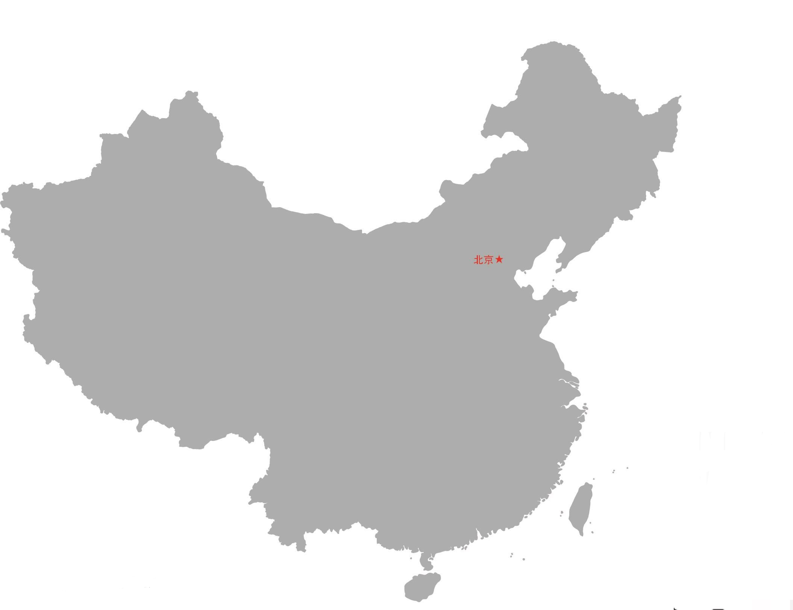
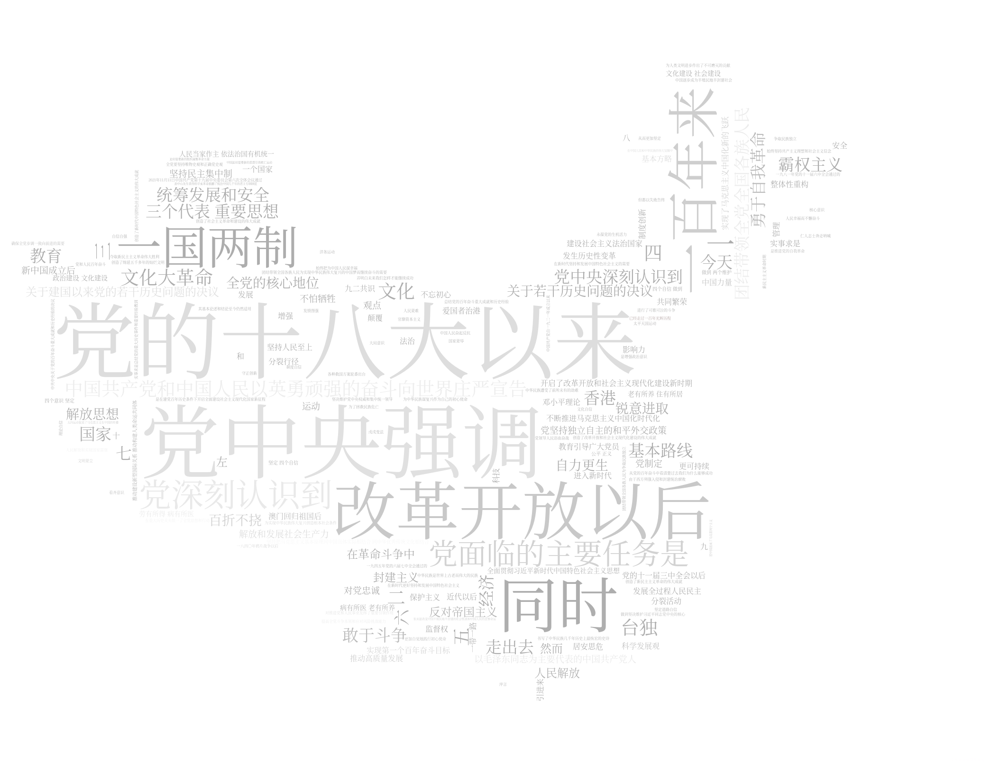
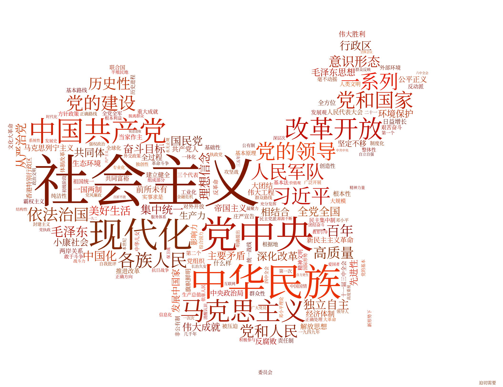

# 用 Python 完成词云图

## 201300035 方盛俊

词云图是一种用来展现高频关键词的可视化表达, 通过文字, 色彩, 图形的搭配, 产生有冲击力地视觉效果, 而且能够传达有价值的信息.

## 1. 自己去查找不同的数据集

我从网上摘抄了《中共中央关于党的百年奋斗重大成就和历史经验的决议》作为云图的基础数据集. 部分摘抄如下:

```
序言

中国共产党自一九二一年成立以来，始终把为中国人民谋幸福、为中华民族谋复兴作为自己的初心使命，始终坚持共产主义理想和社会主义信念，团结带领全国各族人民为争取民族独立、人民解放和实现国家富强、人民幸福而不懈奋斗，已经走过一百年光辉历程。

一百年来，党领导人民浴血奋战、百折不挠，创造了新民主主义革命的伟大成就；自力更生、发愤图强，创造了社会主义革命和建设的伟大成就；解放思想、锐意进取，创造了改革开放和社会主义现代化建设的伟大成就；自信自强、守正创新，创造了新时代中国特色社会主义的伟大成就。党和人民百年奋斗，书写了中华民族几千年历史上最恢宏的史诗。

总结党的百年奋斗重大成就和历史经验，是在建党百年历史条件下开启全面建设社会主义现代化国家新征程、在新时代坚持和发展中国特色社会主义的需要；是增强政治意识、大局意识、核心意识、看齐意识，坚定道路自信、理论自信、制度自信、文化自信，做到坚决维护习近平同志党中央的核心、全党的核心地位，坚决维护党中央权威和集中统一领导，确保全党步调一致向前进的需要；是推进党的自我革命、提高全党斗争本领和应对风险挑战能力、永葆党的生机活力、团结带领全国各族人民为实现中华民族伟大复兴的中国梦而继续奋斗的需要。全党要坚持唯物史观和正确党史观，从党的百年奋斗中看清楚过去我们为什么能够成功、弄明白未来我们怎样才能继续成功，从而更加坚定、更加自觉地践行初心使命，在新时代更好坚持和发展中国特色社会主义。

一九四五年党的六届七中全会通过的《关于若干历史问题的决议》、一九八一年党的十一届六中全会通过的《关于建国以来党的若干历史问题的决议》，实事求是总结党的重大历史事件和重要经验教训，在重大历史关头统一了全党思想和行动，对推进党和人民事业发挥了重要引领作用，其基本论述和结论至今仍然适用。
```

## 2. 改变词云图的基本格式

我更换了如下的背景图片:



尝试运行, 但是运行不成功, 经过观察, 发现是字体文件不存在的原因.

于是我下载了思源宋体, 并更换为 `font_path="SourceHanSerifSC-Regular.otf"`.

然后显示效果如下:



可以看出, 由于使用了图片中原来颜色作为字体基础颜色, 但是并不好看. 所以我们更改为如下代码:

``` python
def random_color_func(word=None, font_size=None, position=None,  orientation=None, font_path=None, random_state=None):
    h  = randint(0, 20)
    s = int(100.0 * 255.0 / 255.0)
    l = int(100.0 * float(randint(60, 120)) / 255.0)
    return "hsl({}, {}%, {}%)".format(h, s, l)

plt.imshow(w.recolor(color_func=image_colors), interpolation="bilinear")
```

最后显示效果如下所示 (红色):


## 3. 自己实现词频统计功能

我们使用 `Counter` 自己实现词频统计功能, 并加上 `generate_from_frequencies` 来进行显示.

通过 jieba 分词得到的分词结果往往包含着动词, 甚至还有许多标点符号, 而这些是我们不想要的. 所以我们设定只有词长度超过 `2` 的词才纳入统计.

最终我们得出的用于替换 `w.generate_from_text(txt)` 的代码如下:

``` python
w.generate_from_frequencies(dict(Counter([v for v in ls if len(v) > 2])))
```

完整代码为:

``` python
import jieba
import wordcloud
from matplotlib import pyplot as plt
from wordcloud import WordCloud,ImageColorGenerator,STOPWORDS
from PIL import Image
import numpy as np
from collections import Counter
from random import randint

def random_color_func(word=None, font_size=None, position=None,  orientation=None, font_path=None, random_state=None):
    h  = randint(0, 20)
    s = int(100.0 * 255.0 / 255.0)
    l = int(100.0 * float(randint(60, 120)) / 255.0)
    return "hsl({}, {}%, {}%)".format(h, s, l)

def cloud():
    f = open("article.txt", "r", encoding="utf-8")
    t = f.read()
    f.close()

    ls = jieba.lcut(t)
    txt = "".join(ls)

    img = Image.open(r'cloud.jpg')  # 打开图片
    img_array = np.array(img)  # 将图片装换为数组

    w = wordcloud.WordCloud(font_path="SourceHanSerifSC-Regular.otf",
                            width=2000,height=1000,
                            background_color="white",
                            mask=img_array
                            )

    # print(txt)
    # w.generate_from_text(txt)
    w.generate_from_frequencies(dict(Counter([v for v in ls if len(v) > 2])))
    image_colors = ImageColorGenerator(img_array)
    

    plt.imshow(w.recolor(color_func=random_color_func), interpolation="bilinear")
    plt.axis('off')  # 横纵坐标是否显示在图上，一般要关闭
    plt.show()  # 显示图片
    #
    filename = r'wordCloud_POM.png'
    w.to_file(filename)


if __name__ == '__main__':
    cloud()
```

显示效果如下, 甚至可以认为优于原展示效果.


