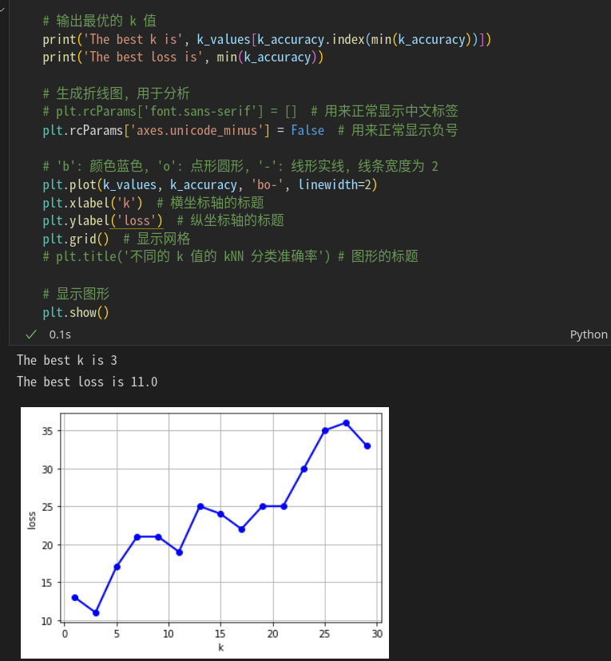

# 实验报告

## 201300035 方盛俊

## 1.实验内容

### 1.1 实验内容: K 近邻算法实现手写数字识别系统

**kNN 算法**是一种分类和回归算法, 这里我们讨论 kNN 算法在**分类问题**中的应用.

简而言之, kNN 算法, 即给定一个**含分类标记训练数据集 (training data)**, 对于一个新的未分类的新**测试样本 (testing sample)**, 找到和这个测试样本**最邻近的 k 个训练样本 (training samples)**, 则我们将这 k 个训练样本中**出现次数最多的类别**看作是这个**新测试样本的类别**, 这就完成了我们的分类问题.


<!-- more -->

例如该图, 图中的 `蓝色圆圈` 和 `绿色方块` 是两种已知的类别, 图中是它们样本点的分布. 我们的任务是, 确认中间的未知类别的 `红色三角` 是属于 `蓝色圆圈` 还是 `绿色方块` 类别.

我们采用 kNN 算法的思想考虑这个问题.

当 k = 1 时, 我们可以看出, 和 `红色三角` 最近的 1 个训练样本是 `蓝色圆圈`, 则我们断言 `红色三角` 属于 `蓝色圆圈` 类别. 

当 k = 3 时, 我们可以看出, 和 `红色三角` 最近的 3 个训练样本中有 2 个是 `绿色方块`, 则我们断言 `红色三角` 属于 `绿色方块` 类别. 

当 k = 5 时, 我们可以看出, 和 `红色三角` 最近的 5 个训练样本中有 3 个是 `蓝色圆圈`, 则我们断言 `红色三角` 属于 `蓝色圆圈` 类别. 

我们可以看到, **当我们选取不同的 k 值时, 会出现不同的分类结果.**

了解了 kNN 的基本概念之后, 我们还要完善具体的实现细节, 细节决定成败嘛. 我们可以考虑几个问题:

1. 如何计算两个样本之间的距离? 
2. 如何平衡各个特征维度在距离计算中影响 (归一化)?
3. 如何选取 k 值?
4. 如何优化算法的运算效率?
5. 如何确定样本不同特征的重要性?
6. 是否需要降维?
7. ...

我们一个一个地考虑这些问题 (慢慢地更新).

PS: 我们还可以发现 kNN 算法的一个特点, 它并不需要任何的显式的训练过程. 其实, 它是 **懒惰学习 (lazy learning)** 的代表算法, 训练过程仅仅是保存数据, 即训练时间为 0, 但是后续运算时消耗资源和消耗时间较大.


### 1.2 距离的计算

通过线性代数课程的学习, 我们知道, 对于 $n$ 维向量空间 $\mathbb{R}^{n}, \alpha=(a_1,a_2,\cdots ,a_{n}), \beta=(b_1,b_2,\cdots ,b_{n})$, 距离 $L_{p}$ 定义为:

$$
L_{p}(\alpha,\beta)=\left( \sum_{i=1}^{n}|a_{i}-b_{i}|^{p}\right)^{\frac{1}{p}}
$$

当 $p=2$ 时, 称为**欧氏距离 (Euclidean distance)**, 即

$$
L_{2}(\alpha,\beta)=\left( \sum_{i=1}^{n}|a_{i}-b_{i}|^{2}\right)^{\frac{1}{2}}
$$

当 $p=1$ 时, 称为**曼哈顿距离 (Manhattan distance)**, 即

$$
L_{1}(\alpha,\beta)=\sum_{i=1}^{n}|a_{i}-b_{i}|
$$

当 $p=+\infty$ 时, 它是各个坐标距离的最大值, 即

$$
L_{\infty}(\alpha,\beta)=\max_{i}|a_{i}-b_{i}|
$$

最常用的是欧氏距离, 我们在中学和大学期间便经常使用. 这里我们也是使用欧式距离来衡量两个样本之间的距离, 而且因为只是要判断距离的大小, 没有必要开平方, 即有

$$
L^{2}(\alpha,\beta)=\sum_{i=1}^{n}(a_{i}-b_{i})^{2}
$$

### 1.3 数据归一化

假设我们有一堆样本, 但是这些样本的两个维度的数值差距较大, 如下图


当 k = 3 时, 

**左图**表明 `红色三角` 应该属于 `蓝色圆圈` 类别; 

**右图**却告诉我们, `红色三角` 应该属于 `绿色方块` 类别.

明明看起来像是同一批的数据, 为什么会有不同的结果呢?

我们观察左图, 左图的数据呈现出长方形的形状, 其中**长度远远大于宽度**. 而右图的数据是经过左图**归一化**而来, 长方形被压缩成了正方形, **长度等于宽度**.

那么左图和右图哪一种比较合理呢?

我们不妨假设一种极端情况: 有那么一批数据, 它的样本有两个维度, 其中 $x$ 特征维度上的数据是 $10^{3}$ 级别的, 而 $y$ 特征维度上的数据仅仅是个位级别的. 此时, 我们再去衡量两个点之间的距离.

我们发现, 判断两个点是否是最近的时候, **它们在 $y$ 维度上的数据对距离几乎没有任何影响, 它们相当于只是用 $x$ 维度上的数据衡量两点的距离, 数据退化成了一维了**.

我们辛辛苦苦收集来的数据, 却只用到了其中的一半, 这怎么行?

所以**我们需要对原始数据进行归一化**.

归一化的方法有很多, 在这里, 我们可以使用简单的**线性归一化**:

$$
x_{i}'=\frac{x_{i} - \min\{x\}}{\max\{x\}-\min\{x\}}
$$

这样可以将数据线性映射到区间 $[0, 1]$ 上.


## 2.实验目的

使用 K 近邻算法识别手写数字.

识别手写数字, 其实也是一种分类问题, 即我们需要将一个包含数字的图像, 分到 `0` ~ `9` 这 10 个类别中.


## 3.算法描述

根据上面描述的过程, 我们可以实现一个基本的 kNN 算法.

大致过程为:

1. 导入数据集, 并进行线性归一化;
2. 划分训练集和测试集;
3. 对每一个测试集的样本, 遍历所有训练集的样本并算出距离;
4. 选出最近的 k 个邻居, 进行投票统计类别;
5. 求正确率的平均值, 最后算出总的正确率.

## 4.算法实现

我自己写的 kNN 代码为:

``` python
from sklearn import datasets  # 读取 sklearn 自带的数据集
from sklearn.model_selection import KFold  # 使用 sklearn 内含的 k 折函数
from collections import Counter  # 用于后续投票
import matplotlib.pyplot as plt  # 用于可视化分析
import numpy as np

iris = datasets.load_iris()  # 读取 iris 数据集
X = iris.data 
y = iris.target

class knn_classifier:

    def __init__(self, X_train: np.ndarray, y_train: np.ndarray, k: int):
        '''
        初始化 kNN 模型. 
        X_train: 训练数据的特征;
        y_train: 训练数据的标签;
        k: kNN 中 k 的取值, 即选取多少个邻居.
        '''

        # 进行数据归一化
        # 计算公式 x' = (x - min(x)) / (max(x) - min(x))
        self._min = X_train.min(axis=0)
        self._max = X_train.max(axis=0)
        self._X_train: np.ndarray = (X_train - self._min) / (self._max - self._min)
        self._y_train: np.ndarray = y_train
        self._k: int = k

    def get_distance(self, first_sample: np.ndarray, second_sample: np.ndarray):
        return ((first_sample - second_sample) ** 2).sum()

    # kNN 分类算法的实现
    def classify_sample(self, X_sample: np.ndarray):
        '''
        给定一个测试样本 X_sample, 通过 kNN 算法来预测它的类别并返回. 
        X_sample: 一个测试样本.
        '''

        # 进行数据归一化
        # 计算公式 x' = (x - min(x)) / (max(x) - min(x))
        X_sample = (X_sample - self._min) / (self._max - self._min)

        # 简单的遍历计算距离, 待优化
        distances = [self.get_distance(X_train_sample, X_sample) for X_train_sample in self._X_train]

        # 从小到大取出前 k 个数据的下标, 使用 np.argsort 函数
        index = np.argsort(distances)[:self._k]
        # 进行投票, 选出出现次数最多的类别
        count = Counter(y[index])
        return count.most_common()[0][0]


# 使用 k 折函数和 knn 的结合
def k_fold_knn(X: np.ndarray, y: np.ndarray, *, k: int, k_fold: int = 5) -> float:
    '''
    使用 k 折交叉验证来计算分类结果准确率, 返回准确率.
    X: 数据集的特征;
    y: 数据集的标签;
    k: kNN 中 k 的取值, 即选取多少个邻居.
    k_fold: 进行多少折验证, 默认为 5 折.
    '''
    # 初始化 k 折函数, 第一个参数是多少折, 第二个参数是随机数种子, 用于生成相同的随机数, 并且要设置 shuffle=True 才能生效
    kf = KFold(n_splits=k_fold, random_state=2021, shuffle=True)
    # 用于保存每一折算出来的正确率
    results = []
    for train_index, test_index in kf.split(X):
        # 每一折的训练集
        X_train, X_test = X[train_index], X[test_index]
        y_train, y_test = y[train_index], y[test_index]
        knn = knn_classifier(X_train, y_train, k=k)

        # 获取预测分类结果
        y_predict = [knn.classify_sample(X_test_sample) for X_test_sample in X_test]

        # 将预测分类结果与正确分类数据比对,
        # 正确则为 1.0, 错误则为 0.0, 最后取平均值
        results.append(sum([1.0 if y_predict[i] == y_test[i] else 0.0 for i in range(len(y_test))]) / len(y_test))

    return sum(results) / len(results)

# 进行超参数 k 的 5 折交叉验证测试
k_values = range(1, 30, 2)
k_accuracy = [k_fold_knn(X, y, k=k) for k in k_values]

# 输出最优的 k 值
print('The best k is', k_values[k_accuracy.index(max(k_accuracy))])
print('The best accuracy is', max(k_accuracy))

# 生成折线图, 用于分析
plt.rcParams['font.sans-serif'] = ['SimHei']  # 用来正常显示中文标签
plt.rcParams['axes.unicode_minus'] = False  # 用来正常显示负号

# 'b': 颜色蓝色, 'o': 点形圆形, '-': 线形实线, 线条宽度为 2
plt.plot(k_values, k_accuracy, 'bo-', linewidth=2)
plt.xlabel('k')  # 横坐标轴的标题
plt.ylabel('accurate')  # 纵坐标轴的标题
plt.grid()  # 显示网格
plt.title('不同的 k 值的 kNN 分类准确率') # 图形的标题

# 显示图形
plt.show()
```

**而作业也给出了对应的实现:**

``` python
import numpy as np

def img2vector(filename):
    # 创建向量
    return_vec = np.zeros((1, 1024))
    # 打开数据文件，读取每行内容
    fr = open(filename)
    for i in range(32):
        # 读取每一行
        line_str = fr.readline()
        # 将每行前 32 字符转成 int 存入向量
        for j in range(32):
            return_vec[0, 32 * i + j] = int(line_str[j])
            
    return return_vec

import operator

def classify0(inX, dataSet, labels, k):    
    """
    参数: 
    - inX: 用于分类的输入向量
    - dataSet: 输入的训练样本集
    - labels: 样本数据的类标签向量
    - k: 用于选择最近邻居的数目
    """
    
    # 获取样本数据数量
    dataSetSize = dataSet.shape[0]

    # 矩阵运算，计算测试数据与每个样本数据对应数据项的差值
    diffMat = np.tile(inX, (dataSetSize, 1)) - dataSet

    # sqDistances 上一步骤结果平方和
    sqDiffMat = diffMat**2
    sqDistances = sqDiffMat.sum(axis=1)

    # 取平方根，得到距离向量
    distances = sqDistances**0.5

    # 按照距离从低到高排序
    sortedDistIndices = distances.argsort()
    classCount = {}

    # 依次取出最近的样本数据
    for i in range(k):
        # 记录该样本数据所属的类别
        voteIlabel = labels[sortedDistIndices[i]]
        classCount[voteIlabel] = classCount.get(voteIlabel, 0) + 1

    # 对类别出现的频次进行排序，从高到低
    sortedClassCount = sorted(
        classCount.items(), key=operator.itemgetter(1), reverse=True)

    # 返回出现频次最高的类别
    return sortedClassCount[0][0]

from os import listdir

def handwritingClassTest(k):
    # 样本数据的类标签列表
    hwLabels = []

    # 样本数据文件列表
    trainingFileList = listdir('digits/trainingDigits')
    m = len(trainingFileList)

    # 初始化样本数据矩阵（M*1024）
    trainingMat = np.zeros((m, 1024))

    # 依次读取所有样本数据到数据矩阵
    for i in range(m):
        # 提取文件名中的数字
        fileNameStr = trainingFileList[i]
        fileStr = fileNameStr.split('.')[0]
        classNumStr = int(fileStr.split('_')[0])
        hwLabels.append(classNumStr)

        # 将样本数据存入矩阵
        trainingMat[i, :] = img2vector(
            'digits/trainingDigits/%s' % fileNameStr)

    # 循环读取测试数据
    testFileList = listdir('digits/testDigits')

    # 初始化错误率
    errorCount = 0.0
    mTest = len(testFileList)

    # 循环测试每个测试数据文件
    for i in range(mTest):
        # 提取文件名中的数字
        fileNameStr = testFileList[i]
        fileStr = fileNameStr.split('.')[0]
        classNumStr = int(fileStr.split('_')[0])

        # 提取数据向量
        vectorUnderTest = img2vector('digits/testDigits/%s' % fileNameStr)

        # 对数据文件进行分类
        classifierResult = classify0(vectorUnderTest, trainingMat, hwLabels, k)

        # 打印 K 近邻算法分类结果和真实的分类
        print("测试样本 %d, 分类器预测: %d, 真实类别: %d" %
              (i+1, classifierResult, classNumStr))

        # 判断K 近邻算法结果是否准确
        if (classifierResult != classNumStr):
            errorCount += 1.0

    # 打印错误率
    print("\n错误分类计数: %d" % errorCount)
    print("\n错误分类比例: %f" % (errorCount/float(mTest)))

# 开始主调用
handwritingClassTest(3)
```

## 5.程序运行结果



我测试了 1 到 30 的所有奇数, 最后发现 3 对应的损失率最低. 说明最好的 k 的取值就是 3.


## 6.实验结果分析

一般来说, k 的取值较难分析, 只能通过一个一个 k 值进行测试, 才能找出最好的 k 值. 通常来说 k 是不大于 20 的整数, 在这里, 我们测试了 1 到 30 的所有奇数, 发现 3 有最好的结果.

说明, 对于基于 k近邻算法的数字分类问题, k = 3 就能得到最好的结果.


## 7.结论

k 近邻算法是一个思路简单清晰, 却异常有效的分类算法. 同时, 它也是一类特别的算法, **懒惰学习 (lazy learning)** 的代表算法. 它并不需要任何的显式的训练过程, 训练过程仅仅是保存数据, 即训练时间为 0, 但是后续运算时消耗资源和消耗时间较大.

这样的算法思路清晰, 代码简单, 很适合做一些简单的分类问题. 事实上, 这类简单的数字分类采用 k 近邻算法就能有不错的效果.

但是 k 近邻算法也有它的缺点. 一般来说, 这种算法计算难度较大, 很难大规模地使用, 也难以压缩计算模型, 造成模型也很庞大. 其次, 它的泛化能力也不强, 例如, 如果我对数字图像进行简单的旋转, 它就很有可能无法正确分类了.
