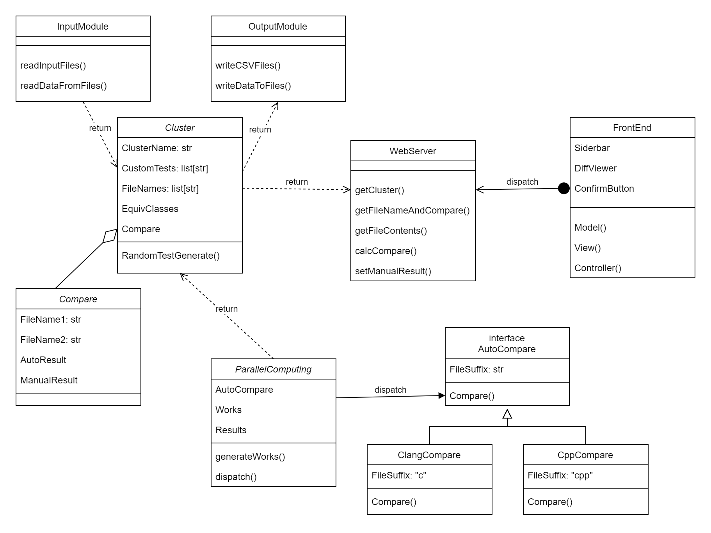
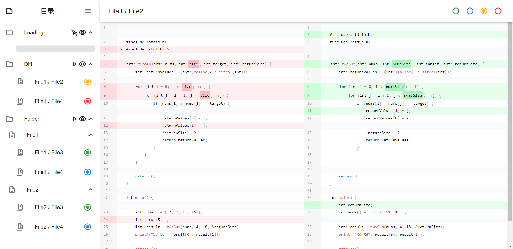
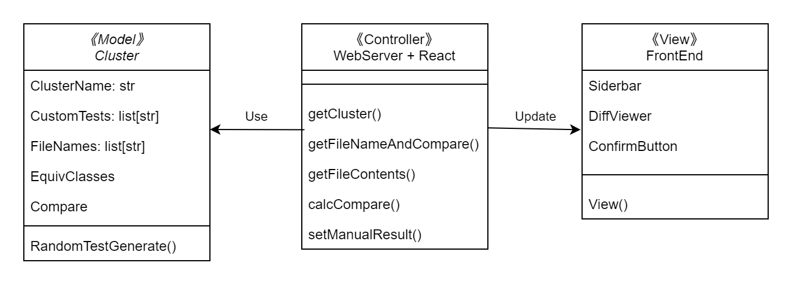
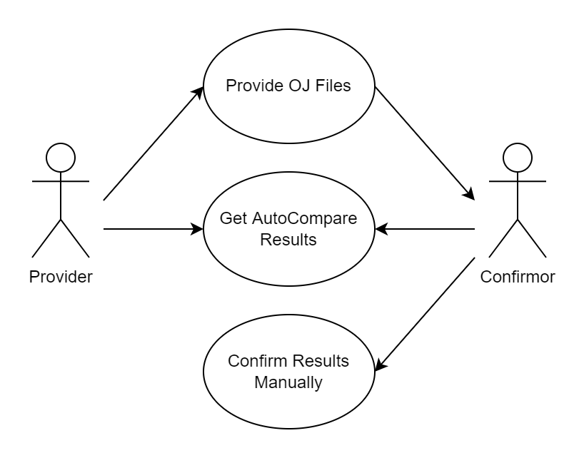
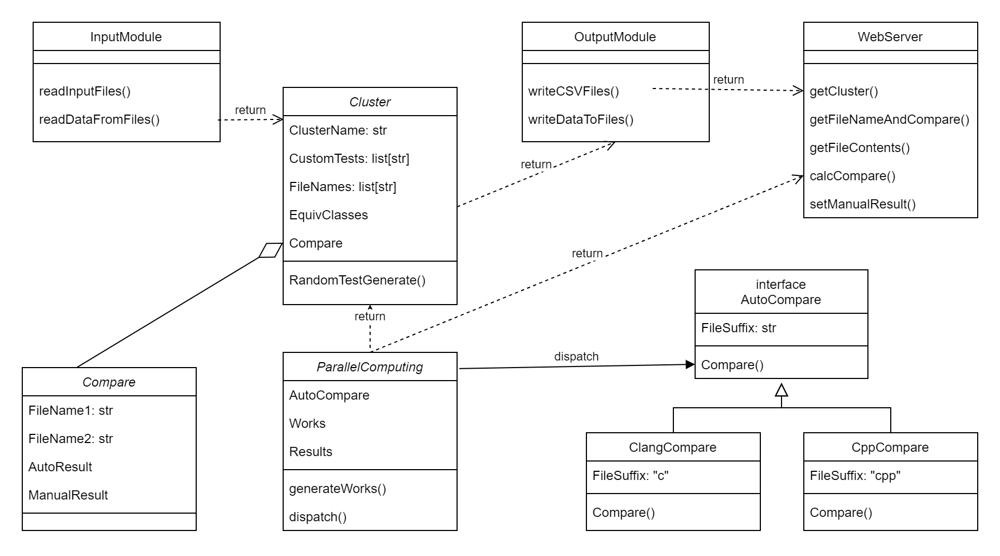
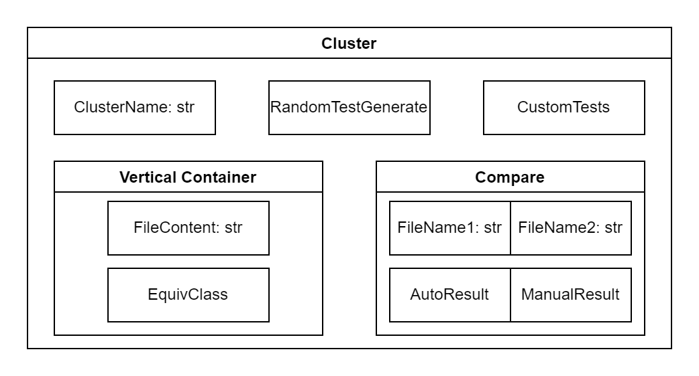
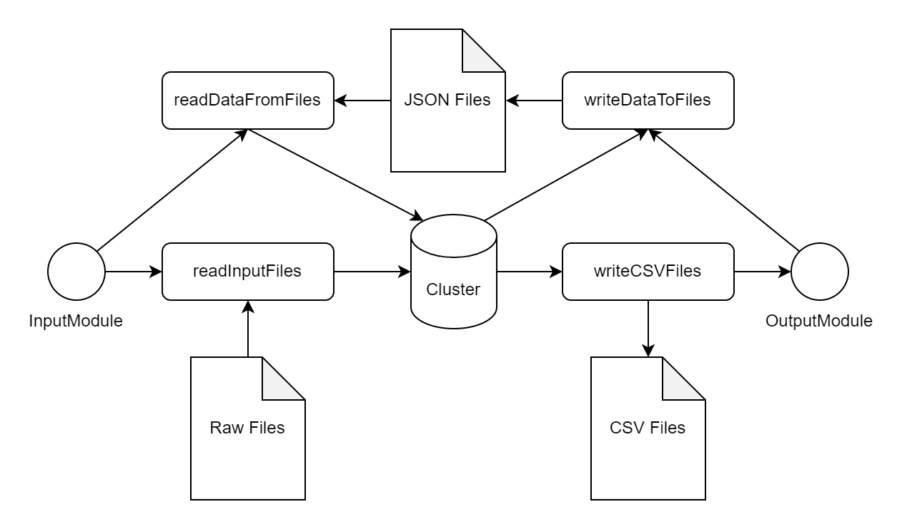
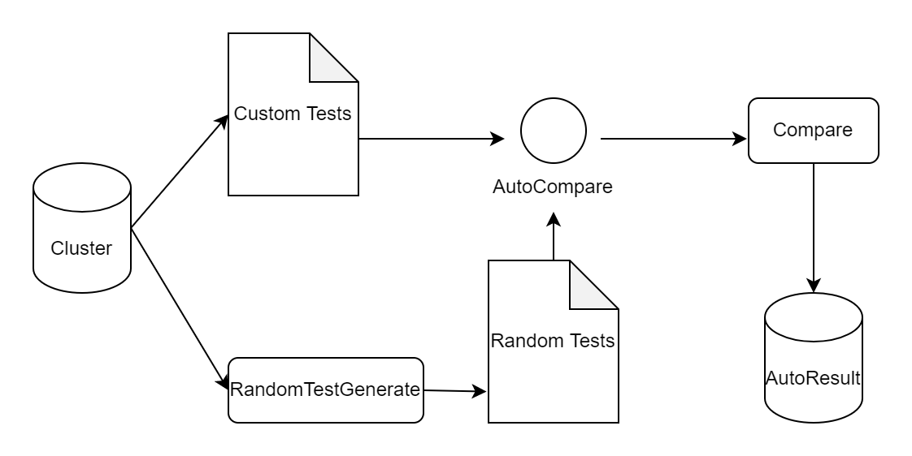
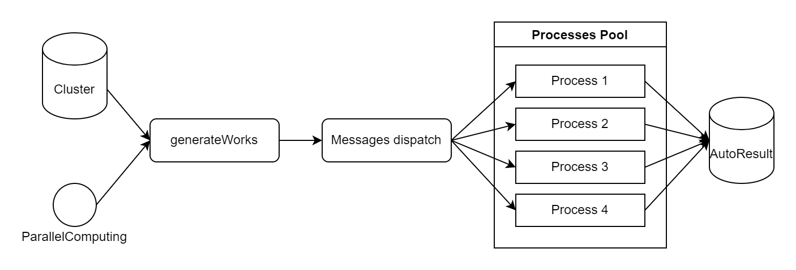

<h1 style="margin-top: 4em">
软件工程实验报告
</h1>

# <h1 class="center title">实验三: 软件设计</h1>

<h3>院系: 人工智能学院</h3>
<h3>姓名: 方盛俊</h3>
<h3>学号: 201300035</h3>
<h3>班级: 人工智能 20 级 2 班</h3>
<h3>邮箱: 201300035@smail.nju.edu.cn</h3>
<h3>时间: 2022 年 10 月 25 日</h3>

<!-- 生成目录 -->

## <h1>目录</h1>

[TOC]

<!-- 文章主体内容 -->

## 一、系统整体架构

系统整体架构使用 UML 图中的 **类图** 表示如下：

其中，**后端** 部分主要功能为 **“等价判断工具”**，**前端** 部分主要功能为 **“等价确认工具”**。

各个部分的简要说明如下：

- 前端 (FrontEnd)
    - 侧边栏目录模块 (Sidebar)
    - Diff 显示模块 (DiffViewer)
    - 人工确认模块 (ConfirmButton)
    - 使用基于 React 的 MVC 设计模式
- 后端 (BackEnd)
    - 输入模块 (InputModule) (从一个文件夹内读取)
        - 读取源文件 (readInputFiles)
        - 读取保存的中间表示 (readDataFromFiles)
    - 中间表示模块 (Data)
        - Cluster
            - 目录名 (Cluster)
            - 测试样例生成 (RandomTestGenerator)
            - 自定义测试样例 (CustomTests)
            - 文件名 (FileName)
                - 文件内容 (FileContent)
                - 并查集等价类 (EquivClass)
            - Compare
                - 文件名 1 (FileName1)
                - 文件名 2 (FileName2)
                - 自动比较结果 (AutoResult)
                - 人工确认结果 (ManualResult)
    - 输出模块 (OutputModule) (输出到一个文件夹)
        - 输出 CSV 文件 (writeCSVFiles)
        - 输出中间表示 (writeDataToFiles)
    - 多进程并行计算模块 (ParallelComputing)
        - 根据 Cluster 和 FileName 生成工作 (generateWorks)
        - 调用 AutoCompare 进行文件的比较 (dispatch)
    - 自动比较模块 (AutoCompare)
        - 根据文件后缀名判断文件类型 (c or cpp)
        - 通过 GCC 等方式编译然后运行 (compare)
    - Web 服务模块 (WebServer)
        - 获取 Cluster (getCluster)
        - 获取 FileName 和 Compare (getFileNameAndCompare)
        - 获取 FileContent (getFileContents)
        - 执行 Compare 并获取反馈 (calcCompare)
        - 保存用户设定的自主比较结果 (setManualResult)

## 二、前端模块 (等价确认工具)

### 2.1 UI 设计

前端模块使用 **React**、**material-ui**、**react-diff-viewer** 以及高亮库 **Prism** 实现。 

如图所示，主要分为三大部分：

- 侧边栏目录模块 (Sidebar)
    - 每个文件夹作为一个 Cluster
    - 每个 Cluster 有三个按钮
        - 执行按钮，调用后端等价判断工具进行比较
        - 显示按钮，切换显示模式 (Diff 模式 / Folder 模式)
        - 收起按钮，切换展开或者收起
    - 每个 Diff 行后有一个 “状态”
        - 绿色代表 “人工确认等价”
        - 蓝色代表 “自动判断等价”
        - 黄色代表 “仍未进行判断”
        - 红色代表 “不等价”
- Diff 显示模块 (DiffViewer)
    - 显示两个代码文件之间的差异
- 人工确认模块 (ConfirmButton)
    - 右上角有四个按钮，可以进行人工的等价确认
        - 绿色代表 “人工确认等价”
        - 蓝色代表 “自动判断等价”
        - 黄色代表 “仍未进行判断”
        - 红色代表 “不等价”

### 2.2 MVC 设计模式

前端模块使用了 MVC 设计模式。

- **Model**：Cluster 类作为 Model，存储了用到的目录、文件以及等价判断结果等信息。
- **Controller**：WebServer 模块和 React 框架作为中间层，负责连接 Model 和 View。Controller 从 Model 中获取数据信息，并且实时地映射到前端的 View 中。
- **View**：由侧边栏 (Sidebar)、Diff 显示 (DiffViewer) 以及等价确认按钮 (ConfirmButton) 等部分组成的 View，用于实时显示 Model 中拥有的数据，并对用户操作做出反馈。

### 2.3 用户交互

我们用 **用例图** 来表示用户可以进行的功能。

- OJ 文件提供者 (Provider)：提供者可以将 OJ 文件保存在对应的 “输入文件夹” 中 (Provide OJ Files)，进而将文件传递到确认者的手上。
- 等价确认者 (Confirmor)：经过自动等价判断之后，可以通过前端获取到自动等价判断的结果 (Get AutoCompare Results)。并且可以在前端中对判断结果进行手动确认 (Confirm Results Manually)。

再使用 **活动图** 表示具体的过程如下：

用户的关键在于处理好每个文件 Diff 对的四种状态：

- 绿色代表 “人工确认等价”
- 蓝色代表 “自动判断等价”
- 黄色代表 “仍未进行判断”
- 红色代表 “不等价”

## 三、后端模块 (等价判断工具)

### 3.1 工具架构

用 **类图** 表示如下：

- 输入模块 (InputModule) (从一个文件夹内读取)
    - 读取源文件 (readInputFiles)
    - 读取保存的中间表示 (readDataFromFiles)
- 中间表示模块 (Data)
    - Cluster
- 输出模块 (OutputModule) (输出到一个文件夹)
    - 输出 CSV 文件 (writeCSVFiles)
    - 输出中间表示 (writeDataToFiles)
- 多进程并行计算模块 (ParallelComputing)
    - 根据 Cluster 和 FileName 生成工作 (generateWorks)
    - 调用 AutoCompare 进行文件的比较 (dispatch)
- 自动比较模块 (AutoCompare)
    - 根据文件后缀名判断文件类型 (c or cpp)
    - 通过 GCC 等方式编译然后运行 (compare)
- Web 服务模块 (WebServer)
    - 获取 Cluster (getCluster)
    - 获取 FileName 和 Compare (getFileNameAndCompare)
    - 获取 FileContent (getFileContents)
    - 执行 Compare 并获取反馈 (calcCompare)
    - 保存用户设定的自主比较结果 (setManualResult)

### 3.2 数据组织方式

我们可以使用 **复合结构图** 来表示我们的数据组织方式 (核心是 Cluster):

- Cluster
    - 目录名 (Cluster)
    - 测试样例生成 (RandomTestGenerator)
    - 自定义测试样例 (CustomTests)
    - 文件名 (FileName)
        - 文件内容 (FileContent)
        - 并查集等价类 (EquivClass) (用于判断数个文件是否同属一个等价类)
    - Compare
        - 文件名 1 (FileName1)
        - 文件名 2 (FileName2)
        - 自动比较结果 (AutoResult)
        - 人工确认结果 (ManualResult)

### 3.3 输入模块

输入模块比较简单，只需要从 “输入文件夹” 中读取数个 Cluster 的文件以及对应的内容。

除此之外，还需要将中间的表示形式 Cluster 保存到 JSON 文件中。

- 输入模块 (InputModule) (从一个文件夹内读取)
    - 读取源文件 (readInputFiles)
    - 读取保存的中间表示 (readDataFromFiles)

对应的 **活动图** 同输出模块。

### 3.4 输出模块

与输入模块恰好相反，需要将 CSV 文件输出到 “输出文件夹” 里，并且将中间表示形式读入。

- 输出模块 (OutputModule) (输出到一个文件夹)
    - 输出 CSV 文件 (writeCSVFiles)
    - 输出中间表示 (writeDataToFiles)

### 3.5 自动比较模块

自动比较模块是真正进行等价判断的 **执行模块**。

首先根据文件后缀名判断文件类型 (`.c` or `.cpp`)，通过 GCC 等方式编译然后运行 (compare)。

由于我们抽象出了一个 **接口** 层 (AutoCompare)，所以我们可以在后续加入更多的语言，例如 `javascript` 和 `python`。

自动比较模块和 Cluster 里的

- 测试样例生成 (RandomTestGenerator)
- 自定义测试样例 (CustomTests)
- 自动比较结果 (AutoResult)

相耦合，通过生成随机测试样例和使用自定义测试样例，来进行自动比较。

### 3.6 多进程并行计算模块

为了更好地利用多核处理器的性能，我们需要一定的并发架构。

由于 Python 存在着全局解释器锁 GIL，难以利用多线程的并发架构，因此在这里我选择了多进程的并发架构。

多进程的并发同步模式，我们采用 **生产者消费者模式**，维护一个进程池 (进程个数为 CPU 核心个数)，通过消息队列分发任务。

- 多进程并行计算模块 (ParallelComputing)
    - 根据 Cluster 和 FileName 生成工作 (generateWorks)
    - 调用 AutoCompare 进行文件的比较 (dispatch)

## 四、总结

整个软件分为两大部分：前端 (Frontend) 和后端 (Backend)。

前端主要是提供等价确认工具相关的功能，正如 UI 图所示。

- 左侧侧边栏可以提供 Cluster 内部文件列表的预览，以及 Diff 的状态 (Status)。
- 右侧 DiffViewer 可以更方便地让用户自行比对文件代码。
- 右上角的四个确认按钮可以让用户切换 Diff 的状态。

后端主要是提供等价判断工具相关的功能。

- 输入模块 (InputModule) (从一个文件夹内读取)
    - 读取源文件 (readInputFiles)
    - 读取保存的中间表示 (readDataFromFiles)
- 中间表示模块 (Data)
    - Cluster
- 输出模块 (OutputModule) (输出到一个文件夹)
    - 输出 CSV 文件 (writeCSVFiles)
    - 输出中间表示 (writeDataToFiles)
- 多进程并行计算模块 (ParallelComputing)
    - 根据 Cluster 和 FileName 生成工作 (generateWorks)
    - 调用 AutoCompare 进行文件的比较 (dispatch)
- 自动比较模块 (AutoCompare)
    - 根据文件后缀名判断文件类型 (c or cpp)
    - 通过 GCC 等方式编译然后运行 (compare)
- Web 服务模块 (WebServer)
