<style>
h1 {
    text-align: center;
}
h2, h3 {
    page-break-after: avoid; 
}
.center {
    margin: 0 auto;
    width: fit-content;
    margin-top: 2em;
    padding-top: 0.5em;
    padding-bottom: 0.5em;
    margin-bottom: 2em;
}
.title {
    font-weight: bold;
    border-top-style: solid;
    border-bottom-style: solid;
}
.newpage {
    page-break-after: always
}
@media print {
    @page {
        margin: 3cm;
    }
}
</style>

<h1 style="margin-top: 4em">
软件工程实验报告
</h1>

# <h1 class="center title">实验六: 软件分析与测试</h1>

<div class="center">
<h3>院系: 人工智能学院</h3>
<h3>姓名: 方盛俊</h3>
<h3>学号: 201300035</h3>
<h3>班级: 人工智能 20 级 2 班</h3>
<h3>邮箱: 201300035@smail.nju.edu.cn</h3>
<h3>时间: 2022 年 12 月 6 日</h3>
</div>

<div class="newpage"></div>

<!-- 生成目录 -->

## <h1>目录</h1>

[TOC]

<div class="newpage"></div>

<!-- 文章主体内容 -->

## 一、静态分析报告

### 1.1 静态分析工具的选取及安装

在实验 4 中，我使用的开发语言是 Python，因此这里我选取了 Pylint 作为我使用的静态分析工具。

在 VS Code 下 Pylint 的安装过程如下：

按下 `Ctrl + Shift + P`, 输入 `select linter`, 选择 `pylint`.

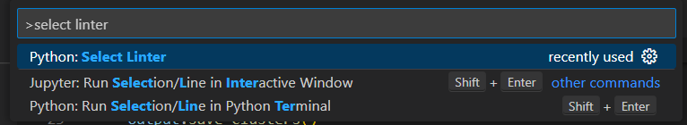

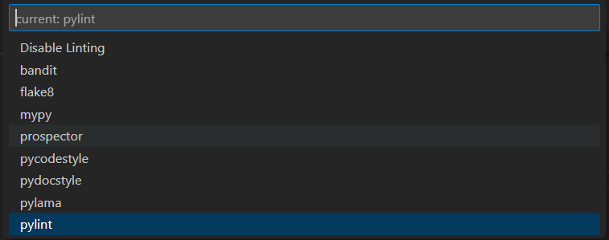

此时 `.vscode/settings.json` 文件内容如下:

```json
{
  "python.analysis.typeCheckingMode": "basic",
  "python.linting.pylintEnabled": true,
  "python.linting.enabled": true
}
```

说明此时已经开启了 Pylint。

我们打开一个 Python 文件，VS Code 会提醒我们还未安装 Pylint，需要执行安装。

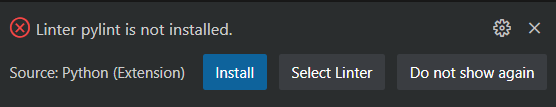

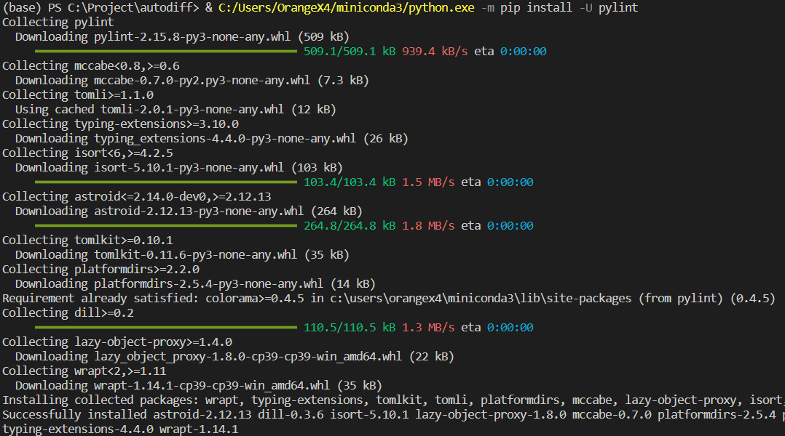

如图所示，此时即为安装完成了。

我们再回到 `main.py` 文件，可以看出 Pylint 已经正常工作了，给出了几个警告。

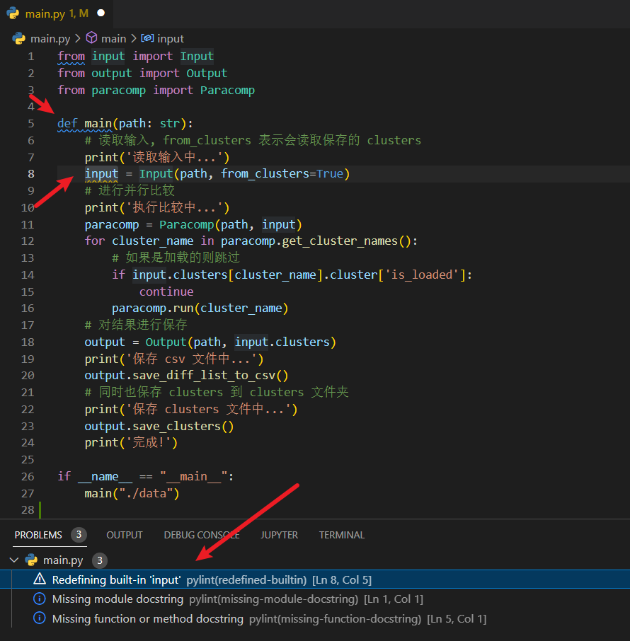


### 1.2 静态分析工具的使用说明

我们查询微软 VS Code 官方文档的说明，可以知道，我们可以控制 Pylint 的报错的警告的种类，首先我们需要输出一个 `.pylintrc` 文件：

```sh
# Using an *nix shell or cmd on Windows
pylint --generate-rcfile > .pylintrc

# Using PowerShell
pylint --generate-rcfile | Out-File -Encoding utf8 .pylintrc
```

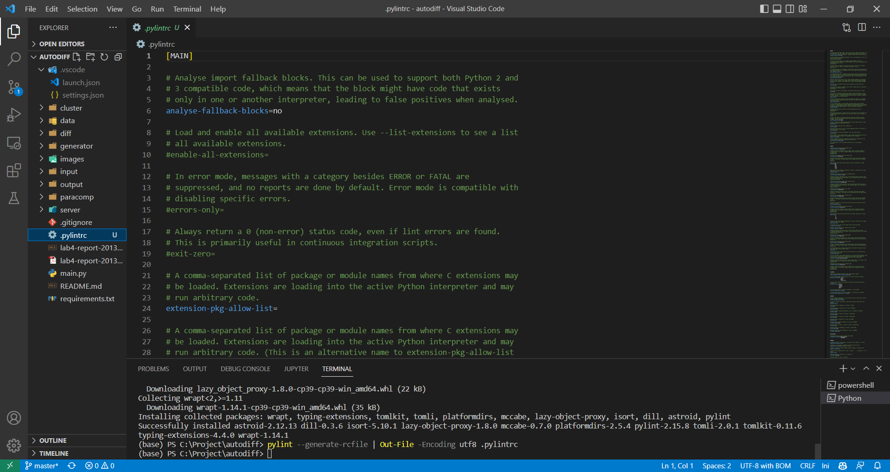

然后我们就可以在 `.pylintrc` 进行 Pylint 的配置。

配置完成之后，只要我们任意打开一个 Python 文件，在打开和保存的时候，VS Code 均会自动地执行 Pylint 对打开的 Python 文件进行分析。

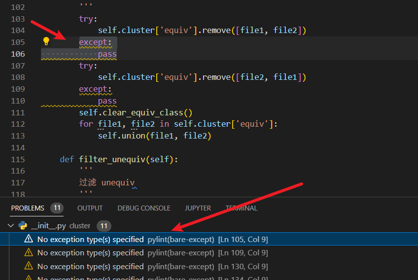


### 1.3 静态分析工具的结果分析

静态分析工具的结果表明，大部分文件没有严重的代码错误，但是存在着不良好的编程习惯，例如：

**没有说明异常的类型**：

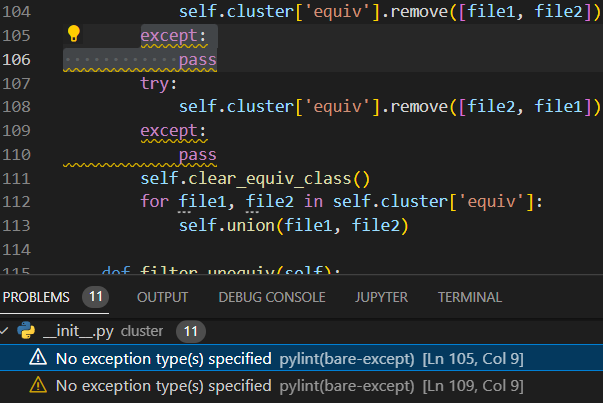

**重新定义了现有函数 input**：

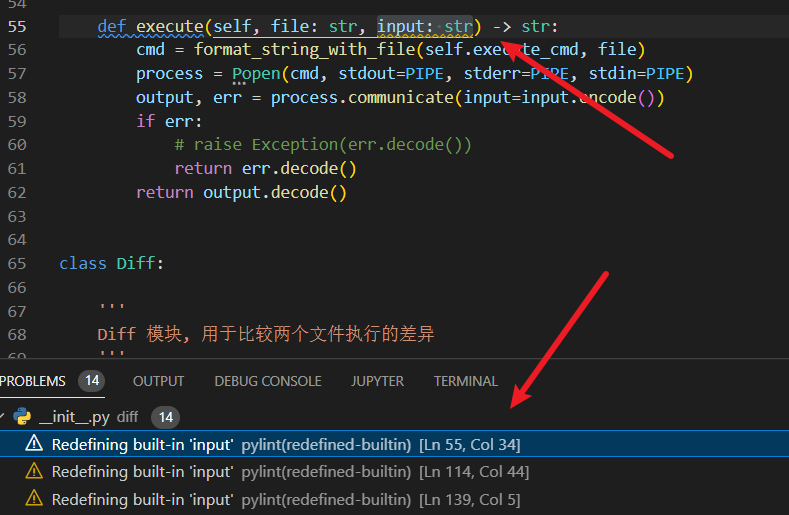

**代码行数过长**：

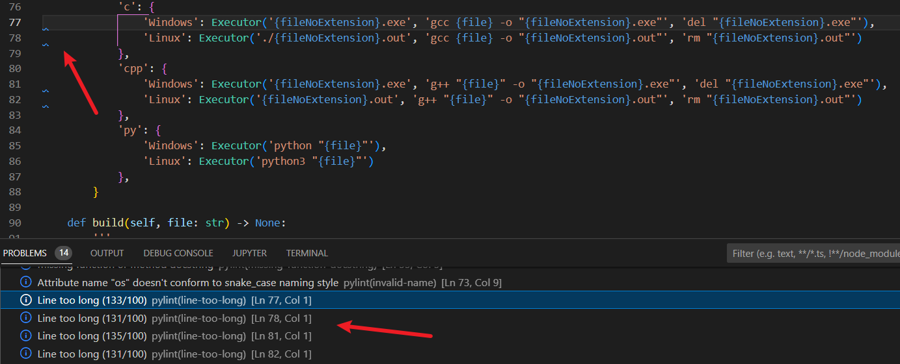


### 1.4 静态分析工具的代码修复

**没有说明异常的类型（修复）**：

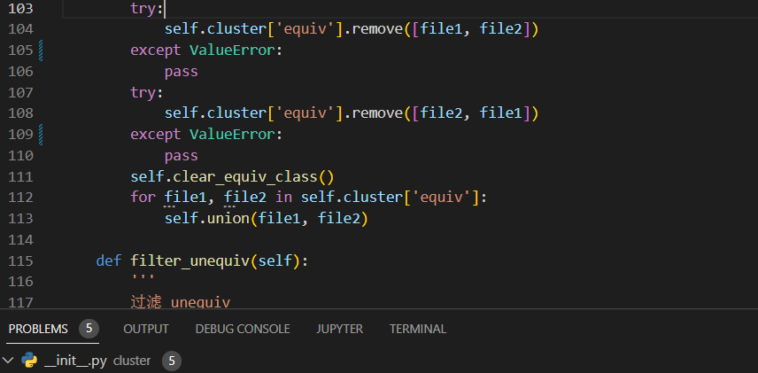

**重新定义了现有函数 input（修复）**：

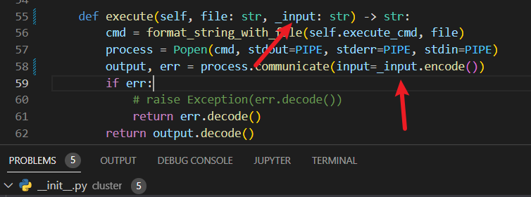

**代码行数过长（修复）**：

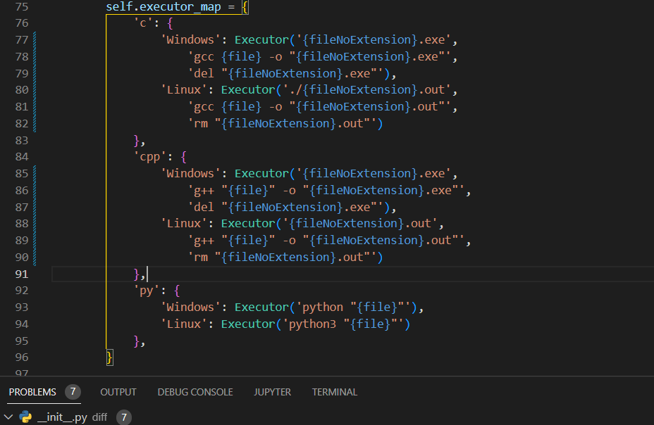


## 二、单元测试报告

### 2.1 测试工具：Pytest

由于我选择的开发语言是 Python，因此这里我使用了 Pytest 作为测试工具。

通过下列命令安装 Pytest：

```sh
pip install pytest
```

然后在 VS Code 中的测试面板选择 Pytest 开始测试：

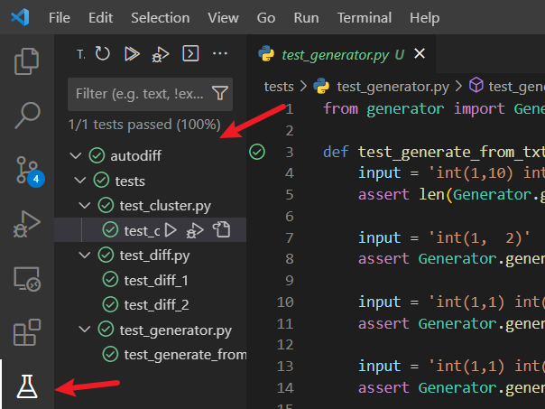


### 2.2 generator 模块单元测试

我们需要测试样例生成器模块，我写了 **超过 10 个测试样例** 用于测试 generator 生成器模块。

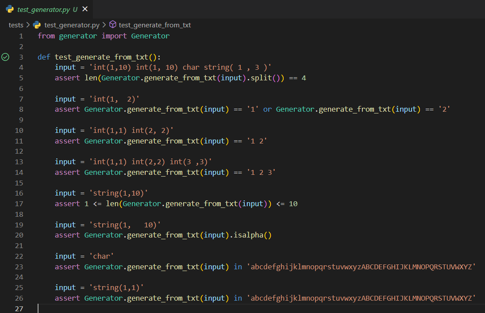

并且我使用了多种手段来测试，例如使用生成样例的分割后长度：

```python
input = 'int(1,10) int(1, 10) char string( 1 , 3 )'
assert len(Generator.generate_from_txt(input).split()) == 4
```

再例如测试了 **边界条件**：

```python
input = 'int(1,1) int(2,2) int(3 ,3)'
assert Generator.generate_from_txt(input) == '1 2 3'
```

并且验证了字符的范围：

```python
input = 'char'
assert Generator.generate_from_txt(input) in \
    'abcdefghijklmnopqrstuvwxyzABCDEFGHIJKLMNOPQRSTUVWXYZ'
```

以上的测试均完美通过了。


### 2.3 diff 模块单元测试

我们需要测试执行对比的 diff 模块，我写了 2 到 3 个用于测试 diff 比较模块的单元测试。

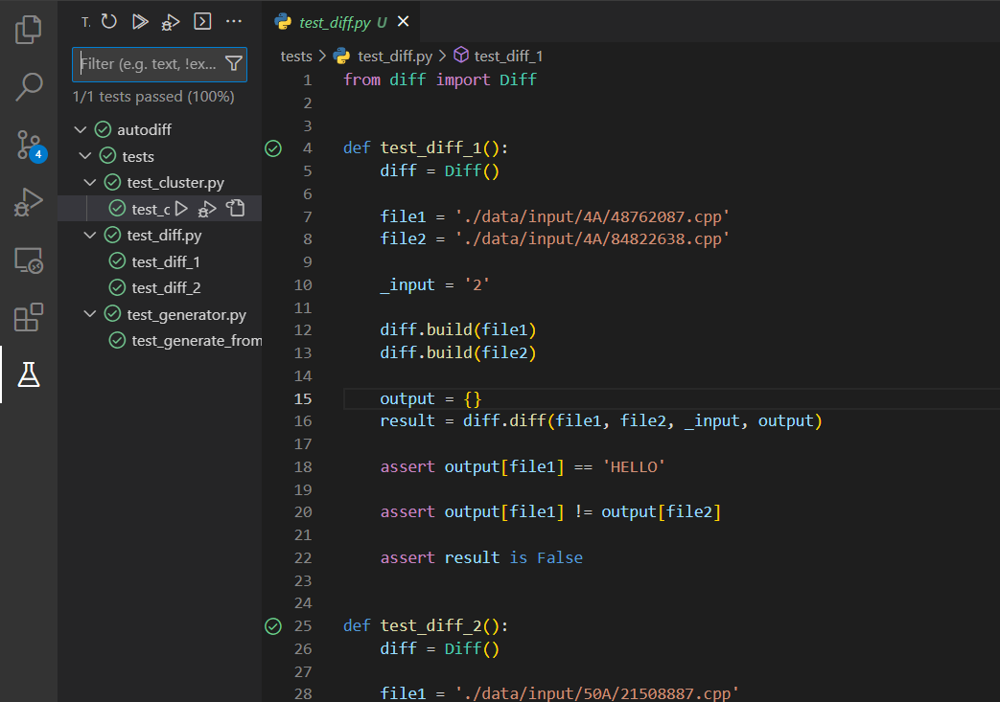

我们可以对执行的确定性输出进行确认，也可以对比对结果进行确认：

```python
def test_diff_1():
    diff = Diff()

    file1 = './data/input/4A/48762087.cpp'
    file2 = './data/input/4A/84822638.cpp'

    _input = '2'

    diff.build(file1)
    diff.build(file2)

    output = {}
    result = diff.diff(file1, file2, _input, output)

    assert output[file1] == 'HELLO'

    assert output[file1] != output[file2]

    assert result is False
```

以上的测试均完美通过了。

### 2.4 cluster 模块单元测试

我们需要测试动态更新的 cluster 数据模块，其有一项很重要的任务，就是通过并查集的方式，根据当前已有的确认等价结果，自动确认一些其他等价结果，以减少工作量。

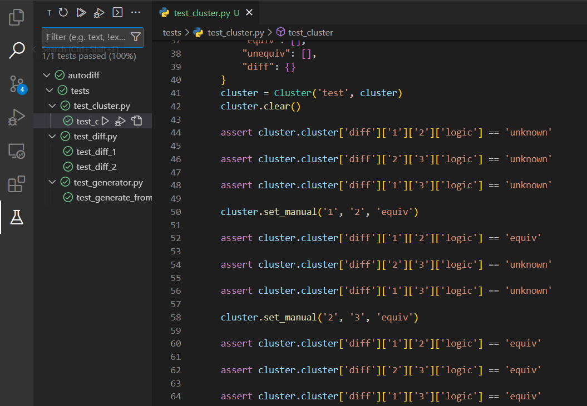

例如这里的文件 1 和 2 等价，文件 2 和 3 等价，则自动推出 1 和 3 等价：

```python
cluster = Cluster('test', cluster)
cluster.clear()

assert cluster.cluster['diff']['1']['2']['logic'] == 'unknown'
assert cluster.cluster['diff']['2']['3']['logic'] == 'unknown'
assert cluster.cluster['diff']['1']['3']['logic'] == 'unknown'

cluster.set_manual('1', '2', 'equiv')

assert cluster.cluster['diff']['1']['2']['logic'] == 'equiv'
assert cluster.cluster['diff']['2']['3']['logic'] == 'unknown'
assert cluster.cluster['diff']['1']['3']['logic'] == 'unknown'

cluster.set_manual('2', '3', 'equiv')

assert cluster.cluster['diff']['1']['2']['logic'] == 'equiv'
assert cluster.cluster['diff']['2']['3']['logic'] == 'equiv'
assert cluster.cluster['diff']['1']['3']['logic'] == 'equiv'
```

除此之外，还要验证对等价操作取消的逻辑：

```python
cluster.set_manual('2', '3', 'unequiv')

assert cluster.cluster['diff']['1']['2']['logic'] == 'equiv'
assert cluster.cluster['diff']['2']['3']['logic'] == 'unequiv'
assert cluster.cluster['diff']['1']['3']['logic'] == 'unequiv'

cluster.set_manual('2', '3', 'unknown')

assert cluster.cluster['diff']['1']['2']['logic'] == 'equiv'
assert cluster.cluster['diff']['2']['3']['logic'] == 'unknown'
assert cluster.cluster['diff']['1']['3']['logic'] == 'unknown'

cluster.set_manual('3', '4', 'equiv')

assert cluster.cluster['diff']['1']['2']['logic'] == 'equiv'
assert cluster.cluster['diff']['2']['3']['logic'] == 'unknown'
assert cluster.cluster['diff']['1']['3']['logic'] == 'unknown'
assert cluster.cluster['diff']['3']['4']['logic'] == 'equiv'

cluster.set_auto('2', '3', 'unequiv')
cluster.update_diff()

assert cluster.cluster['diff']['1']['2']['logic'] == 'equiv'
assert cluster.cluster['diff']['2']['3']['logic'] == 'unequiv'
assert cluster.cluster['diff']['1']['3']['logic'] == 'unequiv'
assert cluster.cluster['diff']['3']['4']['logic'] == 'equiv'
```

以上的测试均完美通过了。


## 三、集成测试报告

测试目的、测试对象、测试环境、测试工具、测试方法等。

以适合的形式给出各个测试的测试目的、测试用例、预期输出、实际输出等。

测试结果分析。

要求提供证明进行了集成测试的截图，如测试用例、测试结果等。


### 3.1 测试目的

我们进行集成测试，是为了检测各个模块之间整合后形成的统一的系统的正确性。

这里我们使用了真实的数据 `4A` 和 `50A`，集成了 input, output, diff, paracomp, clusters, genenrator 等模块的内容，进行的一个统合系统的测试。


### 3.2 测试样例

我们使用的测试样例为：

```python
from input import Input
from output import Output
from paracomp import Paracomp


def test_integration():
    path = './data'
    # 读取输入, from_clusters 表示会读取保存的 clusters
    input = Input(path, from_clusters=True)
    # 进行并行比较
    paracomp = Paracomp(path, input)
    for cluster_name in paracomp.get_cluster_names():
        # 如果是加载的则跳过
        if input.clusters[cluster_name].cluster['is_loaded']:
            continue
        paracomp.run(cluster_name)
    # 对结果进行保存
    output = Output(path, input.clusters)

    # 确认比对结果
    assert output.clusters['4A'].cluster['diff']['101036360.cpp'] \
        ['117364748.cpp']['auto'] == 'unequiv'
    
    assert output.clusters['4A'].cluster['diff']['101036360.cpp'] \
        ['117364748.cpp']['logic'] == 'unequiv'

    assert output.clusters['4A'].cluster['diff']['173077807.cpp'] \
        ['84822639.cpp']['auto'] == 'equiv'

    assert output.clusters['4A'].cluster['diff']['173077807.cpp'] \
        ['84822639.cpp']['logic'] == 'unknown'

    assert output.clusters['50A'].cluster['diff']['138805414.cpp'] \
        ['21508898.cpp']['auto'] == 'unequiv'

    assert output.clusters['50A'].cluster['diff']['138805414.cpp'] \
        ['21508898.cpp']['logic'] == 'unequiv'
    
    assert output.clusters['50A'].cluster['diff']['138805414.cpp'] \
        ['142890373.cpp']['auto'] == 'equiv'

    assert output.clusters['50A'].cluster['diff']['138805414.cpp'] \
        ['142890373.cpp']['logic'] == 'unknown'

    assert output.clusters['50A'].cluster['diff']['142890373.cpp'] \
        ['138805414.cpp']['auto'] == 'equiv'
    
    assert output.clusters['50A'].cluster['diff']['142890373.cpp'] \
        ['138805414.cpp']['logic'] == 'unknown'
```

可以看出，我们使用 input 模块对代码文件数据进行了导入，然后通过 paracomp 模块执行了并行的计算，最后将结果导出到 output 模块中，并对结果进行判断，进行最后的集成测试。


### 3.3 测试结果

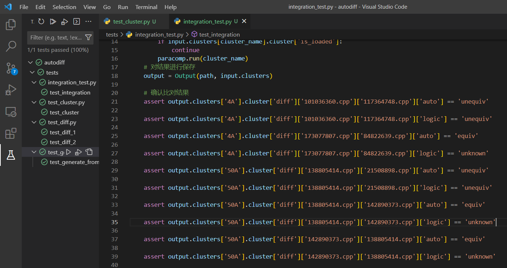

由图中可见，集成测试的所有测试样例均通过了。