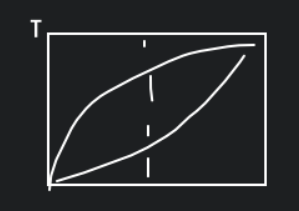

# 地球的故事

奥伯斯佯谬: 宇宙是无限的. 解释佯谬的理论, 宇宙大爆炸.

波粒二象性, 光子能量.

元素的特征谱线. 特征光子, 能级跃迁, 红移, 行星原理.

距离远近的方法, 比较谁亮谁暗.

距离和关系, 哈勃定律. 速度等于哈勃常数乘以距离, 宇宙年龄, 137 忆年, 是哈勃常数的导数, 三条证据, 第三条是氢比值

质量, 恒星只占到了 1.4%.

---

元素的起源, 太阳系元素的分布, 要知道排序, 知道太阳和地球元素含量大小排序, 太阳氢与氦最多.

铁为什么很多.

$_{2}^{4}He$ 代表了中子数和质量数.

四种基本粒子, 原子结构的稳定性受控于哪两个基本粒子.

同位素, 特别是同重元素, 怎么讨论, 意味着什么, beta 衰变是沿着这条线在变化, 一个中子放出一个电子变为一个质子.

爱因斯坦方程 $E=mc^{2}$.

质量陷阱, 质量陷阱对应着我们两个核素是没有的. 导致了 Li Pi B 的含量非常地低.

恒星变大, 能合成的核素越多. 太阳是先氢燃烧, 再到氦燃烧, 寿命长; 而其他更大的恒星虽然能合成更多的, 如碳, 但是燃烧时间短, 寿命短. 

快中子过程, 形成大量的核素. 哪一种是 $\gamma$ 过程, 快中子捕获, 哪一种是慢中子捕获, 还是两种都有. 关键是看它在核素图中的位置.

三种不同的衰变, $\alpha$ 衰变, $\beta$ 衰变, 还是电子捕获?

分别是在宇宙大爆炸中形成 $H, He$, 超新星爆发的快中子捕获过程.

---

矿物

亲铁元素 $Bo$, 亲铜元素, 主要形成硫化物, 

最重要的是硅氧四面体. 硅氧四面体是怎么形成其他的矿物, 例如分子式的计算.

与生命相关的几种有机分子, 

记几个矿物, 题型: 一个矿物图, 给出分子式的选择题.

太阳的年龄. 

太阳系的规律, 共平面, 公转方向相同, 行星的质量, 体积, 密度, 三个参数. 至少要分清楚.

太阳的成分, 跟什么比较相近, 

类地行星和类木行星的差异, 挥发分的差异, 各种差异, 比如 K / U 比.

定年, 半衰期, 放射性的作用, 生成元素, 比如 K, U. 半衰期跟衰变常数的关系. 用什么体系来定年, 这是跟半衰期相联系的.

等时线方程. 不同的参数代表了什么含义, 特别是截距跟斜率.

地球, 月球的年龄, 短寿命元素定年, 它是怎么定年的, 它得到的是相对的年龄.

---

内部结构, 

地球的圈层结构, 地震波, P 波和 S 波, 给一张图, 分辨出那个是 P 波哪个是 S 波, 传播速度, P 波快, 第一个来的肯定是 P 波.

不连续面有什么关系, 对应了那几个不同的圈层.

地球的成分, 地壳的成分, 特别是地球跟地壳.

地核的形成, 以及时间的限定. $^{182}Hf-^{182}W$. 一个亲石的一个亲铁的.

地壳是怎么形成的. 注意和地壳和月壳的形成. 分别描述它们是怎么形成的.

象图

大气圈的形成时间.

---

行星的卫星, 类地行星的卫星要记住,

陨石坑的形成, 撞击金属的形成.

那个模型可以解释哪些证据.

太阳系大撞击过程的证据, 金星的..转, 土星巨大的核.

月球的岩浆洋的理论, 长石. 岩浆洋出现的证据.

地球为什么形成不了像月球这样的长石.

---

宜居性. 

为什么地球的温度还是比较高的.

44 亿年前, 证据.

锆石的形成, 温度.

氧同位素与水循环.

地球为什么没什么氢气.

大气中的 He 的居留时间.

温室效应, 气体的温室效应的效果, 浓度的影响.

地球表明温度的调节.

---

板块构造.

大陆漂移学说的优缺点.

地震活动带, 菲尼...带,

转换断层, 扬中级, ... 三个

板块边界, 考试中可能会出现一些地名.

地幔对流, 地幔流动的证据, 什么叫均衡, 什么时候可以发生对流. 地幔是固体.

---

中级的相关性, 对应的构造单元. 

升温: 地幔柱, 加水: 缓冲带, 减压:.

---

最后一章就不提了.

超过 50 道题目. 可以只答 50 道题目. 只找对的. 答对 50 道满分.

