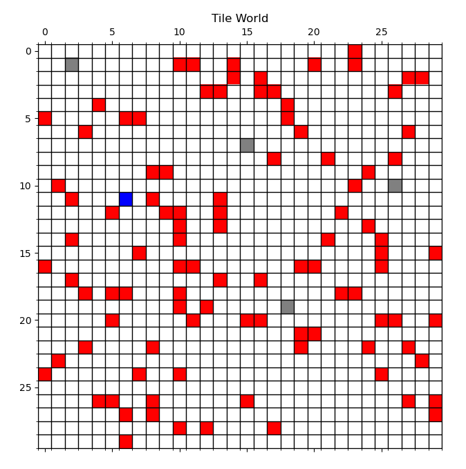
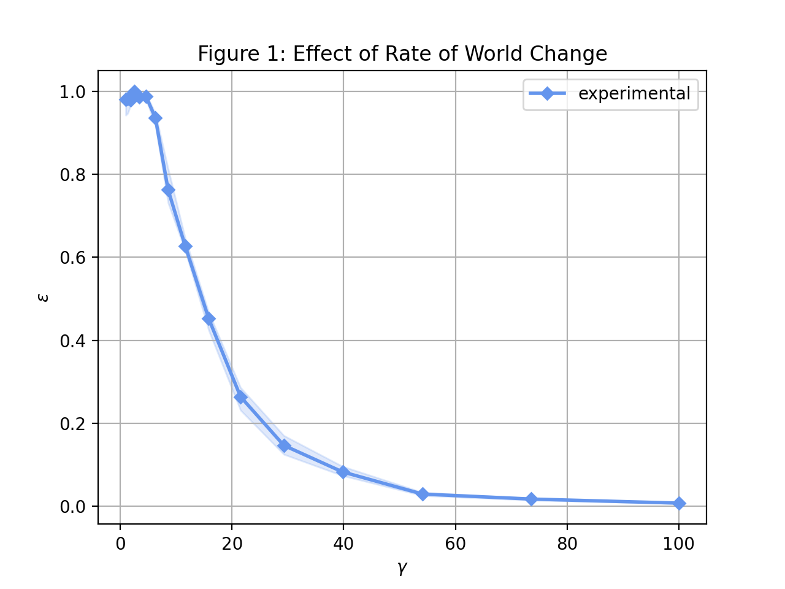
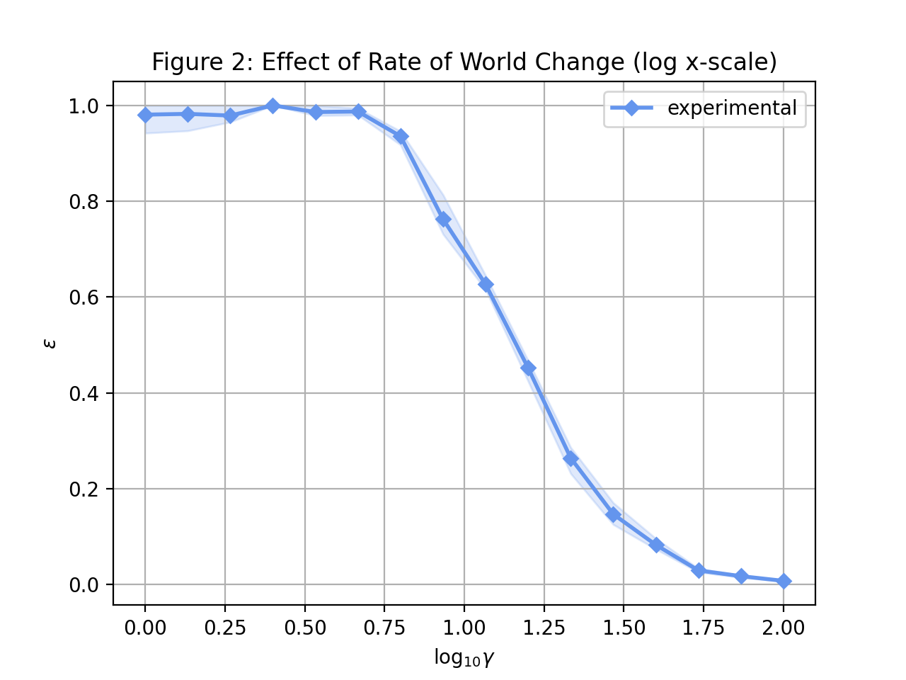
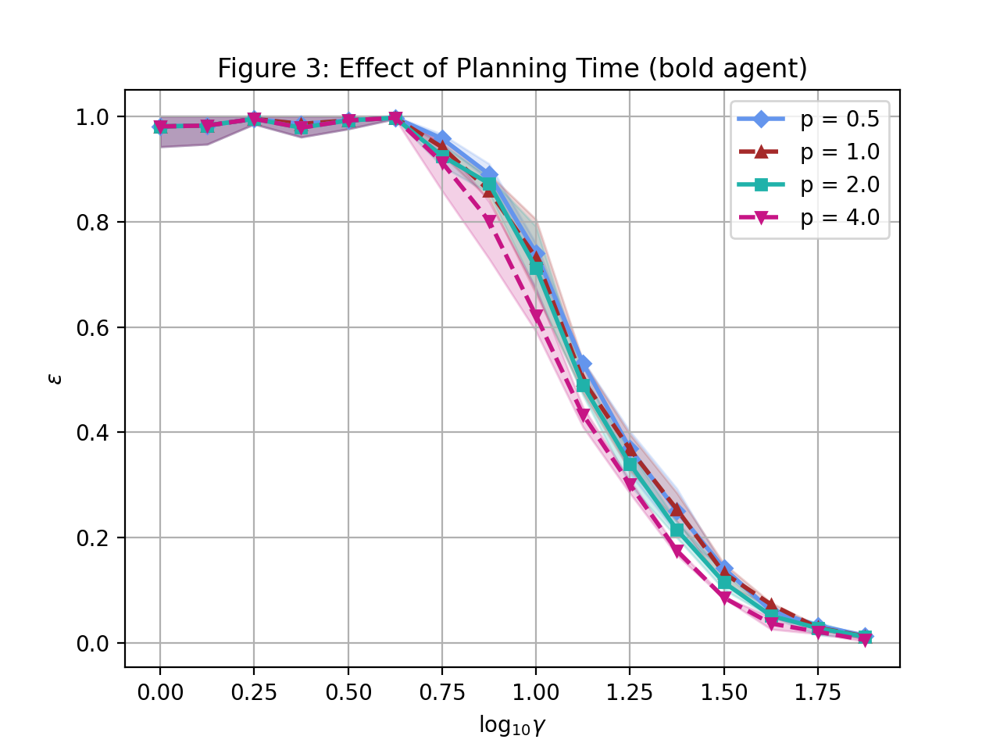
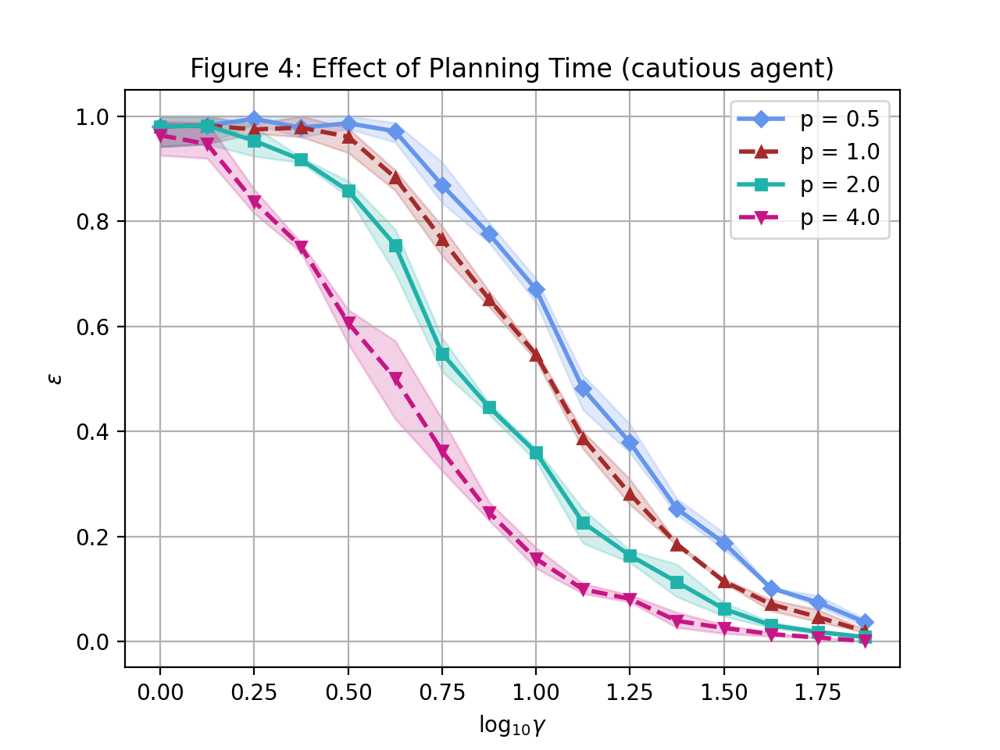
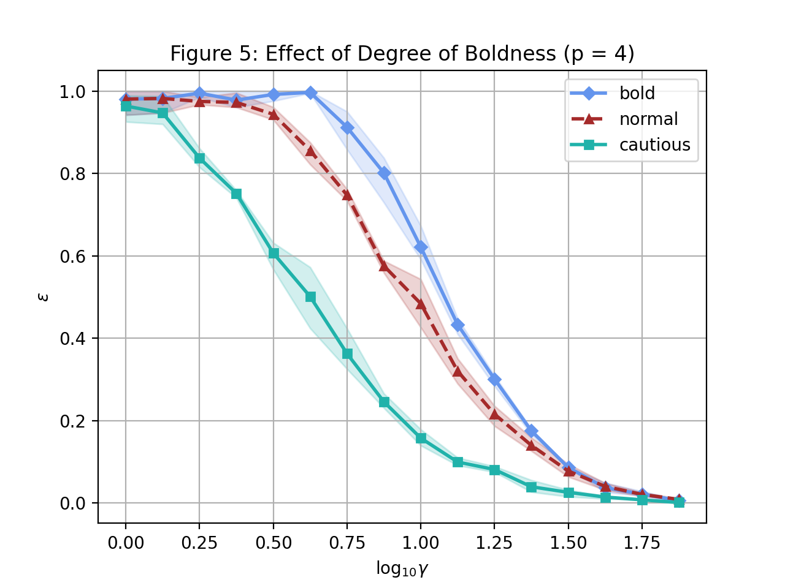
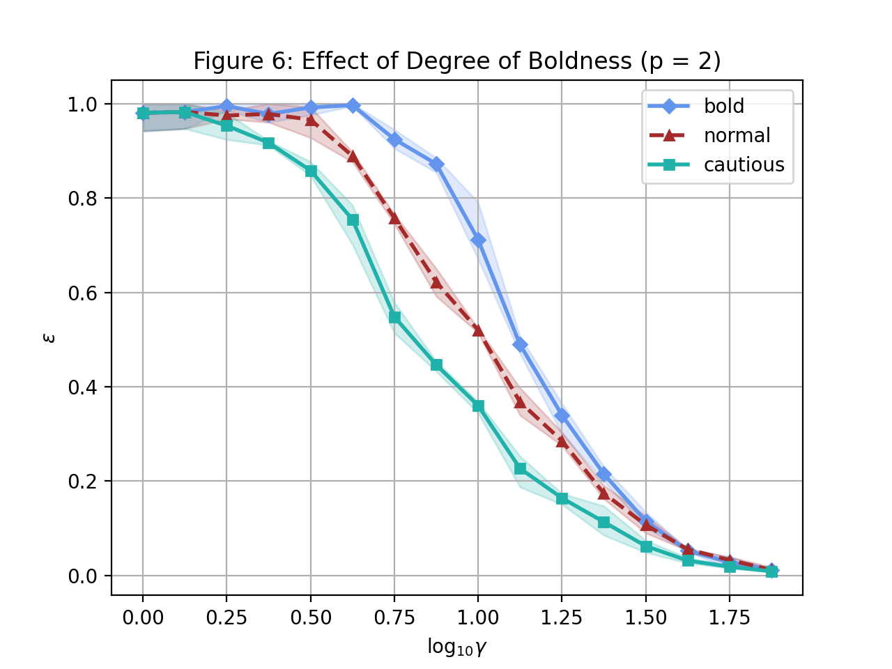
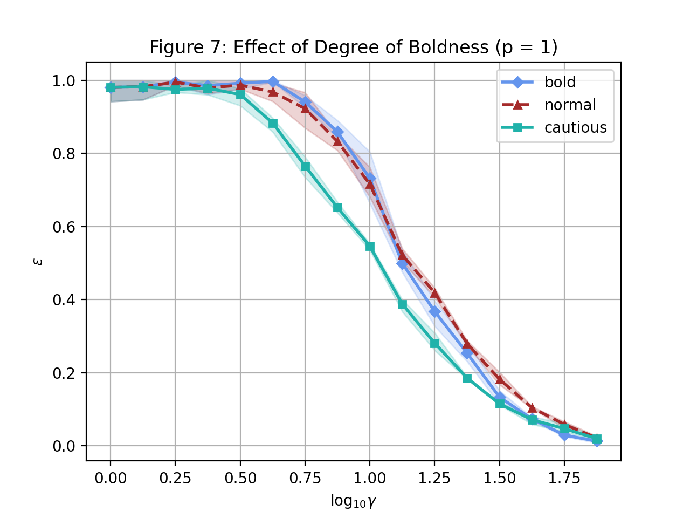
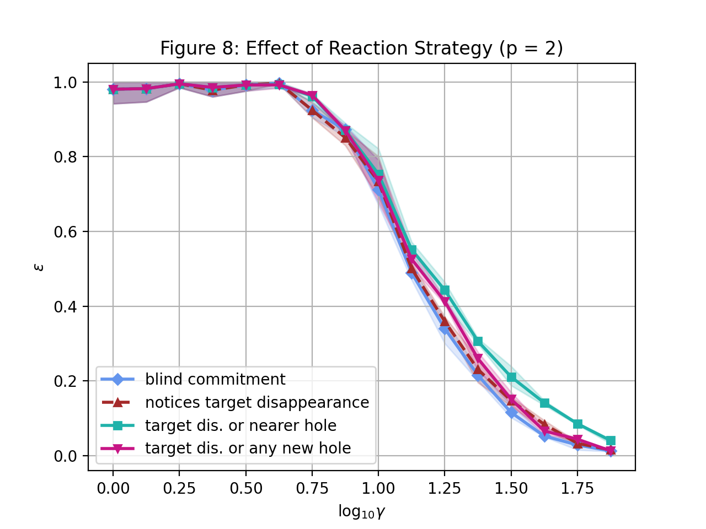
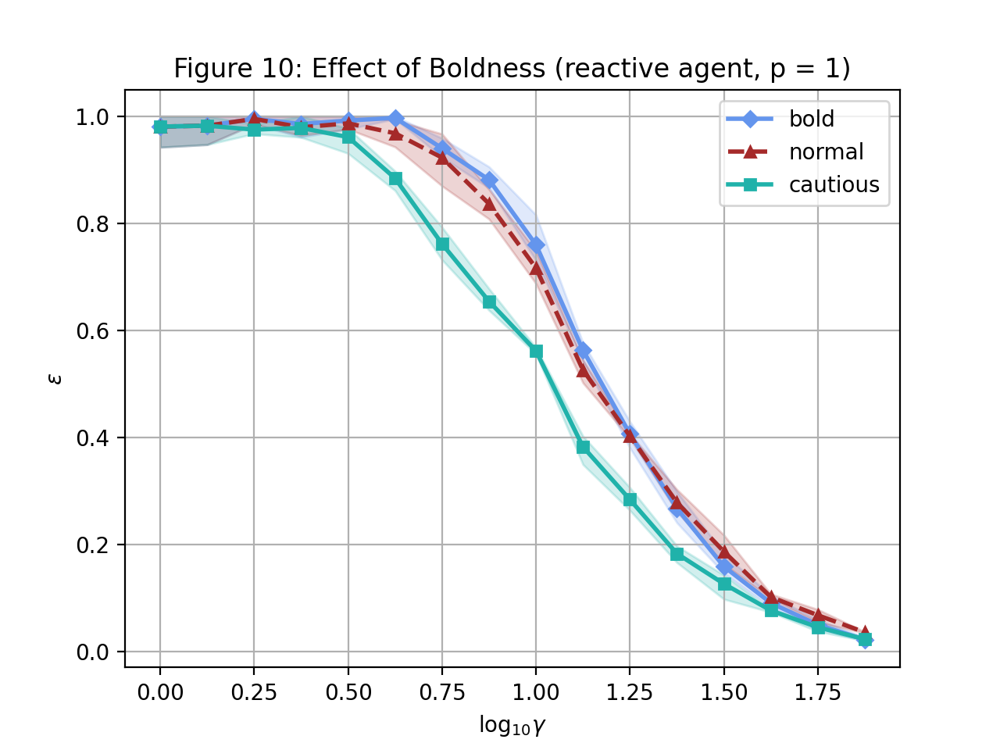

    

        <b style="float: left;">多智能体系统</b>
        <b style="float: right;">人工智能学院</b>
    

    <h1 style="text-align: center;">第一次编程作业</h1>
    

        <i>Instructor:</i> 章宗长
        <i>Name:</i> 方盛俊, <i>StudentId:</i> 201300035
    

## 一、作业说明

### 1.1 作业背景

本次作业为复现 [Commitment and Effectiveness of Situated Agents](https://www.ijcai.org/Proceedings/91-1/Papers/014.pdf) 论文中的实验与结果。

具体来说是要实现一个瓦片（网格）世界，这个世界存在着许多固定的障碍物，以及不断地动态生成的洞穴，每个洞穴有着对应的分数，没有及时填补就会在一定时间消失。我们有一个实用推理 BDI Agent，它负责走到这些洞穴上，只要经过这些洞穴，就能填补对应的洞穴并得分。

### 1.2 参数设置

- `seeds`：默认值 `[3, 1, 8]`，随机数种子；
- `size`：默认值 `30`，世界大小，即 $30 \times 30$ 大小的瓦片世界，如果长宽不等，也可以填入 `[20, 30]`；
- `iterations`：默认值 `3000`，每一局游戏的迭代次数；
- `obstacle_num`：默认值 `100`，障碍物个数；
- `min_gestation`：默认值 `60`，生成洞穴的最小间隔时间；
- `max_gestation`：默认值 `240`，生成洞穴的最大间隔时间；
- `min_life_expectancy`：默认值 `240`，洞穴的最小寿命；
- `max_life_expectancy`：默认值 `960`，洞穴的最大寿命；
- `gamma`：默认值 `1`，世界变化率；
- `min_score`：默认值 `1`，洞穴的最小分数；
- `max_score`：默认值 `10`，洞穴的最大分数；
- `p`：默认值 `1`，Agent 的规划时间；
- `k`：默认值 `inf`，Agent 每 $k$ 步重新考虑意图, 设置 1 即为 Cautious Agent, 设置 4 即为 Normal Agent, 设置 inf 即为 Bold Agent；
- `reaction_strategy`：默认值 `'blind'`，反应策略, 应为 'blind', 'disappear', 'nearer_hole', 'any_hole' 中的一个；
- `visualize`：默认值 `False`，是否渲染每一步对应的瓦片世界；
- `visualize_result`：默认值 `False`，是否渲染瓦片世界的结果；
- `is_tqdm`：默认值 `False`，是否开启进度条；
- `print_score`：默认值 `True`，是否打印最后的效率 $\varepsilon$。

### 1.3 项目特点

1. 写了一个小型的游戏引擎代码 `engine.py`，实现了 [游戏组件化编程](https://gpp.tkchu.me/component.html)，可以更有效的管理游戏的组件、对象与生命周期。
2. 基于小型游戏引擎实现游戏的具体逻辑 `main.py`，并尽力进行了解耦合，使得代码更为地简明易懂。
3. 使用 Matplotlib 渲染了游戏的运行过程，实现了模拟的可视化。其中红色方格为障碍物，灰色方格为洞穴，蓝色方格为 Agent。
4. 通过 `init_config()` 统一管理了所有的参数，可以很方便地对参数进行修改。
5. 实现了 BDI Agent 大部分的函数，例如 `options`、`filter`、`plan`、`reconsider` 与 `execute` 等。
6. 通过 [观察者模式](https://refactoringguru.cn/design-patterns/observer) 对洞穴生成和洞穴消失事件进行了分发，在将洞穴对象与 Agent 对象解耦合的情况下，实现了 `reaction_strategy` 反应策略功能。
7. 实现了 Astar 算法用以寻路，可以减小规划所需的时间，加快代码的运行效率。
8. 还通过对位置进行哈希等手段优化了代码的运行效率。

## 二、复现结果

### 2.1 Experiment 1

实验 1 探究的是世界变化率 $\gamma$ 与效率 $\varepsilon$ 之间的关系：

### 2.2 Experiment 2

实验 2 探究的是规划时间 $p$ 与世界变化率 $\gamma$ 及效率 $\varepsilon$ 之间的关系：

### 2.3 Experiment 3

实验 3 探究的是承诺属性与世界变化率 $\gamma$ 及效率 $\varepsilon$ 之间的关系。

- Bold Agent 会达到意图之后才会重新思考新的意图；
- Normal Agent 每行动 4 次才会重新思考新的意图；
- Cautious Agent 每行动 1 次都会重新思考新的意图。

可以看出，在规划时间 $p$ 较小而世界变化率 $\gamma$ 较大的情况下，Normal Agent 是要优于 Bold Agent 的。这说明我们面对不同的情形，应该采取不同的策略。

### 2.4 Experiment 4

实验 4 探究的是反应策略与世界变化率 $\gamma$ 及效率 $\varepsilon$，还有承诺属性之间的关系。

我们有四种不同的反应策略：

1. `blind`: 盲目策略，不会对事件产生进行反应。
2. `disappear`: 当目标洞穴消失时，重新规划路线。
3. `nearer_hole`: 当目标洞穴消失或有更近的新洞穴出现时，重新规划路线。
4. `any_hole`: 当目标洞穴消失或有任意的新洞穴出现时，重新规划路线。

