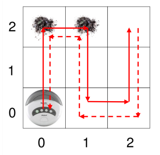
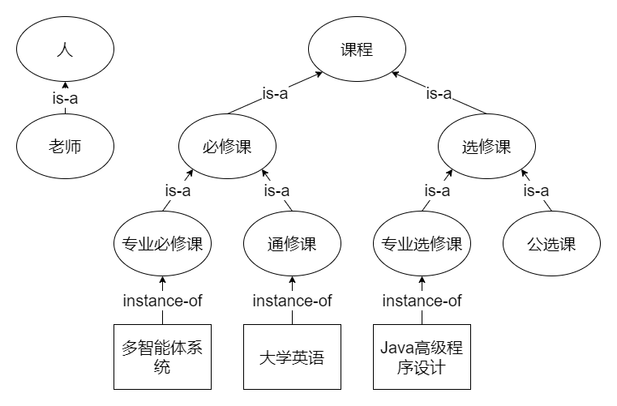

<style>
.title-box {
    border-style: solid;
    border-width: 1px;
    padding: 16px;
    padding-bottom: 32px;
}
</style>

<div class="title-box">
    <div>
        <b style="float: left;">多智能体系统</b>
        <b style="float: right;">人工智能学院</b>
    </div>
    <h1 style="text-align: center;">Homework 1</h1>
    <div>
        <span style="float: left;"><i>Instructor:</i> 章宗长</span>
        <span style="float: right;"><i>Name:</i> 方盛俊, <i>StudentId:</i> 201300035</span>
    </div>
</div>

## 课后作业 2-1

1. **股票交易 Agent**
    1. **环境**: 软件环境, 包括股票市场, 投资者账户, 股票价格等信息. 环境是部分可观察的 (不能获取所有股票市场相关信息), 不确定性的 (股票价格变化不可预测), 多 Agent 的 (有其他投资者影响市场), 序贯式的 (每次交易都会影响未来收益), 连续式的 (股票价格和交易时间都是连续变化). 
    2. **动作库**: 买入某种股票, 卖出某种股票, 持有不变. 执行这些动作的前提条件是: 买入某种股票需要账户中有足够资金; 卖出某种股票需要账户中有该种股票; 持有不变可以在任何时候执行. 
    3. **设计目标**: 最大化投资收益. 
2. **网络爬虫 Agent**
    1. **环境**: 它是一个软件 Agent, 它的环境是互联网上的网页和链接, 以及对应的文本内容. 它的环境是部分可观察的 (因为它不能访问所有网页), 有不确定性的 (因为网页和链接可能发生变化或失效), 多 Agent 的 (因为有其他爬虫或用户在访问同样的网页), 序贯的 (因为每次下载或解析网页都会影响下一次下载或解析网页), 连续或离散 (取决于如何表示和处理数据).
    2. **动作库**: 它可执行的动作库包括请求或下载网页, 解析或存储数据, 跟踪或过滤链接等, 执行这些动作的前提条件是有合法和有效的 URL 地址, 数据格式和抓取规则等.
    3. **设计目标**: 它的设计目标是收集和提供目标领域内的数据.
3. **扫地机器人 Agent**
   1. **环境**: 它是一个物理 Agent, 可以在房间里移动并清扫地面, 主要运行在室内的地面环境中. 它的环境是房间内的物体和障碍物, 环境的状态是房间内各个位置的清洁程度. 它的环境是部分可观察的 (因为它不能看到所有地方), 有不确定性的 (因为它可能遇到意外情况), 单 Agent 的 (除非有其他机器人), 序贯的 (因为每次扫地都会影响下一次扫地), 连续的 (因为时间和空间都是连续变化的).
   2. **动作库**: 它可执行的动作库包括前进, 后退, 左转, 右转, 吸尘等. 执行这些动作的前提条件可能包括电量充足, 没有碰撞, 传感器正常等.
   3. **设计目标**: 它的设计目标是尽可能清洁房间, 并避免损坏自己或其他物体. 


## 课后作业 2-2

### (1)

对于每一个纯反应式 Agent, 存在一个行为等价的标准 Agent.

证明如下:

设 $A$ 是一个纯反应式 Agent, 它的行动函数是 $f: E \to Ac$.

构造一个标准 Agent $B$, 它的行动函数是 $g: \mathcal{R}^{E} \to Ac$, 定义为

$g((e_0,a_0,e_1,a_1,\dots,e_n)) = f(e_{n})$

则由它们的定义易得, 对于任何环境 $Env =\langle E,e_0,\tau \rangle$,

有 $\mathcal{R}(A, Env) = R(B, Env)$, 即两个 Agent 是完全行为等价的.

### (2)

存在标准 Agent, 没有与之行为等价的纯反应式 Agent.

证明如下:

我们构造一个环境 $Env = \langle E,e_0,\tau \rangle $, 其中状态集合 $E = \{e_0, e_1\}$, $e_0$ 是初始状态.

状态转移函数为 $\tau((e_0,a_0))=\{ e_0 \}, \tau((e_0,a_0,e_0,a_1))=\{ e_1 \}$, 其余情况 $\tau(r) = \empty$.

设 $A$ 是一个标准 Agent, 它的行动函数定义为 $h((e_0)) = a_0, h((e_0,a_0,e_0)) = a_1$, 其余情况 $h(r) = a_0$.

则我们可知 $(e_0,a_0,e_0,a_1,e_1,a_0) \in \mathcal{R}(A, Env)$

假设存在一个纯反应式 Agent $B$ 与 $A$ 对于 $Env$ 行为等价, 则一定有 $(e_0,a_0,e_0,a_1,e_1,a_0) \in \mathcal{R}(B, Env)$,

则我们可知输入分别为 $(e_0)$ 与 $(e_0,a_0,e_0)$ 时 $B$ 的行动函数 $f((e_0)) = f(e_0) = a_0, f((e_0,a_0,e_0)) = f(e_0) = a_1$, 与纯反应式 Agent 的决策完全基于当前状态的定义产生矛盾.

由反证法可知, 不存在与 $A$ 行为等价的纯反应式 Agent.


## 课后作业 2-3

定义一个关于运行的效用函数 $u_{R}((e_0)) = 0, u_{R}((e_0, a_0, e_0)) = 1$, 其他情况 $u_{R}(r) = 0$.

假设存在一个与状态有关的效用函数 $u_{E}$ 可以用于定义等价的任务,

则由 $u_{R}((e_0)) = 0$ 可得 $u_{E}(e_0) = 0$, 由 $u_{R}((e_0, a_0, e_0)) = 1$ 可得 $u_{E}(e_0) = 1$, 产生矛盾.

则有反证法可知这个关于运行的效用函数 $u_{R}$ 不能通过与状态有关的效用来定义.


## 课后作业 2-4

由期望效用的计算公式

$\displaystyle EU(Ag, Env) = \sum_{r \in \mathcal{R}(Ag, Env)}u(r)P(r|Ag, Env)$

可得

$Ag_1$ 的期望效用 $= 0.2 \times 8 + 0.2 \times 7 + 0.6 \times 4 = 5.4$

$Ag_2$ 的期望效用 $= 0.2 \times 8 + 0.3 \times 2 + 0.5 \times 5 = 4.7$

因此, 最优 Agent 为 $Ag_1$.


## 课后作业 2-5

函数 `new` 的伪代码描述:

```python
def new(DB, p):
    new_DB = {}
    # 产生谓词 In(...)
    (x, y) = the new position of the agent
    new_DB.add(In(x, y))
    # 产生谓词 Facing(...)
    d = the orientation of the agent
    new_DB.add(Facing(d))
    # 产生谓词 Dirt(...)
    # 如果在新位置上感知到了 dirt 而不是 null
    if p == dirt:
        (x, y) = the new position of the agent
        new_DB.add(Dirt(x, y))
    # 返回新生成的状态
    return new_DB
```


## 课后作业 2-6

给吸尘 Agent 的动作集合加入一个动作 $turnLeft$: 逆时针旋转 90°, 否则无法仅通过现有内部状态和动作集合做出无冲突的演绎规则来实现下列导航 (从 $(0, 0)$ 到 $(2, 2)$, 再从 $(2, 2)$ 到 $(0, 0)$):



清扫规则:

- $In(x, y) \land Dirt(x, y) \to Do(suck)$

导航规则:

- $In(0, 0) \land Facing(north) \land \lnot Dirt(0, 0) \to Do(forward)$
- $In(0, 1) \land Facing(north) \land \lnot Dirt(0, 1) \to Do(forward)$
- $In(0, 2) \land Facing(north) \land \lnot Dirt(0, 2) \to Do(turn)$
- $In(0, 2) \land Facing(east) \to Do(forward)$
- $In(1, 2) \land Facing(east) \to Do(turn)$
- $In(1, 2) \land Facing(south) \land \lnot Dirt(1, 2) \to Do(forward)$
- $In(1, 1) \land Facing(south) \land \lnot Dirt(1, 1) \to Do(forward)$
- $In(1, 0) \land Facing(south) \land \lnot Dirt(1, 0) \to Do(turnLeft)$
- $In(1, 0) \land Facing(east) \to Do(forward)$
- $In(2, 0) \land Facing(east) \to Do(turnLeft)$
- $In(2, 0) \land Facing(north) \land \lnot Dirt(2, 0) \to Do(forward)$
- $In(2, 1) \land Facing(north) \land \lnot Dirt(2, 1) \to Do(forward)$
- $In(2, 2) \land Facing(north) \land \lnot Dirt(2, 2) \to Do(turn)$
- $In(2, 2) \land Facing(east) \to Do(turn)$

导航规则 (反方向):

- $In(2, 2) \land Facing(south) \land \lnot Dirt(2, 2) \to Do(forward)$
- $In(2, 1) \land Facing(south) \land \lnot Dirt(2, 1) \to Do(forward)$
- $In(2, 0) \land Facing(south) \land \lnot Dirt(2, 0) \to Do(turn)$
- $In(2, 0) \land Facing(west) \to Do(forward)$
- $In(1, 0) \land Facing(west) \to Do(turn)$
- $In(1, 0) \land Facing(north) \land \lnot Dirt(1, 0) \to Do(forward)$
- $In(1, 1) \land Facing(north) \land \lnot Dirt(1, 1) \to Do(forward)$
- $In(1, 2) \land Facing(north) \land \lnot Dirt(1, 2) \to Do(turnLeft)$
- $In(1, 2) \land Facing(west) \to Do(forward)$
- $In(0, 2) \land Facing(west) \to Do(turnLeft)$
- $In(0, 2) \land Facing(south) \land \lnot Dirt(0, 2) \to Do(forward)$
- $In(0, 1) \land Facing(south) \land \lnot Dirt(0, 1) \to Do(forward)$
- $In(0, 0) \land Facing(south) \land \lnot Dirt(0, 0) \to Do(turn)$
- $In(0, 0) \land Facing(west) \to Do(turn)$


以上就是真空吸尘器世界中的演绎规则. 可以看出, 该简单的解决方案却需要由许多的规则来声明, 并不直观, 也不优美, 也不紧凑.


## 课后作业 2-7

给吸尘 Agent 的动作集合加入一个动作 $turnLeft$: 逆时针旋转 90°, 否则无法仅通过现有内部状态和动作集合做出无冲突的演绎规则来实现下列导航:


按照上面给出的方法, 我们假设真空吸尘器世界的规模大小为 $n \times n$, 则需要

$2 \times [(n + 2) \times n - 1] + 1 = 2 n^{2} + 4 n - 1$

条规则.

带入 $n = 10$ 可得需要

$2 n^{2} + 4 n - 1 = 239$

条规则进行编码, 对于这种规模的例子来说, 这是一个偏大的数目.

我们可以进行一般化处理 (下面定义 $m = n - 1$):

清扫规则:

- $In(x, y) \land Dirt(x, y) \to Do(suck)$

终点规则 (在最后一点反向):

当 $n$ 为奇数 (即 $m$ 为偶数) 时我们有:

- $In(m, m) \land Facing(east) \to Do(turn)$

当 $n$ 为偶数 (即 $m$ 为奇数) 时我们有:

- $In(m, 0) \land Facing(east) \to Do(turnLeft)$

边界规则 (第一行和最后一行, 其中 $k$ 为整数):

- $In(2k, m) \land Facing(north) \land \lnot Dirt(2k, m) \to Do(turn)$
- $In(2k, m) \land Facing(east) \to Do(forward)$
- $In(2k+1, m) \land Facing(east) \to Do(turn)$
- $In(2k+1, 0) \land Facing(south) \land \lnot Dirt(2k+1, 0) \to Do(turnLeft)$
- $In(2k+1, 0) \land Facing(east) \to Do(forward)$
- $In(2k, 0) \land Facing(east) \to Do(turnLeft)$
- $In(2k, 0) \land Facing(south) \land \lnot Dirt(2k, 0) \to Do(turn)$
- $In(2k, 0) \land Facing(west) \to Do(forward)$
- $In(2k+1, 0) \land Facing(west) \to Do(turn)$
- $In(2k+1, m) \land Facing(north) \land \lnot Dirt(2k+1, m) \to Do(turnLeft)$
- $In(2k+1, m) \land Facing(west) \to Do(forward)$
- $In(2k, m) \land Facing(west) \to Do(turnLeft)$

前进规则 (正方向和反方向):

- $In(x, y) \land Facing(north) \land \lnot Dirt(x, y) \to Do(forward)$
- $In(x, y) \land Facing(south) \land \lnot Dirt(x, y) \to Do(forward)$

该规则优先级为从上至下.


## 课后作业 2-8

这个并发 MetateM 程序定义了 5 个 Agent 的行为:

1. SnowWhite 是资源的提供者, 她手中有糖作为资源. 当她被要糖时, 她会给出糖, 并且只会把糖给一个人.
    1. $SnowWhite(ask)[give]$: 她可以接收的消息的符号为 $ask$, 可以发送的消息的符号为 $give$.
    2. $\odot ask(x) \Rightarrow \lozenge give(x)$: 如果 $x$ 昨天要糖了, 则将会把糖给 $x$.
    3. $give(x) \land give(y) \Rightarrow (x = y)$: 如果把糖给了 $x$ 和 $y$, 则 $x$ 和 $y$ 一定是同一个人, 即只会把糖给一个人.
2. eager 是资源的消费者. 他非常渴望得到糖, 因此他会在系统启动后立即要求糖, 并且只要收到糖就会再次要求. 
    1. $eager(give)[ask]$: 他可以接收的消息的符号为 $give$, 可以发送的消息的符号为 $ask$.
    2. $start \Rightarrow ask(eager)$: 在系统启动后, 他会立即发送一条要求糖的消息. 
    3. $\odot give(eager) \Rightarrow ask(eager)$: 只要收到了糖, 他就会再次发送要求糖的消息. 
3. greedy 是资源的消费者. 他非常贪婪, 想要尽可能多的糖果, 因此他会一直不停地要求糖. 
    1. $greedy(give)[ask]$: 他可以接收的消息的符号为 $give$, 可以发送的消息的符号为 $ask$.
    2. $start \Rightarrow \square ask(greedy)$: 在系统启动后, 他会不断发送要求糖的消息, 直到得到为止. 
4. courteous 是资源的消费者. 他很有礼貌, 不想打扰其他人, 因此他只有在 eager 和 greedy 没有要求糖的时候才会要求糖. 
    1. $courteous(give)[ask]$: 他可以接收的消息的符号为 $give$, 可以发送的消息的符号为 $ask$.
    2. $((\lnot ask(courteous) S give(eager)) \land (\lnot ask(courteous) S give(greedy))) \Rightarrow ask(courteous)$: 如果 eager 和 greedy 没有要求糖, 他才会发送一条要求糖的消息. 
5. shy 是资源的消费者. 他很害羞, 不喜欢与别人交流, 因此他只有在没有其他消费者要求糖的时候才会要求糖.
    1. $shy(give)[ask]$: 他可以接收的消息的符号为 $give$, 可以发送的消息的符号为 $ask$.
    2. $start \Rightarrow \lozenge ask(shy)$: 在系统启动后, 他将会发送一条要求糖的消息. 
    3. $\odot ask(x) \Rightarrow \lnot ask(shy)$: 如果有其他消费者要求糖, 他就不会要求糖.
    4. $\odot give(shy) \Rightarrow \lozenge ask(shy)$: 如果之前得到了糖, 则将来还会继续要求糖.


## 课后作业 2-9

1. **Forward**:

$
\begin{aligned}
& & & Forward(x,y,d) \\
pre & & & In(x,y) \land Facing(d)  \\
del & & & In(x,y)  \\
add & & & In(x',y')  \\
\end{aligned}
$

Forward 操作的前提条件是 Agent 在某个位置 $(x,y)$. 且面朝某个方向 d, 删除效果是 Agent 在位置 $(x,y)$, 添加效果是 Agent 在位置 $(x',y')$, 其中 $(x',y')$ 是根据 $d$ 和 $(x,y)$ 算出来的下一个位置, 如果该位置超出网格范围, 则该操作不可执行. 

2. **Suck**:

$
\begin{aligned}
& & & Suck(x,y) \\
pre & & & In(x,y) \land Dirt(x,y) \\
del & & & Dirt(x,y) \\
add & & & \empty \\
\end{aligned}
$

Suck 操作的前提条件是 Agent 在某个位置 $(x,y)$, 且该位置有灰尘 $Dirt(x,y)$, 删除效果是该位置有灰尘 $Dirt(x,y)$.

3. **Turn**:

$
\begin{aligned}
& & & Turn(d) \\
pre & & & Facing(d) \\
del & & & Facing(d) \\
add & & & Facing(d') \\
\end{aligned}
$

Turn 操作的前提条件是 Agent 面朝某个方向 $d$, 删除效果是 Agent 面朝方向 $d$, 添加效果是 Agent 面朝方向 $d'$, 其中 $d'$ 是根据 $d$ 沿顺时针方向转动 90° 得到的下一个方向.


## 课后作业 2-10

计算得到的规划为

```txt
UnStack(C, A)

PutDown(C)

Pickup(B)

Stack(B, C)
```

开始时的环境:

```txt
  C
  |
  A           B
  |           |           |
-----------------------------
```

执行 `UnStack(C, A)` 后:

```txt
        |
        C

  A           B
  |           |           |
-----------------------------
```

执行 `PutDown(C)` 后:

```txt
  A           B           C
  |           |           |
-----------------------------
```

执行 `Pickup(B)` 后:

```txt
        |
        B

  A           C
  |           |           |
-----------------------------
```

执行 `Stack(B, C)` 后的最终环境:

```txt
              B 
              |
  A           C
  |           |           |
-----------------------------
```


## 课后作业 2-11

(a) 变量 $B$, $D$ 和 $I$:

$B$ 代表 belief, 即 Agent 所持有的信念集合, 包含了 Agent 当前对世界的认知或信念. 

$D$ 代表 desire, 即 Agent 的愿望集合, 表示 Agent 希望实现的状态或行为. 

$I$ 代表 intention, 即 Agent 当前的意图集合, 表示 Agent 在当前时刻要实现的目标或意图. 

(b) 感知 $\rho$:

感知是 Agent 从外部环境中收集信息的方式, $\rho$ 表示感知函数, 用于获取当前时刻 Agent 所处的环境状态. 

(c) $brf(…)$ 函数:

$B := brf(B, \rho)$ 函数是信念修正函数, 用于更新 Agent 的信念集合. 基于现有的信念集合 $B$ 和感知到的信息 $\rho$, 计算出新的信念集合, 并更新 Agent 的信念集合.

(d) $options(…)$ 函数:

$D := options(B, I)$ 函数是选项生成函数, 接受 Agent 当前的信念 $B$ 和意图 $I$, 以此为基础产生可能的选项或愿望集合 $D$.

(e) $filter(…)$ 函数:

$I := filter(B, D, I)$ 函数是过滤函数, 用于从愿望集合 $D$ 中过滤掉 Agent 在当前时刻难以完成的愿望, 进而生成当前的意图集合 $I$, 也即从竞争的选项中做出 "最佳" 的选择, 供 Agent 做出承诺.

(f) $plan(…)$ 函数:

$\pi := plan(B, I)$ 函数是规划算法, 用于根据 Agent 的信念集合 $B$ 和当前的意图集合 $I$ 生成一个规划 $\pi$, 以实现当前的意图 $I$.

(g) $sound(…)$ 函数:

$sound(\pi, I, B)$ 函数是一个布尔函数, 代表在给定 $B$ 时, $\pi$ 是实现 $I$ 的正确的规划. 用于判断 Agent 所制定的规划 $\pi$ 是否合理且可行, 以确保 Agent 能够在其执行规划的过程中不会违背其信念集合 $B$ 和意图集合 $I$.

(h) $succeeded(…)$ 函数 和 $impossible(…)$ 函数:

$succeeded(I, B)$ 函数和 $impossible(I, B)$ 函数是用于判断当前的意图集合 $I$ 是否是已经成功或者是不可能成功的意图集合.

$succeeded(I, B)$ 函数判断 Agent 在执行规划 $\pi$ 后是否成功实现了其意图集合 $I$, 如果成功则返回 True, 否则返回 False.

$impossible(I, B)$ 函数判断 Agent 是否无法通过任何规划实现其意图集合 $I$, 如果无法实现则返回 True, 否则返回 False.

(i) $reconsider(…)$ 函数:

$reconsider(I, B)$ 函数是一个布尔函数, 用于在 Agent 执行规划过程中, 根据环境变化改变信念集合 $B$ 的情况下, 思考当前的信念集合 $B$ 和意图集合 $I$ 间的关系, 以判断是否需要调整 Agent 当前的愿望集合 $D$ 和意图集合 $I$. 在其认为需要重新考虑时返回 True, 不需要重新考虑时返回 False.

这个函数是用来解决两难局面的:

- 专一承诺 Agent：不停下来充分地重新考虑它的意图, 可能这些意图不再是最佳的.
- 坦率承诺 Agent：不断地重复考虑它的意图, 将会没有足够的时间实现这些意图.

通过引入一个布尔函数 $reconsider$ 决定是否重新考虑意图, 我们就能很好地权衡重复考虑意图与否之间的平衡问题.


## 课后作业 2-12

用 Brooks 的归类式结构的方法求解真空吸尘器如下 (优先级依次从高到低):

1. if 当前网格位置有垃圾, then 打扫垃圾;
2. if 当前位置在起点或者终点, then 顺时针转动 180° 掉头;
3. if 当前位置位于边界且面向边界, then 转动 90°, 前进一格, 再转动 90° 到达下一行;
4. if 真, then 向前移动.


## 课后作业 2-13

火星探测器目标: 是收集珍贵岩石的样本.

用于描述 Agent 内部状态的领域谓词:

- $In(x, y)$: Agent 位于 $(x, y)$ 位置;
- $Sample(x, y)$: $(x, y)$ 位置存在样本;
- $Obstacle(x, y)$: $(x, y)$ 位置存在障碍物;
- $Base(x, y)$: $(x, y)$ 位置存在基地;
- $Crumb(x, y)$: $(x, y)$ 位置存在碎屑;
- $Carry$: 当前是否携带样本.

火星探测器 Agent 的动作集合:

- $Turn$: 改变方向;
- $MoveRandomly$: 随机移动;
- $DropSample$: 放下样本;
- $TravelUpGradient$: 沿梯度上升方向行驶;
- $TravelDownGradient$: 沿梯度下降方向行驶;
- $PickUp$: 捡起样本;
- $DropCrumbs$: 扔下两个碎屑.
- $PickUpCrumb$: 采集一个碎屑.

演绎规则:

1. $In(x, y) \land Obstacle(x, y) \to Do(Turn)$
2. $In(x, y) \land Carry \land Base(x, y) \to Do(DropSample)$
3. $In(x, y) \land Carry \land \lnot Base(x, y) \to Do(DropCrumbs) \land Do(TravelUpGradient)$
4. $In(x, y) \land Sample(x, y) \to Do(PickUp)$
5. $In(x, y) \land Crumb(x, y) \to Do(PickUpCrumb) \land Do(TravelDownGradient)$
6. $True \to Do(MoveRandomly)$


## 课后作业 2-14

Touring 机体系结构包括以下几个部分:

- **传感器输入** (Sensor input). 传感器输入模块负责接收外部环境的信号, 并将其转化为数字信号, 供下一层的处理和分析使用. 
- **感知子系统** (Perceptual sub-system). 感知子系统对传感器输入的数字信号进行处理和分析, 以提高对外部环境的理解和感知能力.
- **模型层** (Modelling layer). 模型层代表世界上各种各样的实体 (包括 Agent 本身和其他 Agent), 可以预言 Agent 之间的冲突, 并产生需要完成的新目标来解决这些冲突. 可以将新目标下传到规划层, 利用规划库来决定如何实现它们.
- **规划层** (Planning layer). 规划层完成 Agent 的预动行为, 有一个规划库, 为了实现目标, 会尝试在规划库中找到一个合适的规划, 并据此选择出要执行的动作.
- **反应层** (Reactive layer). 反应层用情景-动作规则集实现, 能对环境中发生的改变提供迅速的反应.
- **控制子系统** (Control subsystem). 控制子系统是一个动作仲裁部件, 按照控制规则集来实现. 控制子系统对三个决策层的输入和输出数据进行分析和控制, 可以使用各种控制算法和调节策略, 以实现对系统行为的优化和调整.
- **执行子系统** (Action subsystem). 执行子系统根据三个决策层得出来的结果, 执行相应的动作和操作, 以实现系统的目标和任务.
- **行动** (Actions): 行动是 Touring 机的输出部分, 它代表了机器对外部环境所做出的响应.

其中三个决策层如何实现产生反应式行为和预动行为的目标: 

- **反应式行为**: 反应层的作用是根据来自感知子系统的输入, 实现即时的, 基本的反应动作. 反应层设计的目标是实现快速响应和高效执行, 以应对突发的环境变化和紧急任务. 例如, 在遇到突然出现的障碍物时, 反应层可以迅速采取避让动作, 避免机器人碰撞. 通过反应层的处理, 机器人可以实现反应式行为. 
- **预动行为**: 模型层将新目标下传到规划层, 利用规划库来决定如何实现它们. 规划层考虑机器人的长期目标, 环境的变化和任务的需求, 以实现预动行为. 例如, 在进行清洁任务时, 规划层可以根据地图和任务需求, 规划机器人的行动路线和清洁策略. 通过模型层和规划层的处理, 机器人可以实现预动行为.


## 课后作业 3-1

**类别层次与实例关系**:



**相关的属性**:

- "课程" 拥有 "课程编号" 属性, 这是一个外在属性.
- "课程" 拥有 "授课老师" 属性, 这是一个关系, 应当连接到两个类 "课程" 与 "老师".
- "课程" 拥有 "选课人数" 属性, 这是一个外在属性.

**属性约束**:

- "课程编号" 属性拥有势约束, 即一个 "课程" 只能有一个 "课程编号". "课程编号" 属性还有着类别约束, 即 "课程编号" 只能是一个正整数.
- "授课老师" 属性是一个关系, 其有范围约束, 范围为 "老师".
- "选课人数" 属性拥有势约束, 即一个 "课程" 只能有一个 "选课人数"; "选课人数" 属性还有着类别约束, 即 "选课人数" 只能是一个正整数.


## 课后作业 3-2

A 向 B 查询（evaluate）《多智能体系统》课程的选课人数情况:

```ruby
(:evaluate
    :sender A
    :receiver B
    :language KIF
    :ontology 课程本体
    :reply-with q1
    :content (val (选课人数 多智能体系统)))
```

B 告知 A《多智能体系统》选课人数为 30 人.

```ruby
(:reply
    :sender B
    :receiver A
    :language KIF
    :ontology 课程本体
    :in-reply-to q1
    :content (= (选课人数 多智能体系统) (scalar 30)))
```


## 课后作业 3-3


A 向 B 查询《机器学习导论》课程的所有信息:

```ruby
(stream-about
    :sender A
    :receiver B
    :language KIF
    :ontology 课程本体
    :reply-with q1
    :content 机器学习导论)
```

B 告知 A《机器学习导论》的课程编号为 30000150:

```ruby
(tell
    :sender B
    :receiver A
    :language KIF
    :ontology 课程本体
    :in-reply-to q1
    :content (= (课程编号 机器学习导论) (scalar 30000150)))
```

B 告知 A《机器学习导论》的授课老师为周志华老师:

```ruby
(tell
    :sender B
    :receiver A
    :language KIF
    :ontology 课程本体
    :in-reply-to q1
    :content (= (授课老师 机器学习导论) 周志华))
```

B 告知 A《机器学习导论》选课人数为 300 人:

```ruby
(tell
    :sender B
    :receiver A
    :language KIF
    :ontology 课程本体
    :in-reply-to q1
    :content (= (选课人数 机器学习导论) (scalar 300)))
```

B 告知 A 当前通信流结束:

```ruby
(eos
    :sender B
    :receiver A
    :language KIF
    :ontology 课程本体
    :in-reply-to q1)
```


## 课后作业 3-4

**(a)**

发送者 A 向接收者 B 发送了一个 ask-one 类型的消息, 该消息的标识为 q1, 内容是 ((margherita isa Pizza) (margherita hasTopping mozzarella)), 意思是询问 margherita 是否是一种 Pizza, 以及 margherita 的顶部配料是否有 mozzarella, 消息内容是用 OWL 语言来描述的, 其本体为 pizza.

**(b)**

发送者 A 向接收者 B 发送了一个 tell 类型的消息, 该消息没有显式的标识, 它是对标识为 q1 消息的响应, 内容是 (not (hawaiian isa ItalianPizza)), 意思为 hawaiian 不是一种 ItalianPizza, 消息内容是用 OWL 语言来描述的, 其本体为 pizza. 


## 课后作业 3-5

为了使用 KQML 实现合同网, 我们加入以下语用词:

| 语用词        | 含义                              |
| ------------- | --------------------------------- |
| announce      | S 通知 R 存在一个需要帮助的任务 C |
| bid           | S 告知 R 想要对任务进行投标       |
| win-bid       | S 告知 R 竞标成功                 |
| lose-bid      | S 告知 R 竞标失败                 |
| inform-result | S 告知 R 任务执行结果 C           |

其中 S 为发送方, R 为接收方, C 为消息内容.

使用 KQML 实现合同网协议如下:

1. 识别任务 (Task Identification): 在这个阶段, Agent 识别出需要别的 Agent 帮助的任务. 由于只需要在 Agent 内部进行识别, 因此该步骤不需要发送信息.
2. 发布任务 (Task Announcement). 在这个阶段, 有这个任务的 Agent 发出一个通知, 这个通知里包含了这个任务的明细单. 对任务本身的描述; 约束条件, 如截止日期, 解的质量要求等; 元任务信息, 如 "投标必须由 ... 来提交" 等.
    ```ruby
    (announce
        :sender task-announcement-sender
        :receiver all
        :reply-with task1
        :content (
            (task-list (subtask1, subtask2))
            (meta (submitted-by task-receiver))
            (min-quality high)
            (max-duration 5)))
    ```
3. 竞标 (Bidding). 接收到通知的 Agent 决定是否想要竞标. 考虑因素: 自己是否有能力完成任务, 以及质量约束和价格等信息, 如果具备完成该任务的技能和资源, 则发送一个竞标消息, 说明自己能够完成该任务并提供了相应的报价信息.
    ```ruby
    (bid
        :sender bidder
        :receiver task-announcement-sender
        :in-reply-to task1
        :content (
            (price 100)
            (quality high)
            (duration 3)))
    ```
4. 选择中标者 (Winner Selection). 任务发布者从收到的竞标消息中选择一位中标者, 并发送一个任务分配消息, 通知中标者获得任务的执行权. 发出通知的 Agent 必须在投标的 Agent 中间选出 "授予合同" 的对象, 选择的结果需要通知给投标的 Agent, 竞标成功的 Agent, 即任务承包商, 负责完成相应的任务.
    ```ruby
    (win-bid
        :sender task-announcement-sender
        :receiver winning-bidder
        :in-reply-to task1
        :content (
            (winning-bidder "winning-bidder")
            (price 100)
            (quality high)
            (duration 3)))
    ```
    ```ruby
    (lose-bid
        :sender task-announcement-sender
        :receiver losing-bidder
        :in-reply-to task1
        :content ((winning-bidder "winning-bidder")))
    ```
5. 任务执行 (Task Execution). 中标者接收到任务分配消息后, 开始执行任务, 并发送一个执行结果消息.
    ```ruby
    (inform-result
        :sender winning-bidder
        :receiver task-announcement-sender
        :in-reply-to task1
        :content (
            (status completed)
            (:result "task1 result")))
    ```
