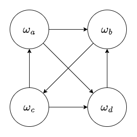

    

        <b style="float: left;">多智能体系统</b>
        <b style="float: right;">人工智能学院</b>
    

    <h1 style="text-align: center;">Homework 2</h1>
    

        <i>Instructor:</i> 章宗长
        <i>Name:</i> 方盛俊, <i>StudentId:</i> 201300035
    

## 课后作业 4-1

#### (1)

纯策略纳什均衡解: (D, D)

帕累托最优解: (C, D), (D, C), (C, C)

社会福利最优解: (C, C)

#### (2)

纯策略纳什均衡解: (C, D), (D, C)

帕累托最优解: (C, D), (D, C), (C, C)

社会福利最优解: (C, C)

#### (3)

纯策略纳什均衡解: (C, D), (D, C)

帕累托最优解: (C, D), (D, C)

社会福利最优解: (C, D), (D, C)

## 课后作业 4-2

#### (1)

纯策略纳什均衡解: (C, D), (D, C)

帕累托最优解: (C, D), (D, C), (C, C)

社会福利最优解: (C, D), (D, C), (C, C)

#### (2)

纯策略纳什均衡解: 无

帕累托最优解: (D, D), (C, D), (D, C), (C, C)

社会福利最优解: (D, D), (C, D), (D, C), (C, C)

#### (3)

纯策略纳什均衡解: (D, D)

帕累托最优解: (D, D)

社会福利最优解: (D, D)

## 课后作业 4-3

需要看双方程序采取了什么策略, 例如如果双方程序选择的策略都是如果双方程序的代码相同, 则进行合作的话, 则就达成了相互合作的程序均衡解.

深究其原因的话, 是因为可以获取到对方程序的代码, 进而得知获取到对方的出价策略, 以此来选择自己的策略. 因为可以 [使用可证明性逻辑来构建代理程序](https://arxiv.org/abs/1401.5577), 使得可以以一种稳健的方式实现相互合作, 这种合作甚至不需要代理程序的源代码完全相等, 也可以实现不会被利用的相互合作程序均衡解.

## 课后作业 4-4

**多数制:** comedy.

**波达计数:**

计算四种电影类型的最终得分:

$\text{action} = 3 \times 3 + 2 \times 0 + 5 \times 2 + 3 \times 1 = 22$

$\text{comedy} = 3 \times 1 + 2 \times 1 + 5 \times 3 + 3 \times 0 = 20$

$\text{drama} = 3 \times 2 + 2 \times 2 + 5 \times 1 + 3 \times 3 = 24$

$\text{romance} = 3 \times 0 + 2 \times 3 + 5 \times 0 + 3 \times 2 = 12$

因此波达计数结果为 drama.

## 课后作业 4-5

#### (a)

多数图为:

#### (b)

存在导致结果为 $\omega_a$ 的议程:

#### (c)

存在导致结果为 $\omega_c$ 的议程:

#### (d)

康多塞赢家: 对任意议程, 该候选者都是最终赢家.

这个线性序列成对选举中, 不存在康多塞赢家, 因为 (b) 和 (c) 中的两个议程的赢家分别为 $\omega_a$ 和 $\omega_c$, 则不存在唯一最终赢家.

#### (e)

应该将 $\{ \omega_a, \omega_c \} \rightarrow \omega_c$ 改为 $\{ \omega_a, \omega_c \} \rightarrow \omega_a$.

这样一来 $\omega_a$ 无论在何时对上任何一个候选人, 都能获胜, 因此一定是唯一的最终赢家, 即康多塞赢家.

## 课后作业 4-6

$v(\{ a \}) = 0$

$v(\{ c \}) = 4$

$v(\{ a, b \}) = 6 + 3 + 2 = 11$

$v(\{ b, c \}) = 3 + 4 = 7$

$v(\{ a, b, c \}) = 6 + 3 + 4 = 13$

## 课后作业 4-7

先计算边际贡献:

$\mu_a(\empty) = 12 - 0 = 12$

$\mu_a(\{ b \}) = 60 - 18 = 42$

$\mu_a(\{ c \}) = 72 - 6 = 66$

$\mu_a(\{ b, c \}) = 120 - 48 = 72$

$\mu_b(\empty) = 18 - 0 = 18$

$\mu_b(\{ a \}) = 60 - 12 = 48$

$\mu_b(\{ c \}) = 48 - 6 = 42$

$\mu_b(\{ a, c \}) = 120 - 72 = 48$

$\mu_c(\empty) = 6 - 0 = 6$

$\mu_c(\{ a \}) = 72 - 12 = 60$

$\mu_c(\{ b \}) = 48 - 18 = 30$

$\mu_c(\{ a, b \}) = 120 - 60 = 60$

计算夏普利值:

$\displaystyle sh_{a} = \frac{2 \times 12 + 42 + 66 + 2 \times 72}{3!} = 46$

$\displaystyle sh_{b} = \frac{2 \times 18 + 48 + 42 + 2 \times 48}{3!} = 37$

$\displaystyle sh_{c} = \frac{2 \times 6 + 60 + 30 + 2 \times 60}{3!} = 37$

## 课后作业 4-8

#### (1)

$v(\{ A, B \}) = 2$

$v(\{ C \}) = 5$

$v(\{ A, B, C \}) = 2 + 4 + 5 = 11$

#### (2)

收益分配 $\left<1, 4, 6 \right>$ 在核心中, 因为任何子联盟都无法得到更高的收益.

#### (3)

收益分配 $\left<3, 4, 4 \right>$ 不在核心中, 因为子联盟 $\{ B, C \}$ 可以得到更高的收益分配 $\left<4, 5 \right>$.

## 课后作业 4-9

$v_{\beta_1}(\{ a \}) = 0$

$v_{\beta_1}(\{ a, b \}) = 4$

$v_{\beta_1}(\{ a, b, c \}) = 4$

$v_{\beta_1}(\{ a, b, c, d \}) = 7$

