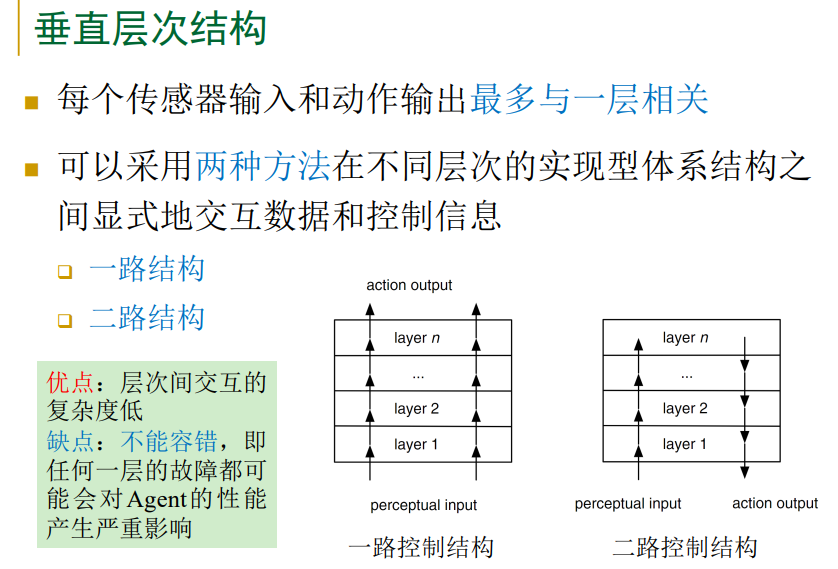
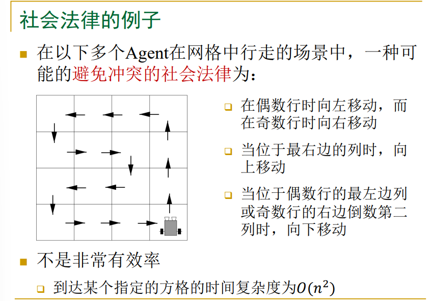
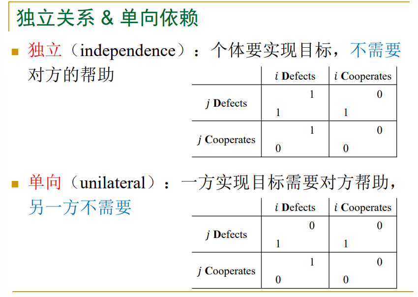

# 多智能体

## 考点

- 10 道简答题 (10 x 6), 4 道应用题 (4 x 10)
- 第一部分不考 (印象中没有这方面的题目)
- 3.4 不考
- 4.7 有点难, 只考概念, 不考具体算法, 不会考大题
- 5.1 和 5.3 不考, 但是 5.2 节的概念可能与 5.1 有关 (**5.2 节是重点**)
- **课堂上 PPT 的例题, 课后作业**

## 第二部分: 智能自治 Agent

### 2.1 智能 Agent

1. Agent 和环境
    - 什么是 Agent
        - **核心概念: 自治性, 有独立行动的能力**
        - Agent 定义: Agent 是处在某个环境中的计算机系统, 该系统有能力在这个环境中自主行动以实现其设计目标. 
        - Agent 在与环境的交互过程中, 决定: 
            - 选择什么 (what) 动作来执行
            - 什么时候 (when) 执行一个动作
        - **可调整的自治性: 当满足某些条件时, 把决策的控制权交给人**
    - 简单的 (无趣的) Agent:
        - 控制系统, 温度控制器, 目标: 保持室内温度, 动作: 加热, 停止加热
        - 软件指示器, UNIX biff 程序, 目标: 监控发给用户的邮件, 动作: 改变屏幕上的图标, 执行一个程序
    - 对象
        - 一个计算实体, 封装了一些状态
        - 可以在这些状态下执行某些动作或者方法
        - 可以通过消息传递进行通信
    - Agent 和对象的区别
        - Agent 是自治的: 
            - Agent 包含有更强的自治性的概念
            - Agent 自己决定是否接受其他 Agent 的请求执行一个动作
            - 自治性不是基本的面向对象模型的组成部分
        - Agent 是灵活的: 
            - 具有反应的 (reactive), 预动的 (pro-active), 社会的 (social) 行为能力
            - 标准的对象模型根本没有这些行为能力
        - Agent 是主动的: 
            - Agent 不是消极的服务提供者
            - 多 Agent 系统本质上是多线程的, 每个 Agent 至少有一个主动控制的线程
    - 专家系统
        - 一类具有专门知识和经验的计算机智能程序系统
        - 模拟人类专家解决领域问题的能力
        - 例子: MYCIN 系统, 可以协助医生处理人类的血液感染问题
        - 专家系统 = 知识库 + 推理机
    - Agent 和专家系统的区别
        - "经典" 的专家系统是与现实分离的:
            - 它们与任何环境没有直接联系, 而是把用户作为"中间人"发生作用
            - 例子: MYCIN 不直接对病人进行操作
        - 专家系统一般不能采取反应式, 预动的行动
        - 专家系统一般没有社会行为能力, 不能进行合作, 协调和协商
        - 有些专家系统看起来很像是 Agent (特别是执行实时控制任务的专家系统) 
    - 环境的分类
        - 完全可观察的与部分可观察的
            - 完全可观察的环境: Agent 的传感器在每个时间点上都能获取环境的完整状态
            - 部分可观察的环境: 传感器有噪声, 不精确, 或丢失了部分状态数据
            - 完全不可观察的环境: 没有传感器
            - 部分可观察环境的例子
                - 只有一个本地灰尘传感器的吸尘 Agent 无法知道另一个方格是否有灰尘
                - 自动驾驶出租车无法了解到别的司机在想什么
        - 单 Agent 与多 Agent
            - 单 Agent 环境: 字谜游戏
            - 合作性的多 Agent 环境: 蚁群系统
            - 竞争性的多 Agent 环境: 国际象棋
            - 既合作又竞争的多 Agent 环境: 机器人足球赛
            - 多 Agent 环境中的 Agent 设计问题往往也单 Agent 环境的相差甚远
                - 通信经常作为理性行为出现在多 Agent 环境中
                - 在一些竞争的环境中, 随机行为是理性的
        - 确定的与随机的
            - 确定的环境: 下一个状态完全取决于当前状态和 Agent 执行的动作
            - 否则, 环境是随机的
            - 如果环境是部分可观察的, 那么它可能表现为随机的
            - "随机" 暗示后果是不确定的并且可以用概率来量化
        - 片段式的与序贯式的
            - 在片段式环境中, Agent 的经历被分成了一个个原子片段
                - 在每个片段中 Agent 感知信息并完成单个行动
                - 下一个片段不依赖于以前的片段中采取的行动
                - 例子: 装配线上检验次品零件
            - 在序贯式环境中, 当前的决策会影响到所有未来的决策
                - 行动会有长期的效果
                - 例子: 下棋, 出租车驾驶
            - 片段式的环境更简单, 因为 Agent 不需要前瞻
        - 静态的与动态的
            - 动态的环境: 环境在 Agent 计算的时候会变化
                - 出租车自动驾驶
            - 否则, 环境是静态的
                - 字谜游戏
            - 半动态的环境: 环境本身不随时间变化而变化, 但是 Agent 的性能评价随时间变化
                - 国际象棋 (比赛的时候要计时) 
        - 连续的与离散的
            - 环境的状态, 时间的处理方式以及 Agent 的感知信息和行动, 都有离散/连续之分
            - 国际象棋环境
                - 状态是有限的
                - 感知信息和行为是离散的
            - 出租车驾驶环境
                - 连续状态和连续时间
                - 驾驶行为也是连续的
2. 智能 Agent 的属性
    - 智能 Agent 应具有能力: 
        - 反应性 (Reactivity) 
        - 预动性 (Proactiveness) 
        - 社会能力 (Social Ability) 
    - 反应性 (Reactivity) 
        - 如果一个程序的环境是固定的, 则程序仅仅盲目地执行就可以了
            - 固定环境的例子: 编译程序
        - 真实世界不同: 大多数环境是动态的 (dynamic) 和信息不完全的 (incomplete) 
        - 构造适用于动态环境的软件是困难的: 程序需要考虑失败的可能性
        - 一个反应式的 (reactive) 系统能与环境持续的交互, 对环境发生的变化以及时的方式做出反应
    - 预动性 (Proactiveness) 
        - 对环境做出反应是容易的
            - 例子: 刺激 → 反应 (规则) 
        - 但是, 我们想 Agent 为我们做事情
            - 因此, 表现出目的引导的行为
        - 预动性 = 通过主动发起动作, 表现出目标引导的行为
            - 识别机会
    - 社会能力 (Social Ability) 
        - 真实世界是一个多 Agent 环境: Agent 在实现自己目标的同时, 不能不考虑其他 Agent 的目标
            - 一些目标只能通过与其他 Agent 交互来达到
            - 多台计算机构成的环境类似: 英特网是一个很好的例子
        - Agent 的社会能力: 通过合作 (cooperation), 协调 (coordination), 协商 (negotiation).其他 Agent (可能是人).互的能力
            - 至少, 包括通信能力
        - 社会能力: 合作 (Cooperation) 
            - 作为一个团队一起工作以达到一个共享的目标
            - 合作经常是由下列事实导致的: 
                - 单一的 Agent 不能达到该目标
                - 合作将获得更好的结果 (比如, 更快达到目标) 
        - 社会能力: 协调 (Coordination) 
            - 如何管理 Agent 活动之间的内部依赖关系
            - 例子: 如果你想使用的资源和我想使用的资源是不能共享的, 则我们需要协调
        - 社会能力: 协商 (Negotiation) 
            - Agent 就共同关心的问题达成一致的能力
            - 例子
                - 屋里有一台电视机, 你想看电影, 你丈夫想看足球
                - 一种可能的约定: 今晚看足球, 明晚看电影
        - 通常涉及出价 (offer), 还价 (counter-offer), 参与者在协商过程中会作出让步
    - 智能 Agent 的其他属性
        - 移动性 (Mobility): 移动能力
            - 例: 软件 Agent 可以在信息网络环境中运动
        - 诚实性 (Veracity): 不会故意发送错误信息
        - 仁慈性 (Benevolence): Agent 之间的目标不会产生冲突, 每个 Agent 总是尽量完成所要求的任务
        - 合理性 (Rationality): 为了实现目标而努力, 不会采取阻碍目标实现的动作, 至少在它的信念中是这样
        - 学习性 (Learning/Adaption): 随时间改进性能
3. 作为意识系统的 Agent
    - 大众心理学 (Folk Psychology) 
        - 当解释人类的行为时, 经常用到下面的句子描述: 
            - Janine 带上了雨伞, 因为她相信将要下雨
            - Michael 努力工作, 因为他想要写完自己的书
        - 这两个句子利用了大众心理学, 说明人类的行为可以通过态度的属性进行预测和解释
            - 例如: 相信, 想要, 希望, 担心等
        - 在大众心理描述中采用的这些属性被称为意识属性
        - 意识立场: 讨论 Agent 系统的一种常用方法
            - 特点: 使用意识属性, 把 Agent 看作意识系统
    - 意识系统
        - 哲学家 Daniel Dennett 创造了意识系统 (Intentional System) 这个术语来描述一些实体
            - 这些实体的行为可以用信念, 愿望和理性敏感等属性预测
        - 不同"层次"的意识系统: 
            - 一阶意识系统有信念和愿望 (等), 但是没有关于信念和愿望的信念和愿望
            - 二阶意识系统更加复杂, 它有关于信念和愿望的信念和愿望
        - 人类在日常推理时一般不会使用超过三层的意识立场层次 (Intentional Stance Hierarchy) 
        - 赋予智能 Agent 以信念和愿望等意识属性是不是合理的 (legitimate) 和有用的 (useful)?
            - 当赋予一台机器的这些意识属性和赋予一个人的这些意识属性具有相同的含义时,  这种表示是合理的
            - 如果这样做有助于理解机器的结构, 机器过去和将来的行为, 或者有助于修理或改进这台机器, 则这种表示是有用的
        - 什么对象可以用意识立场来描述? 
            - 几乎所有的自动控制系统都可以用意识立场描述
            - 对系统的了解越多, 越不需要依赖对其行为意图进行有灵性的解释
        - 然而, 对于非常复杂的系统, 使用物理立场或者设计立场解释系统的行为并不现实
            - 物理立场: 从系统的最初结构开始, 使用物理定理预测系统的行为
            - 设计立场: 根据系统要实现的目标的知识预测系统的行为
        - 意识立场是一种抽象的方法/工具
            - 用它来以简单形式讨论复杂系统, 简单预测和解释系统的行为, 而不需要理解这些系统究竟是如何工作的
4. 设计方法
    - 显式编程
        - 显式地编码告诉 Agent 在各种可能经历的场景下该如何采取行动
            - 直接, 无学习, 基于规则, 在简单问题上有效
        - 当需要提供一个复杂策略时, 会给设计者带来较大的编码负担
    - 监督学习
        - 样例学习的一种
        - 设计者提供一组训练样本: "输入-输出" 对, 学习 Agent 观察这些样本, 学习从输入到输出的映射
        - 广泛用于分类, 回归任务
        - 当用于学习从观察到行动的映射时, 亦称为行为克隆
    - 优化
        - 给定策略空间和性能度量, 在空间中搜索使得性能度量最优的策略, 即最优策略
        - 通过仿真实验评估策略的性能
        - 在运行仿真实验时, 会用到动态模型的知识, 但模型的知识不用于搜索最优策略
        - 当策略空间的维度较低且没有较多的局部最优解时, 有多种优化方法可以大概率找到最优策略
    - 规划
        - 一种形式的优化方法
        - 假设环境的动态模型已知, 将其用于指导搜索
        - 经典规划方法
            - 假设环境是确定的
            - 可高效求解高维任务
        - 概率规划方法
            - 考虑未来的不确定性
    - 强化学习
        - 假设环境的模型未知
        - Agent 通过与环境交互, 从强化信号 (奖赏和惩罚组合的序列) 中学习
        - 设计者提供性能度量, 学习算法优化 Agent 的行为
        - 行动不仅有立即效果, 而且有延迟效果
5. 小结
    - Agent 和环境
        - 自治性, Agent 与对象, 专家系统的异同, 环境的分类
    - 智能 Agent
        - 反应性, 预动性, 社会能力 (合作, 协调, 协商, 通信) 
    - 作为意识系统的 Agent
        - 意识立场 (使用意识属性, 把 Agent 看作意识系统) 
    - 设计方法
        - 显式编程, 监督学习, 优化, 规划, 强化学习
    - 一些应用
        - 游戏, 自动驾驶, 机器人运动控制

### 2.2 智能 Agent 的体系结构

1. 智能 Agent 的抽象体系结构
    - Agent 的结构
        - Agent = 体系结构 + 程序
        - 程序实现的是把感知信息映射到行动的函数
        - 体系结构 (Architecture) 是构造 Agent 的方法论, 研究如何用软件或硬件的方法实现 Agent
        - 一般而言, 体系结构为程序提供来自传感器的感知信息, 运行程序, 并把程序计算出来的行动决策送达执行器
    - Agent 的体系结构 & 抽象体系结构
        - Agent 体系结构的研究内容: 
            - Agent 的内部模块集合如何组织起来
            - 它们的相互作用关系如何
            - Agent 感知到的信息如何影响它的行为和内部状态
            - 如何将这些模块用软件或硬件的方式形成一个有机整体
        - Agent 的抽象体系结构
            - 独立于 Agent 体系结构的具体实现技术
            - 与具体的支撑平台和环境没有任何联系
            - 有助于在一个较高抽象层次上描述和分析构成 Agent 的部件, 部件之间的关系以及不同 Agent 的性质
    - Agent 的抽象体系结构
        - 环境是任何离散的瞬时状态的有限集合 $E = \{ e, e', \ldots \}$
        - Agent 有一个可执行动作的清单, 它们改变环境的状态: (有限的) 动作集合 $Ac = \{ \alpha, \alpha', \ldots \}$
        - Agent 在环境中的一次运行 (run) $r$ 是环境状态与动作交替的一个序列: $r: e_0 \xrightarrow{\alpha_0} e_1 \xrightarrow{\alpha_1} e_2 \xrightarrow{\alpha_2} e_3 \xrightarrow{\alpha_3} \cdots \xrightarrow{\alpha_{u-1}} e_u$
            - $\mathcal{R}$ 是所有可能的 ($E$ 和 $Ac$ 上的) 有限序列集合
            - $\mathcal{R}^{Ac}$ 是以动作结束的序列所组成的的子集
            - $\mathcal{R}^{E}$ 是以状态结束的序列所组成的的子集
            - 用 $r, r', \ldots$ 代表 $\mathcal{R}$ 的成员
        - 环境
            - 状态转移函数表示 Agent 的动作作用于环境的效果 $\tau: \mathcal{R}^{Ac} \to 2^{E}$
            - 假设环境是历史依赖的 (history dependent) 
                - 环境的下一个状态不仅仅是由 Agent 执行的动作和当前的状态决定, 早时 Agent 所做的动作对决定当前状态也起部分作用
            - 环境可以是不确定的 (non-deterministic) 
                - 在某个状态下执行一个动作的结果具有不确定性
            - 如果 $\tau(r) = \empty$  (假设 $r$ 是由一个动作作为结束), 则 $r$ 不存在可能的后继状态 (系统结束 $r$) 
        - 环境, Agent 模型
            - 形式上, 环境 $Env$ 是一个三元组 $Env = \left< E, e_0, \tau \right>$: 
                - $E$ 是环境状态的集合
                - $e_0 \in E$ 是初始状态
                - $\tau$ 是状态转移函数
            - Agent 模型是一个把运行映射到动作的函数 $Ag: \mathcal{R}^{E} \to Ac$
            - Agent 根据到当前为止的历史决定执行什么动作
            - 设 $\mathcal{AG}$ 是所有 Agent 的集合
        - 系统
            - 系统是 Agent 和环境构成的对
            - 任何系统都有与之相关的可能的运行集合
            - $\mathcal{R}(Ag, Env)$ 表示 Agent 在环境 $Env$ 中的运行的集合
            - 假设 $\mathcal{R}(Ag, Env)$ 只包含可以结束的运行
                - 即, 运行 $r$ 不存在可能的后继状态: $\tau(r) = \empty$
            - 形式上, 序列: $(e_0, \alpha_0, e_1, \alpha_1, e_2, \ldots)$ 表示 Agent $Ag$ 在环境 $Env = \left< E, e_0, \tau\right>$ 中的一次运行, 如果: 
            - 两个 Agent ($Ag_1$ 和 $Ag_2$) 对环境 $Env$ 是 **行为等价** 的, 当且仅当 $\mathcal{R}(Ag_1, Env) = \mathcal{R}(Ag_2, Env)$
            - 两个 Agent ($Ag_1$ 和 $Ag_2$) 是 **完全行为等价** 的, 当且仅当它们对所有环境是行为等价的
        - 纯反应式 Agent
            - 决策完全基于当前状态
            - 行动可以表示成函数: $action: E \to Ac$
            - 例如温度控制器
        - 有状态的 Agent
            - Agent 具有内部状态
        - 感知
            - 感知函数 see 代表 Agent 观察环境的能力
            - 函数 see 的输出是一种感知 $see: E \to Per$
                - 实现从环境状态到感知的映射
            - 这些 Agent 有内部数据结构, 一般用来记录环境状态和环境的历史
            - 设 $I$ 是 Agent 的所有内部状态的集合
        - 行动选择函数和下一个状态函数
            - 行动选择函数 action 代表 Agent 的决策过程
            - 函数 action 实现内部状态到动作的映射: $action: I \to Ac$
            - 下一个状态函数 next 实现从内部状态和感知到内部状态的映射: $next: I \times Per \to I$
        - Agent 控制回路
            - $i_0 \to see(\cdots) \to next(\cdots) \to action(\cdots)$
2. 告诉 Agent 要做什么
    - Agent 和任务
        - 建造 Agent 是为了执行任务
        - 我们需要用某种方式详细说明要执行的任务
        - 方式 1: 告诉 Agent 怎么去做
            - 优点: 对 Agent 要做什么没有任何不确定性
            - 缺点: 我们必须自己考虑究竟如何完成这个任务
        - 方式 2: 告诉 Agent 要做什么, 而不告诉它怎么去做
            - 不直接定义任务, 而是使用某种性能度量
            - 任务说明: 使用效用 (Utility), 使用谓词 (Predicate) 
    - 状态的效用函数
        - 效用是表示状态有多 "好" 的数值
            - 效用越高, 状态越好
        - 状态效用函数 (给每一个环境状态一个实数值): $u: E \to \mathbb{R}$
        - 一次运行的全局效用的不同定义方式: 
            - 遇到的最差 (好) 的状态的效用, 所有遇到的状态的平均值/累积值......
            - 缺点: 当给每个状态赋予一个效用后, 很难使用长期的观点
            - 一种可能的方法: 给未来状态的效用乘上折扣
    - 运行的效用函数
        - 不是把效用赋给单个状态, 而是把效用赋给这些状态的运行: $u: \mathcal{R} \to \mathbb{R}$
        - 这种方法使用了长期的观点
        - 效用如何得到呢?
            - 在有些任务中, 比较容易得到, 比如: 瓦片世界
            - 在另外一些任务中, 比较难得到, 用 "要实现的目标" 更方便, 由此提出了用谓词说明任务的方法
    - 期望效用
        - 用 $P(r|Ag, Env)$ 表示把 Agent $Ag$ 放在环境 $Env$ 中出现运行 $r$ 的概率
        - 显然有 $\sum_{r \in \mathcal{R}(Ag, Env)} P(r|Ag, Env) = 1$
        - 则期望效用为 $EU(Ag, Env) = \sum_{r \in \mathcal{R}(Ag, Env)} u(r) P(r|Ag, Env)$
    - 最优 Agent
        - 在环境 $Env$ 中的最优 Agent 是使期望效用最大化的 Agent: $Ag_{opt} = \argmax_{Ag \in \mathcal{AG}} EU(Ag, Env)$
        - 当然, 一个 Agent 是最优的并不意味着它将是最好的; 只是在平均方面, 我们可以期望它是做得最好的
    - 受限的最优 Agent
        - 有些 Agent 不能在一些机器 (计算机) 上实现
        - 用 $\mathcal{AG}_m$ 表示能在机器 $m$ 上实现的 Agent
        - 用 $Ag_{bopt}$ 表示能在机器 $m$ 上实现的受限最优 Agent
    - 使用谓词的任务说明
        - 使用谓词来代替效用函数
        - 如果效用的取值范围是集合 $\{0, 1\}$, 则可以说效用函数 $u: \mathcal{R} \to \mathbb{R}$ 是一个谓词
        - 使用 $\Psi$ 表示谓词说明 $\Psi: \mathcal{R} \to \{ 0, 1 \}$
            - 用 $\Psi(r)$ 表示 $r \in \mathcal{R}$ 满足 $\Psi$
            - 当且仅当 $u(r) = 1$ 时 $\Psi(r)$ 为真
    - 任务环境
        - 一个任务环境是一个 $\left< Env, \Psi \right>$ 对, 其中 $Env$ 是环境, $\Psi$ 是定义在运行上的谓词
        - 用 $\mathcal{TE}$ 表示所有任务环境的集合
        - 一个任务环境说明了
            - Agent 所在的系统的特性
            - 评价 Agent 失败或者成功完成任务的标准
        - 用 $\mathcal{R}_{\Psi}(Ag, Env)$ 表示 Agent $Ag$ 在环境 $Env$ 中满足 $\Psi$ 的所有运行的集合
            - $\mathcal{R}_{\Psi}(Ag, Env) = \{ r | r \in \mathcal{R}(Ag, Env) \land \Psi(r) = 1 \}$
        - 如果有 $\mathcal{R}_{\Psi}(Ag, Env) = \mathcal{R}(Ag, Env)$ 则称 Agent $Ag$ 在任务环境 $\left<Env, \Psi \right>$ 中获得成功
        - 即 Agent 成功的悲观定义: $\forall r \in \mathcal{R}(Ag, Env)$ 都有 $\Psi(r)$
        - 对 Agent 成功的乐观定义: $\forall r \in \mathcal{R}(Ag, Env)$ 都有 $\Psi(r)$
    - 成功概率
        - 如果环境是不确定的, 则 $\tau$ 返回的是一个可能的状态的集合
            - 可以定义这个状态集合的概率分布
        - 用 $P(r|Ag, Env)$ 表示把 Agent $Ag$ 放在环境 $Env$ 中出现运行 $r$ 的概率
        - 则 $Ag$ 在环境 $Env$ 中满足 $\Psi$ 的概率 $P(\Psi|Ag, Env)$ 为 $P(\Psi|Ag, Env) = \sum_{r \in \mathcal{R}_{\Psi}(Ag, Env)} P(r|Ag,Env)$
    - 实现型 & 维护型任务
        - 两种最常见的任务类型是实现型任务和维护型任务
        - 如果能区分环境状态𝐸𝐸的子集 $G$, 使得一旦 $G$ 的一个或多个状态出现在运行 $r$ 中, 就有 $\Psi(r)$ 为真, 则由谓词 $\Psi$ 说明的任务是实现型任务
            - 子集𝐺𝐺的成员被称为目标 (goal) 状态
        - 如果能找到环境状态 $E$ 的子集 $B$, 使得一旦 $B$ 的一个或多个状态出现在运行 $r$ 中, 就有 $\Psi(r)$ 为假, 则由谓词 $\Psi$ 说明的任务是维护型任务
            - 子集 $B$ 的成员被称为失败 (failure) 状态
    - 合成 Agent
        - Agent 合成是自动程序设计问题
            - 目标: 使程序输入任务环境, 并从该任务环境自动产生一个可以在这个环境中取得成功的 Agent
        - Agent 合成算法 `syn` 可以理解成一个函数: $syn: \mathcal{TE} \to (\mathcal{AG} \cup \{ \bot \})$
        - 合成算法是可靠的 (soundness): 如果能返回一个 Agent, 则这个 Agent 在作为输入的任务环境中是成功的
            - 形式化: $syn(\left<Env, \Psi \right>) = Ag$ 则有 $\mathcal{R}(Ag, Env) = \mathcal{R}_{\Psi}(Ag, Env)$
            - 问题: 即使存在成功的 Agent, 仍可能返回 $\bot$
        - 合成算法是完备的 (completeness): 如果存在一个 Agent 在作为输入的任务环境中是成功的, 则保证返回一个 Agent
            - 形式化: $\exists Ag \in \mathcal{AG} \text{ s.t. } \mathcal{R}(Ag, Env) = \mathcal{R}_{\Psi}(Ag, Env)$ 则有 $syn(\left<Env, \Psi \right>) \neq \bot$
            - 问题: 即使存在成功的 Agent, 仍可能返回失败的 Agent
        - 理想情况下, 我们希望得到一个既可靠又完备的合成算法问题
3. 智能 Agent 的实现型体系结构
    - Agent的体系结构
        - 研究内容: 
            - Agent 的内部模块集合如何组织起来
            - 它们的相互作用关系如何
            - Agent 感知到的信息如何影响它的行为和内部状态
            - 如何将这些模块用软件或硬件的方式形成一个有机整体
        - Agent 的抽象体系结构
            - 状态, 动作, 运行, 环境, Agent 模型, 系统
            - 纯反应式 Agent, 有状态的 Agent
        - 如何用计算机系统可以理解和处理的手段来表示 Agent 的状态, 实现构成 Agent 的各个部件?
    - Agent 的实现型体系结构
        - Agent 体系结构的设计和实现要进一步考虑: 
            - 如何给出相应的数据结构来表示 Agent 的内部状态 (如果有的话)? 
            - 如何实现构成 Agent 的各个部件, 并为它们设计相应的实现算法? 
                - 如: 感知部件, 状态转换部件, 动作选择部件等
        - 实现型体系结构 -> 智能 Agent 的类型
            - 知识型体系结构 -> 演绎推理 Agent
            - 思维型体系结构 -> 实用推理 Agent
            - 反应型体系结构 -> 反应式 Agent
            - 混合型体系结构 -> 混合式 Agent
    - 演绎推理 Agent
        - 具有表示 Agent 内部状态的部件
        - 内部状态被定义为 Agent 所拥有的 **知识**
        - 各个知识条目用逻辑语言来表示
            - 命题逻辑: 假设现实世界是由事实构成的
            - 一阶逻辑: 假设现实世界是由事实, 对象, 关系构成的
            - 高阶逻辑: 可以把一阶逻辑中的关系本身也视为对象
        - Agent 的动作选择是一个基于其知识的逻辑演绎或定理证明过程
    - 实用推理 Agent
        - 具有表示 Agent 内部状态的部件
        - 内部状态表现为 Agent 所具有的 **思维状态** (mental state) 
        - Agent 的动作选择是一个针对其内部思维状态的 **实用推理** 过程
        - 实用推理
            - **慎思** 的过程 (deliberation): 想清楚决定做什么样的事
            - **目标手段推理** 的过程 (means-ends reasoning): 根据目标 (想做的事) 来决定实现该目标所需的手段 (需执行的动作) 
    - 反应式 Agent
        - 不具有表示 Agent 内部状态的部件
        - 内部定义了一系列的反应式规则
        - 根据感知到的环境信息, 激发相应的反应式规则来执行
        - Agent 的动作选择是一个从情景 (situation) 到动作的映射
    - 混合式 Agent
        - 在内部集成了多个不同类型的实现型体系结构
        - 组合了多个层次的动作选择部件
        - 不同层次的实现型体系结构或者单独运作或者彼此相互作用
            - 共同对感知到的环境输入做出多种方式的响应
            - 如: 反应式响应, 慎思式响应
        - 在运行时能够表现出多种形式的行为特征
            - 如: 自治性, 反应性, 预动性, 社会性
4. 小结
    - 智能 Agent 的抽象体系结构
        - 状态, 动作, 运行, 环境, Agent 模型, 系统
        - 纯反应式 Agent, 有状态的 Agent
    - 告诉 Agent 要做什么
        - (状态的, 运行的) 效用, 期望效用, 最优 Agent, 受限最优 Agent
        - 谓词说明, 任务环境, 实现型 & 维护型任务
        - Agent 合成算法 (可靠性 & 完备性) 
    - 智能 Agent 的实现型体系结构
        - 知识型 (演绎推理 Agent), 思维型 (实用推理 Agent), 反应型 (反应式 Agent)  , 混合型 (混合式 Agent) 

### 2.3 演绎推理 Agent

1. 作为定理证明器的 Agent
    - 符号 & 演绎推理 Agent
        - 符号推理 Agent: 通过
            - 用 **符号** 表示系统环境和期望的行为
            - 用 **句法规则** 处理这种表示来产生智能行为
        - 演绎推理 Agent
            - 符号表示: 一些逻辑公式
            - 句法规则处理: 逻辑演绎或定理证明
    - 两个关键问题
        - 转换问题: 把现实世界转换成这个世界的准确恰当的符号表示的问题
            - 导出了视觉, 语音理解, 学习等方面的研究
        - 表示和推理问题: 用符号表示信息并且让 Agent 使用这种表示进行处理和推理的问题
            - 导出了知识表示, 自动推理, 自动规划等方面的研究
    - 内部状态的表示
        - 内部状态 $DB$ 是由经典一阶谓词逻辑公式组成的数据库
            - 设 $L$ 是经典一阶谓词逻辑公式集合
            - $D = 2^{L}$ 是数据库 $L$ 的集合
            - $DB$ 是 $D$ 中的一个元素
        - 例如, 一个 Agent 的数据库可能包含下列公式: 
            - $Open(value221)$
            - $Temperature(reactor4726, 321)$
            - $Pressure(tank776, 28)$
    - 各个部件
        - 感知函数 $see: S \to Per$
        - 状态转移函数 $next: D \times Per \to D$
            - 由数据库和感知映射到新的数据库
        - 动作选择函数 $action: D \to Ac$
            - 根据演绎规则定义
            - 演绎规则: 一些简单的逻辑推理规则
    - 动作选择函数的伪代码
        - $DB \vdash_{\rho} \varphi$: 可以从数据库 $DB$ 仅使用演绎规则 $\rho$ 证明公式 $\varphi$
        - 先通过定理证明 $DB \vdash_{\rho} Do(\alpha)$ 的方式试图找到要执行的动作, 找到则返回 $\alpha$
        - 否则再通过定理证明 $DB \not \vdash_{\rho} \lnot Do(\alpha)$ 的方式试图找到不被明确禁止的动作, 找到则返回 $\alpha$
        - 最后什么都没找到则返回 $null$
    - 规则的优先级问题: 当有多条演绎规则可被用于推理时, 如何选择? 
        - 为不同的演绎规则设置不同的优先级, 选择具有更高优先级的演绎规则所产生的动作执行
        - 例: 在真空吸尘器世界中, 为了实现吸尘的设计目标, 把清扫规则的优先级设为最高
    - 动作选择的时效性问题: 当环境在 Agent 演绎推理的过程中发生了变化, 会有怎样的后果? 
        - 选出的动作可能不再是最优动作
        - 基于逻辑的演绎推理 (定理证明): 计算复杂度高
        - 解决办法: 不使用严格的逻辑描述语言和完备的演绎规则集合
2. 面向 Agent 的程序设计
    - 面向 Agent 的程序设计
        - 1990 年, Yoav Shoham 基于计算的社会性观点, 提出了一个新的程序设计风格: 面向 Agent 的程序设计
            - 核心思想: 用意识属性直接对 Agent 进行程序设计
            - 意识属性: 如信念, 愿望, 意图等
        - 采用与人类一样的抽象机制表示复杂系统的特性
        - Agent0: 第一个实现面向 Agent 程序设计风格的语言
    - Agent0
        - Agent0 中的每个 Agent 有 4 部分: 
            - 一组能力集合 (Agent 可以做的事情) 
            - 初始信念集合
            - 初始承诺集合 (Agent 将要做的事情) 
            - 承诺规则集合 (决定 Agent 如何行动的关键部分)
        - 一条承诺规则包含: 
            - 一个消息条件
            - 一个思维状态条件 (mental condition) 
            - 一个动作
        - 当接收到一条消息, 激活一条承诺规则的前提: 
            - 该规则的消息条件与 Agent 接收到的消息匹配
            - 该规则的思维状态条件与 Agent 的信念匹配
        - 如果一条承诺规则被激活, 则 Agent 承诺要做的动作
        - Agent 的动作
            - 私有动作
                - 内部执行的子进程
            - 通信动作
                - 发送消息
        - 消息
            - 请求 (request) 
                - 执行一个动作
            - 取消请求 (non-request) 
                - 阻止执行一个动作
            - 通知 (inform)
                - 传送消息
3. 并发 MetateM & 时序逻辑
    - 并发 MetateM
        - 由 Michael Fisher 开发
        - 基于 **时序逻辑** 的多 Agent 编程语言
    - 时序逻辑
        - 在 **经典逻辑** 的基础上增加了表示事件的时间顺序模态的连接词
        - 命题时序逻辑 = 命题逻辑 + 事件的时间顺序模态
        - 一阶时序逻辑 = 一阶逻辑 + 事件的时间顺序模态
    - 并发 MetateM 系统中的 Agent 是并发执行的实体, 可以通过消息广播互相通信
    - 并发 MetateM Agent 有两个主要部件: 
        - 接口: 定义 Agent 如何与环境 (即其他 Agent) 进行交互
        - 计算引擎: 定义 Agent 如何采取行动
    - 一个 Agent 的接口由 3 个部分组成: 
        - Agent 的标识 (即 Agent 的名字) 
        - 环境命题集: 用来定义 Agent 可以接收的消息的符号集合
        - 组件命题集: 用来定义 Agent 可以发送的消息的符号集合
4. 小结
    - 作为定理证明的 Agent
        - 内部状态 (知识库), 感知函数, 状态转移函数, 演绎规则
        - 动作选择函数是一个基于其知识的定理证明过程
        - 例子: 真空吸尘器世界
        - 问题: 动作选择的时效性, 表达能力, 易用性
    - 面向 Agent 的程序设计
        - 核心思想: 用意识属性直接对 Agent 进行程序设计
        - Agent0: 第一个实现面向 Agent 程序设计风格的语言
    - 并发 MetateM
        - 基于时序逻辑的多 Agent 编程语言
        - 可以用于实现演绎推理 Agent

### 2.4 实用推理 Agent

1. 实用推理 = 慎思过程 + 目标手段推理
    - 什么是实用推理 (practical reasoning)?
        - 实用推理直接通过推理得到动作, 是弄清楚做什么动作的过程: 
        - 将实用推理与理论推理区分: 
            - 理论推理直接导致信念
            - 实用推理直接导致动作
    - 实用推理的组成
        - 人类的实用推理由两个过程组成: 
            - **慎思过程** (deliberation) 
                - 决定要实现的状态
                - 慎思过程的结果是 **意图** (intentions) 
            - **目标手段推理** (means-ends reasoning) 
                - 决定如何实现这些状态
                - 手段-目的推理的结果是 **规划** (plans) 
        - 例子: 大学毕业, 面临重要选择
            - 慎思过程: 决定把哪种职业作为目标的过程
            - 目标手段推理: 决定如何实现这一状态的过程
    - 在实用推理中, 用意图刻画思维状态
        - 未来的意图, 即 Agent 有意图实现将来的某一状态
    - 意图在实用推理中起着重要作用: 
        1. 意图驱动目标手段推理
            - 如果 Agent 形成了一个意图, 它会投入资源来决定如何实现这一意图. 
        2. 意图约束未来慎思
            - Agent 不会接受与当前意图不一致的选择. 
        3. 意图的持续性
            - 没有足够的理由一般不会放弃一个意图. 
        4. 意图与信念密切相关
            - 如果 Agent 形成了一个意图, 那么它相信在合适的条件下, 能实现这个意图. 如果 Agent 有意图实现某个状态, 同时相信不能实现它, 那么它是不理性的. 
        5. 不必想要意图的所有预期副作用
            - 想要看牙医, 不意味着想要痛
        6. 意图有比愿望 (desire) 更强的预动属性
2. 目标手段推理
    - 目标手段推理/规划 (Planning) 
        - 规划是行动方案的设计, 它将实现一些期望的目标
            - 规划器是接受下列输入表示的系统: 
                - 目标, 意图或者任务
                - 当前的环境状态 - Agent 的信念
                - Agent 可以采取的动作
            - 作为输出, 规划算法产生一个规划 (plan) 
        - 本质上, 这就是自动编程 (automatic programming) 
        - 不需要直接告诉系统如何去做! 
            - 让它自己想办法实现目标! 
        - STRIPS 规划器
            - 第一个规划器: Stanford Research Institute Problem Solver
            - 由 Richard Fikes 和 Nils Nilsson 在 1971 年开发, 用在机器人 Shakey 上
            - 两个基本部件
                - 世界模型: 用一阶逻辑的集合表示
                - 动作模式: 描述了规划 Agent 可以执行的所有动作的前提条件和执行效果
    - 规划是什么? 
        - 一系列动作 (列表), 其中变量替换为常量
    - 规划问题的形式化表示
        - 假设 Agent 可以执行固定的一组动作: $Ac = \{ \alpha_1, \ldots, \alpha_n \}$
        - 对动作 $\alpha \in Ac$ 的描述用三元组表示: $\left< P_{\alpha}, D_{\alpha}, A_{\alpha} \right>$ 
            - $P_{\alpha}$: 刻画动作 $\alpha$ 的前提条件
            - $D_{\alpha}$: 刻画通过执行动作 $\alpha$ (删除表) 变为假的事实
            - $A_{\alpha}$: 刻画通过执行动作 $\alpha$ (增加表) 变为真的事实
        - 规划问题可以用三元组表示: 
            - $B_0$: Agent 关于世界的初始状态的信念
            - $Ac$: 动作的集合
            - $I$: 要实现的目标 (或者意图) 
        - 规划 $\pi$ 是一个动作序列: $\pi = (\alpha_1, \ldots, \alpha_n)$
        - 动作会改变世界的状态
        - 理性 Agent 在执行动作后会更新它的信念 $B_0 \xrightarrow{\alpha_1} B_1 \xrightarrow{\alpha_2} \cdots \xrightarrow{\alpha_n} B_n$
    - 规划的有效性
        - 对于问题 $\left<B_0, Ac, I \right>$, 称一个规划 $\pi$ 是可接受的 (acceptable), 当且仅当:
            - 对于所有 $1 \le j \le n, B_{j-1} \models P_{\alpha j}$, 第 $j$ 步的动作 $\alpha_j$ 的前提条件在前一个信念 $B_{j-1}$ 中是可满足的
        - 一个规划 $\pi$ 是正确的 (correct), 当且仅当: 
            - 它是可接受的
            - $B_n \models I$, 即目标在由规划产生的最后的环境状态中
3. 实现一个实用推理 Agent
    - 慎思过程
        - Agent 如何慎思? 
            - 首先尝试了解可以使用的选项 (options) 
            - 在它们之间选择, 并承诺 (commit) 其中一些
        - 选择的选项就是意图
        - 慎思函数可以分解为两个不同的功能组件: 
            - 选项生成 (option generation) 
            - 过滤 (filtering) 
        - 信念/愿望/意图（BDI）模型
    - 承诺策略
        - Agent 用来决定什么时候更新意图和规划的机制
        - Agent 对目标和手段都有承诺
        - 盲目承诺 (也称狂热承诺) 
            - Agent 将一直维持一个意图, 直到它相信这个意图真的已经实现了为止
        - 如何修改呢? 
            - 如果规划有误, 则重新规划
    - 盲目承诺 Agent
        - 对手段和目标都盲目承诺
    - 仅对目标盲目承诺的 Agent
        - 加入了 `sound()`
        - 对手段不再盲目承诺
            - 每执行一个动作后，会修正信念
            - 如果 $\pi$ 不再是正确的规划, 则通过规划算法重新产生新的 $\pi$
        - 对目标 (意图) 仍然盲目承诺
    - 专一承诺 Agent (Single Minded Commitment Agent)
        - 加入了 `succeeded()` 和 `impossible()`
        - 停下来确定意图是否已经实现了或者意图是否已经不可能实现
    - 坦率承诺 Agent (Open Minded Commitment Agent)
        - 在每次 `brf()` 都进行 `options()` 和 `filter()`
        - 专一承诺 Agent 存在的问题: 当前意图可能不再是最佳
        - 在每次执行一个动作后，都会有慎思过程来重新计算意图
    - 使用意图重考虑的 Agent
        - 两难的局面
            - 专一承诺 Agent: 不停下来充分地重新考虑它的意图, 可能这些意图不再是最佳的
            - 坦率承诺 Agent: 不断地重复考虑它的意图, 将会没有足够的时间实现这些意图
        - 加入了 `reconsider()` 决定是否重新考虑意图
        - 两种不同类型的重新考虑策略:
            - 鲁莽的 (bold) Agent: 在当前规划被全部执行以前, 从不停下来重新考虑它们的意图
            - 谨慎的 (cautious) Agent: 在执行每个动作后, 都停下来重新考虑
        - 环境的动态性以世界变化率 $\gamma$ 表示: 在一个Agent控制回路/循环中世界变化的次数
        - 如果 $\gamma$ 低 (世界变化不快), 鲁莽的 Agent 比谨慎的 Agent 做得更好
            - 谨慎的 Agent 要花费时间重新考虑它们的承诺, 而鲁莽的 Agent 则忙于努力实现自己的意图
        - 如果 $\gamma$ 高 (世界变化频繁), 谨慎的 Agent 胜过鲁莽的 Agent
            - 谨慎的 Agent 能够发现意图什么时候消失, 并且能够在偶然的运气和新的机会出现时, 利用它们
    - 以下的伪代码为实用推理 (BDI) Agent 定义了一个控制回路: 
      
    - 具体参数的用途
        - 变量 $B$, $D$ 和 $I$:
            - $B$ 代表 belief, 即 Agent 所持有的信念集合, 包含了 Agent 当前对世界的认知或信念. 
            - $D$ 代表 desire, 即 Agent 的愿望集合, 表示 Agent 希望实现的状态或行为. 
            - $I$ 代表 intention, 即 Agent 当前的意图集合, 表示 Agent 在当前时刻要实现的目标或意图. 
        - 感知 $\rho$: 感知是 Agent 从外部环境中收集信息的方式, $\rho$ 表示感知函数, 用于获取当前时刻 Agent 所处的环境状态. 
        - $brf(…)$ 函数: $B := brf(B, \rho)$ 函数是信念修正函数, 用于更新 Agent 的信念集合. 基于现有的信念集合 $B$ 和感知到的信息 $\rho$, 计算出新的信念集合, 并更新 Agent 的信念集合.
        - $options(…)$ 函数: $D := options(B, I)$ 函数是选项生成函数, 接受 Agent 当前的信念 $B$ 和意图 $I$, 以此为基础产生可能的选项或愿望集合 $D$.
        - $filter(…)$ 函数: $I := filter(B, D, I)$ 函数是过滤函数, 用于从愿望集合 $D$ 中过滤掉 Agent 在当前时刻难以完成的愿望, 进而生成当前的意图集合 $I$, 也即从竞争的选项中做出 "最佳" 的选择, 供 Agent 做出承诺.
        - $plan(…)$ 函数: $\pi := plan(B, I)$ 函数是规划算法, 用于根据 Agent 的信念集合 $B$ 和当前的意图集合 $I$ 生成一个规划 $\pi$, 以实现当前的意图 $I$.
        - $sound(…)$ 函数: $sound(\pi, I, B)$ 函数是一个布尔函数, 代表在给定 $B$ 时, $\pi$ 是实现 $I$ 的正确的规划. 用于判断 Agent 所制定的规划 $\pi$ 是否合理且可行, 以确保 Agent 能够在其执行规划的过程中不会违背其信念集合 $B$ 和意图集合 $I$.
        - $succeeded(…)$ 函数 和 $impossible(…)$ 函数:
            - $succeeded(I, B)$ 函数和 $impossible(I, B)$ 函数是用于判断当前的意图集合 $I$ 是否是已经成功或者是不可能成功的意图集合.
            - $succeeded(I, B)$ 函数判断 Agent 在执行规划 $\pi$ 后是否成功实现了其意图集合 $I$, 如果成功则返回 True, 否则返回 False.
            - $impossible(I, B)$ 函数判断 Agent 是否无法通过任何规划实现其意图集合 $I$, 如果无法实现则返回 True, 否则返回 False.
        - $reconsider(…)$ 函数: $reconsider(I, B)$ 函数是一个布尔函数, 用于在 Agent 执行规划过程中, 根据环境变化改变信念集合 $B$ 的情况下, 思考当前的信念集合 $B$ 和意图集合 $I$ 间的关系, 以判断是否需要调整 Agent 当前的愿望集合 $D$ 和意图集合 $I$. 在其认为需要重新考虑时返回 True, 不需要重新考虑时返回 False.
            - 这个函数是用来解决两难局面的:
                - 专一承诺 Agent：不停下来充分地重新考虑它的意图, 可能这些意图不再是最佳的.
                - 坦率承诺 Agent：不断地重复考虑它的意图, 将会没有足够的时间实现这些意图.
            - 通过引入一个布尔函数 $reconsider$ 决定是否重新考虑意图, 我们就能很好地权衡重复考虑意图与否之间的平衡问题.
4. 过程推理系统
    - 过程推理系统 (Procedure Reasoning System, PRS) 
        - 过程推理系统 (PRS): 由斯坦福大学研究所的 Michael Georgeff 等研发
        - 最早使用 BDI 体系结构来开发软件 Agent 并成功用于各种应用的系统之一
        - 不同版本的 PRS
            - 澳大利亚人工智能研究所的 DMARS
            - 密歇根大学用 C++实现的 PRS 系统 UMPRS
            - 利用 Java 程序设计语言实现的 JAM
    - PRS 系统的结构
        - 采用 BDI 体系结构
        - 拥有一个预先编译好的规划库
            - 规划库拥有一个或者多个规划
            - 这些规划是事先由 Agent 程序员手工构造的
        - 每一个规划有下列元素
            - 目标 - 规划的后件
            - 上下文 - 规划的前件 (前提条件) 
            - 内容 - 规划的 "方法" 部分, 即要执行的动作序列
5. 小结
    - 实用推理 = 慎思过程 + 目标手段推理
        - 实用推理: 直接通过推理得到动作
        - 慎思过程: 决定要实现的状态, 结果是意图集
        - 目标手段推理: 决定如何实现这些状态, 结果是规划
    - 目标手段推理
        - 规划, STRIPS 规划器, 规划问题的形式化表示
        - 例子: 积木世界
    - 实现一个实用推理 Agent
        - BDI 体系结构, 承诺策略, 意图重考虑
    - 过程推理系统
        - 例子: 用 Java 实现的 JAM 系统

### 2.5 反应式 Agent

- 反应式体系结构
    - 用符号/逻辑的方法来构造 Agent 遇到了很多无法解决的问题
        - 主要问题: **Agent 的行为决策基于复杂和耗时的符号推理来完成, 不能确保 Agent 对环境事件作出适时的反应**
    - 这些问题使得一些研究者怀疑并否定了符号/逻辑方法的基本假设, 发展出了反应式的体系结构
        - 代表性的人物:  MIT 的 Rodney Brooks 教授
    - 但是, 反应式 Agent 的研究者没有一个共同宣言, 他们使用不同的技术开展反应式 Agent 的研究
        - 代表性的工作: 归类式 (subsumption) 体系结构
- Brooks的主要观点
    - 智能行为无需明确使用符号 AI 建议的那类表示方法就能够产生
    - 智能行为无需使用符号 AI 建议的那类精确的抽象推理就能够产生
    - 智能是某种复杂系统自然产生的属性
- 指导 Brooks 研究的关键思想
    - 情景和实际 (situatedness & embodiment) 
        - "真正" 的智能存在于现实世界中, 而不是在诸如定理证明器和专家系统这样无形的系统中
    - 智能和出现 (intelligence & emergence) 
        - "智能的" 行为是 Agent 和它所处的环境交互作用的结果
        - 智能是在 "旁观者的眼睛里", 不是先天, 孤立的属性
    - 这些思想已凝结在归类式体系结构中
        - Brooks 据此构造了多个 Agent (如 Genghis) 
- 归类式体系结构的特点
    - Agent 做决策, 通过一个完成任务的行为集合实现
        - 每一种行为都被看成一个动作选择函数
            - 动作选择函数把感知输入映射成要执行的动作
        - 每个行动模块都力图完成一些特定任务
            - 在 Brooks 的实现中, 行动模块都是有限状态机
        - 假设这些完成任务的模块不包括复杂的符号表示方式, 并假定不做任何符号推理
        - 在很多实现中, 这些行为都是按照规则形式实现的: 情景 (situation) ⟶动作 (action) 
    - 很多行为可以同时 "触发"
        - 把行动模块组织成归类式等级 (层次结构) 
        - 等级结构中的低层可以抑制高层, 层次越低, 优先权越高
        - 例: 希望移动机器人有躲避障碍的行为, 要给躲避障碍物赋予一个高的优先级
    - 通过一个完成任务的行为集合做决策
        - 每个行动模块都力图完成一些特定任务
    - 很多行为可以同时 "触发"
        - 可以通过归类式层次结构由简单组件得到复杂的行为
- 反应式 Agent 的优点 & 局限性
    - 优点: 原理简单, 易理解, 易计算, 易实现 ...
    - 局限性
        - 在局部环境中一定要有充分的可用的信息来决定一个可以接受的动作
        - 按照局部信息做决策------天生的"短视"
        - 从工程上实现反应式 Agent 以完成特定的任务非常困难
        - 虽然只要少量的行为就可以生成有效的 Agent, 但是要构造一个包含很多层的 Agent 十分困难

### 2.6 混合式 Agent

- 混合式体系结构
    - 很多研究者认为, 完全慎思式的或完全反应式的方法都不适合构建 Agent
    - 他们建议使用混合式体系结构, 使得 Agent 具有反应行为能力和预动行为能力
    - 用至少两个子系统来构建一个 Agent: 
        - 慎思式子系统: 包含一个符号世界模型和一些规划, 并使用符号 AI 的方式做决策
        - 反应式子系统: 能对不需要复杂推理的事件做出反应
    - 通常, 相比慎思式子系统, 反应式子系统的优先级更高
    - 各个子系统被排列成层次间相互交互的等级结构
    - 根据不同层次的实现型体系结构之间的相关性和组织方式的差异, 分成两种集成方式
        - 水平层次结构, 代表性的例子: Touring 机
        - 垂直层次结构, 代表性的例子: InteRRaP
- 小结
    - 反应式 Agent
        - Brooks 的主要观点, 指导其研究的关键思想
        - 归类式体系结构
            - 通过一个完成任务的行为集合做决策
            - 很多行为可以同时"触发"
        - Steels 的火星探索者系统
    - 混合式 Agent
        - 具有反应行为能力和预动行为能力
        - 用至少两个子系统来构建 Agent: 反应式和慎思式
        - 两种集成不同层次的实现型体系结构的方式
            - 水平层次结构, 代表性的例子: Touring 机
            - 垂直层次结构, 代表性的例子: InteRRaP

## 第三部分: 通信与合作

### 3.1 相互理解的 Agent

1. 本体论 (Ontology) 基础
    - 什么是本体 (Ontology)
        - 来源: 哲学中的本体论
            - 探讨存在本身, 即一切现实事物的基本特征
            - 是形而上学的基本分支
        - 信息科学中: 结构化的术语集
            - 特定领域中存在的对象类型或概念及其属性和相互关系
            - 应用领域: 
                - 语义网
                - 软件工程
                - 图书馆学
    - 多 Agent 系统为什么需要本体论? 
        - 如果 Agent 需要通信, 他们的通信内容就必须遵守相同的"术语"
        - 本体提供了一种特殊类型的术语集, 具有结构化的特点
    - 本体描述层次
        - 按照可复用性从低到高将本体划分为三个层次
            - 应用本体
            - 领域本体
            - 上层本体
        - 一个本体越具体, 它的可复用性就越低
2. 本体描述语言
    - XML - 可扩展标记语言
        - XML (eXtensible Markup Language) 
            - 本身不是为本体而设计, 但能够定义一些简单的本体
        - XML 的设计旨在扩展 HTML 语言格式
            - HTML: 缺少语义标记
            - 能够定义新的标记标签, 而并非一定需要遵循 HTML 中的固定格式
    - KIF - 知识交换格式 (Knowledge Interchange Format) 语言
        - KIF 最初开发的目的是作为特定领域的公共语言
            - 表示消息的内容, 而非是消息本身
        - KIF 严格基于一阶逻辑
        - 使用 KIF, Agent 可以表示
            - 一个领域中事物的性质
                - 例: Michael 是一个素食主义者
            - 一个领域中事物之间的关系
                - 例: Michael 和 Janine 结婚了
            - 一个领域中的一般性质
                - 例: 每个人都有母亲
    - 构建本体
        - 构建本体的步骤
            - 尽管我们可以用不同的描述语言来定义本体, 但在构建一个本体时, 我们可以遵守 [Noy and McGuinness, 2004] 提出的方法论, 分为 7 个步骤: 
                - 确定领域和范围
                - 考虑复用
                - 列举关键术语
                - 定义类和类的层次结构
                - 定义属性
                - 定义属性上的约束
                - 创建实例
            - 确定领域和范围
                - 在开发软件时, 要理解用户有哪些需求
                - 在开发本体时, 我们也要回答类似的问题: 
                    - 我设计的本体涵盖哪个领域? 
                    - 我设计的本体用来回答什么问题? 
                    - 怎样使用这个本体? 
    - 考虑复用
        - 复用在本体开发中是极其重要的, 许多预定义好的本体能够简化我们的实现
        - 一些已公开的本体实例
            - 氨基酸本体: 关于氨基酸及其性质的小型本体
            - 基本形式化本体: 为科学技术研究工作提供支持的形式化上层本体
            - 细胞周期本体: 用于表达细胞周期的应用本体
    - 列举关键术语
        - 可以通过 "头脑风暴", 简单地将与所开发本体的领域关联的术语先列举出来, 然后筛选出与需求相关的概念和名词
    - 定义类和类的层次结构
        - 根据对领域知识的理解, 定义类和类的层次结构
        - 在定义类时, 要规避一些常见错误: 
            - 不要混淆类和属性
                - 例: "人" 和 "年龄" 应当分别是类和属性, 而不是两个类
            - 不要定义琐碎的类
                - 例: 定义一个类为 "有黑色头发和蓝色眼睛的人" 是不合理的
        - 类的定义应当是有层次的, 可遵循自顶向下或者自底向上的逻辑
    - 定义属性
        - 一个类可以具有以下形式的属性
            - 固有属性
                - 与类的本质相关的属性, 如人的身高, 体重等
            - 外在属性
                - 能够关联到一个物体上的具体属性, 如名字, 身份号码等等
            - 组件
                - 如果一个物体是结构化的, 那么就适于使用组件表示
            - 关系
                - 例: 一个 "作者" 关系应当连接到两个类 "作品" 与 "人"
    - 定义属性约束
        - 一个类的每个属性可能有不同的约束条件: 
            - 势约束 (cardinality constraints) 
                - 如一个人只有一个出生日期
            - 类别约束 (type constraints) 
                - 如一个人的年龄是一个正整数
            - 范围约束 (range constraints) 
                - 如一个类 "人" 拥有 "母亲" 属性, 那么该属性的类型不应当是 "人", 而是范围更小的"女人"
            - 领域约束 (domain constraints) 
                - 如属性 "作者" 对于类 "电影" 而言是不合适的
    - 创建实例
        - 尽量选择具体的类
        - 例: 《银河系漫游指南》是一本科幻小说, 我们就应当令其为"科幻小说"类的实例, 而非创建为"小说"的实例
3. 小结
    - 本体论基础
        - 本体: 结构化的术语集
        - 对于多 Agent 系统, 本体提供了 Agent 相互理解的基础
        - 本体表示方法
        - 本体描述层次
    - 本体描述语言
        - XML, OWL, KIF
    - 如何构建本体
        - 遵循构建本体的方法论 (7 个步骤) 

### 3.2 通信

- 小结
    - 言语行为
        - 传达某种交互的意图和内容
        - 影响其他 Agent 的内部状态以及相应的行为实施
    - 言语行为理论
        - 把通信建模成可以改变通信参与者的思维状态的动作
        - 三分说, 主要类型, 基于规划的言语行为理论等
    - 通信方式
        - 消息, 黑板, 邮箱
        - 消息传递
            - 参与交互的 Agent (主体) 之间需要建立某种通信通道, 并基于该通信通道进行消息传递
                - 例: 基于 TCP/IP 协议的消息传递
            - 一旦 Agent 间建立了通信通道, 那么处于通信通道中的 Agent 就可以进行双向, 对等的通信
            - 该通信方式具有较好的保密性和实用性
                - 通信通道归属于参与交互的双方 Agent, 不能为其他 Agent 共享
        - 黑板
            - 在现实世界, 人们通常借助于黑板通信方式进行各种各样的交流
                - 参与通信的 Agent 共享一个公共的区域
            - 无须建立通信通道, Agent 之间的消息交互通过一个公共共享区域来完成
            - 该通信方式的保密性较差, 实时性不如消息传递
        - 邮箱
            - 参与通信的 Agent 都有自己的邮箱并且它们之间需要建立起邮箱通道
            - 一般情况下, 这些邮箱通道可以为多个 Agent 之间的消息传输所共有, 而不是由某些 Agent 独占
            - 一个 Agent 欲向另一个 Agent 发送消息时, 可将消息打包成邮件, 并通过邮件通道发送到对方的邮箱中
            - 该通信方式的保密性一般, 实时性较差
    - Agent 通信语言
        - KQML, FIPA ACL
        - FIPA ACL 与 KQML 的最重要区别在于它们提供的语用词

### 3.3 合作

1. 合作分布式问题求解
    - 合作分布式问题求解 (Cooperative Distributed Problem Solving, CDPS)
        - CDPS 研究问题求解器的松耦合网络如何能合作求解问题, 这些问题超出了个体能力的范围. 网络中每个问题求解器具有复杂问题求解的能力并可以独立工作, 但是在没有合作时, 这些求解器不可能完成所面临的问题. 合作是必需的, 因为没有一个求解器具有问题求解所需的足够专长, 资源和信息, 并且不同的求解器具有求解问题不同部分的专长.
    - 仁慈的 (Benevolent) Agent
        - 如果系统中所有的 Agent 是由同一个组织或个体拥有时, 可以设计这些 Agent 随时可以互帮互助
        - 在这种情况下, 可以假设 Agent 是仁慈的, 它们共享一个共同的目标且不存在潜在的冲突性
        - **仁慈系统中的问题求解即是 CDPS**
        - 仁慈假设能极大地简化设计者的任务
    - 自利的 (Self-interested) Agent
        - 通常情况下, Agent 代表着不同的个体或组织, 我们就不能做出仁慈性假设
        - Agent 会根据自己的利益采取行动, 而且有可能导致别的 Agent 的利益损失
        - 潜在冲突性
        - 这种情况有可能极大地复杂化任务设计
        - 尽管 Agent 之间存在潜在的利益冲突, 但最终会像人类社会一样, 为了实现各自的目标进行合作
    - CDPS 与并行问题求解的区别
        - 并行问题求解简单地包括问题求解中并行机制的研究
        - 在并行问题求解中, 计算部件是简单的处理器, 通常假设这些处理器是同构的, 没有不同的专长
    - 一致性 (Coherence) 
        - 这是用来评价一个基于 Agent 的系统的标准
        - 一致性: 根据某些衡量标准, 多 Agent 系统构成的一个整体的表现有多好 (Bond and Gasser, 1988)
        - 我们可以依据解的质量, 资源利用效率, 操作的概念清晰度等方面进行一致性的度量
    - 协调性 (Coordination) 
        - 协调性: Agent 能避免"外来"活动 (如: 同步和调整等活动) 影响的程度(Bond and Gasser, 1988)
        - 在一个完全协调的系统中, 在努力实现共同目标的过程中, Agent 不会阻碍到别的 Agent 的行动; 它们也不必进行明显的通信, 因为可以通过维护各自的内部模型来进行相互预测. 
    - CDPS中的主要问题
        - 如何将问题分解为能在 Agent 之间分配的子任务?
        - 如何有效地将子问题的解综合为问题的解?
        - 如何进行 Agent 问题求解活动的整体优化, 以产生一个最大程度上符合某些一致性度量的解?
        - 使用什么样的技术来协调 Agent 的活动, 以避免发生破坏性 (且无用) 的相互影响, 并优化系统效率 (通过利用任何积极的相互影响)?
2.  任务共享和结果共享
    - CDPS 的三个阶段
        - 一组 Agent 如何合作求解问题? 
        - 将 CDPS 过程分成以下三个阶段: 
            - 问题分解
            - 子问题求解
            - 解综合
    - 任务共享和结果共享
        - 在三个阶段的 CDPS 框架中, 有两个活动可能在合作中出现: 
        - 任务共享: 一个任务的各个部分被分配给不同的 Agent 如何决定如何分配? 
        - 结果共享: 信息 (如部分结果) 被分配我们如何从部分合成一个完整解? 
    - 合同网
        - 合同网 (Contract Net, CNET) 协议是通过任务共享实现有效合作的高级协议
        - 合同网包含五个阶段: 
        - 识别: 在这个阶段, Agent 识别出需要别的 Agent 帮助的任务
        - 通知:
            - 在这个阶段, 有这个任务的 Agent 发出一个通知,  这个通知里包含了这个任务的明细单
            - 明细单必须记录
                - 对任务本身的描述
                - 约束条件
                    - 如截止日期, 解的质量要求
                - 元任务信息
                    - 如 "投标必须由......来提交"
            - 然后将这个通知广播出去
        - 竞标
            - 接收到通知的 Agent 决定是否想要竞标
            - 考虑因素: 
                - 自己是否有能力完成任务
                - 质量约束和价格等信息
            - 如果选择竞标, 那么 Agent 就投标
        - 授予
            - 发出通知的 Agent 必须在投标的 Agent 中间选出 "授予合同" 的对象
            - 选择的结果需要通知给投标的 Agent
            - 竞标成功的 Agent, 即任务承包商, 负责完成相应的任务
        - 实现
            - 实施过程中可能生成进一步的 "经理-承包商" 关系
            - 子合同: 可能包含另一个合同网
        - 
    - 结果共享
        - 在结果共享中, Agent 之间在共同合作求解时, 互相给予信息
        - 结果共享在以下几个方面有利于问题求解: 
            - 信心 (Confidence): 独立来源的解可以进行交叉检查, 揭示可能存在的错误和增加对整体解的信心
            - 完整性 (Completeness): 通过局部解视图的共享, 得到一个更好的, 整体的解视图
            - 精确度 (Precision): 共享的结果可以提升解的精确度
            - 及时性 (Timeliness): 共享结果使得在某些情况下可以动用并行资源求解
    - 结果共享的一些例子
        - 黑板系统
            - 通过共享的数据结构 (黑板) 实现结果共享
            - 多个 Agent 可以读取黑板上的数据
            - 多个 Agent 可以向黑板写数据 (一部分解) 
        - 订阅/通知模式
            - 一个对象订阅另一个对象
                - 当事件 $e$ 发生的时候, 告诉我
            - 信息以预动的方式在对象间共享
3. 不一致性
    - 出现不一致性的原因
        - 一组 Agent 可能在以下两个方面产生不一致性: 
            - 信念
            - 目标/意图
        - 产生不一致信念的原因
            - Agent 不能看到全局信息
            - Agent 拥有的传感器有毛病, 或者 Agent 访问的信息源也可能有毛病
        - 产生不一致目标的原因
            - Agent 是自治的, 没有共享的目标
    - 处理不一致性的方法: 三种可能的方法
        - 不允许出现
            - 例: 在合同网中, 任务共享总是由管理者 Agent 来驱动
        - 通过协商解决不一致性
            - Agent 之间通过协商, 讨论不一致的信息和目标直至不一致性消除
        - 建立一个不一致性出现后能平稳退化的系统
            - 三种方法中最理想的
4. 协调
    - 协调
        - 协调问题: 如何管理 Agent 活动 (activity) 之间的内部依赖关系? 
        - 如果 Agent 参加的活动中存在任何形式的相互作用, 那么一定的协调机制是必需的
        - 例: 
            - 你和我都打算离开房间, 并且我们各自同时向门走去, 而门只允许我们一个人走过去, 如何保证我们俩都可以走过门? 
            - 我们同时来到打印室要复印一叠材料, 谁先使用复印机? 
    - 协调关系的分类
        - 活动之间的依赖关系分为积极的, 消极的
        - 积极的关系
            - 使用它能使至少一个 Agent 获益
        - 请求的
            - 我显式地请求你对我的活动给予帮助
        - 非请求的
            - 由于这样合作的出现, 至少一个 Agent 可以获得更好的解, 同时也不会对其他 Agent 产生坏的影响
    - 非请求的协调关系
        - 行动平等 (Action Equality) 关系: 
            - 我们都打算去执行一个相同的动作, 并且相互认识到这一点, 这样我们中的一个能独立去执行动作, 节省另一个人的努力
        - 后承 (Consequence) 关系: 
            - 我规划中的动作的执行可以致使你的某个目标的完成, 这是我的动作的附加作用, 消除了你去完成该目标的需要
        - 恩惠 (Favour) 关系: 
            - 我规划中的部分有这样的附加作用, 其执行会对你的一个目标的实现产生贡献, 使得该目标的实现更容易
    - 动态协调活动的方法
        - 通过部分全局规划的协调
        - 通过联合意图的协调
        - 通过互相建模的协调
        - 通过规范和社会法律的协调
        - 通过多 Agent 规划的协调
    - 通过部分全局规划的协调
        - 主要原理: 在问题求解过程中, 合作的 Agent 需要交换信息来达成一致
        - 部分全局规划: 将一组 Agent 的动作和相互作用结合在一起形成的数据结构
        - 该结构是通过 Agent 之间交换信息而合作生成的. 它包含如下基本的属性: 
            - 目的
            - 活动图
            - 解的结构图
        - 规划是部分的
            - 系统不能产生整个问题的规划
        - 规划是全局的
            - Agent 可以通过局部规划的交换和合作, 得到问题求解的全局视图, 进而形成全局规划
        - 该协调方法包含 3 个迭代的阶段: 
            - 每个 Agent 决定自己的目标, 并且为实现目标产生短期的规划
            - Agent 之间通过信息交换, 获知其他 Agent 的规划和目标
            - 为了更好协调它们各自的动作, Agent 要修改局部的规划
        - 广义的部分全局规划: 利用了如下的 5 种协调活动技术, 扩展和完善了基于部分全局规划的协调机制: 
            - 非局部观点的更新
            - 结果的沟通
            - 简单冗余的处理
            - 硬协调关系的处理: "消极的"
            - 软协调关系的处理: "积极的"
    - 通过联合意图的协调
        - 就像每个人有个人的意图，一个团队有联合意图
        - 联合持续目标: 当一组 Agent 从事合作活动时, 它们必须有一个对整体目标的联合承诺, 以及分配给自己的具体任务的个体承诺
        - 一组 Agent 有一个实现某目标 $\varphi$ 的联合承诺
            - 例: $\varphi$ 可能是 "移动这个沙发"
        - 也有目标的动机 $\psi$
            - 例: $\psi$ 可能是"西蒙想要移动这个沙发"
        - 具有联合持续目标的 Agent 队的思维状态: 
            - 开始: 每个 Agent 不相信 $\varphi$ 已经达成, 但相信是可能的
            - 每个 Agent $i$ 有目标 $\varphi$ 直到结束条件满足
        - 结束条件是以下的任一个条件被互相相信: 
            - 目标 $\varphi$ 已经满足
            - 目标 $\varphi$ 是不可能的
            - 目标的动机/理由 $\varphi$ 不再存在
        - 如果结束条件没满足, 那么: 
            - 如果任何 Agent 𝑖𝑖相信目标被实现, 那么它将有一个让该信息成为互相信念的目标, 并且保持该目标直到结束条件满足
            - 如果任何 Agent 𝑖𝑖相信目标是不可能的, 那么它将有一个让该信息成为互相信念的目标, 并且保持该目标直到结束条件满足
            - 如果任何 Agent 𝑖𝑖相信目标的动机𝜓𝜓不再存在, 那么它将有一个让该信息成为互相信念的目标, 并且保持该目标直到结束条件满足
            - 这个机制保证了 Agent 之间的活动是协调的
    - 基于队工作的 CDPS 模型
        - 基于队工作的协调模型, 模型分 4 个阶段: 
            - 识别
                - Agent 认识到合作动作对其达成目标的潜力
            - 队形成
                - 这个阶段的结果是, 队伍中 Agent 对实现的目标达成一致, 但还未就实现方法达成一致
            - 规划形成
                - 在这个阶段, Agent 就应该执行什么活动的过程达成一致
            - 队活动
                - 在这个阶段, Agent 执行新的达成一致的联合活动的规划, 并维持编织完全紧密的关
    - 通过互相建模的协调
        - MACE 系统的熟人模型
        - 熟人模型是对其他 Agent 的表示
            - 其他 Agent 的技能, 兴趣, 能力, 喜好等
        - Agent 对熟人的如下信息进行维护: 
            - 类: 用来组织 Agent, 并通过类名识别类
            - 名字: 每个 Agent 分配一个名字
            - 角色: Agent 在类中扮演的成分
            - 技能: Agent 知道的, 被建模的 Agent 的能力
            - 目标: Agent 知道的, 被建模的 Agent 打算实现的目标
            - 规划: 该 Agent 观点下, 被建模的 Agent 实现目标的方法
    - 通过规范和社会法律的协调
        - 在社会过程中, 协议扮演关键的角色
        - 在 Agent 社会中, 制订协议的方法
            - 离线设计
            - 系统内产生
        - 离线设计
            - 约束是一个二元组 $(E', \alpha)$
            - 这个约束是说, 如果 Agent 处在某种 $E'$ 中的某个状态, 那么动作 $\alpha$ 是被禁止的
            - 社会法律就是这些约束的集合 $sl$
            - 定义一个焦点状态集合 $F \subseteq E$, 这些状态是合法的, Agent 总是能访问它们
            - 一个有用的社会法律不会阻止 Agent 从一个焦点状态转移到另一个焦点状态
            - 有用的社会法律问题 (NP-完全问题) 
                - 给定一个环境 $Env = \left<E, \tau, e_0 \right>$ 和焦点状态集合 $F \subseteq E$, 如果存在就寻求有用的社会法律, 否则通告不存在这样的法律
        - 系统内产生
            - 我们也可以设计社会法律在其中自行产生的系统
            - T 恤衫游戏: 每个 Agent 有两件 T 恤衫: 一件红色, 一件蓝色. 游戏的目标是所有的 Agent 最后穿上相同颜色的 T 恤衫. 每一轮, 每个 Agent 和其他的一个 Agent 随机组成一队,  每队 Agent 查看对方的颜色并决定是否更换衣服. 这一轮中 Agent 只能看到对方的 T 恤颜色, 没有其他信息. 
            - Agent 只能使用所存储的前几轮的经验来做出决策
                - 是换一件 T 恤衫还是继续穿现在的? 
            - 策略更新函数
                - 表示从 Agent 至今所观察的历史信息到颜色的映射
                - 通过使用该函数, 能使 Agent 社会的每个 Agent 尽可能有效地达成全局的一致
            - 不同的策略更新函数
                - 简单从众
                    - 总是选择出现次数最多的那种颜色的 T 恤衫
                - 根据 Agent 类型的简单从众
                    - 将 Agent 分为两类, 如果 Agent 和自己同类型的 Agent 相遇, 则通过通信来交换各自的记忆历史, 否则简单从众
                - 最高的累积奖赏
                    - Agent 根据所看到的其他 Agent (所有 Agent 的某一子集) 成功配色的频率, 选择最多配对的颜色
    - 通过多 Agent 规划的协调
        - 多 Agent 规划
            - 必须考虑 Agent 的活动之间存在相互作用的事实, 直接规划所有 Agent 要做些什么
            - 集中式规划, 分布式规划
        - 分布式规划
            - 输入问题的模型表示, 通过算法输出 Agent 所能执行的动作序列
            - 规划过程不一定是分布式的, 但要求 Agent 能够分布式地执行规划的结果
            - Agent 之间是相互独立的, 它们获得的信息也是相互独立的
                - 每个 Agent 只能观察到世界状态的某个局部
5. 小结
    - 合作分布式问题求解 (CDPS) 
        - 仁慈性, 自利性, 一致性, 协调性
        - 与并行问题求解的区别, 研究的主要问题
    - 任务共享和结果共享
        - CDPS 的三个阶段: 问题分解, 子问题求解, 解综合
        - 任务共享: 合同网
        - 结果共享: 黑板系统, 订阅/通知模式
    - 不一致性
    - 协调
        - 通过部分全局规划的协调
        - 通过联合意图的协调
        - 通过互相建模的协调
        - 通过规范和社会法律的协调
        - 通过多 Agent 规划的协调

## 第四部分: 多 Agent 决策

### 4.1 多 Agent 交互

- 多 Agent 交互
    - 一个多 Agent 系统包含一些 Agent: 
    - 通过通信相互交互
    - 可以在环境中动作
    - 有不同的 "作用范围"
        - 可以控制, 至少是影响环境的不同部分
    - 影响的范围可能重叠
        - 产生 Agent 间的依赖关系
        - 如: 两个 Agent 都可以通过一道门, 但不能同时通过
    - 其他关系
        - 如: "权力" 关系
    - 本节最重要的内容: 理解发生在这些 Agent 之间的交互类型
- 效用和偏好
    - 效用函数定义
        - Agent: $Ag = \{ i, j \}$
        - 结果: $\Omega = \{ \omega_1, \omega_2, \ldots  \}$
        - 效用函数: $u_i: \Omega \to \mathbb{R}, u_j: \Omega \to \mathbb{R}$
    - 偏好
        - 效用函数使得结果能够进行比较
            - 偏好关系: $u_i(\omega) \ge u_i(\omega') \iff \omega \succeq_{i} \omega'$
            - 严格偏好关系: $u_i(\omega) > u_i(\omega') \iff \omega \succ_{i} \omega'$
        - 性质: 偏好关系是全序关系
            - 自反性: $\omega \succeq_{i} \omega$
            - 传递性: 如果 $\omega_1 \succeq_{i} \omega_2$ 和 $\omega_2 \succeq_{i} \omega_3$, 则 $\omega_1 \succeq_{i} \omega_3$
            - 完全性: 对于任意 $\omega_1, \omega_2 \in \Omega$, 有 $\omega_1 \succeq_{i} \omega_2$ 或 $\omega_2 \succeq_{i} \omega_1$
        - 很多时候, 人们并不关心结果的具体效用是多少,  只关心偏好
- 多 Agent 相遇
    - 环境
        - Agent: $Ag = \{ i, j \}$
        - 动作: $Ac = \{ C, D \}$
            - $C$: 合作 (cooperate), $D$: 不合作 (defect)
        - 结果: $\Omega = \{ \omega_1, \omega_2, \cdots \}$
        - 状态转移函数 $\tau$: $Ac \times Ac \to \Omega$
        - 
    - 收益矩阵 (Pay-off Matrix)
        - 正则形式的博弈: 采用这种矩阵形式表示的博弈
        - 
- 解的概念和性质
    - 最优反应
        - $s_i$: Agent $i$ 的策略
        - $s_{i:n}$: 所有 $n$ 个 Agent 的策略组合
        - $s_{-i}$: 所有 Agent 中除去 Agent $i$ 的策略组合
        - $U_i(s_{1:n})$ 或 $U_i(s_i, s_{-i})$: 给定一个策略组合 $s_{1:n}$, Agent $i$ 的效用
        - Agent $i$ 对策略组合 $s_{-i}$ 的一个最优反应是策略 $s_i^{*}$ 满足 $U_i(s_i^{*}, s_{-i}) \ge U_i(s_i^{*}, s_{-i}), \forall s_i$
        - 一般地, 给定 $s_{-i}$, 可以有多个不同最优反应
    - 优势策略
        - 在一些博弈中, 存在一个 $s_i$, 它是所有可能 $s_{-i}$ 的一个最优反应, 称 $s_i$ 为一个 **优势策略** (dominant strategy) 
        - 当所有 Agent 都使用优势策略, 称它们的组合为优势策略均衡 (dominant strategy equilibrium)
        - 优势策略让决策变得非常简单
        - 优势策略不一定存在
        - 
    - 纳什均衡
        - 策略 $s_i$ 和 $s_j$ 处在纳什均衡, 当且仅当
            - 当 Agent $i$ 采取策略 $s_i$ , Agent $j$ 没有比 $s_j$ 更好的策略
            - 当 Agent $j$ 采取策略 $s_j$ , Agent $i$ 没有比 $s_i$ 更好的策略
        - 或者说, Agent $i$ 和 Agent $j$ 的策略 $s_i$ ,  $s_j$ 互为最优反应
        - 当策略 $s_i$, $s_j$ 处在纳什均衡时, Agent 没有动力来改变原来的策略, 因此非常稳定
        - 即使博弈问题没有优势策略, 但还是可能存在纳什均衡
        - 一个 Agent 的策略 (strategy) 分为: 
            - 纯策略: 行动的选择是确定性的
                - 如: 以 1 的概率选择不合作
            - 混合策略: 行动的选择是概率性的
                - 如: [不合作: 0.7; 合作: 0.3]
            - 纯策略是混合策略的一种特殊情形
        - 两个重要的结论: 
            - 并不是每个交互的情形都有纯策略的纳什均衡
                - 在石头-剪子-布博弈中, 纯策略的纳什均衡不存在
            - 有些交互的情形有一个以上的纯策略的纳什均衡
                - 在猎鹿博弈中, 存在多个纯策略的纳什均衡
                - 
        - 纳什定理: 一个动作空间有限的博弈问题, 总是存在至少一个纳什均衡解. 
        - 例子: 石头-剪子-布博弈没有纯策略的纳什均衡, 但是有混合策略的纳什均衡
            - 以相同的概率选取石头, 剪刀和布中的一个
    - 
    - 帕累托最优 (Pareto Optimality) 
        - 帕累托最优性 (也称帕累托效率, Pareto efficiency) 
        - 结果 $\omega$ 为帕累托最优 <=> 如果想要提升一个个体的效用, 必须以其它个体效用的减少作为代价
        - 结果 $\omega$ 不是帕累托最优 <=> 存在一个结果 $\omega'$, 使得至少一个个体的效用提高, 同时不会使其余个体的效用减少
        - 可以使用坐标系法来判定
        - 纳什均衡不一定是帕累托最优的 (例如猎鹿博弈)
        - 帕累托最优也不一定是纳什均衡 (例如小鸡博弈)
        - 
    - 社会福利
        - 一个结果 $\omega$ 的社会福利, 是所有 Agent 效用的总和 $\sum_{i \in Ag} u_i(\omega)$
        - 在合作型的多 Agent 系统中, 目标往往是最大化社会福利
- 竞争与零和交互
    - 对于一个 Agent, 它与其他 Agent 存在竞争, 即当它的效用最大时, 其它 Agent 的效用并不是最大
    - 严格竞争性: 对于环境中的任意两个结果 $\omega, \omega' \in \Omega$, 满足 $\omega \succ_{i} \omega' \iff \omega' \succ_{j} \omega$
        - Agent $i$ 和 Agent $j$ 的偏好相互处于完全对立的位置
    - 零和博弈满足严格竞争性
        - 竞争最"激烈的"博弈形式
    - 零和博弈 (Zero-sum game)
        - 对于任意结果 $\omega \in \Omega$, 两个 Agent 的效用之和为零: $u_i(\omega) + u_j(\omega) = 0$
        - 例如下棋和石头剪刀布
        - 现实世界中, 真正的零和博弈是非常罕见的, 在很多情形下, 有相互利益合作的可能
- 囚徒困境
    - 
    - 对于理性的 Agent $i$ 来说: 
        - 当 Agent $j$ 选择揭发时, 最优反应是揭发
        - 当 Agent $j$ 选择沉默时, 最优反应是揭发
        - 因此, **相互揭发不仅是纳什均衡, 也是优势策略均衡**
        - 直觉告诉我们, 双方保持沉默是比相互揭发更好的选择
        - 然而, 如果两个 Agent 都做理性的推理, 会做出揭发的选择
        - 因此, 这被称作是一个困境, 这一悖论是多 Agent 交互的一个根本问题
        - 囚徒困境问题在真实世界中普遍存在
    - 重复进行的囚徒困境
        - 囚徒困境的变种: 重复进行的囚徒困境
            - 想法: 对局进行多次, 每一次对局称为 "一轮"
            - 假设每个 Agent 都可以看到其对手前一轮的动作
        - 重复进行的囚徒困境有两种类型: 
            - 重复固定轮数的囚徒困境
            - 重复无限轮数的囚徒困境
        - 重复固定轮数的囚徒困境
            - 反向归纳法 (backwards induction) 
            - 第 $n$ 轮事实上是一次性囚徒困境对局, 理性的行为是不合作
            - 但是, 这又意味着 "真正的" 最后一轮是第 $n - 1$ 轮, 同样的推理导致这一轮事实上也会像一次性囚徒困境对局, 理性的行为是不合作
            - 继续这样的反向归纳过程, 得到结论: 在固定的, 事先双方都知道轮数的囚徒困境问题中, 不合作是理性的
        - 重复无限轮数的囚徒困境
            - 在无限轮数的囚徒困境中, 合作是理性的行为! 
            - 两个原因: 
                - 如果你现在不合作, 对手将来可以通过不合作惩罚你
                    - 这种惩罚不可能发生在一次对局的囚徒困境问题中
                - 如果你一开始通过合作"试试深浅", 并且在第一轮得到欺骗的回报, 那么因为你们要无限期地进行对局, 这次的效用损失会在将来的轮次中"分期偿还"
                    - 相比合作可能带来的期望效用而言, 这个损失更小
        - 阿克塞尔罗德 (Axelrod) 竞赛
            - 阿克塞尔罗德竞赛
                - 一个个体, 与多个个体进行多轮囚徒困境博弈
                - 被用于研究合作的行为, 在由理性个体组成的群体中, 是如何产生的
                - 虽然个体之间交互的过程中会遭受其它个体的背叛, 但仍然有很大概率遇见愿意合作的个体
            - 一些参赛的程序
                - 随机: 总是以相同的概率选择合作 (沉默, 𝐶𝐶) 或背叛 (揭-发, 𝐷𝐷) 
                - ALL-D: 无论对手之前选择什么, 总是背叛
                - 以牙还牙 (TIT-FOR-TAT): 
                - 在首轮选择合作
                - 在第一轮后, 重复对手上一轮的动作
                - Joss: 90%的时间采取以牙还牙的策略, 10%的时间采取背叛
                - Tester: 在第 1 轮通过不合作检验对手. 如果对手以不合作报复, 那么接着采用以牙还牙的策略. 如果对手合作, 那么它重复进行两轮合作对局, 然后不合作
            - 获胜者: 以牙还牙 (TIT-FOR-TAT) 
                - 意想不到的是, 以牙还牙策略最终取胜
                - 以牙还牙策略并不能够在多轮囚徒困境中, 赢下所有对手
                - 当有足够多的机会遇到愿意合作的 Agent, 这种策略还是足够好的
        - 程序均衡 (Program Equilibria) 
            - 传统的策略直接给出动作, 能否采取更加精细化的策略? 
                - 例如: 策略"如果你合作, 那么我就合作"
            - 新的规则
                - 每个 Agent 提交程序给仲裁 (mediator), 仲裁再同时执行提交的程序
                - 每个程序可以基于对方给出的程序, 来决定采取什么动作
            - 
            - 如果对方提交左边的程序, 那么最优反应也是提交相同的代码
            - 双方提交相同的程序形成纳什均衡
- 其他的对称 2 × 2 交互
- 多 Agent 系统的依赖关系
- 小结
    - 博弈
        - 效用: 定义环境中不同结果对于个体的价值
        - 环境: 定义个体的行为会带来什么结果
        - 策略: 纯策略, 混合策略
        - 解: 优势策略, 纳什均衡, 帕累托最优, 社会福利最优
    - 对称 2 × 2 交互
        - 囚徒困境
        - 个人最佳选择并非团体最佳选择
        - 变种: 重复进行 (重复固定轮数, 无限轮数的) 囚徒困境
        - 猎鹿博弈, 小鸡博弈......

### 4.2 制定群组决策

1. 社会选择理论
    - 社会选择理论 (social choice theory) 
        - 本节将研究用于制定群组决策的协议, 这属于社会选择理论的范畴
        - 社会选择理论研究的问题: 综合个人偏好, 得出集体选择
        - 社会选择的典型实例: 投票 (voting)
    - 社会选择理论模型
        - 假设集合𝐴𝐴𝐴𝐴 = {1, ... , 𝑛𝑛}为投票者集合
        - 有限 or 无限? 有限
        - 奇数 or 偶数? 奇数
        - 投票者关于候选集合 $\Omega = \{ \omega_1, \omega_2, \cdots, \omega_n \}$ 做出选择
        - 如果 $\Omega = 2$, 将其称为成对选举 (pairwise election) 
        - 如果 $\Omega > 2$, 称为一般投票场景 (general voting scenario) 
    - 偏好
        - 每个投票者对候选者都有其偏好 (preference): 对集合 $\Omega$ 内元素的一个排序 (ordering) 
        - 例: 假设候选集合 $\Omega = \{ \omega_1, \omega_2, \omega_3 \}$, Agent $i$ 的偏好排序是 $(\omega_2, \omega_3, \omega_1)$, 那么表示 Agent $i$ 最偏好 $\omega_2$, $\omega_3$ 次之, 最不偏好 $\omega_1$, 可记作 $\omega_2 \succ_i \omega_3 \succ_i \omega_1$
        - 将候选集合 $\Omega$ 上的所有偏好构成的集合记作 $\Pi(\Omega)$
    - 偏好聚合
        - 社会选择理论研究的基本问题: 
            - 偏好聚合 (preference aggregation): 给定一组偏好, 我们如何将它们结合起来得出一个尽可能紧密地反映投票人偏好的群组决策?
        - **偏好聚合** 的两种形式: 
            - 社会福利函数 (social welfare functions) 
            - 社会选择函数 (social choice functions)
    - 社会福利函数
        - 令 $\Pi(\Omega)$ 表示候选集合 $\Omega$ 上的偏好排序集合
        - 一个社会福利函数的输入是每个投票者的偏好, 输出一个社会偏好排序: $f: \Pi(\Omega) \times \cdots \times \Pi(\Omega) \to \Pi(\Omega)$ 
        - 社会福利函数的结果用 $\succ^{*}$ 表示
            - $\omega \succ^{*} \omega'$: 在社会排序中, 对 $\omega$ 的偏好高于对 $\omega'$ 的偏好
        - 例子: 组合搜索引擎的结果, 协同过滤
    - 社会选择函数
        - 有时, 只需要选出一个候选者, 而不是一个社会偏好排序
        - 社会选择函数的形式 $f: \Pi(\Omega) \times \cdots \times \Pi(\Omega) \to \Omega$
        - 可以由社会福利函数得到社会选择函数
        - 例子: 总统选举
    - 我们把社会福利函数和社会选择函数称作 **投票过程**
2. 投票过程
    - 投票过程 - 多数制 (Plurality) 
        - 也叫做最高票者当选 (first-past-the-post), 赢者通吃 (winner-takes-all) 
        - 是一个社会选择函数, 选出单一的结果
        - 每个投票者提交一个偏好排序 (或者一个最期望的候选者), 被排到第一位次数最多的候选者获胜
        - 多数制的问题: 即使其中一个候选人胜利了, 但依然可能存在多数的人倾向于其他候选者
    - 策略性投票 (Tactical Voting) 
        - 即使不是我真实的偏好, 我也可以投票给第三方得到对自己而言更好的结果
        - 避免 "浪费的选票"
        - 通过策略性投票，获得更期望看到的结果
    - 
    - 投票过程 - 序列多数选举 (Sequential Majority Election) 
        - 多数制的一种变体, 表现为进行一系列的选举
            - 每次进行成对选举, 胜者进入下一次成对选举
        - 序列可以是
            - 线性的
            - 树状的 (类似淘汰赛) 
        - 最终的选举结果
            - 不仅取决于选民的偏好
            - 还取决于候选人参加选举的顺序, 即选举议程 (election agenda) 
        - 例子: 如果选举议程是 $\omega_2$, $\omega_3$, $\omega_4$, $\omega_1$, 那么第一次选举在 $\omega_2$ 和 $\omega_3$ 之间进行, 胜者和 $\omega_4$ 之间进行选举, 本次的胜者与 $\omega_1$ 进行选举
        - 序列多数选举的问题: 存在某些选举选举, 对任意一个候选者, 我们可以固定一个选举议程使得其在序列多数选举中获胜
    - 多数图 (Majority Graph) 
        - 一种有向图
            - 节点: 候选者
            - 边: 如果大多数选民将 $\omega$ 排在 $\omega'$ 之前, 那么有一条从 $\omega$ 指向 $\omega'$ 的边
        - 多数图的性质: 
            - 多数图是完全的 (complete) 
            - 多数图是不对称的 (asymmetric) 
            - 多数图是不自反的 (irreflexive) 
        - 多数图是投票者偏好的一种简洁的表示
        - 如果存在议程使得某候选者为最终赢家, 则称该候选者为一个可能的赢家 (possible winner) 
    - 康多塞赢家: 对任意议程, 该候选者都是最终赢家
    - 投票过程 - 波达计数 (Borda Count) 
        - 多数制有较多问题的原因
            - 忽略了大多数选民的偏好顺序, 只关注排名靠前的候选人
        - 波达计数考虑了整个偏好顺序
            - 对于每个候选人, 都有一个计数变量, 计算支持这个候选人的强弱程度
            - 设 $|\Omega| = k$, 如果 $\omega_i$ 出现在偏好顺序中的第一位, 那么为其计数变量增加 $k - 1$, 为偏好顺序中的下一个的计数变量增加 $k - 2$, 以此类推, 直到为偏好顺序中的最后一个增加 $0$
            - 对所有投票者的偏好进行上述操作, 给出候选者排名
    - 投票过程 - 斯莱特排序 (Slater Ranking) 
        - 考虑如下的 NP-难问题: 找到一个一致排序 (不包含环), 使它尽可能接近多数图
        - 使得排序和多数图的不一致程度最小
        - 不一致程度: 为了使对应的排序与多数图一致, 图中有多少条边需要被 "翻转"
        - 
        - 
3. 投票过程的性质
    - 投票过程的性质
        - 一个 "好的" 投票过程应该具有怎样的性质? 
        - 三个关键的性质: 
            - 帕累托条件 (Pareto condition)
            - 康多塞赢家条件 (Condorcet winner condition)
            - 无关选项独立性 (Independence of irrelevant alternatives, IIA)
        - 同时还应该避免独裁性 (dictatorship)! 
    - 帕累托条件
        - 回顾 4.1 节的帕累托最优或帕累托效率: 一个结果 $\omega$ 被称为帕累托最优, 当没有其他结果可以在不使任何人情况变坏的前提下, 使得至少一个人情况变得更好. 
        - 对于投票过程来说, 帕累托条件就是: 如果每个投票者都将 $\omega_i$ 排在 $\omega_j$ 前面, 那么一定有 $\omega_i \succ^{*} \omega_j$. 
        - 多数制和波达计数满足帕累托条件, 而序列多数选举不满足
        - 
    - 康多塞赢家条件
        - 康多塞赢家
            - 在任何选举议程下都是最终赢家, 换句话说, 在任何成对选举中都能获胜的候选者
        - 康多塞赢家条件
            - 如果 $\omega_i$ 是一个康多塞赢家, 那么 $\omega_i$ 在社会选择中排名第一, 或者最终选择的是 $\omega_i$
            - 看似是一个显然的性质, 但在前面介绍的投票过程中, 只有序列多数选举满足 
        - 
    - 无关选项独立性
        - 无关选项独立性 (IIA): 两个候选项的社会排序仅依赖于二者在投票者偏好中的相对关系, 与其他候选项无关. 
        - 举例说明: 假设候选者包括 $\omega_i$ 和 $\omega_j$ , 投票结果是 $\omega_i \succ^{*} \omega_j$ , 这时有人改变了自己的偏好, 但其对 $\omega_i$ 和 $\omega_j$ 的相对排序不变, 仍然有 $\omega_i \succ^{*} \omega_j$. 
        - 多数制, 波达计数和序列多数选举都不满足 IIA
        - 
        - 
        - 
    - 独裁性
        - 如果对某个投票者 $i$ 有: $f(\hat{\omega}_1, \cdots, \hat{\omega}_n) = \hat{\omega}_i$, 那么该投票过程具有独裁性
        - 具有独裁性的投票过程只输出某一个投票者的偏好, 而忽略了其他投票者的偏好! 这显然是一个不希望看到的性质! 
        - 前面介绍的投票过程都不具有独裁性, 但是具有独裁性的过程满足帕累托条件和 IIA 这两个好的性质
    - 阿罗不可能定理: 对于两个以上候选人的选举, 唯一满足帕累托条件和 IIA 的投票程序是独裁, 其社会结果实际上是简单地由一个选民选择. 
4. 策略性操纵
    - 可操纵性 (Manipulation)
        - 我们已经看到, 有时候, 选民可以通过从战术上歪曲他们的偏好 (即策略性投票) 而受益
        - 给定一个社会选择函数 $f$, 对一组选民偏好排序 $\hat{\omega}_1, \cdots, \hat{\omega}_i, \cdots, \hat{\omega}_n$ 和选民 $i$, 如果存在偏好排序 $\hat{\omega}_i'$, 使得 $f(\hat{\omega}_1, \cdots, \hat{\omega}_i', \cdots, \hat{\omega}_n) \succ_{i} f(\hat{\omega}_1, \cdots, \hat{\omega}_i, \cdots, \hat{\omega}_n)$, 则该过程是可操纵的 (munipulable), 即选民可以通过 **单方面改变自己的偏好** 来获得 **更好的结果**
    - 策略性操纵
        - 从某种意义上来说, 我们不希望投票过程具有可操纵性
        - 是否存在无法操纵的投票过程? 
            - Yes, 独裁投票
        - 除了独裁投票, 是否存在其他满足帕累托条件的不可被操纵的投票过程? 
            - No, 根据 Gibbard-Satterthwaite 定理
        - 虽然该结论较为悲观, 但是可以通过提升操纵的难度来优化投票过程
    - 容易计算 & 容易操纵
        - 容易计算 (easy to compute): 
            - 函数 $f$ 对应的算法可以在关于投票者和候选者数的多项式时间内运行结束. 
            - 斯莱特排序不容易计算, 其他已经介绍的投票过程都是容易计算的
        - 容易操纵 (easy to manipulate): 
            - 如果存在一个并非出于本意的偏好排序 $\hat{\omega}_i'$ 使得投票结果更令投票者 $i$ 满意, 则可以在多项式时间内计算出来
    - 策略性操纵的复杂度
        - 是否存在非独裁投票过程, 容易计算且满足帕累托条件, 但是不容易操纵? 
            - yes, 例: second-order Copeland 投票过程
        - 计算复杂度 (computational complexity) 在此处成为正面的性质
        - 依然存在问题: 可能会有一些启发式的操纵算法在实际选举中表现较好, 影响投票过程
5. 小结
    - 社会选择理论
        - 理论模型, 社会福利/选择函数
    - 投票过程
        - 多数制, 序列多数选举, 波达计数, 斯莱特排序
    - 投票过程的性质
        - 帕累托条件, 康多塞赢家, 条件无关选项独立性, 独裁性
        - 阿罗定理
    - 策略性操纵
        - 可操纵性, 计算复杂度 (容易计算, 容易操纵) 

### 4.3 形成联盟

- 合作博弈概览
    - 囚徒困境 vs. 合作博弈 (Cooperative/Coalitional Game) 
        - 囚徒困境中不会出现合作, 其原因是
            - 没有制定具有约束力的协议
            - 收益是由于个体行为而直接给予个体的
        - 合作博弈建模 Agent 能通过合作获利的情景
            - 特点 1: 使用合同等与其他 Agent 制定具有约束力的协议
            - 特点 2: 收益不直接分配给个体, 而是集体
    - 合作博弈的三个阶段
        - 联盟结构的生成
            - 决定了哪些 Agent 之间合作
            - 基本问题: 我应该加入哪个联盟? 
            - 结果: 划分出来多个联盟, 每个 Agent 只属于其中一个联盟
            - 整个划分是一个联盟结构
        - 求解每个联盟的最优化问题
            - 决定联盟内部如何合作
            - 求解一个联盟的联合问题: 
                - 最大化联盟本身的效用, 通常涉及联合规划等方法
        - 划分利益
            - 决定联盟的成员获得多少效用
            - 联盟成员不能忽略彼此的偏好
            - 如果分到的收益不够好, 成员会选择离开
            - 涉及分配的公平问题
    - 合作博弈 & 联盟
        - 合作博弈 $\mathcal{G} = \left<Ag, v \right>$
            - $Ag = \{ 1, 2, \cdots, n \}$: Agent 的集合
            - $v: 2^{Ag} \to \mathbb{R}$: 合作博弈的 **特征函数**, 它表示一个联盟可以获得的收益
        - 联盟 (coalition) 
            - 将 $Ag$ 的子集称为联盟, 用 $C$ 表示, $C \subseteq Ag$
            - **大联盟** (grand coalition): 包含所有 Agent 的联盟, 此时 $C = Ag$
            - $v(C) = k$: 联盟 $C$ 通过合作可以获得 $k$ 的效用
    - 加入哪个联盟?
        - 已知特征函数和收益向量, 一个 Agent 应该加入哪个联盟?
            - 联盟 $C$ 的收益向量 $x = \left<x_1, \cdots, x_k \right>$: 分配给联盟 $C$ 中每一个成员的收益组成的向量
            - 收益向量是高效的 (efficient), 如果满足: $v(C) \sum_{i \in C}x_i$
        - 一个 Agent 应该只加入满足下列条件的联盟 $C$: 
            - 可行的 (feasible): 它不反对联盟 $C$ 的收益向量
            - 高效的 (efficient): 联盟 $C$ 的所有收益都得到了分配
        - 然而, 可以有多个满足条件的联盟: 
            - 每个联盟有不同的特征函数
        - Agent 如何选择? 
            - 加入能带来最大收益的联盟
    - 核心 (Core) 
        - 合作博弈的核心: 对 **所有成员** (大联盟) 的收益的可行分配集合, 使得没有任何子联盟反对
        - 直觉上, 如果存在一个结果使得联盟中所有成员都获得更高的收益, 那么该联盟反对原来的结果
        - 如果存在针对联盟 $C \subseteq Ag$ 的效益分配 $\left<x_1', \ldots, x_k' \right>$ 使得 $x_i' > x_i$ 对于所有 $i \in C$ 那么, $C$ 会反对大联盟的收益分配结果 $\left<x_1, \cdots, x_n \right>$
        - 如果有人反对, 结果就不会发生! 
            - 如果核心为空集, 则无法形成联盟
        - 如果核心是非空集, 则大联盟是稳定的, 因为没有人可以从叛离中获利
        - 等价的问题
            - 大联盟稳定吗? 
            - 核心是非空集吗? 
    - 核心与公平收益: 有时核心非空，但是并不公平
- 收益公平分配: 夏普利值
    - 合作收益分配
        - 夏普利值 (Shapley value): 定义如何公平分配合作收益
            - 考虑了 Agent 的贡献 (contribution) 
            - Agent $i$ 的夏普利值: 在各种可能的联盟次序下, Agent $i$ 对联盟的 **边际贡献** 的 **平均值**
        - 夏普利值满足如下公理 (axiom): 
            - 对称性 (symmetry) 
            - 假玩家 (dummy player) 
            - 相加性 (Additivity)
    - 边际贡献 (Marginal Contribution) 
        - 边际贡献 $\mu_i(C):$ Agent $i$ 加入联盟 $C \subseteq Ag \setminus \{ i \}$ 所增加的特征函数值 $\mu_i(C) = v(C \cup \{ i \}) - v(C)$
        - 如果 $\mu_i(C) = v(\{ i \})$, 那么说明 Agent $i$ 加入联盟 $C$ 并未起到协同作用
            - 也就是没有附加值 (added value), 因为 Agent $i$ 增加的值就是它本身的收益
        - Agent $i$ 的夏普利值 $sh_{i}$: Agent $i$ 在博弈 $\left<Ag, v \right>$ 中被分配的值
    - 夏普利公理: 对称性
        - 贡献相同的 Agent 得到的收益相同
            - Agent 得到收益的多少只取决于它的贡献大小
            - Agent $i$ 和 $j$ 是可互换的, 如果: $\mu_i(C) = \mu_j(C), \forall C \subseteq Ag \setminus \{ i, j \}$
        - 对称性指出: 如果 $i$ 和 $j$ 是可互换的, 那么 $sh_{i} = sh_{j}$
    - 夏普利公理: 假玩家
        - 不能和任何联盟产生协同作用的 Agent, 只得到单独可以获得的收益
        - 假玩家 (Dummy Player) 的定义:
            - $\mu_i(C) = v(\{ i \}), \forall \subseteq Ag \setminus \{ i \}$
            - 即, Agent 只给联盟贡献自己的那部分收益
        - 假玩家公理指出: 如果 $i$ 是一个假玩家, 那么 $sh_{i} = v(\{ i \})$
    - 夏普利公理: 相加性
        - 
- 模块化表示
    - 合作博弈的表示
        - 最简单的表示: 列表表示
        - 问题: 这种表示方法的复杂度随 $Ag$ 的大小指数增长
        - 这种表示方法在现实中是不可行的
    - 模块化表示 (Modular Representation) 
        - 模块化表示利用了夏普利公理 - 相加性
        - 核心思想
            - 将整个博弈划分呈若干小规模的博弈
            - 然后利用相加性来计算夏普利值
        - 下面介绍两种方法: 
            - 诱导子图 (Induced Subgraph) 
            - 边际贡献网 (Marginal Contribution Net) 
    - 诱导子图 (Induced Subgraph) 
        - 用定义在 $Ag$ 上的无向图来表示特征函数 $v$
            - 每个节点代表一个 Agent
            - 为每条边赋予整数权重, 用 $\omega_{i,j}$ 表示 $i, j$ 之间的权重
        - 联盟 $C \subseteq Ag$ 的特征函数值 $v(C)$: $v(C) = \sum_{\{ i, j \} \subseteq C} \omega_{i, j}$ 
            - 由联盟 $C$ 中包含的 Agent 诱导的子图的边的权重求和
        - 由诱导子图计算夏普利值
            - 可以在多项式时间内计算出夏普利值: 运用对称性公理, Agent 可以获得它所属边的一半收益
        - 诱导子图的性质
            - 诱导子图表示法是简洁的 (succinct) 
                - 至多需要 $\frac{1}{2} |Ag|^{2}$ 个数来表示特征值函数
            - 诱导子图表示法是不完全的 (incomplete) 
                - 存在它无法表示的特征函数
                - 
    - 边际贡献网 (Marginal Contribution Net) 
        - 边际贡献网用一系列规则表示特征函数: 模式⟶价值
            - 模式 (pattern) 是一些 Agent 的联合 (conjunction) 
        - 如果一个联盟 $C$ 是模式中所含 Agent 的超集, 那么该条规则就适用于联盟 $C$
        - **联盟的特征函数值是所有适用于它的规则的价值之和**
        - 边际贡献网表示法是完全的, 但并不总是简洁的
            - 在最坏情况下, 需要规则的数量随 $Ag$ 的大小指数增长
- 简单博弈及其表示
    - 简单博弈 (Simple Game) 
        - 前面研究的是具有一般性的合作博弈的表示方法, 每个联盟的特征函数值可以是任意值
        - 对于有某些限制的合作博弈, 有更简单自然的表示方法
        - 简单博弈
            - 一类具有实际意义的合作博弈
            - 任何联盟的特征函数值为 1 (获胜) 或者 0 (失败) 
            - 可以建模 yes/no 投票系统
            - 其中的两类: 加权投票博弈和网络流博弈
- 联盟结构的形成
- 小结
    - 合作博弈建模 Agent 能通过合作获利的情景
        - 合作博弈的三个阶段
        - 联盟: 核心非空才可形成联盟
        - 夏普利值: 定义如何公平收益分配
    - 合作博弈的表示
        - 模块化表示: 诱导子图, 边际贡献网
        - 简单博弈及其表示: 加权投票博弈, 网络流博弈
    - 联盟结构形成
        - 寻找能最大化整个系统的社会福利的联盟结构

### 4.4 分配稀缺资源

- 多 Agent 系统的核心内容之一: 如何在多个 Agent 之间分配稀缺资源
- 拍卖及其分类
    - 拍卖的定义
        - 一种拍卖是一种市场制度 (market institution), 当中来自交易者的消息包含某些价格信息
            - 在出价 (bid) 的情形中, 这些信息可以是用一个给定价格购买的出价
            - 在要价 (ask) 的情形中, 这些信息可以是用一个给定价格出售的报价
            - 更高的出价和更低的要价有更高的优先级
- 单件商品的拍卖
    - 拍卖协议的维度
        - 赢家判定 (winner determination) 
            - 谁得到商品, 以及他们需要为此支付多少
                - 第一价格拍卖: 出价最高的 Agent 获得商品
                - 第二价格拍卖: 把商品分配给开价最高的 Agent, 但是这个 Agent 只需要支付第二高的出价金额
        - 公开出价 (open cry)  vs 秘密出价 (sealed-bid) 
            - 参加拍卖的 Agent 是否相互了解
                - 公开出价: 每个 Agent 可以看到所有其他 Agent 的出价
                - 秘密出价: 每个 Agent 不知道其他 Agent 的出价
        - 一轮出价 vs 迭代式出价
            - 在分配商品之前, 是否一次性完成所有的出价
            - 如果可以迭代出价, 那么
                - 价格是递增的还是递减的? 
                - 终止条件是什么
        - 单件商品 (single item)  vs 多件商品 (multi-item) 
            - 单件商品: 被拍卖的是一件不可分割的东西
            - 多件商品 (组合拍卖): 被拍卖的是多件商品
                - 例: 一把橙色的沙发和两把红色的椅子
    - 英式拍卖
        - 英式拍卖是第一价格, 公开出价, **加价** 拍卖: 
            - 由卖方给出商品的建议保留价 (reserve price) 开始 (这个价格可能为 0) 
            - 如果没有 Agent 愿意出价高于这个保留价, 则这个商品分配给开这个价格的卖家
            - 然后邀请 Agent 出价, 出价必须高于当前的最高出价, 所有 Agent 都可以看到出价, 都可以参与加价过程
            - 当没有 Agent 愿意再增加出价时, 则商品分配给当前出价最高的 Agent, 并且对这个商品支付的金额是出价的金额
        - 大约 95％ 的互联网拍卖都是英式拍卖
        - 英式拍卖通常用于买卖古董和艺术品
        - 优势策略: 相继以略高于当前最高出价的价格出价, 直到出价达到他当前的估计, 然后撤标
    - 荷兰拍卖
        - 荷兰拍卖是第一价格, 公开出价, **减价** 拍卖: 
            - 卖方从一个他认为的高价开始拍卖商品
            - 然后卖方不停地一点点降低商品的价格, 直到有 Agent 以等于当前的价格竞买这个商品
            - 然后, 商品分配给这个开价的 Agent
        - 产生平局时, 以稍高于平局价格的报价重新开始
        - 荷兰拍卖经常用于出售易腐商品
        - 一般情况下, 荷兰拍卖没有优势策略
    - 第一价格秘密出价拍卖
        - 第一价格秘密出价拍卖是第一价格, 秘密出价, 一轮拍卖: 
            - 拍卖只有一轮, 在这一轮中, 买方向卖方提交竞拍商品的出价, 没有后续的竞标轮次, 商品分配给出最高价的 Agent
            - 中标者按出价的最高出价支付
                - 其他 Agent 没有机会为这个商品开出更高的价格
        - 最高出价和第二高出价之差是中标者多支付的金钱
            - 比第二高出价多出很少一点, 仍然可以拍到商品
        - Agent 可以采取的最好策略
            - 以低于真正价值加价
            - 低多少取决于其他 Agent 的出价------没有一般的解答
        - 各国政府通常使用这种方式来出售国债
    - 维克里 (Vickrey) 拍卖
        - 维克里拍卖是第二价格, 秘密出价, 一轮拍卖: 
            - 拍卖只有一轮, 在这一轮中, 买方向卖方提交竞拍商品的出价, 没有后续的竞标轮次, 商品分配给出最高价的 Agent
            - 中标者按出价的最二高出价支付
    - 买方的优势策略: 以真实的估价出价 (诚实出价) 
        - 假设出价高于估计价值
            - 可能会中标
            - 如果这样做的话, 可能要以高于自己相信的商品价值支付
            - 不够明智的做法
        - 假设出价低于估计价值
            - 成功的机会更少
            - 即使中了, 还是付出一样的代价
            - 同样不够明智
        - 
        - 
        - 维克里拍卖在人类拍卖中没有广泛使用
        - 最重要的原因可能是人们常常发现维克里拍卖的机制很难理解
        - 维克里拍卖会使反社会行为成为可能
    - 串通 (Collusion) 
        - 前面讨论的 4 种类型的拍卖对串通都没有免疫力
        - 买方串通: 由所有参与竞标 Agent 组成的大联盟可以事先串通
            - 报出人为的低价格
            - 买方可以得到商品真实的价值
            - 获利分享
        - 卖方说谎: 拍卖者设置伪造的买方 (串通的同伙) 
            - 伪造的买方可以在公开出价中人为地抬高投标价格
            - 会造成 "赢家诅咒" 的问题
- 组合拍卖
    - 组合拍卖: 针对多件商品 (bundles of goods) 的拍卖

### 4.7 分布式规划

- 规划的基础知识
    - 经典规划的基本假设
        - (A0) 有限系统: 问题只涉及有限的状态, 动作, 事件等
        - (A1) 完全可观察: 总知道当前所在的状态
        - (A2) 确定性: 每个动作只会导致一种确定的影响
        - (A3) 静态性: 不存在外部动作, 环境所有的改变都来自 Agent 的动作
        - (A4) 状态目标: 目标是一些需要达到的目标状态
        - (A5) 序列规划: 规划结果是一个线性动作序列
        - (A6) 隐含时间: 不考虑时间连续性
        - (A7) 离线规划: 规划求解器不考虑执行时的状态
    - 经典规划
        - 典型的问题: 积木世界
        - 问题描述
            - 集合描述: 使用有限的命题符号集合
            - 经典描述: 使用一阶逻辑符号
        - 求解方法分为状态空间的求解和规划空间的求解
        - 状态空间搜索
            - 在状态转移图中搜索从初始状态到目标状态的一条路径
            - 前向搜索, 后向搜索, 启发式搜索
        - 规划空间搜索
            - 用找缺陷的方法对规划求精, 直到规划可执行
            - 偏序规划
    - MDP 模型的特点
        - 考虑了状态转移的不确定性
        - Agent 可以直接获得环境的状态信息
    - POMDP 模型的特点
        - Agent 不能直接获得环境的状态信息, 其对于状态的观察来源于传感器收集到的带噪声的局部信息
    - 信念状态
        - Agent 需要依赖过去动作和观察序列的完整历史信息来选择理想的动作
        - 信念状态: 表征与决策有关的, 过去动作和观察序列的完整历史信息
        - $b_t(s)$: 在 $t$ 时刻, Agent 在状态 $s$ 的概率
    - 开环规划
        - 开环规划: 不考虑未来状态信息
            - 如: 很多路径规划算法
            - 得到静态的动作序列
            - 计算开销较小, 仅能获得次优解
    - 闭环规划
        - 闭环规划: 考虑未来状态信息
        - 如: 动态规划
        - 得到反应式的策略, 能对动作的不同结果做出不同反应
        - 计算开销较大, 能获得近似最优解
        - 在行动效果不确定的序贯决策问题中, 闭环规划更有优势动态规划
    - 动态规划
        - 动态规划是一种通用的技术
            - 计算斐波那契数列
            - 计算两个字符串的最长子串匹配
            - 计算隐马尔可夫模型的最可能状态序列
            - 求解 MDP/POMDP/Dec-POMDP 规划问题的最优策略
        - 要素
            - 最优子结构: 将原问题分解成多个子问题, 如果知道了子问题的解, 就很容易知道原问题的解
            - 重叠子问题: 分解得到的多个子问题中, 有很多子问题是相同的, 不需要重复计算
- 分布式规划的决策模型
    - 分布式规划
        - 分布式规划的过程
            - 输入问题的模型表示, 通过算法输出 Agent 所能执行的动作序列
            - 不一定是分布式的, 但要求 Agent 能够分布式地执行规划的结果
        - Agent 之间是相互独立的, 它们获得的信息也是相互独立的
            - 每个 Agent 只能观察到世界状态的某个局部
    - 确定性/不确定性的分布式规划
        - 确定性的分布式规划
            - 确定性环境: 每个 Agent 动作的效果都是可以预测的
            - 这类问题本质上和经典的规划问题一致
                - 只是在状态和动作的维度上扩展为多个 Agent
                - 在计算复杂度上与传统的经典规划问题相当
        - 不确定性的分布式规划
            - 不确定性环境: 动作可能有多种效果, 需要有反馈信息来预测动作实际产生的效果
            - 需要在规划的过程中考虑每个动作各种可能的效果
            - 在执行阶段从环境中获取动作的反馈, 指导后续动作的执行
    - Dec-POMDP 模型的特点
        - Dec-POMDP 模型是 POMDP 在多 Agent 决策问题上的自然拓展
            - 当 Agent 的数量为 1 时, 等价于单 Agent 的 POMDP 模型
            - 每个 Agent 不仅要考虑动作效果的不确定性和环境状态感知的不确定性, 还要考虑其他 Agent 行为上的不确定性
        - 所有 Agent 共享一个奖励函数
            - Agent 之间是完全合作的关系, 具有共同的目标
    - Dec-POMDP 的超类: POSG
        - 部分可观察的随机博弈 (Partially Observable Stochastic Game, POSG)
        - 不同 Agent 可以有不同的奖励函数
            - Agent 之间不一定是完全合作的关系, 不一定有共同的目标
    - Dec-POMDP 的子类: Dec-MDP, MMDP
        - Dec-MDP 是有联合完全观察的 Dec-POMDP
            - Dec-POMDP 的一个子类
            - Dec-POMDP 不一定是联合完全观察的
            - 联合完全观察: 由所有 Agent 的观察组合在一起能得到环境的状态信息
        - 多 Agent 的 MDP (Multiagent MDP, MMDP) 
            - Dec-MDP 的一个子类
            - 每个 Agent 都可以完全观察到环境的真实状态
    - 离线规划
        - 基本原理: 把 Dec-POMDP 问题的求解过程分为离线规划和在线执行两个阶段
        - 离线规划
            - 求解器: 输入一个 Dec-POMDP 问题, 输出一个联合策略
            - 联合策略的要求: 方便分配到每个 Agent 中进行执行
        - 在线执行
            - 将每个 Agent 的策略分配到 Agent 的执行系统中
            - Agent 根据自己所获得的局部信息来进行动作选择
        - 求解范式: 集中式规划, 分布式执行
- 分布式规划的离线算法
    - 精确算法 1: 暴力枚举法
        - 基本思想: 枚举生成所有可能的策略树, 并对每个联合策略计算 $V$ 值, 然后从中选择出最优的联合策略
    - 精确算法 2: 多 Agent 的 A* 算法
        - 常用的启发式函数: 忽略 Dec-POMDP 的部分可观察性后退化成的 MMDP 问题的最优值函数 (可容纳最优) 
    - 精确算法 3: 动态规划法
        - 基本思想
            - 从最后一步开始逐步向前, 计算出一个完整的联合策略
            - 生成策略树的时候, 从叶子节点开始, 自底向上一步步构建, 直至构建出高度为 $T$ 的策略树
        - 由 $t$ 步策略树构建 $t + 1$ 步策略树的过程
            - 备份 (Backup): 给定𝑡𝑡步策略树的情况下, 生成 $t + 1$ 步策略树
            - 评价 (Evaluate): 对 $t + 1$ 步的所有联合策略进行值评价
            - 裁剪 (Prune): 将所有可以删减的 $t + 1$ 步策略树剔
        - 每一步生成的策略树数量: $|Q_{t+1}^{i}| = O(|\mathcal{A}^{i}| |Q_{t}^{i}|^{|\mathcal{O}^{i}|})$
    - 多 Agent 的 A* 算法 vs. 动态规划法
        - 多 Agent 的 A* 算法
            - 构建策略树的方式: 自顶向下
        - 动态规划法
            - 构建策略树的方式: 自底向上
    - 近似算法 1: 基于联合均衡的策略搜索算法
        - 基本思想: 寻找纳什均衡点的联合策略
        - 保证所有 Agent 都有等概率的机会被选择并进行策略的改进,  直到所有 Agent 的策略都无法改进为止
    - 近似算法 2: 基于信念点的动态规划算法
        - 基本思想
            - 使用动态规划自底向上构建策略树
            - 只考虑巨大信念状态空间的可达信念点
        - 由 $t$ 步策略树构建 $t + 1$ 步策略树的过程
            - 备份 (Backup): 给定 $t$ 步策略树的情况下, 生成 $t + 1$ 步策略树
            - 评价 (Evaluate): 生成一系列的可达信念点, 评价 $t + 1$ 步的所有联合策略在这些点的值
            - 裁剪 (Prune): 只保留在至少一个可达信念点上有最优值的策略树
        - 主要问题: 可达的信念点可能非常的多, 在最坏情况下, 需要考虑的策略树依然呈双指数式的增长
    - 近似算法 3: 内存受限的动态规划算法
        - 基本思想
            - 将自顶向下的搜索过程和自底向上的动态规划相结合来生成策略树
            - 在自顶向下的搜索中只考虑状态的分布, 不考虑其他 Agent 的策略
        - 由 $t$ 步策略树构建 $t + 1$ 步策略树的过程
            - 备份 (Backup): 给定 $t$ 步策略树的情况下, 生成 $t + 1$ 步策略树
            - 评价 (Evaluate): 只生成固定个数的联合信念状态, 评价 $t + 1$ 步的所有联合策略在这些点的值
            - 裁剪 (Prune): 只保留在至少一个联合信念状态上有最优值的策略树
        - 优点: 策略树随求解的步数呈线性增长
            - 实际效果好, 带动了实用性 Dec-POMDP 近似算法的研究
- 分布式规划的在线算法
    - 在线规划
        - 基本原理: Agent 在决策周期内一边进行规划一边执行动作
        - 主要优势
            - Agent 无需考虑所有的可能, 而仅仅需要对当前遇到的情况进行规划
            - 可以随时改变模型或者规划算法来处理一些突发事件
        - 主要劣势
            - 用于规划的时间往往非常的有限
    - 误协调
        - 在 Dec-POMDP 中的误协调现象
            - 每个 Agent 获得的信息是各自不同的局部信息
            - 根据这些不同的局部信息进行规划有可能出现误协调
    - 在线协调机制
        - Dec-POMDP 的在线规划算法需要考虑多 Agent 之间的协调与合作
            - 产生好的团队决策
        - 避免误协调的解决办法
            - 在进行规划的时候考虑其他 Agent 可能采取的策略
        - 情况 1: Agent 之间不能通信
            - 在线规划的时候只能对其他 Agent 的行为进行大致的预测
            - 预测方式 1: 考虑其他 Agent 决策的最坏可能情况
            - 预测方式 2: 考虑其他 Agent 决策的平均可能情况
        - 情况 2: Agent 之间可以通信
            - 通过通信进行信息共享和策略协调
    - 通信策略
        - 定时广播
            - 实现简单, 可能会浪费掉一些宝贵的通信资源
        - 考虑决策过程的通信策略
            - 原理: 预测通信前和通信后求解出的策略之间的差别
            - 基于策略的结构: 策略有差别说明通信能导致策略的改变, 但策略的不同不代表策略效果的不同
            - 基于策略的值评价: 使用通信的信息值衡量一次通信对决策的价值
            - 通信的信息值=通信后的策略值-通信前的策略值-通信代价

## 第五部分: 多 Agent 强化学习

