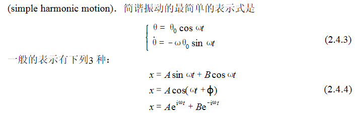

# Mechanics

## Kinematics

### Mechanics motion

* Translational motion
* Rotational motion
* Oscillation & Deformation

### Translation

Average Velocity: $\displaystyle\overline{\boldsymbol{v}}=\frac{\Delta\boldsymbol{r}}{\Delta t}$

Average Speed: $\displaystyle\overline{v}=\frac{\Delta s}{\Delta t}$

### Rotation

### Oscillation

