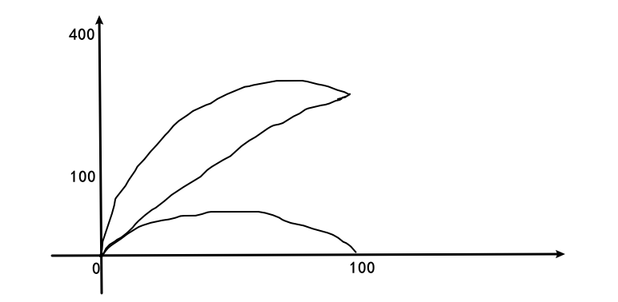

# 第十次作业

12.8, 12.9, 12.13, 13.6, 13.12, 14.2

## 12.8

$\because 60\ ^{\circ}\text{C}=(273+60) \ \text{K}=333 \ \text{K}$

$\because \displaystyle \Delta Q_{b}=\frac{1}{2}\times 20\times 10^{-3}\times 400^{2}\ \text{J}=mc(T_{f}-333 \ \text{K})$

$\therefore\displaystyle T_{f}=333\ \text{K}+\frac{\displaystyle \frac{1}{2}\times 20\times 10^{-3}\times 400^{2}}{20\times 10^{-3}\times 400}\ \text{K}=533\ \text{K}$

$
\begin{aligned}
\therefore \Delta S&=\left( \int_{333}^{T_{f}}+\int_{T_{f}}^{288} \right) \frac{mc\mathrm{d}T}{T}+\frac{\Delta Q_{s}}{T_{s}} \\
&=20\times 10^{-3}\times 400\times \ln\frac{288}{333}\ \text{J/K}\\
&+\frac{\displaystyle \frac{1}{2}\times 20\times 10^{-3}\times 400^{2}+20\times 10^{-3}\times 400\times 45}{273+15} \ \text{J/K} \\
&=5.65\ \text{J/K}
\end{aligned}
$

## 12.9

### (a)

### (b)

$
\begin{aligned}
\frac{S}{k_{B}}&=\ln C_{1500}^{n}=\ln\frac{1500!}{(1500-n)!n!} \\
&=\ln \frac{1500\cdot 1499\cdot \cdots \cdot (1500-n+1)}{n\cdot (n-1)\cdot \cdots \cdot 1} \\
&=\ln \frac{1500}{n}+\ln \frac{1499}{n-1}+\cdots +\ln \frac{1500-n+1}{1}
\end{aligned}
$

### (3)

$\because \displaystyle \frac{x}{1500}=\frac{100-x}{100}$

$\therefore \displaystyle x=\frac{1500}{16}=93.75$

## 12.13

## 13.6

$
\begin{aligned}
N&=\int_{v_{m}}^{\infty}n_{0}\left( \frac{1}{\pi v_{m}^{2}} \right) \exp\left( -\frac{v^{2}}{v_{m}^{2}} \right) 4\pi v^{2}\mathrm{d}v \\
&=\frac{4n_0}{\sqrt{\pi}}\int_{1}^{\infty}e^{-x^{2}}x^{2}\mathrm{d}x \\
&=\frac{2n_{0}}{\sqrt{\pi}}\left( e^{-1}+\int_{1}^{\infty}e^{-x^{2}}\mathrm{d}x \right) \\
&=\frac{2n_0}{\sqrt{\pi}}\left( e^{-1}+\frac{\sqrt{\pi}}{2}-\int_{0}^{1}e^{-x^{2}}\mathrm{d}x \right) \\ 
&=n_0\left( 1+\frac{2}{e\sqrt{\pi}}-erf(1) \right) \\
&=n_0\left( 1+\frac{2}{e\sqrt{\pi}}-0.8427 \right) \\
&=0.57241n_0
\end{aligned}
$

## 13.12

$\because \displaystyle 4\pi r^{2}\sigma T_{b}^{4}=4\pi R_{\odot}^{2}\sigma T_{\odot}^{4}\frac{\pi r^{2}}{4\pi D^{2}}$

$\therefore \displaystyle T_{b}=T_{\odot}\sqrt[4]{\frac{R_{\odot}^{2}}{4D^{2}}}=T_{\odot}\sqrt{\frac{\theta}{2}}=5700\ \text{K}\sqrt{\frac{0.50\times \pi}{2\times 180}}=266\ \text{K}$

