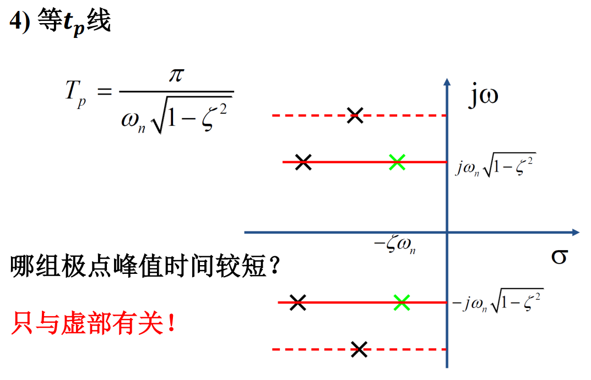
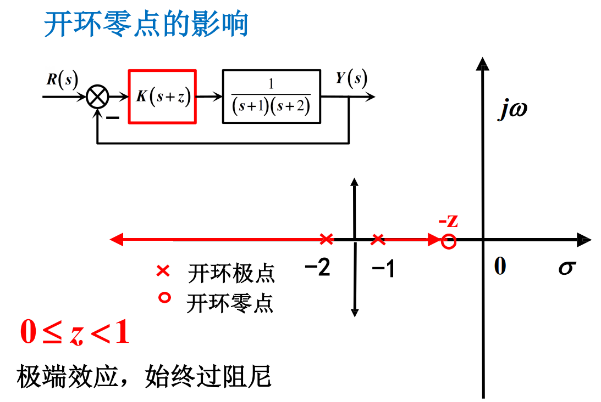
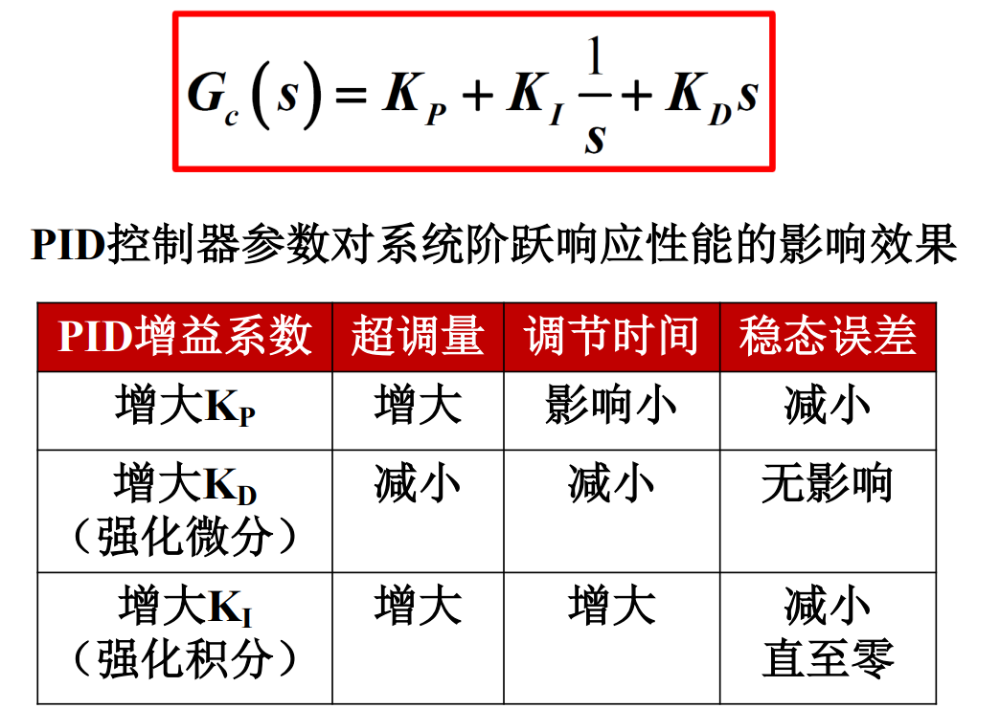
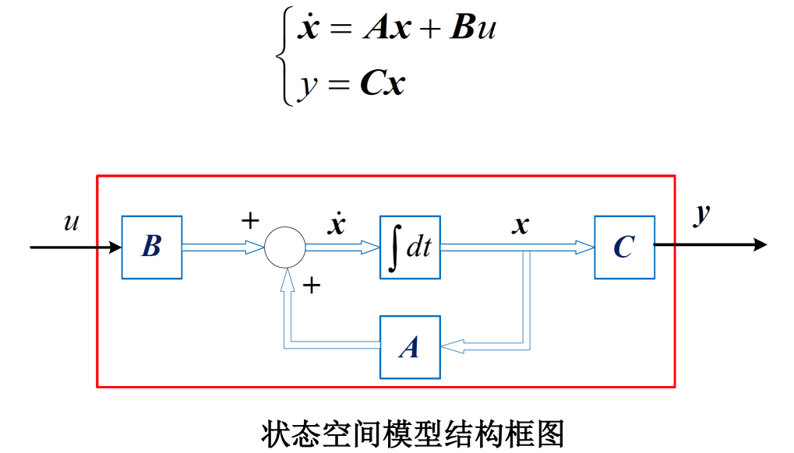
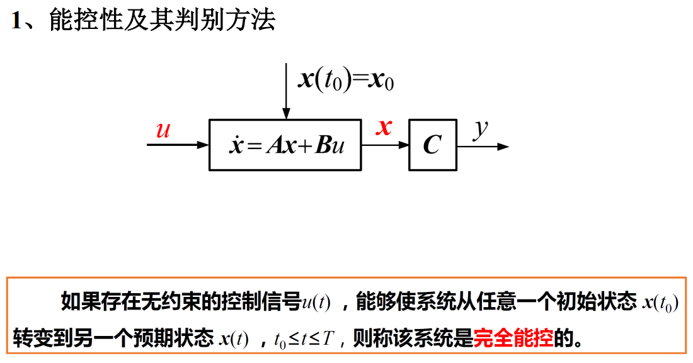
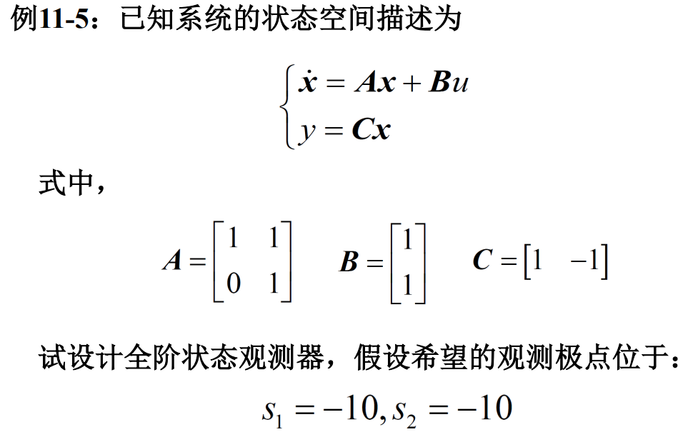
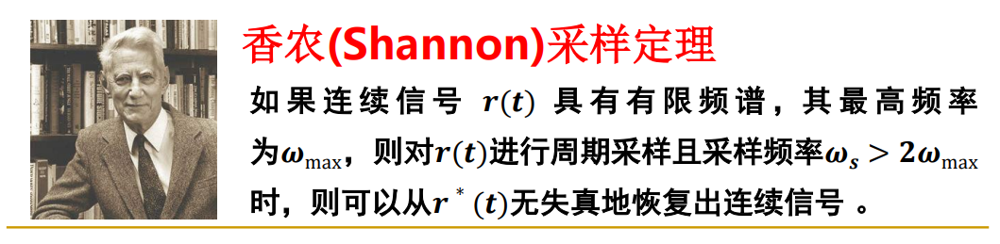

# 控制理论

- 判断题 10 道 (10 分)
- 选择题 10 道 (20 分)
- 简答题 6 道 (30 分)
- 应用题 4 道 (40 分)

## 第一章: 控制系统导论

- 引言
    - 控制就是使受控对象产生预期响应, 即按照预期的方式工作.
    - 受控对象: 共性特点是动.
    - 用微分方程模型描述受控对象的动态行为和表现.
    - 自动控制是指无人参与情况下, 使受控对象产生预期响应.
- 基本概念
    - 控制: 使受控对象按照预期的方式工作
    - 受控对象: 是指要求实现自动工作的机器, 设备或生产过程
    - 受控对象通常有多个受控变量
    - 自动控制: 在没有人直接参与的情况下, 利用控制装置使受控对象的某一物理量 (受控变量) 自动地按照预定的规律运行
    -  控制系统: 由相互关联的元件按一定的结构组成的系统, 能够提供预期的响应
    -  控制系统框图: 表征控制系统的因果关系 (输入-输出关系), 由有向线段和方框组成的框图
    -  开环控制: 利用执行机构直接控制受控对象
    -  开环控制的特点: 信息单向流动
    -  反馈: 控制的精髓
    -  闭环控制的特点: 信息的双向流动
    -  负反馈是反馈控制的主要结构
    -  控制系统的基本性能要求: 稳定性, 快速性, 准确性

## 第二章: 系统数学模型

### 2.1 数学模型

- 数学模型: 描述系统输入, 输出量以及内部各变量之间关系的数学表达式, 揭示了系统结构及其参数与其性能之间的内在关系.
    - 经典控制理论采用的数学模型以传递函数为基础
    - 现代控制理论采用的数学模型以状态空间方程为基础
    - 微分方程是列写传递函数和状态空间方程的基础
    - 时间域: 微分 (差分) 方程, 状态方程
    - 复数域: 传递函数 (基于微分方程), 结构图 (框图, 信号流图）
    - 频率域: 频率特性函数 (基于传递函数) 

### 2.2 微分方程模型的建立步骤

1. 分析元件和系统的工作原理, 确定系统输入量, 输出量
2. 根据元件遵循的定律列写动态方程式 (忽略次要因素)
3. 消除中间变量, 只保留输入-输出的数学关系式
4. 动态方程标准化: 等式右边与输入变量有关, 等式左边与输出变量有关

**常见物理系统:**

在旋转坐标系中:

* 角速度 $\dot\theta$ 的地位等同于惯性系的速度;
* 角加速度 $\ddot\theta$ 的地位等同于惯性系的加速度; 
* 转动惯量 $\displaystyle I=\int\rho^2{\rm d}m$ 的地位等同于惯性系的质量, 质点转动惯量为 $I = mr^{2}$;
* 力矩 $T = \boldsymbol{F}\times\boldsymbol{r}$ 的地位等同于惯性系里的力;
* 角动量 $L=r×p=r×mv=mr×v$ 的地位等同于惯性系的动量;
* 转动动能 $\displaystyle E=\frac{1}{2}I\dot\theta^2$;
* 类似牛顿第二定律: $\displaystyle T = \boldsymbol{F}\times\boldsymbol{r}=I\ddot\theta=\int\rho^{2}{\rm d}m \ddot\theta$

输入和输出之间可以使用常微分方程来描述.

### 2.3 线性系统

线性系统: 同时满足叠加性和齐次性的系统

线性就是变量间成一次关系, 即满足

- 叠加性: $y(x_1+x_2) = y(x_1) + y(x_2)$
- 齐次性: $y(\beta x) = \beta y(x)$

注意, $y = kx + b$ 不属于线性关系, 它不满足齐次性.

常见的线性关系例子有:

- 等比关系: $y = kx$
- 导数关系: $y = \dot{x}$
- 积分关系: $y = \int x \mathrm{d}t$
- 线性常微分: 见下图公式

在微分方程中就是你要求的未知函数 y(x) 和这个函数的各种阶的导数, 不管有多少阶, 多少个, 都是一次方.

### 2.4 线性化近似模型

- 限制范围, 使系统工作在 **线性区**, 忽略非线性;
- 换一个角度考察所谓的 **小信号**. 可以用线性模型来代替非线性模型.

使用泰勒展开可知

$\displaystyle y = f(x) = y_0 + \left.\frac{\mathrm{d}y}{\mathrm{d}x}\right|_{x_0} (x - x_0) + \frac{1}{2}\left. \frac{\mathrm{d}^2y}{\mathrm{d}x^2} \right|_{x_0} (x - x_0)^{2} + \cdots$

当 $(x - x_0)$ 在小范围内波动时, 可以近似为

$\displaystyle (y - y_0) = \left. \frac{\mathrm{d}y}{\mathrm{d}x} \right|_{x_0}(x - x_0) = k(x-x_0)$

因此有 $\Delta y = k \Delta x$, 即线性的小信号模型.

其中一个可以应用小信号模型的就是 **单摆系统**.

作用于单摆质点上的扭矩为

$T = MgL\sin \theta$

由类牛顿第二定律可知

$T = ML^{2} \ddot{\theta}$

因此我们有

$\displaystyle \ddot{\theta} = \frac{g}{L}\sin \theta \thickapprox \frac{g}{L}\theta, -\frac{\pi}{4} \le \theta \le \frac{\pi}{4}$

### 2.5 拉普拉斯变换

拉普拉斯变换可以理解为广义单边傅里叶变换, 或者是在傅里叶变换的基础上乘上了一个衰减函数 $e^{-\sigma t}$, 用以保证收敛.

- 傅里叶变换: $\displaystyle F(\omega) = \int_{-\infty}^{+\infty}e^{-j\omega t}f(t)\mathrm{d}t$, 可能发散, 例如 $f(t) = t^{2}$
- 拉普拉斯变换: $\displaystyle L(s) = \int_{0}^{\infty}e^{-(\sigma+j\omega)t}f(t)\mathrm{d}t = \int_{0}^{\infty}e^{-st}f(t)\mathrm{d}t$

并且, 我们可以将拉普拉斯变量 $s$ 看成微分算子, 还可以得到对应的积分算子, 即

- $\displaystyle s \equiv \frac{\mathrm{d}}{\mathrm{d}t}$
- $\displaystyle \frac{1}{s} \equiv \int_{0^{-}}^{t}\mathrm{d}t$

通过定义我们可以求出一些常用的拉普拉斯变换:

简化版:

**拉普拉斯变换性质:**

- 线性
    - 齐次性: $L(af(t)) = aL(f(t))$
    - 叠加性: $L(f_1(t) + f_2(t)) = L(f_1(t)) + L(f_2(t))$
- 时间平移: $L(f(t-a)) = e^{-as}F(s)$
- 频率域平移 (位移): $L(e^{-at}f(t)) = F(s+a)$
- 尺度变换: $\displaystyle L(f(\frac{t}{a})) = aF(as)$
- 微分: $\displaystyle L(\frac{\mathrm{d}^{n}}{\mathrm{d}t^{n}}f(t)) = s^{n}F(s)$, 零初值条件下
    - $\displaystyle L(\frac{\mathrm{d}^{n}}{\mathrm{d}t^{n}}f(t)) = s^{n}F(s) - s^{n-1}f(0) - \cdots - f^{(n-1)}(0)$
- 积分: $\displaystyle L(\int\int\cdots\int f(t)\mathrm{d}t^{n}) = \frac{1}{s^{n}}F(s)$, 零初值条件下
    - $\displaystyle f^{-1}(0) = \int_{-\infty}^{0}f(t)\mathrm{d}t$
    - $\displaystyle L(\int f(t)\mathrm{d}t) = \frac{1}{s}F(s) + \frac{1}{s}f^{-1}(0)$
    - $\displaystyle L(\int\int f(t)\mathrm{d}t^{2}) = \frac{1}{s^{2}}F(s) + \frac{1}{s^{2}}f^{(-1)}(0) + \frac{1}{s}f^{(-2)}(0)$
- 初值定理: $\displaystyle \lim_{t \to 0}f(t) = \lim_{s \to \infty}sF(s)$
- 终值定理: $\displaystyle \lim_{t \to \infty}f(t) = \lim_{s \to 0}sF(s)$

### 2.6 拉普拉斯反变换

**求解微分方程组步骤:**

1. 建立微分方程组;
2. 求微分方程组的拉普拉斯变换;
3. 求解代数方程, 得到所需变量的拉普拉斯变换;
4. 使用拉普拉斯逆变换得到所需变量的运动解, 或者使用终值定理得到稳定值.

### 2.7 传递函数

- 系统的传递函数: 在零初始条件下, 系统输出量的拉普拉斯变换与输入量拉普拉斯变换的比值

1. 传递函数的概念只适用于线性定常系统, 它是在零初始条件下定义的;
2. 传递函数是复变量 $s$ 的有理分式函数, 通常 $n \ge m$, 各系数均为实数;
3. 物理性质不同的系统可以具有相同的传递函数 (相似系统);
4. 传递函数表示线性定常系统自身将输入信号传递, 变换成输出信号的能力, 与输入信号无关;
5. 传递函数的拉普拉斯反变换是系统的脉冲响应;
6. 系统的放大系数 (增益): 当 $s = 0$ 时, $K = G(0) = b_m / a_n$ 称为系统的放大系数或增益, 反映了系统处于静态时, 输出与输入的比值.

7. 传递函数的特征方程: $N(s) = 0$ 称为系统的特征方程, 特征方程的根称为系统的特征根. 特征方程决定着系统的主要动态特性. $N(s)$ 中 $s$ 的最高阶次等于系统的阶次.

8. 传递函数的零极点分布决定系统的动态特性. 极点决定系统的主要动态特性.

**环节:**

- 具有某种确定信息传递关系的元件, 元件组或元件的一部分称为一个环节.
- 复杂的系统可归结为一些典型环节的组合.

### 2.8 框图模型

- 框图模型: 描述系统及各组成部件之间信号传递关系的图示化模型.
- 框图包含以下要素: 信号线, 信号引出点, 函数方框和比较点.
- 相邻比较点可以互换, 合并, 分解, 即满足代数运算的交换律, 结合律和分配律.

**框图模型的建立:**

1. 建立系统各元部件的微分方程, 明确信号的因果关系 (输入/输出).
2. 对上述微分方程进行拉普拉斯变换, 绘制各部件的框图.
3. 按照信号在系统中的传递, 变换过程, 依次将各部件的框图连接起来, 得到系统的框图.

**系统框图的简化:**

- 串联连接转相乘 $G(s) = G_1(s)G_2(s)\cdots G_n(s)$
- 并联连接转相加 $G(s) = G_1(s) + G_2(s) + \cdots + G_n(s)$
- 负反馈连接 $\displaystyle T(s) = \frac{G(s)}{1+G(s)H(s)}$
    - 其中 $G(s)$ 称为前向通路传递函数
    - 其中 $H(s)$ 称为反馈通路传递函数
    - $G(s)H(s)$ 称为开环或环路传递函数
- 化简基本思路: 利用等效变换法则, 移动比较点和引出点, 消去交叉回路, 变换成可以运算的简单回路.
- 若存在干扰, 则
    - 闭环传递函数 $\displaystyle \Phi_{i}(s) = \frac{X_{o1}(s)}{X_{i}(s)} = \frac{G_1(s)G_2(s)}{1+G_1(s)G_2(s)H(s)}$
    - 偏差传递函数 $\displaystyle \Phi_{\varepsilon i}(s) = \frac{\varepsilon_{i}(s)}{X_{i}(s)} = \frac{1}{1+G_1(s)G_2(s)H(s)}$
    - 干扰传递函数 $\displaystyle \Phi_{i}(s) = \frac{X_{o2}(s)}{N(s)} = \frac{G_2(s)}{1+G_1(s)G_2(s)H(s)}$
    - 干扰偏差传递函数 $\displaystyle \Phi_{\varepsilon N}(s) = \frac{\varepsilon_{N}(s)}{X_{i}(s)} = \frac{-G_2(s)H(s)}{1+G_1(s)G_2(s)H(s)}$
    - 根据线性系统的叠加原理, 系统在输入 $x_i(t)$ 及扰动 $n(t)$ 共同作用下的总输出为 $X_{o}(s) = X_{o1}(s) + X_{o2}(s)$
    - 若 $|G_1(s)G_2(s)H(s)| \gg 1$ 且 $|G_1(s)H(s)|\gg 1$, 则 $\displaystyle X_{o}(s)\approx \frac{1}{H(s)}X_{i}(s)$

### 2.9 信号流图模型

- 信号流图是控制系统的另一种图形表示;
- 根据信号流图采用梅森公式可方便地求出系统的传递函数.

- 通路: 沿支路箭头方向穿过各相连支路的路径.
- 前向通路: 从输入节点到输出节点通路上通过任何节点不多于一次的通路. 前向通路上各支路增益之乘积, 称前向通路总增益, 一般用 $p_k$ 表示.
- 回路: 起点与终点重合且通过任何节点不多于一次的闭合通路. 回路中所有支路增益之乘积称为回路增益, 用 $L_a$ 表示.
- 不接触回路: 相互间没有任何公共节点的回路. (即使只有一个点也算公共节点)

**梅森公式:**

## 第五章: 反馈控制系统的性能

### 5.1 时域响应

- 时域响应: 系统在输入信号作用下, 输出随时间的变化过程又, 称时间响应.
- 时域响应能直观地反映系统性能.
- 时域响应 (函数) 等于系统传递函数与输入信号的象函数之积取拉普拉斯反变换.
- 脉冲信号, 阶跃信号, 斜坡信号和加速度信号常用于分析系统的时域瞬态响应.
- 正弦输入信号常用于分析系统的频率响应特性.

### 5.2 瞬态响应和瞬态性能指标

- 时域分析法: 在时间域内研究控制系统性能的方法.
- 时域响应由两部分组成:
    - 瞬态响应: 系统在输入信号的作用下, 输出量从初始状态到稳定状态的响应过程. 也称瞬态过程, 过渡过程. 能反映系统的稳定性, 快速性.
    - 稳态响应: 系统在输入信号作用下, 当时间 $t$ 趋于无穷大时, 系统输出量的表现方式. 表征输出量最终复现输入量的程度. 也称稳态过程, 能反映系统的准确性.
- 瞬态性能指标: 一组刻画瞬态过程快速, 平稳等动态特性的定量指标.
    - 上升时间 $t_r$: 有超调系统为响应曲线从零时刻首次到达稳态值的时间. 无超调系统为从稳态值的 10% 上升到稳态值的 90% 所需的时间.
    - 峰值时间 $t_p$: 响应曲线从零时刻上升到第一个峰值点所需要的时间.
    - 上升时间和峰值时间主要衡量了系统响应的敏捷性.
    - 调节时间 $t_s$: 响应曲线达到并一直保持在允许误差范围内的最短时间.
    - 调节时间衡量了系统响应的快速性.
    - 超调量 $P.O.$: 响应曲线的最大峰值与稳态值 $1.0$ 的差, 超调量为相对值, 用百分比表示.
    - 超调量衡量了系统响应的平稳性.
    - 振荡次数: 在调节时间 $t_s$ 内响应曲线振荡的次数.
    - 稳定性, 快速性和准确性均与系统固有特性有关. 稳定性, 快速性与输入信号的形式无关; 而准确性与输入信号的形式有关.

### 5.3 一阶系统的时域响应性能分析

- 一阶系统的数学模型
    - 开环传递函数: $\displaystyle G(s) = \frac{1}{Ts}$
    - 闭环传递函数: $\displaystyle \Phi(s) = \frac{1}{Ts + 1}$
    - $T$ 称为时间常数, 是一阶系统唯一的性能参数

### 5.4 二阶系统的时域响应性能分析

- $\zeta$ 称为阻尼系数 (阻尼比), $\omega_n$ 为系统固有频率 (自然振荡频率).

**欠阻尼系统:**

**临界阻尼系统:**
- 二阶系统的极点是二重负实根.
- 系统的表现和性能与一阶系统类似.

**过阻尼系统:**

- 二阶系统的极点是两个负实根.
- 系统的表现和性能与一阶系统类似.
- 过渡过程长短取决于较慢的衰减, 即离虚轴较近的极点 (较大的时间常数), 没有振荡和超调.

**零阻尼系统:**

- 二阶系统的极点是一对共轭虚根.
- 时域响应函数: $y(t) = 1 - \cos(\omega_n t)$
- 无阻尼, 等幅振荡.

**负阻尼系统:**

- 二阶系统的极点具有正实部.
- 系统不稳定其响应曲线有两种形式: 发散振荡或单调发散.

### 5.5 欠阻尼二阶系统的时域响应性能分析

**超调量由阻尼系数唯一决定**

**欠阻尼二阶系统性能指标的参数调节:**

**欠阻尼二阶系统极点位置与参数的关系:**

**总结:**

### 5.6 高阶系统的时域响应性能分析

- 一般的高阶系统可以分解成若干一阶惯性环节和二阶振荡环节的叠加. 其瞬态响应即是由这些一阶惯性环节和二阶振荡环节的响应函数叠加组成.
- 当所有闭环极点均具有负实部时, 系统稳定.
- 额外闭环零点有减小等效阻尼的效应. 零点越靠近虚轴, 效应越明显. 原有二阶输出被微分环节调理, 波动增强.
- 第三个闭环极点有增大等效阻尼的效应. 极点越靠近虚轴, 效应越明显. 原有二阶输出被积分环节调理, 波动减弱.

**高阶系统的简化:**

- 忽略非主导极点: $N \ge 10$, 可以忽略远端极点.
    - 主导极点: 靠近虚轴且附近没有零点的极点.
    - 一个好的设计, 应该使系统表现得如同主导二阶系统, 易于把控.
- 偶极子相消: 系统传递函数中, 如果分子分母具有负实部的零, 极点数值上相近, 则可将该零点和极点一起消掉, 称之为偶极子相消.
    - 某极点与对应的零点之间的间距小于它们本身到原点距离的十分之一时, 即可认为是偶极子.
    - 忽略的极点或相消的零, 极点要保证具有负实部.
    - 忽略非主导零, 极点时要保证系统的静态增益不变.

### 5.7 系统的稳态性能分析

**输入引起的稳态误差:**

**干扰引起的稳态误差:**

**系统的稳态误差分析:**

- 增大前向通道干扰点前的放大倍数, 可减小干扰带来的稳态误差.
- 在前向通道干扰点前加积分器, 可消除干扰带来的稳态误差.
- 干扰输入点之前的增益要大, 甚至带积分环节.
- 增加干扰点之后的增益, 或是在干扰点之后增加积分环节, 对消除干扰引起的稳态误差不起作用.
- 无法消除系统反馈通道的测量干扰带来的误差.

 **减小稳态误差的途径:**

 

## 第六章: 控制系统的稳定性

### 6.1 稳定性的基本概念

- 平衡状态: 如果没有受到任何扰动或者输入信号的激励, 控制系统输出量将保持在某个状态, 则称控制系统处于平衡状态.
- 稳定性: 一个处在平衡状态的系统, 在扰动作用下, 会偏离平衡状态. 当扰动消失后, 扰动的后效随着时间消失, 系统能恢复到平衡状态, 则称该系统是稳定的. 反之, 则称该系统不稳定.
- BIBO 稳定性: 有界输入的激励下, 系统只会产生有界的输出.
- 稳定性是系统的固有属性, 只与系统自身有关.
- 线性系统稳定的充分必要条件: 所有闭环极点的实部为负, 或者说, 所有闭环极点都位于 $s$ 平面的左半平面.

### 6.2 线性系统稳定的充分必要条件

- 线性系统稳定的充分必要条件: 所有闭环极点的实部为负, 或者说, 所有闭环极点都位于 $s$ 平面的左半平面.
    - 由于输出是有界输入与单位脉冲响应的卷积 (组合), 即可转化为闭环传递函数的脉冲响应是否有界.
    - 所有极点的实部为负, 则有界 (稳定). 有一个非负, 则无界 (不稳定).
- 线性系统稳定的充分必要条件: 所有闭环极点的实部为负, 或者说所有闭环极点都位于 $s$ 平面的左半平面.

### 6.3 劳斯-赫尔维茨稳定性判据

- 劳斯-赫尔维茨稳定性判据: 已知系统的闭环特征方程, 不必求解特征根. 根据特征多项式的系数判别闭环系统的稳定性.
- 要使全部特征根均具有负实部, 必须满足 (必要条件, 非充分条件):
    - 特征方程的各项系数 $a_{i} \neq 0$.
    - 特征方程的各项系数的符号都相同.
    - $a_n$ 一般取正值, 则上述两条件简化为 $a_i > 0$.

- 系数大于 $0$ 的三阶系统稳定的充要条件是 $a_2a_1 > a_3a_0$.

## 第七章: 根轨迹法

### 7.1 基本概念

- 根轨迹: 开环系统某一参数从 0 变到正无穷时, 闭环系统的极点在s平面上变化的轨迹.
- 根轨迹图：以系统根轨迹增益 $K$ 为参变量, 当 $K$ 由 $0 \to \infty$ 时, 系统闭环极点在 $s$ 平面上变化的轨迹.

### 7.2 根轨迹绘制的基本方法

### 7.3 基于根轨迹的控制系统分析

- 广义根轨迹: 变换特征方程以获取等效开环传递函数.

 **控制器对根轨迹的影响:**

### 7.4 基于根轨迹的控制系统设计

- 看第 11 周课件例子.

## 第三章: 状态空间模型

### 3.1 引言

- 经典控制理论物理意义明确, 计算方便, 工程实用性强, 应用广泛.
    - 研究对象: 经典控制理论的研究对象是单输入单输出的线性定常系统.
    - 数学模型: 传递函数描述的是控制系统的输入输出关系.
    - 设计方法: 控制系统设计的优劣依赖于工程经验.
    - 局限性:
        - 难以直接处理多输入多输出复杂非线性系统;
        - 不能包含系统的全部运动状态;
        - 对工程经验的依赖性较强.
- 现代控制理论的提出
    - 工程需求
        - 控制精度要求高
        - 控制系统规模大
        - 性能指标要求最优
    - 技术基础
        - 计算机硬件技术发展
        - 计算机软件技术发展
    - 理论基础
        - 动态规划法, 极大值原理, Kalman 滤波理论, 能控性, 能观性

### 3.2 状态空间模型的基本概念

- 经典控制理论采用 **传递函数** 描述对象的输入, 输出关系.
- 状态空间方法采用 **系统状态** 描述系统内部运行的基本规律.
- 系统状态是指表示系统的一组变量, 只要知道了这组变量当前取值情况, 输入信号和描述系统动态特性的方程, 就能够完全确定系统未来的状态和输出响应.
    - 状态变量的个数 = 系统中独立的储能元件个数
    - 状态变量的个数 = 系统微分方程的阶次
- **状态向量**: 能够完全表征动力学系统时间域行为的一个最小内部变量组.
- **状态空间**: 以各状态变量 $x_1(t), x_2 (t), \cdots, x_n(t)$ 为坐标轴所构成的 $n$ 维空间.

### 3.3 状态空间模型的建立

### 3.4 状态空间模型与传递函数的变换关系

### 3.5 线性定常系统状态方程的解

## 第十一章: 状态变量反馈控制系统设计

### 11.1 引言

- 是不是所有的状态都能受输入信号的影响?
    - 能控性
- 如果状态变量无法测量，该如何构造观测器?
    - 能观性

### 11.2 线性系统的能控性和能观性

### 11.3 线性系统的全状态反馈控制器设计

### 11.4 线性系统的状态观测器设计

### 11.5 带有观测器的全状态反馈控制器

## 第十三章: 数字控制系统简介

### 13.1 数字控制系统的基本概念

### 13.2 采样与保持

