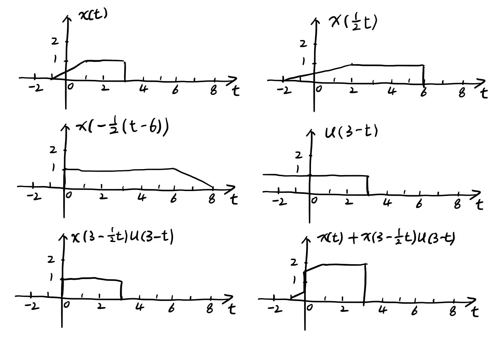
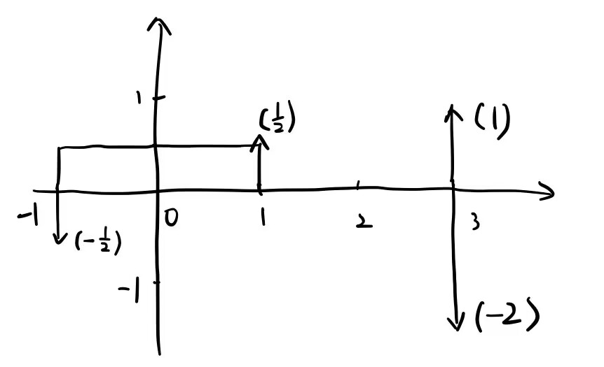

# 数字信号处理

## 1.

**(1)**

$\displaystyle x(t) = \sin ^{2}t + \cos \pi t = \frac{1}{2}-\frac{1}{2}\cos 2t + \cos \pi t$

其中 $\cos 2t$ 周期为 $\displaystyle T_1 = \frac{2\pi}{2} = \pi$, $\cos \pi t$ 的周期为 $\displaystyle T_2 = \frac{2\pi}{\pi} = 2$.

由于 $\displaystyle \frac{T_1}{T_2} = \frac{\pi}{2}$ 为无理数, 因此 $x(t)$ 不是周期信号.

**(2)**

$
\begin{aligned}
x(t) &= (\sin 2t + \cos t)^{2} \\
&= \sin^{2} 2t + 2\sin 2t\cos t + \cos^{2} t \\
&= \frac{1}{2}-\frac{1}{2}\cos 4t + (\sin (2t+t)+\sin (2t-t)) + \frac{1}{2}\cos 2t+\frac{1}{2} \\
&= -\frac{1}{2}\cos 4t + \sin 3 t + \frac{1}{2}\cos 2t+\sin t+1 \\
\end{aligned}
$

由于 $\cos 4t, \sin 3t, \cos 2t, \sin t$ 的周期分别为 $\displaystyle \frac{\pi}{2}, \frac{2\pi}{3}, \pi, 2\pi$.

它们两两间的周期之比为有理数, 因此 $x(t)$ 为周期信号, 周期为它们的最小公倍数 $\displaystyle 2\pi$.

**(3)**

$
\begin{aligned}
x(t) &= \frac{\cos 2t + 1 + \sin t + \sin 2t + \sin 3t}{\cos t} \\
&= \frac{2\cos^{2} t + \sin t + 2\sin t\cos t + 3\sin t - 4\sin^{3} t}{\cos t} \\
&= \frac{2\cos^{2} t + 4\sin t + 2\sin t\cos t - 4\sin t(1 - \cos^{2} t)}{\cos t} \\
&= \frac{2\cos^{2} t + 2\sin t\cos t + 4\sin t\cos^{2} t}{\cos t} \\
&= \frac{2\cos^{2} t + 2\sin t\cos t + 2\sin 2t\cos t}{\cos t} \\
&= 2\cos t + 2\sin t + 2\sin 2t \\
\end{aligned}
$

其中 $\cos t, \sin t, \sin 2t$ 的周期分别为 $2\pi, 2\pi, \pi$.

它们两两间的周期之比为有理数, 因此 $x(t)$ 为周期信号, 周期为它们的最小公倍数 $\displaystyle 2\pi$.

**(4)**

$x(t) = \sin et + \cos \pi t$

其中 $\sin et, \cos \pi t$ 的周期分别为 $\displaystyle \frac{2\pi}{e}, 2$.

由于 $\displaystyle \frac{T_1}{T_2} = \frac{\pi}{e}$ 不清楚是有理数还是无理数, 因此无法判定 $x(n)$ 的周期性.

**(5)**

$x(n) = \sin 2kn + \cos 3kn$

若令 $\sin 2k(n+N) = \sin 2kn$

则我们可知 $2kN = 2\pi m_1$

即 $2kN$ 是 $2\pi$ 的整数倍, 且周期为 $\displaystyle N = \frac{\pi m_1}{k}$

若令 $\cos 3k(n+N) = \cos 3kn$

则我们可知 $3kN = 2\pi m_2$

即 $3kN$ 是 $2\pi$ 的整数倍, 且周期为 $\displaystyle N = \frac{2\pi m_2}{3k}$

如果同时有 $2kN = 2\pi m_1$ 与 $3kN = 2\pi m_2$

则我们两式相减有 $kN = 2\pi(m_2-m_1)$, 即 $kN$ 是 $2\pi$ 的整数倍,

且 $kN$ 是 $2\pi$ 的整数倍也可以推出 $2kN$ 和 $3kN$ 是 $2\pi$ 的整数倍.

若未知 $k$ 为多少, 则无法判定 $x(n)$ 的周期性.

若存在正整数 $N$ 使得其满足 $kN$ 是 $2\pi$ 的整数倍, 则有 $x(n)$ 为周期信号, 且周期为 $\displaystyle N = \frac{2\pi m}{k}$, 其中 $m$ 是使得 $kN=2\pi m$ 成立的最小正整数.

若不存在正整数 $N$ 使得其满足 $kN$ 是 $2\pi$ 的整数倍, 则 $x(n)$ 不是周期信号.

## 2.

**(1)**

最后的图像为右下角所示, 表达式为:

$\displaystyle x(t) + x(3-\frac{1}{2}t)u(3-t) = \begin{cases}
\frac{1}{2}(t+1), & t \in [-1, 0] \\
\frac{1}{2}(t+3), & t \in [0, 1] \\
2, & t \in [1, 3] \\
0, & \text{otherwise}
\end{cases}$

**(2)**

$\displaystyle x'(t) = -\delta(t-3) + y(t)$, 其中 $y(t) = \begin{cases}
\frac{1}{2}, & t \in [-1, 1] \\
0, & \text{otherwise}
\end{cases}$

$\displaystyle x''(t) = \frac{1}{2}\delta(t+1) - \frac{1}{2}\delta(t-1) - \delta'(t-3)$

因此有

$\displaystyle x'(t) - x''(t) = y(t) - \frac{1}{2}\delta(t+1) + \frac{1}{2}\delta(t-1) - \delta(t-3) + \delta'(t-3)$

图像为:

**(3)**

由于 $x(t)$ 只在 $t \in [-1, 3]$ 处有正值, 其他情况下 $x(t) = 0$, 因此有 $x(t), x(t+4n), x(t-4n), n=1,2,\cdots, \infty$ 互不冲突, 即任取 $t \in (-\infty, \infty)$ 都仅有其中一个函数值非零. 

展开 $h(t)$ 即可得

$
\begin{aligned}
h(t) &= \sum_{n = 0}^{\infty}\frac{1}{2^{n}}[x(t+4n)+x(t-4n)] \\
&= 2x(t) + \sum_{n = 1}^{\infty}\frac{1}{2^{n}}[x(t+4n)+x(t-4n)] \\
&=\begin{cases}
t+1, & t \in [-1, 1] \\
2, & t \in [1, 3] \\
\frac{1}{2^{n+1}}[(t \mp 4n)+1], & t \in [-1 \pm 4n, 1 \pm 4n], n = 1, 2, \cdots, \infty \\
\frac{1}{2^{n}}, & t \in [1 \pm 4n, 3 \pm 4n], n = 1, 2, \cdots, \infty \\
\end{cases} \\
\end{aligned}
$

能量:

$
\begin{aligned}
W &= \lim_{T \to \infty}\int_{-T}^{T}|h(t)|^{2}\mathrm{d}t \\
&= \int_{-1}^{1}(t+1)^{2}\mathrm{d}t + \int_{-1}^{1}2^{2}\mathrm{d}t + 2\sum_{n=1}^{\infty}\int_{-1+4n}^{1+4n}(\frac{1}{2^{n+1}}[(t - 4n)+1])^{2}\mathrm{d}t  \\
&\quad\ + 2\sum_{n=1}^{\infty}\int_{1+4n}^{3+4n}(\frac{1}{2^{n}})^{2}\mathrm{d}t \\
&= \frac{8}{3} + 8 + 2\sum_{n=1}^{\infty}\int_{-1}^{1}(\frac{t+1}{2^{n+1}})^{2}\mathrm{d}t + 2\sum_{n=1}^{\infty}\int_{1}^{3}(\frac{1}{2^{n}})^{2}\mathrm{d}t \\
&= \frac{8}{3} + 8 + 2\sum_{n=1}^{\infty}\frac{1}{2^{2n+2}}\cdot \frac{8}{3} + 2\sum_{n=1}^{\infty}\frac{1}{2^{2n}}\cdot 2 \\
&= \frac{8}{3} + 8 + \frac{4}{9} + \frac{4}{3} \\
&= \frac{112}{9} \\
\end{aligned}
$

功率: $\displaystyle P = \lim_{T \to \infty}\frac{1}{2T}W = 0$

因此可知 $h(t)$ 是能量信号.

## 3.

**(1)**

当 $t < -2$ 时, 有 $\displaystyle x(t) * x(t) = \int_{-\infty}^{\infty}x(\tau)x(t-\tau)\mathrm{d}\tau = 0$

当 $-2 \le t < 0$ 时, 

$
\begin{aligned}
x(t) * x(t) &= \int_{-\infty}^{\infty}x(\tau)x(t-\tau)\mathrm{d}\tau  \\
&= \int_{-1}^{t+1}(2\tau+1)(2(t-\tau)+1)\mathrm{d}\tau  \\
&= \int_{-1}^{t+1}(- 4 \tau^{2} + 4 t \tau + 2 t + 1)\mathrm{d}\tau  \\
&= (- \frac{4}{3} \tau^{3} + 2 t \tau^{2} + (2 t + 1)\tau)|_{-1}^{t+1}  \\
&= (- \frac{4}{3} (t+1)^{3} + 2 t (t+1)^{2} + (2 t + 1)(t+1)) \\
&\quad\ - (- \frac{4}{3} (-1)^{3} + 2 t (-1)^{2} + (2 t + 1)(-1))  \\
&= \frac{2 t^{3}}{3} + 2 t^{2} + t - \frac{2}{3}  \\
\end{aligned}
$

当 $0 \le t < 2$ 时,

$
\begin{aligned}
x(t) * x(t) &= \int_{-\infty}^{\infty}x(\tau)x(t-\tau)\mathrm{d}\tau  \\
&= \int_{-1}^{t-1}3(2\tau+1)\mathrm{d}\tau + \int_{t-1}^{1}(2\tau+1)(2(t-\tau)+1)\mathrm{d}\tau \\
&\quad\ + \int_{1}^{t+1}3(2(t-\tau)+1)\mathrm{d}\tau  \\
&= 3(\tau^{2}+\tau)|_{-1}^{t-1} + (- \frac{4}{3} \tau^{3} + 2 t \tau^{2} + (2 t + 1)\tau)|_{t-1}^{1} \\
&\quad\ + 3(-\tau^{2} + (2 t+1)\tau)|_{1}^{t+1}  \\
&= 3t (t - 1) + (- \frac{2 t^{3}}{3} - 2 t^{2} + 7 t - \frac{2}{3}) + 3t (t - 1) \\
&= - \frac{2 t^{3}}{3} + 4 t^{2} + t - \frac{2}{3} \\
\end{aligned}
$

当 $2 \le t < 4$ 时,

$
\begin{aligned}
x(t) * x(t) &= \int_{-\infty}^{\infty}x(\tau)x(t-\tau)\mathrm{d}\tau  \\
&= \int_{t-3}^{1}3(2\tau+1)\mathrm{d}\tau + \int_{1}^{t-1}9\mathrm{d}\tau + \int_{t-1}^{3}3(2(t-\tau)+1)\mathrm{d}\tau  \\
&= 3(\tau^{2}+\tau)|_{t-3}^{1} + 9\tau|_{1}^{t-1} + 3(-\tau^{2} + (2 t+1)\tau)|_{t-1}^{3}  \\
&= - 6 t^{2} + 39 t - 42  \\
\end{aligned}
$

当 $4 \le t < 6$ 时,

$
\begin{aligned}
x(t) * x(t) &= \int_{-\infty}^{\infty}x(\tau)x(t-\tau)\mathrm{d}\tau  \\
&= \int_{t-3}^{3}9\mathrm{d}\tau  \\
&= 54 - 9 t  \\
\end{aligned}
$

当 $t \ge 6$ 时, $\displaystyle x(t) * x(t) = \int_{-\infty}^{\infty}x(\tau)x(t-\tau)\mathrm{d}\tau = 0$

因此我们有

$x(t) * x(t) = \begin{cases}
    0, & t < -2 \\
    \frac{2 t^{3}}{3} + 2 t^{2} + t - \frac{2}{3}, & -2 \le t < 0  \\
    - \frac{2 t^{3}}{3} + 4 t^{2} + t - \frac{2}{3}, & 0 \le t < 2 \\
    - 6 t^{2} + 39 t - 42, & 2 \le t < 4 \\
    54 - 9 t, & 4 \le t < 6 \\
    0, & t \ge 6 \\
\end{cases}$

**(2)**

当 $t < 3$ 时, $y(t) = 0$

当 $t \ge 3$ 时,

$
\begin{aligned}
y(t) &= [2e^{-2(t-1)}u(t-2)] * [3e^{-3(t+1)}u(t-1)] \\
&= \int_{2}^{t-1}[2e^{-2(\tau-1)}]\cdot [3e^{-3(t-\tau+1)}]\mathrm{d}\tau \\
&= \int_{2}^{t-1}6 e^{\tau - 3 t  - 1}\mathrm{d}\tau \\
&= 6 e^{\tau - 3 t  - 1}|_{2}^{t-1} \\
&= 6 e^{- 2 t - 2} - 6 e^{1 - 3 t} \\
\end{aligned}
$

因此有

$y(t) = \begin{cases}
    6 e^{- 2 t - 2} - 6 e^{1 - 3 t}, & t \ge 3 \\
    0, & t < 3 \\
\end{cases}$

**(3)**

当 $n = 0$ 时, $x(n) * y(n) = 1 \times 1 = 1$

当 $n = 1$ 时, $x(n) * y(n) = 1 \times 9 + 1 \times 1 = 10$

当 $n = 2$ 时, $x(n) * y(n) = 1 \times 1 + 1 \times 9 + 4 \times 1 = 14$

当 $n = 3$ 时, $x(n) * y(n) = 1 \times 9 + 1 \times 1 + 4 \times 9 + 5 \times 1 = 51$

当 $n = 4$ 时, $x(n) * y(n) = 1 \times 8 + 1 \times 9 + 4 \times 1 + 5 \times 9 + 1 \times 1 = 67$

当 $n = 5$ 时, $x(n) * y(n) = 1 \times 1 + 1 \times 8 + 4 \times 9 + 5 \times 1 + 1 \times 9 + 4 \times 1 = 63$

当 $n = 6$ 时, $x(n) * y(n) = 1 \times 1 + 4 \times 8 + 5 \times 9 + 1 \times 1 + 4 \times 9 = 115$

当 $n = 7$ 时, $x(n) * y(n) = 4 \times 1 + 5 \times 8 + 1 \times 9 + 4 \times 1 = 57$

当 $n = 8$ 时, $x(n) * y(n) = 5 \times 1 + 1 \times 8 + 4 \times 9 = 49$

当 $n = 9$ 时, $x(n) * y(n) = 1 \times 1 + 4 \times 8 = 33$

当 $n = 10$ 时, $x(n) * y(n) = 4 \times 1 = 4$

因此有 $x(n) * y(n) = \{ 1, 10, 14, 51, 67, 63, 115, 57, 49, 33, 4 \}$

**(4)**

$x(n)$ 也可以改写为

$x(n) = \begin{cases}
    n, & n = 0, 1, 2, \cdots, k \\
    0, & \text{otherwise}
\end{cases}$

当 $0 \le n \le k$ 时,

$\displaystyle x(n) * x(n) = \sum_{i=0}^{n}x(i)x(n-i) = \sum_{i=0}^{n}i(n-i) = \frac{1}{6}n (n^{2} - 1)$

当 $k+1 \le n \le 2k+1$ 时,

$
\begin{aligned}
x(n) * x(n) & = \sum_{i=n-k}^{k}x(i)x(n-i)  \\
& = \sum_{i=n-k}^{k}i(n-i)  \\
& = n\sum_{i=n-k}^{k}i-\sum_{i=n-k}^{k}i^{2}  \\
& = n\cdot \frac{n (2 k - n + 1)}{2}-(\frac{n(n+1)(2n+1)}{6})|_{n-k-1}^{k}  \\
& = - \frac{1}{6}(2 k - n + 1) (2 k^{2} - 2 k n + 2 k - n^{2} - n) \\
\end{aligned}
$

因此可得

$x(n) * x(n) = \begin{cases}
    \frac{1}{6}n (n^{2} - 1), & 0 \le n \le k \\
    - \frac{1}{6}(2 k - n + 1) (2 k^{2} - 2 k n + 2 k - n^{2} - n), & k+1 \le n \le 2k+1 \\
    0, & \text{otherwise}
\end{cases}$

此处的 $x(n) * x(n)$ 依然是从 0 开始的, 而非从 1 开始的.

##  4.

**(1)**

求齐次解, 特征方程为

$\alpha^{2}+7\alpha+12 = (\alpha + 3) (\alpha + 4) = 0$

齐次解为 $y_h(t) = A_1 e^{-3t} + A_2 e^{-4t}$

求特解, 设特解形式为 $y_p(t) = B_1 \cos(2t) + B_2 \sin(2t)$

带入可得

$
\begin{aligned}
& \quad\ y_p^{(2)}(t) + 7y_p^{(1)}(t) + 12y_p(t)  \\
& = - 4 B_{1} \cos(2t) - 4 B_{2} \sin(2t) - 14B_1\sin(2t) + 14B_2\cos(2t)  \\
&\quad\ + 12B_1 \cos(2t) + 12B_2 \sin(2t)  \\
& = (8 B_{1} + 14 B_{2})\cos(2 t) + (- 14 B_{1} + 8 B_{2}) \sin(2 t)  \\
& = 2\sin(2 t)  \\
\end{aligned}
$

因此有 $\begin{cases}
    8 B_{1} + 14 B_{2} = 0 \\
    - 14 B_{1} + 8 B_{2} = 2 \\
\end{cases}$ 即有 $\begin{cases}
    B_{1} = - \frac{7}{65} \\
    B_{2} = \frac{4}{65} \\
\end{cases}$

因此我们有

$\displaystyle y(t) = y_h(t) + y_p(t) = A_1 e^{-3t} + A_2 e^{-4t} - \frac{7}{65}\cos(2t) + \frac{4}{65}\sin(2t)$

根据初始条件有

$
\begin{cases}
    \displaystyle y(0) = A_{1} + A_{2} - \frac{7}{65} = 0  \\
    \displaystyle y^{(1)}(0) = - 3 A_{1} - 4 A_{2} + \frac{8}{65}= 1  \\
\end{cases}
$

解得 $\displaystyle A_{1} = \frac{17}{13}, A_{2} = - \frac{6}{5}$

因此有 $\displaystyle y(t) = y_h(t) + y_p(t) = \frac{17}{13} e^{-3t} + - \frac{6}{5} e^{-4t} - \frac{7}{65}\cos(2t) + \frac{4}{65}\sin(2t)$

**(2)**

求齐次解, 特征方程为 $\displaystyle \alpha^{3}-\frac{3}{4}\alpha^{2}+\frac{1}{16} = \frac{1}{16}(4 \alpha + 1)(2 \alpha - 1)^{2} = 0$

特征根为 $\displaystyle \alpha_1 = -\frac{1}{4}, \alpha_2 = \alpha_3 = \frac{1}{2}$

齐次解为 $\displaystyle y_h(n) = A_1 (-\frac{1}{4})^{n} + (A_2 + A_3n)(\frac{1}{2})^{n}$

设特解为 $\displaystyle y_p(n) = C(\frac{1}{3})^{n}$

带入可得

$
\begin{aligned}
&\quad\ y_p(n) - \frac{3}{4}y_p(n-1) + \frac{1}{16}y_p(n-3) \\
&= C(\frac{1}{3})^{n} - \frac{3}{4}C(\frac{1}{3})^{n-1} + \frac{1}{16}C(\frac{1}{3})^{n-3} \\
&= \frac{7}{16}C(\frac{1}{3})^{n} \\
&= x(n) - x(n-1) \\
&= (\frac{1}{3})^{n} - (\frac{1}{3})^{n-1} \\
&= - 2 \cdot (\frac{1}{3})^{n} \\
\end{aligned}
$

因此可得 $\displaystyle C = -2 \times \frac{16}{7} = - \frac{32}{7}$

特解为: $\displaystyle y_p(n) = - \frac{32}{7}\cdot (\frac{1}{3})^{n}$

因此我们有

$\displaystyle y(n) = y_h(n) + y_p(n) = A_1 (-\frac{1}{4})^{n} + (A_2 + A_3n)(\frac{1}{2})^{n} - \frac{32}{7}\cdot (\frac{1}{3})^{n}$

我们带入初始条件得

$
\begin{cases}
    \displaystyle y(0) = A_{1} + A_{2} - \frac{32}{7} = 0 \\
    \displaystyle y(1) = - \frac{A_{1}}{4} + \frac{A_{2}}{2} + \frac{A_{3}}{2} - \frac{32}{21} = 0 \\
    \displaystyle y(2) = \frac{A_{1}}{16} + \frac{A_{2}}{4} + \frac{A_{3}}{2} - \frac{32}{63} = 1 \\
\end{cases}
$

解得

$
\begin{cases}
    A_{1} = \frac{1136}{567} \\
    A_{2} = \frac{208}{81} \\
    A_{3} = \frac{40}{27} \\
\end{cases}
$

因此有

$\displaystyle y(n) = \frac{1136}{567} (-\frac{1}{4})^{n} + (\frac{208}{81} + \frac{40}{27}n)(\frac{1}{2})^{n} - \frac{32}{7}\cdot (\frac{1}{3})^{n}$
