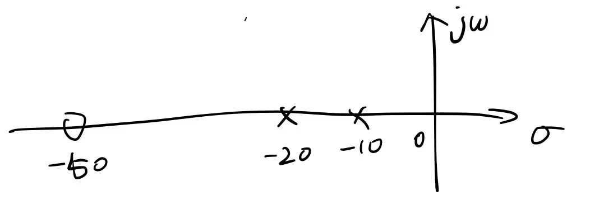

# 数字信号处理

## 第 1 题

### 1.

**(1)**

对于 $x(t) = te^{-(t-2)}u(t-1)$

求拉普拉斯变换有

$
\begin{aligned}
X(s) &= \int_{0^{-}}^{\infty}te^{-(t-2)}u(t-1)e^{-st}\mathrm{d}t  \\
&= \int_{1^{-}}^{\infty}te^{-(t-2)}e^{-st}\mathrm{d}t  \\
&= \frac{e^{2}}{(s+1)^{2}}\int_{1^{-}}^{\infty}(s+1)te^{-(s+1)t}\mathrm{d}(s+1)t  \\
&= \frac{(- (s + 1)t - 1) e^{- (s + 1)t + 2}}{(s+1)^{2}}|_{1^{-}}^{\infty}  \\
&= \frac{( s + 2 ) e^{- s + 1}}{(s+1)^{2}}  \\
\end{aligned}
$

收敛域为 $\sigma > -1$.

**(2)**

对于 $\displaystyle x(t) = e^{-at}f(\frac{t}{a})$, 已知 $\mathcal{L}[f(t)] = F(s)$, 设 $f(t)$ 收敛域为 $\sigma > \sigma_0$.

由展缩特性有 $\displaystyle \mathcal{L}[f(\frac{t}{a})] = aF(as)$, 收敛域变为 $\displaystyle \sigma > \frac{\sigma_0}{a}$.

由指数加权和有 $\displaystyle X(s) = \mathcal{L}[e^{-at}f(\frac{t}{a})] = aF(a(s+a)) = aF(as+a^{2})$,

收敛域为 $\displaystyle \sigma > \frac{\sigma_0}{a}-a$.

**(3)**

由于 $\displaystyle \mathcal{L}[\cos 2t] = \frac{s}{s^{2}+2^{2}} = \frac{s}{s^{2}+4}$,

由线性加权特性可得

$\displaystyle \mathcal{L}[t^{2}\cos(2t)] = \frac{\mathrm{d}^{2}\mathcal{L}[\cos 2t]}{\mathrm{d}s^{2}} = \frac{\mathrm{d}^{2}}{\mathrm{d}s^{2}}(\frac{s}{s^{2}+4}) = \frac{2 s (s^{2} - 12)}{(s^{2} + 4)^{3}}$

收敛域为 $\displaystyle \sigma > 0$.

**(4)**

由于 $\displaystyle \mathcal{L}[u(t)] = \frac{1}{s}$,

由线性加权特性可得

$\displaystyle \mathcal{L}[t^{n}u(t)] = (-1)^{n} \cdot \frac{\mathrm{d}^{n}}{\mathrm{d}s^{n}}(\frac{1}{s}) = \frac{n!}{s^{n+1}}$

收敛域为 $\displaystyle \sigma > 0$.

**(5)**

对于 $x(t) = \begin{cases}
    \sin(\omega t),  & 0 < t < \frac{T}{2}, T = \frac{2\pi}{\omega} \\
    0,  & \text{otherwise}
\end{cases}$

求拉普拉斯变换有

$
\begin{aligned}
X(s) &= \int_{0^{-}}^{\infty}x(t)e^{-st}\mathrm{d}t  \\
&= \int_{0^{-}}^{\frac{T}{2}}\sin(\omega t)e^{-st}\mathrm{d}t  \\
&= \int_{0^{-}}^{\frac{\pi}{\omega}}\frac{e^{j\omega t}-e^{-j\omega t}}{2j}e^{-st}\mathrm{d}t  \\
&= \frac{1}{2j(s-j\omega)}\int_{0^{-}}^{\frac{\pi}{\omega}}e^{-(s-j\omega)t}\mathrm{d}(s-j\omega)t  \\
&\quad\  - \frac{1}{2j(s+j\omega)}\int_{0^{-}}^{\frac{\pi}{\omega}}e^{-(s+j\omega)t}\mathrm{d}(s+j\omega)t  \\
&= \frac{-e^{-(s-j\omega)t}}{2j(s-j\omega)}|_{0^{-}}^{\frac{\pi}{\omega}} - \frac{-e^{-(s+j\omega)t}}{2j(s+j\omega)}|_{0^{-}}^{\frac{\pi}{\omega}}  \\
&= (\frac{-e^{-(s-j\omega)\frac{\pi}{\omega}}}{2j(s-j\omega)} - \frac{-1}{2j(s-j\omega)}) - (\frac{-e^{-(s+j\omega)\frac{\pi}{\omega}}}{2j(s+j\omega)} - \frac{-1}{2j(s+j\omega)})  \\
&= \frac{\omega(1 + e^{- \frac{\pi s}{\omega}})}{\omega^{2} + s^{2}}  \\
\end{aligned}
$

收敛域为 $\sigma > -\infty$.

### 2.

进行部分分式展开:

$\displaystyle X(s) = \frac{4s+5}{s^{2}+5s+6} = \frac{4s+5}{(s+2)(s+3)} = \frac{k_1}{s + 2} + \frac{k_2}{s + 3}$

其中

$\displaystyle k_1 = (s+2)X(s)|_{s=-2} = \frac{4s+5}{s+3}|_{s=-2} = -3$

$\displaystyle k_2 = (s+3)X(s)|_{s=-3} = \frac{4s+5}{s+2}|_{s=-3} = 7$

即有 $\displaystyle X(s) = -\frac{3}{s+2} + \frac{7}{s+3}$

进行拉普拉斯反变换可得

$\displaystyle x(t) = -3e^{-2t}u(t) + 7e^{-3t}u(t)$

## 第 2 题

**(1)**

由 $x(t) = u(t)$ 可知

零状态响应和激励信号的拉普拉斯变换分别为

$\displaystyle Y_{zs}(s) = \frac{1}{s} - \frac{1.6}{s+10} + \frac{0.6}{s+20} = \frac{4 (s + 50)}{s (s + 10) (s + 20)}, \quad \operatorname{Re}(s) > 0$

$\displaystyle X(s) = \frac{1}{s}, \quad \operatorname{Re}(s) > 0$

因此有系统函数

$\displaystyle H(s) = \frac{Y_{sz}(s)}{X(s)} = \frac{4 (s + 50)}{(s + 10) (s + 20)} = \frac{4 s + 200}{s^{2} + 30 s + 200}, \quad \operatorname{Re}(s) > -10$

对应的零极点分布图为

**(2)**

由系统函数

$\displaystyle H(s) = \frac{Y_{sz}(s)}{X(s)} = \frac{4 (s + 50)}{(s + 10) (s + 20)} = \frac{4 s + 200}{s^{2} + 30 s + 200}, \quad \operatorname{Re}(s) > -10$

可得

$\displaystyle (s^{2} + 30 s + 200)Y_{zs}(s) = (4s + 200)X(s)$

两边进行拉普拉斯反变换, 可得描述系统的微分方程为

$\displaystyle y''(t) + 30y'(t) + 200y(t) = 4x'(t) + 200x(t)$

将系统函数进行部分分式展开有

$\displaystyle H(s) = \frac{Y_{sz}(s)}{X(s)} = \frac{4 (s + 50)}{(s + 10) (s + 20)} = \frac{k_1}{s + 10} + \frac{k_2}{s + 20}$

其中

$\displaystyle k_1 = (s+10)H(s)|_{s=-10} = \frac{4(s+50)}{s+20}|_{s=-10} = 16$

$\displaystyle k_2 = (s+20)H(s)|_{s=-20} = \frac{4(s+50)}{s+10}|_{s=-20} = -12$

因此我们有

$\displaystyle H(s) = \frac{Y_{sz}(s)}{X(s)} = \frac{4 (s + 50)}{(s + 10) (s + 20)} = \frac{16}{s + 10} - \frac{12}{s + 20}$

再进行拉普拉斯反变换, 可得系统冲击响应为

$\displaystyle h(t) = (16e^{-10t} - 12e^{-20t})u(t)$

**(3)**

系统冲击响应 $\displaystyle h(t) = (16e^{-10t} - 12e^{-20t})u(t)$,

满足 $h(t) = 0, t < 0$, 因此系统为因果系统.

由 (1) 中零极点分布图可以看出, 系统的极点位于 $s$ 左半平面, 因此系统稳定.

