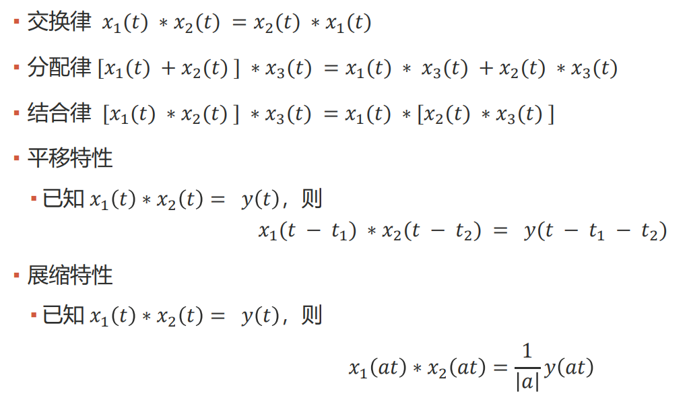
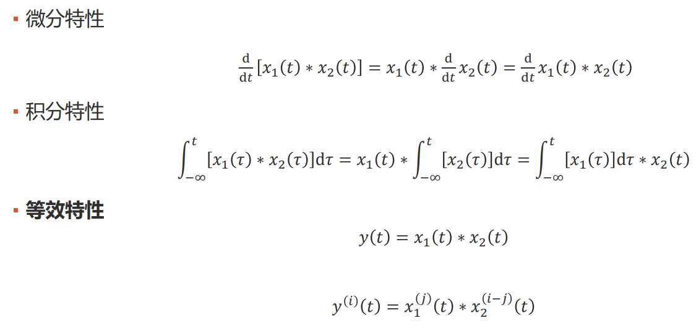
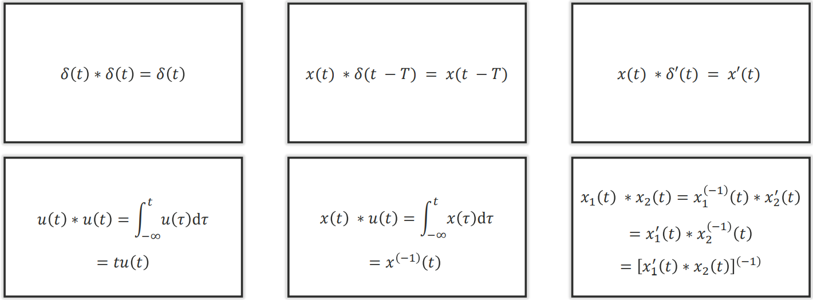
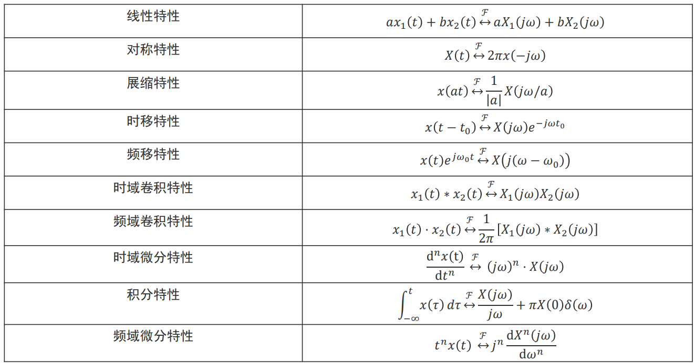

# 傅里叶变换 (Fourier transform)

## 0. 数学知识

### 0.1 卷积公式

$\displaystyle x(t)*h(t) = \int_{-\infty}^{+\infty}x(\tau)h(t-\tau)\mathrm{d}\tau$

对于脉冲函数 $\delta(t)$ 来说

$\displaystyle x(t)*\delta(t) = \int_{-\infty}^{+\infty}x(\tau)\delta(t-\tau)\mathrm{d}\tau = x(t)$

这也相等于说明了函数可以看作一个无穷维的向量, 其中 $\delta(t-\tau)$ 是一系列正交基.

## 1. 傅里叶级数

### 1.1 函数内积

函数可以看作一个无穷维的向量, 因此也定义其内积.

首先我们定义区间 $(t_0, t_0+T)$ 上的内积:

$\displaystyle \left<f(t), g(t) \right> = \int_{t_0}^{t_0+T}f(t)\overline{g(t)}\mathrm{d}t$

注意复函数要取共轭. (复向量内积时, 取共轭有助于保证自身内积 $\left\| \alpha \right\|^{2}$ 为正)

该定义是 $n$ 维向量内积

$\displaystyle \left<\alpha, \beta \right> = \sum_{i=1}^{n}\alpha_i\beta_i$

的自然推广.

### 1.2 三角函数族

三角函数族

$\{ \cos n\omega t, \sin n\omega t \}, n=0,1,2,\cdots,\infty$

是在 $(t_0, t_0+T)$ 上的完备正交集, 其中 $\displaystyle \omega = \frac{2\pi}{T}$

- 任意两个不同函数的乘积在 $[t_0, t_0+T]$ 上内积等于零
    - $\displaystyle \int_{t_0}^{t_0+T}\cos n\omega t\cdot \cos m\omega t \mathrm{d}t=\frac{1}{2}[\cos (n+m)\omega t+\cos (n-m)\omega t] = 0$
    - 其他使用积化和差公式同理
- 任一函数的平方在 $[t_0, t_0+T]$ 上的内积都不等于零
    - $\displaystyle \left\| \sin n\omega t \right\|^{2}= \left\| \cos n\omega t \right\|^{2}=\frac{T}{2}$
    - $\displaystyle \left<1, 1 \right> = T$

因此我们可以使用三角函数族来变换一个函数的正交基

$\displaystyle x(t) = a_0 + \sum_{n=1}^{\infty}a_n\cos n\omega t + \sum_{n=1}^{\infty}b_n\sin n\omega t$

其中

- $\displaystyle a_0 = \frac{\left<x(t), 1\right>}{\left<1, 1\right>} = \frac{1}{T}\int_{t_0}^{t_0+T}x(t)\mathrm{d}t$
- $\displaystyle a_n = \frac{\left<x(t), \cos n\omega t\right>}{\left<\cos n\omega t, \cos n\omega t\right>} = \frac{2}{T}\int_{t_0}^{t_0+T}x(t)\cos n\omega t\mathrm{d}t$
- $\displaystyle b_n = \frac{\left<x(t), \sin n\omega t\right>}{\left<\sin n\omega t, \sin n\omega t\right>} = \frac{2}{T}\int_{t_0}^{t_0+T}x(t)\sin n\omega t\mathrm{d}t$

称为傅里叶级数 (三角函数形式).

### 1.3 指数函数族

指数函数族

$\{ e^{jn\omega t} \}, n=0, \pm 1,\pm 2,\cdots,\pm \infty$

是在 $(t_0, t_0+T)$ 上的完备正交集, 其中 $\displaystyle \omega = \frac{2\pi}{T}$

这是因为

$\displaystyle \left<e^{jn\omega t}, e^{jm\omega t} \right> = \int_{t_0}^{t_0+T}e^{jn\omega t}\cdot e^{-jn\omega t}\mathrm{d}t = \int_{t_0}^{t_0+T}e^{j(n-m)\omega t}\mathrm{d}t = \begin{cases}
T, n=m \\ 0, n\neq m\end{cases}$

满足

- 任意两个不同函数的乘积在 $[t_0, t_0+T]$ 上内积等于零
- 任一函数的平方在 $[t_0, t_0+T]$ 上的内积都不等于零

因此我们可以使用指数函数族来变换一个函数的正交基

$\displaystyle x(t) = \sum_{n=-\infty}^{+\infty}X_n e^{jn\omega t} = \sum_{n=-\infty}^{+\infty}X_n(\cos n\omega t + j\sin n\omega t)$

因此我们其实也有 $\begin{cases}a_n = X_n+X_{-n} \\ b_n = j(X_n-X_{-n})\end{cases}$

即有 $\begin{cases}\displaystyle X_0 = \frac{a_0}{2} \\ \displaystyle X_n = \frac{a_n - j b_n}{2} \\ \displaystyle X_{-n} = \frac{a_n + j b_n}{2}\end{cases}$

其中

$\displaystyle X_n = \frac{\left<x(t), e^{jn\omega t} \right>}{\left<e^{jn\omega t}, e^{jn\omega t} \right>} = \frac{1}{T}\int_{t_0}^{t_0+T}x(t)\cdot e^{-jn\omega t}\mathrm{d}t$

注意复函数要取共轭, 因此有个负号.

- 分析公式: $\displaystyle X_n = \frac{1}{T}\int_{t_0}^{t_0+T}x(t)e^{-jn\omega t}\mathrm{d}t$
- 合成公式: $\displaystyle x(t) = \sum_{n=-\infty}^{+\infty}X_n e^{jn\omega t}$

## 2. 数字信号处理的傅里叶变换

### 2.1 傅里叶变换

重新定义 $\displaystyle \omega_0 = \frac{2\pi}{T}$, 有

- 分析公式: $\displaystyle X_n = X(nj\omega_0) = \frac{1}{T}\int_{t_0}^{t_0+T}x(t)\cdot e^{-jn\omega_0 t}\mathrm{d}t$
    - 两边乘以 $T$ 得: $\displaystyle TX_n = \frac{2\pi}{\omega_0}X(nj\omega_0) = \int_{t_0}^{t_0+T}x(t)\cdot e^{-jn\omega_0 t}\mathrm{d}t$
- 合成公式: $\displaystyle x(t) = \sum_{n=-\infty}^{+\infty}X_n e^{jn\omega_0 t} = \sum_{n\omega_0=-\infty}^{+\infty}\frac{X(nj\omega_0)}{\omega_0} e^{jn\omega_0 t}\Delta(n\omega_0)$

令周期 $T \to \infty$, 即 $\omega_0 \to 0$,

则 $\omega = n\omega_0$ 变得连续, 并且重新定义 $\displaystyle X(j\omega) = \frac{2\pi}{\omega_0}X(nj\omega_0)$,

则我们有

- $n\omega_0 \to \omega$
- $\Delta(n\omega_0) \to \mathrm{d}\omega$
- $\displaystyle \frac{X(jn\omega_0)}{\omega_0} \to \frac{X(j\omega)}{2\pi}$
- $\displaystyle \sum_{n\omega_0=-\infty}^{+\infty} \to \int_{-\infty}^{+\infty}$

因此到傅里叶变换, 可以适用于非周期信号.

- $\displaystyle X(j\omega) = \int_{-\infty}^{+\infty}x(t)e^{-j\omega t}\mathrm{d}t$
- $\displaystyle x(t) = \frac{1}{2\pi}\int_{-\infty}^{+\infty}X(j\omega)e^{j\omega t}\mathrm{d}\omega$

前者称为 **傅里叶正变换**, 后者称为 **傅里叶逆变换**.

其中 $X(\omega)$ 是 $x(t)$ 的频谱函数, 一般是复函数, 可以写作

- $X(\omega) = |X(\omega)|e^{j\varphi(\omega)}$

并且 $|X(\omega)|$ 是 $X(\omega)$ 的模, 代表信号中各频率分量的相对大小, $\varphi(\omega)$ 是 $X(\omega)$ 的相位函数, 代表信号中各频率分量之间的相位关系. 二者对应的曲线分别称为幅度频谱和相位频谱.

如果 $x(t)$ 是实函数, 则 $|X(\omega)|$ 是偶函数, $\varphi(\omega)$ 是奇函数.

### 2.2 周期函数的傅里叶变换

由于周期信号不满足傅里叶变换的绝对可积条件, 所以我们无法直接使用

- $\displaystyle X(j\omega) = \int_{-\infty}^{+\infty}x(t)e^{-j\omega t}\mathrm{d}t$
- $\displaystyle x(t) = \frac{1}{2\pi}\int_{-\infty}^{+\infty}X(j\omega)e^{j\omega t}\mathrm{d}\omega$

但是我们可以通过周期函数的傅里叶级数来推导

由 $\mathcal{F}[1]=2\pi \delta(\omega)$ 和频移特性可得 $\mathcal{F}[e^{j\omega_0t}] = 2\pi\delta(\omega-\omega_0)$

$x(t)$ 的傅里叶级数为

$\displaystyle x(t) = \sum_{n=-\infty}^{+\infty}X_n e^{jn\omega_0t}$

两边同时取傅里叶变换得

$\displaystyle \mathcal{F}[x(t)] = \mathcal{F}\left[ \sum_{n=-\infty}^{\infty}X_ne^{jn\omega_0t} \right] = \sum_{n=-\infty}^{\infty}X_n\mathcal{F}\left[ e^{jn\omega_0t} \right] = 2\pi\sum_{n=-\infty}^{+\infty}X_n\delta(\omega-n\omega_0)$

因此有

- $\displaystyle \mathcal{F}[x(t)] = 2\pi\sum_{n=-\infty}^{+\infty}X_n\delta(\omega-n\omega_0)$
- $\displaystyle X_n = \frac{1}{T}\int_{t_0}^{t_0+T}x(t)e^{-jn\omega_0t}\mathrm{d}t$

说明有

- 周期信号 $x(t)$ 的傅里叶变换有位于 $0, \pm \omega_0, \pm 2\omega_0, \cdots$ 处的冲激信号组成, 冲激信号的强度等于对应傅里叶级数系数的 $2\pi$ 倍.
- 傅里叶变换反应频谱密度, 因此周期信号的傅里叶变换不是有限值, 是冲激函数, 表明在无穷小的频带范围内取得无穷大的频谱值.
- 周期信号的频谱是离散的.

### 2.3 时域采样的频域分析

由于

$\displaystyle \mathcal{F}[\delta_{T_s}(t)] = X(j\omega) = 2\pi\sum_{-\infty}^{+\infty}X_n\delta(\omega-n\omega_s)=\omega_s\sum_{n=-\infty}^{+\infty}\delta(\omega-n\omega_s)$

因此有

$\displaystyle \mathcal{F}[x_s(t)] = \frac{1}{2\pi}[X(j\omega)*\omega_s\sum_{-\infty}^{+\infty}\delta(\omega-n\omega_s)] = \frac{1}{T_s}\sum_{-\infty}^{+\infty}X(j(\omega-n\omega_s))$

时域对信号做离散化, 频域表现为原始时域信号频谱 $X(j\omega)$ 的周期延拓 (重复), 时域的离散化导致了频域的周期性.

反之亦然, 因此一个域的离散化和另一个域的周期性相对应.

### 2.4 时域采样定理

采样定理: 若连续信号 $x(t)$ 是一个频带受限信号 (若 $\left| \omega \right| > \omega_m$ 则 $X(j\omega)=0, \omega_m=2\pi f_m$), $x(t)$ 的等间隔样本值 $x_s(t)$, 用 $x_s(t)$ 唯一表示 $x(t)$ 的条件是

$\displaystyle T_s < \frac{1}{2 f_m}$ 即 $\omega_s > 2\omega_m$

$f_s = 2 f_m$ 为最小采样频率, 称为 Nyquist Rate.

