# 数字信号

## 00. 导论

- 信号
    - 消息 (message): 通常把来自外界的各种报道统称为消息. 
    - 信息 (information): 通常把消息中有意义的内容称为信息. 
    - 信号 (signal): 信号是反映信息的各种物理量, 是系统直接进行加工, 变换以实现通信的对象. 信号一般是随时间变化的有限的实值函数. 
    - 信号是信息 (消息)的表现形式, 信息 (消息)是信号的具体内容. 信号是传递信息的载体, 是反映信息的物理量；如: 电压, 电流, 电磁场, 声音, 烽火, 信鸽.
- 信号分类
    - 信号输入角度
        - 连续信号: 在观测过程的连续时间范围内信号有确定的值. 允许在其时间定义域上存在有限个间断点. 通常以 $x(t)$ 表示. 
        - 离散信号: 信号仅在规定的离散时刻有定义. 通常以 $x[n]$ 表示. 
    - 信号输出角度
        - 模拟信号: 在任意时刻的取值是连续的连续信号. 
        - 数字信号: 取值为离散的离散信号. 
- 信号的描述
    - 连续信号
        - 函数描述: 使用数学表达式, 把信号描述为一个或若干个自变量的函数或序列的形式. 
        - 波形描述: 按照函数自变量的变化关系, 画出信号波形. 
    - 离散信号
        - 函数表示
        - 波形表示
        - 列表表示
        - 序列的表格表示
- 信号的分类
    - 确定信号: 信号随时间变化服从确定的规律, 能够以确定的时间函数表示的信号, 一般是人工设计的信号.
    - 随机信号: 不能预知信号随时间变化的规律, 信号的幅度, 相位一般使用概率分布/统计特性描述, 一般是自然界产生的信号.
    - 时间序列分析: 针对离散随机信号进行分析, 建模, 预测.
- 信号的处理
    - 信号的处理: 对信号进行加工或变换.
    - 信号传输, 交换, 处理相互密切联系, 又各自组成独立的学科体系. 它们共同的理论基础之一是要研究信号的基本性能, 包括信号的描述, 分解, 变换, 检测, 特征提取等.
- 系统
    - 系统 (system) 是指若干相互关联的事物组合而成具有特定功能的整体, 如电路系统, 通讯系统, 电力系统, 机械系统, 计算机网络, 交通网络, 神经元系统等等. 
    - 信号与系统是相互依存的整体. 
        - 信号必定是由系统产生, 发送, 传输与接收, 离开系统没有孤立存在的信号；
        - 系统的重要功能就是对信号进行加工, 变换与处理, 没有信号的系统就没有存在的意义.
- 基本概念
    - 时域: 以时间为自变量描述信号和系统.
    - 频率: 信号每单位时间变化的次数 (Hz), 是描述信号周期性的物理量. 类比“时间”, 是描述信号的另一个维度.
    - 频域: 以频率为自变量描述信号和系统. 如果不以频率为基本单位, 也称为 “变换域”.
    - 频谱: 信号的频域表示, 描述信号各个频率分量的幅度和相位.

**二角和差公式**

**和差化积与积化和差公式**

## 01. 信号的时域分析

### 1.1 信号的分类

- 周期信号
    - 连续周期信号: $\forall t \in  \mathbb{R}$, 存在正数 $T$, 使得 $x(t + T) = x(t)$.
    - 离散周期信号: $\forall n \in \mathbb{N}$, 存在正整数 $N$, 使得 $x[n + N] = x[n]$.
    - 满足上述条件的最小的正 $T$, 正 $N$ 称为信号的基波周期 (fundamental period). 
- 周期信号 $x(t)$, $y(t)$ 的周期为 $T_1$ 和 $T_2$, 若周期之比 $T_1/T_2$ 为有理数, 则其和信号 $x(t) + y(t)$ 仍然是周期信号, 其周期为 $T_1$ 和 $T_2$ 的最小公倍数. 
    - 连续信号的周期性
        - 可以用辗转相除法 (余数是否为零) 得到最大公因数, 然后用两者乘积除以最大公因数即得最小公倍数.
        - 周期信号可能分解为周期信号, 非周期信号也可能分解为周期信号, 如 $\cos 2t + \sin \pi t$.
        - 由积化和差公式可知, 正弦余弦信号乘积也是周期信号.
    - 离散信号的周期性
        - 离散信号可视为连续 (包络线) 信号和周期脉冲的乘积.
        - 离散信号的周期性和连续信号以及周期脉冲信号的周期有关.
        - 连续正弦信号一定是周期信号, 而正弦序列不一定是周期序列. 
        - 两连续周期信号之和不一定是周期信号, 而两周期序列之和一定是周期序列. 
- 因果信号
    - 若当 $t < 0$ 时 $f(t) = 0$, 当 $t > 0$ 时 $x(t) \neq 0$ 的信号, 称为因果信号.
    - 非因果信号指的是在时间零点之前有非零值. 
- 一维信号与多维信号
    - 信号可以表示为一个或多个变量的函数, 称为一维或多维函数. 

### 1.2 信号的运算

- 连续信号的运算
    - 尺度变换: $x(t) \to x(at)$ 扩大到原来的 $1 / a$ 倍
    - 翻转: $x(t) \to x(-t)$
    - 时移: $x(t) \to x(t - t_0)$ 右移 $t_0$
    - 相加: $x(t) = x_1(t) + x_2(t)$
    - 相乘: $x(t) = x_1(t) \cdot x_2(t)$
    - 单信号变换画波形: 先尺度变化, 再翻转, 最后时移.

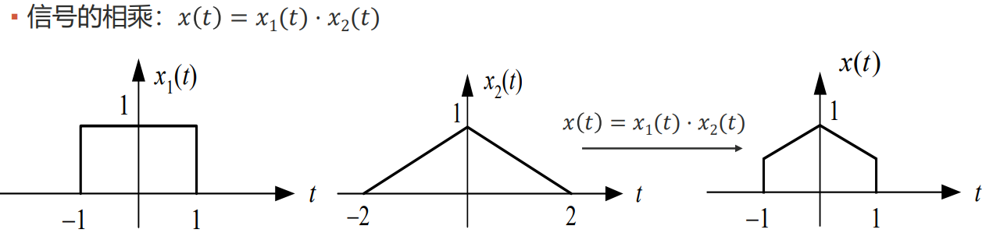

- 离散信号的运算
    - 翻转: $x[n] \to x[-n]$
    - 时移: $x[n] \to x[n - k]$ 右移 $k$
    - 相加: $x[n] = x_1[n] + x_2[n]$
    - 相乘: $x[n] = x_1[n] \cdot x_2[n]$

### 1.3 经典的信号

- 抽样信号: $\displaystyle \operatorname{Sa}(t) = \frac{\sin t}{t}$
- $\displaystyle \operatorname{sinc}(t) = \frac{\sin \pi t}{\pi t}$

- 虚指数序列: $x[n] = e^{j\omega_0 n}$
    - 针对 $\omega_0$ 频率振荡的周期性 $e^{j(\omega_0+2k\pi)n} = e^{j\omega_0 n}$
    - $e^{j \omega_0 n}$ 对于 $\omega_0$ 的周期为 $2\pi$, 不具有随 $\omega_0$ 增加而增加振荡速率的性质.
    - 频率为 $\omega_0, \omega_0 \pm 2\pi, \omega_0 \pm 4\pi, \cdots$ 的虚指数信号, 只需要考虑一个大小为 $2\pi$ 的间隔即可.

- 虚指数序列: $x[n] = e^{j\omega_0 n}$
    - $\displaystyle \frac{\omega_0}{2\pi}$ 是有理数, 则虚指数序列 $e^{j \omega_0 n}$ 是周期序列, 否则不是周期序列.

**其他离散信号**:

- 离散时间单位脉冲 $\delta[n]=\begin{cases} 1, & n=0 \\ 0, & n\neq 0 \end{cases}$
    - 基本性质
        - $x[n]\delta[n] = x[0]\delta[n]$
        - $x[n]\delta[n-n_0] = x[n_0]\delta[n-n_0]$
    - 表示任意离散时间信号
        - $x[n] = \delta[n] + 2\delta[n - 1] + 2\delta[n - 2]$
- 单位阶跃序列 $u[n] = \begin{cases} 1, & n \ge 0 \\ 0, & n < 0 \end{cases}$
    - 看作延时脉冲的叠加 $\displaystyle u[n] = \sum_{k=0}^{\infty}\delta[n-k]$
    - 与单位脉冲序列互相表示
        - $\delta[n] = u[n] - u[n-1]$
        - $u[n] = \sum_{m=-\infty}^{n}\delta[m]$

### 1.4 信号的分解

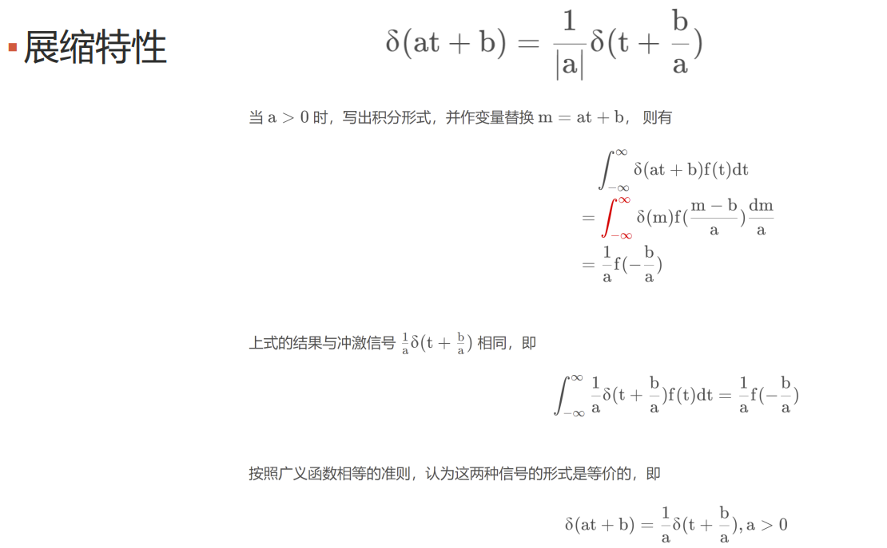

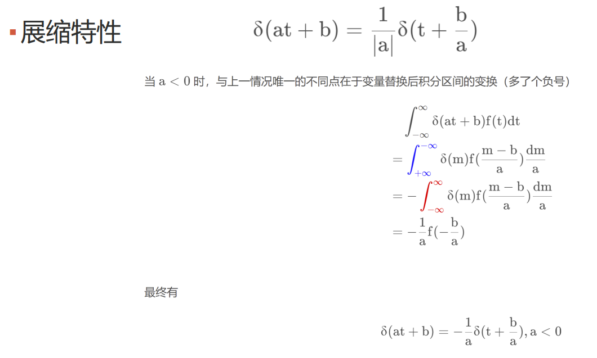

## 02. 系统的时域分析

- 系统
    - 系统是指由相互作用和依赖的若干事物组成的, 具有特定功能的整体.

### 2.1 系统的分类和描述

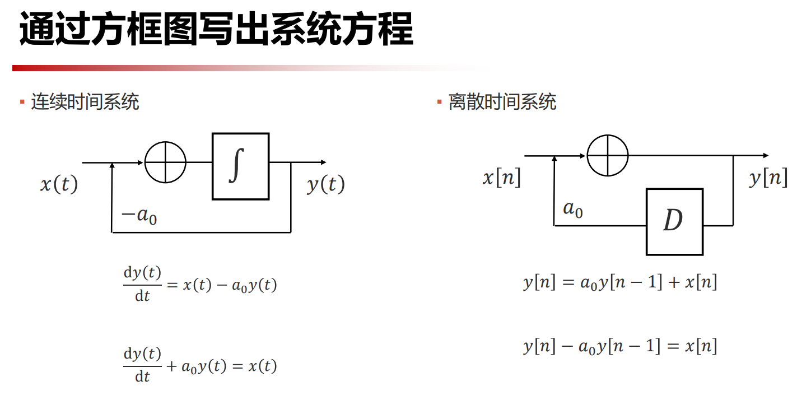

- 记忆系统和无记忆系统
    - 无记忆系统: 系统的输出只取决于系统该时刻的输入
- 可逆系统
    - 系统在不同的输入下, 导致不同的输出, 则系统可逆
    - 如果一个系统可逆, 则存在一个逆系统, 系统与逆系统级联, 作用等效于恒等系统
- 因果系统
    - 当且仅当输入信号激励系统时才产生系统输出响应的系统.
    - 如果响应 $y(t)$ 并不依赖于将来的激励如 $x(t + 1)$, 那么系统就是因果的
- 稳定系统
    - 稳定系统在微小的输入下的响应不会发散
    - 指有界输入产生有界输出的系统
    - BIBO: Bounded Input, Bounded Output
    - 不稳定系统: $y(t) = tx(t)$

### 2.2 卷积

### 2.3 卷积的性质

### 2.4 卷积的应用

- 利用卷积分析系统
    - 结合律: 级联系统的冲激响应等于两个子系统冲激响应的卷积
    - 交换律: 交换两个级联系统的先后连接次序不影响系统总的冲激响应
    - 分配律: 并联系统的冲激响应等于两个子系统冲激响应之和
- 用卷积分析因果系统
    - 因果系统是指系统 $t_0$ 时刻的输出只和 $t_0$ 时刻及以前的输入信号有关
    - LTI系统因果的充分必要条件
        - 因果连续时间 LTI 系统的冲激响应必须满足 $h(t) = 0, t < 0$
        - 因果离散时间 LTI 系统的单位脉冲响应必须满足 $h[n] = 0, n < 0$

## 03. 系统的时域分析

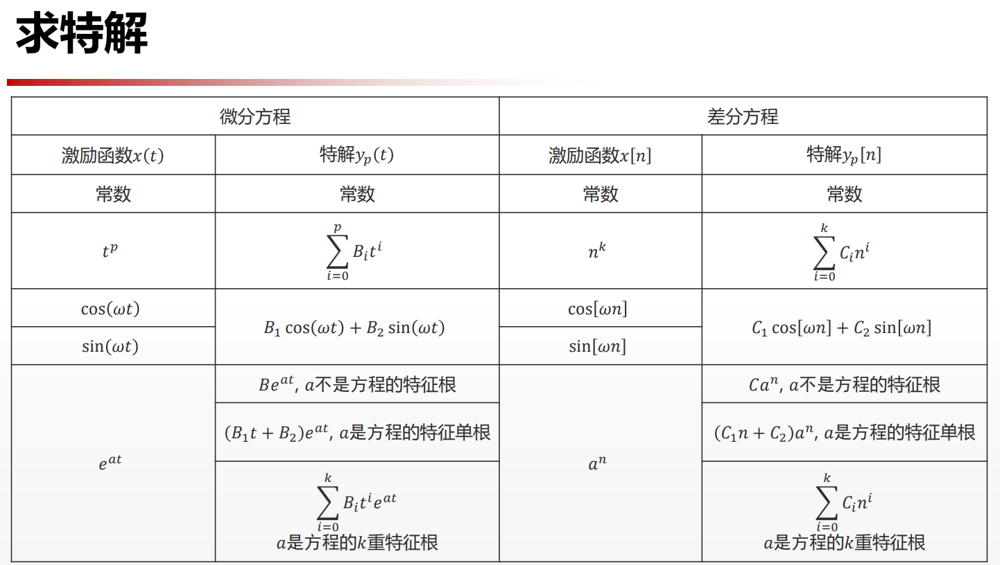

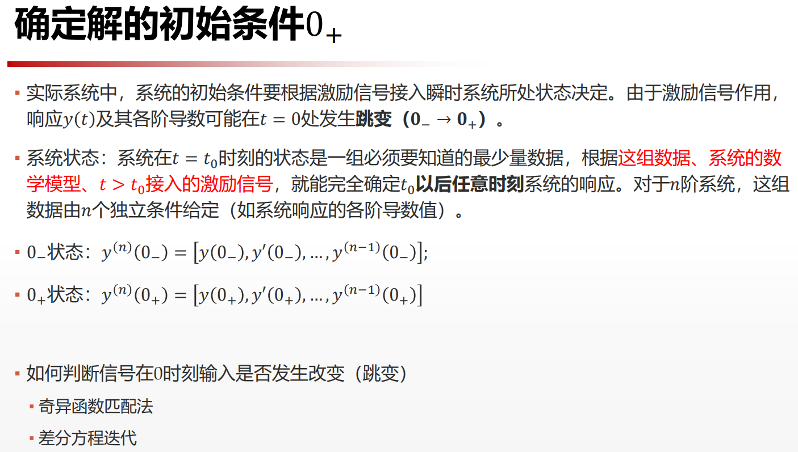

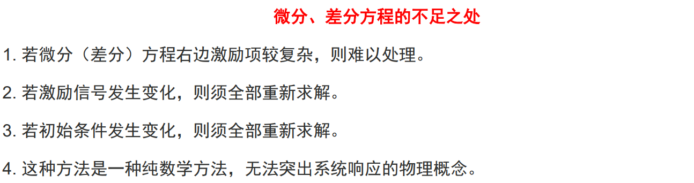

## 04. 信号的傅里叶级数

### 4.1 傅里叶级数的定义

我们可以使用指数函数族来变换一个函数的正交基

$\displaystyle x(t) = \sum_{n=-\infty}^{+\infty}X_n e^{jn\omega t} = \sum_{n=-\infty}^{+\infty}X_n(\cos n\omega t + j\sin n\omega t)$

因此我们其实也有 $\begin{cases}a_n = X_n+X_{-n} \\ b_n = j(X_n-X_{-n})\end{cases}$

即有 $\begin{cases}\displaystyle X_0 = \frac{a_0}{2} \\ \displaystyle X_n = \frac{a_n - j b_n}{2} \\ \displaystyle X_{-n} = \frac{a_n + j b_n}{2}\end{cases}$

其中

$\displaystyle X_n = \frac{\left<x(t), e^{jn\omega t} \right>}{\left<e^{jn\omega t}, e^{jn\omega t} \right>} = \frac{1}{T}\int_{t_0}^{t_0+T}x(t)\cdot e^{-jn\omega t}\mathrm{d}t$

注意复函数要取共轭, 因此有个负号.

- 分析公式: $\displaystyle X_n = \frac{1}{T}\int_{t_0}^{t_0+T}x(t)e^{-jn\omega t}\mathrm{d}t$
- 合成公式: $\displaystyle x(t) = \sum_{n=-\infty}^{+\infty}X_n e^{jn\omega t}$

### 4.2 傅里叶级数和频域

- 频域将信号表示为不同频率正弦分量的线性组合
    - 从信号分析的角度, 将信号表示为不同频率正弦分量的线性组合, 为不同信号之间进行比较提供了途径.
    - 从系统分析角度, 已知单频正弦信号激励下的响应, 利用迭加特性可求得多个不同频率正弦信号同时激励下的总响应,及每个正弦分量通过系统后的变化.

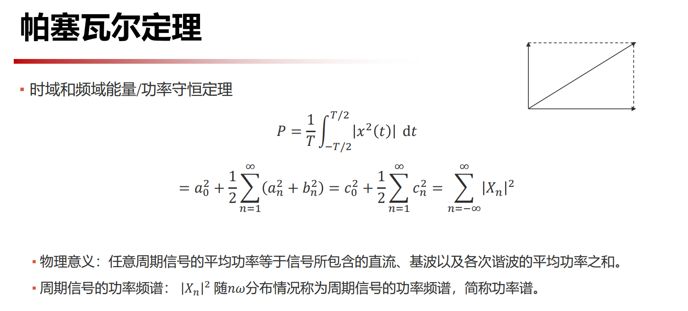

### 4.3 傅里叶级数的计算

### 4.4 系统函数

## 05. 信号的傅里叶变换

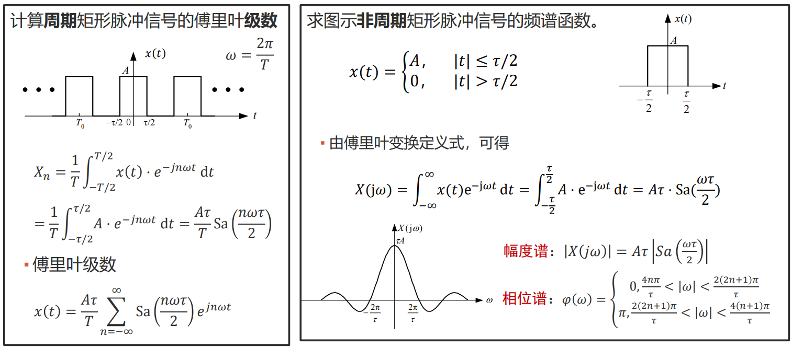

### 5.1 典型信号的傅里叶变换

### 5.2 傅里叶变换的性质

### 5.3 周期信号的傅里叶变换

## 06. 信号的采样

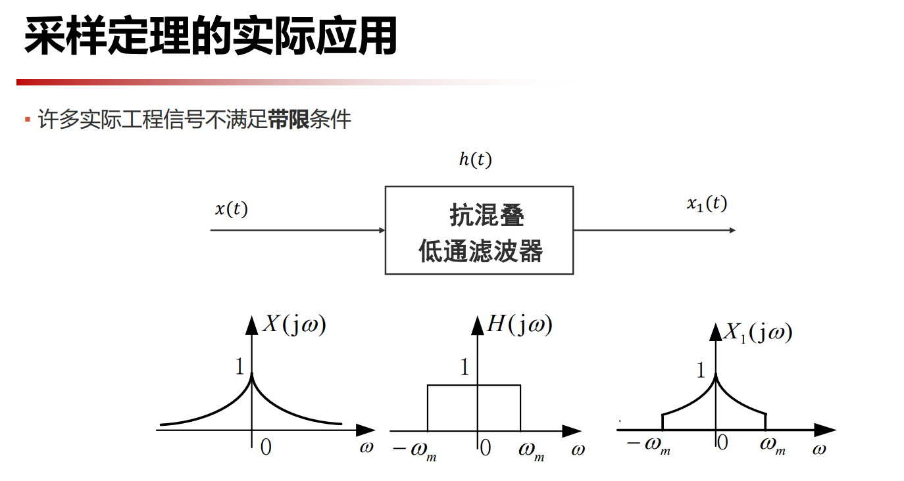

## 07. 调制, 解调和滤波

- 通信: 把发送者拥有的消息传递给接收者
- 为达到通信的目的, 
    - 要把信源消息经发送设备转变为适合信道传输的信号, 因此需要进行调制, 编码, 放大等操作. 
    - 发送和接收设备还可能包括多路复用, 加密, 纠错等处理设备
    - 传输媒介也成为信道, 可为导线, 电缆, 光纤等. 混入信道的噪声无法避免, 在构建通信系统时需要考虑噪声的影响. 
- 按照传输介质分类: 
    - 有线信道 (电缆, 光缆等)
    - 无线信道 (长波, 中波, 短波, 微波, 光通信)
- 按照频率范围分类, 不同波段使用的传输媒质不同
    - 如短波使用同轴电缆

## 08. 离散信号的傅里叶变换

### 8.1 序列的傅里叶变换

### 8.2 离散信号的频域分析

### 8.3 离散傅里叶变换

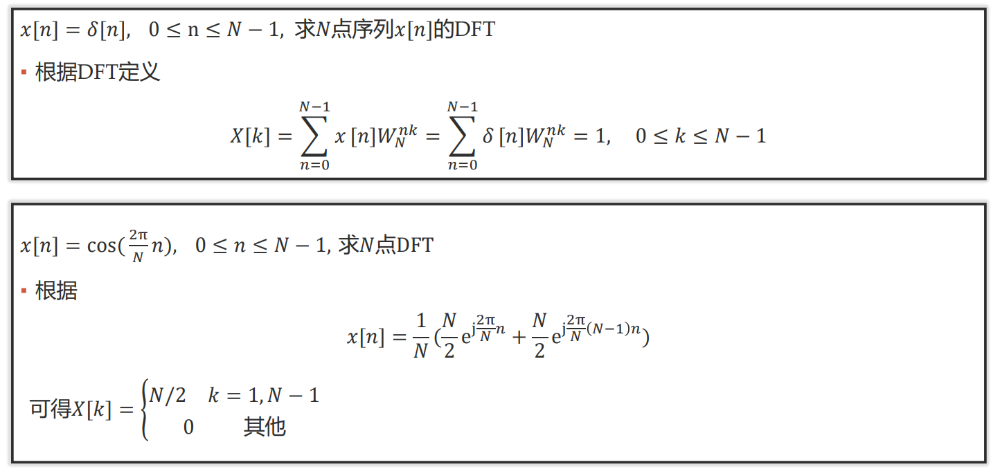

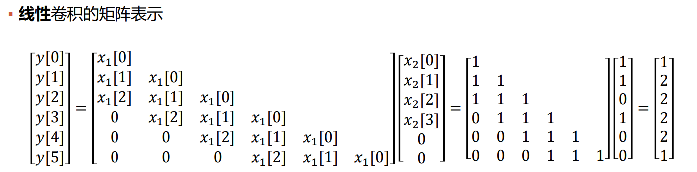

### 8.4 快速傅里叶变换

- 离散傅里叶变换 (DFT):
    - $\displaystyle F(u) = \sum_{x=0}^{M-1}f(x) (e^{-j 2\pi u / M})^x = \sum_{x=0}^{M-1}f(x)(\omega_{M}^{u})^{x}$
- 离散傅里叶反变换 (IDFT):
    - $\displaystyle f(x) = \frac{1}{M}\sum_{u=0}^{M-1}F(u) (e^{j 2\pi x / M})^u = \frac{1}{M}\sum_{u=0}^{M-1}F(u)(\omega_{M}^{-x})^u$

其中 $\omega_{M}^{k} = e^{-j 2\pi k / M}$ 代表着复平面上将单位圆 $M$ 等分, 并以原点为起点, 以 $k$ 等分点为终点形成的向量. 

因此我们很自然地就能得到两个相关性质:

- 折半引理: $\omega_{2M}^{2k} = \omega_{M}^{k}$
    - 由几何意义可知, 两者表示的向量终点是一样的.
- 消去引理: $\omega_{M}^{k + M / 2} = -\omega_{M}^{k}$
    - 由几何意义可知, 两者表示的向量方向恰好相反.

> 一个 $n - 1$ 次多项式在 $n$ 个不同点处的取值唯一确定了该多项式.

因此, 我们也可以将离散傅里叶变换视作 **多项式的点值表示** 过程. 其中 $f(x)$ 是多项式的系数, $\omega_{M}^{k}$ 是我们带入的不同点, 最后求出点值表示 $F(u)$.

我们对多项式 $\displaystyle f(x) = \sum_{i=0}^{n-1}a_ix^{i}$ 进行研究, 我们带入 $x=\omega_{n}^{k}$, 并对多项式以奇偶的方式进行划分, 则有

$
\begin{aligned}
f(x) &= (a_0x^{0} + a_2x^{2} + \cdots + a_{n-2}x^{n-2}) \\
&+ (a_1x^{1} + a_3x^{3} + \cdots + a_{n-1}x^{n-1}) \\
\end{aligned}
$

令 $f_1(x) = a_0x^{0} + a_2x^{1} + \cdots + a_{n-2}x^{\frac{n}{2}-1}$, $f_2(x) = a_1x^{0} + a_3x^{1} + \cdots + a_{n-1}x^{\frac{n}{2}-1}$

则有 $f(x) = f_1(x^{2}) + xf_2(x^{2})$

带入 $x = \omega_{n}^{k}$ 有

$
\begin{aligned}
f(\omega_{n}^{k}) &= f_1(\omega_{n}^{2k}) + \omega_{n}^{k}f_2(\omega_{n}^{2k}) \\
&= f_1(\omega_{\frac{n}{2}}^{k}) + \omega_{n}^{k}f_2(\omega_{\frac{n}{2}}^{k}) \\
\end{aligned}
$

带入 $x = \omega_{n}^{k+\frac{n}{2}}$ 有

$
\begin{aligned}
f(\omega_{n}^{k+\frac{n}{2}}) &= f_1(\omega_{n}^{2k+n}) + \omega_{n}^{k+\frac{n}{2}}f_2(\omega_{n}^{2k+n}) \\
&= f_1(\omega_{n}^{2k}\cdot \omega_{n}^{n}) - \omega_{n}^{k}f_2(\omega_{n}^{2k}\cdot \omega_{n}^{n}) \\
&= f_1(\omega_{n}^{2k}) - \omega_{n}^{k}f_2(\omega_{n}^{2k}) \\
&= f_1(\omega_{\frac{n}{2}}^{k}) - \omega_{n}^{k}f_2(\omega_{\frac{n}{2}}^{k}) \\
\end{aligned}
$

其中 $\displaystyle k < \frac{n}{2}$.

由此可见, 我们只需要递归地求出 $f_1(\omega_{\frac{n}{2}}^{k}), f_2(\omega_{\frac{n}{2}}^{k})$ 即可 $O(1)$ 地合并结果.

因此我们能够用 $O(\log n)$ 的时间复杂度求出 $f(\omega_{n}^{k})$, 进而可以用 $O(n\log n)$ 的时间复杂度求出所有的 $f(\omega_{n}^{k}), k=0,2,\cdots,n-1$.

### 8.5 数字图像的傅里叶分析方法

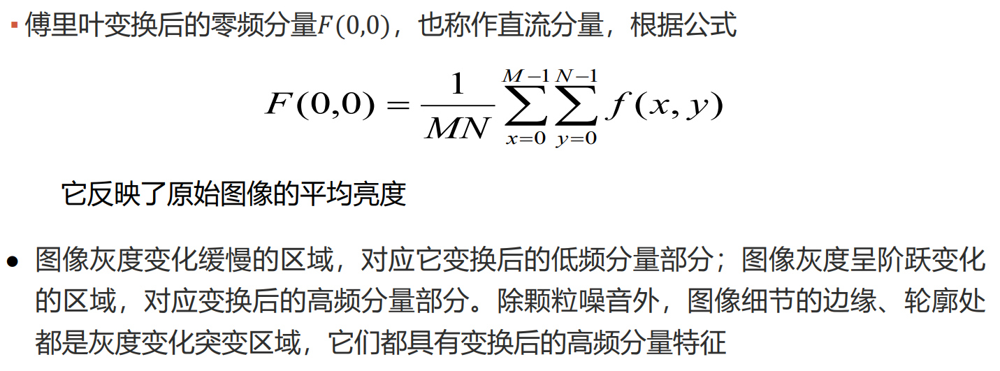

## 09. 拉普拉斯变换及其应用

### 9.1 拉普拉斯变换

### 9.2 单边拉普拉斯变换的计算

### 9.3 单边拉普拉斯变换的性质

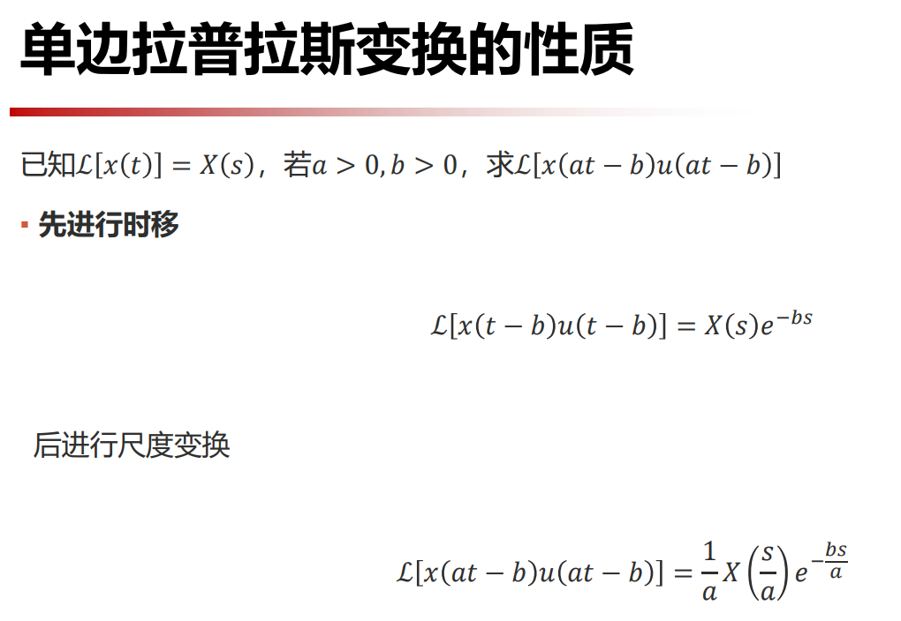

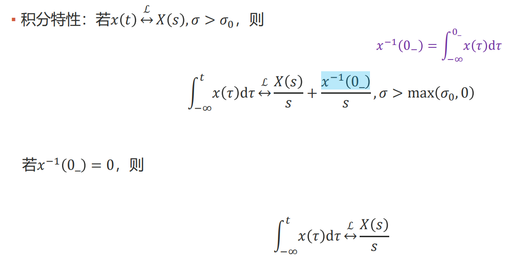

### 9.4 拉普拉斯反变换

## 10. Z 变换

### 10.1 Z 变换的定义

### 10.1 Z 变换的性质

### 10.3 Z 反变换及其应用

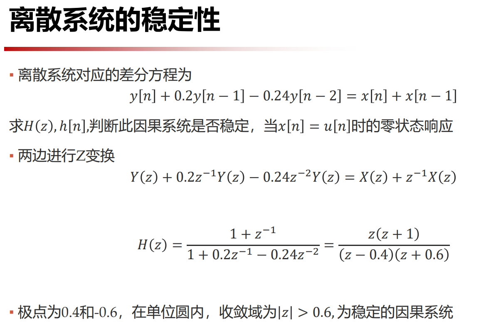

