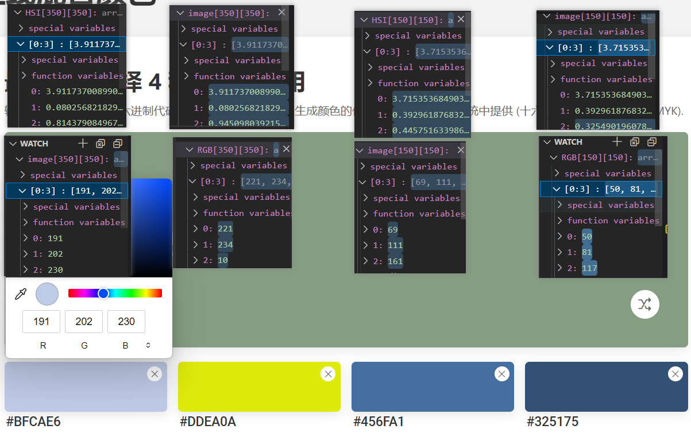
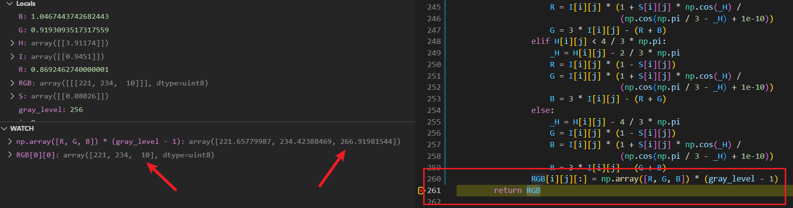

<style>
h1 {
    text-align: center;
}
h2, h3 {
    page-break-after: avoid; 
}
.center {
    margin: 0 auto;
    width: fit-content;
    margin-top: 2em;
    padding-top: 0.5em;
    padding-bottom: 0.5em;
    margin-bottom: 2em;
}
.title {
    font-weight: bold;
    border-top-style: solid;
    border-bottom-style: solid;
}
.newpage {
    page-break-after: always
}
@media print {
    @page {
        margin: 3cm;
    }
}
</style>

<h1 style="margin-top: 4em">
数字图像处理实验报告
</h1>

# <h1 class="center title">实验一：直方图均衡化</h1>

<div class="center">
<h3>院系：人工智能学院</h3>
<h3>姓名：方盛俊</h3>
<h3>学号：201300035</h3>
<h3>邮箱：201300035@smail.nju.edu.cn</h3>
<h3>时间：2022年9月29日</h3>
</div>

<div class="newpage"></div>

<!-- 生成目录 -->

## <h1>目录</h1>

[TOC]

<div class="newpage"></div>

<!-- 文章主体内容 -->

## 一、实现细节

### 1. 图像类的封装

本次实验我采用了 Python 语言进行代码的编写, 共计编写了 355 行代码, 其中用到了两个包: `numpy` 和 `matplotlib`.

- `numpy`: 用于在 Python 中进行快速的矩阵运算.
- `matplotlib`: 用于加载和显示图片.

为了方便后续进行图片处理, 图片显示和图片对比, 我首先封装了一个 `Image` 类, 其中重要的接口 (以及部分实现) 如下:

```python
class Image:
    '''
    图像类, 里面包括了图像初始化, 显示, 获取直方图, 直方图均衡化等方法
    '''

    def __init__(self, image: np.ndarray, *, gray_level=256) -> None:
        '''
        初始化图像, 传入图像矩阵 image
        还可以输入灰阶 gray_level, 默认为 256
        '''
        # 保存输入参数
        self._image = image
        self._gray_level = gray_level
        # ...

    def show(self) -> None:
        '''
        显示图像
        '''
        plt.figure(figsize=(20, 20))
        plt.imshow(self._image, cmap='gray' if self._is_gray_image else None)
        plt.show()

    def compare_with(self, before: Image) -> None:
        '''
        与前一张图像进行对比显示
        '''
        plt.figure(figsize=(20, 20))
        plt.subplots_adjust(wspace=0.5, hspace=1.0)
        # 显示两张图像
        plt.subplot(1, 2, 1)
        plt.title('Before')
        plt.imshow(before.get_image(),
                   cmap='gray' if before._is_gray_image else None)
        plt.subplot(1, 2, 2)
        plt.title('After')
        plt.imshow(self.get_image(),
                   cmap='gray' if self._is_gray_image else None)
        plt.show()

    def hist(self) -> np.ndarray:
        '''
        获取图像的直方图. 如果是灰度图像, 返回一维数组, 如果是彩色图像, 返回二维数组
        '''
        # ...

    def show_hist(self) -> None:
        '''
        显示图像的直方图
        '''
        # ...

    def compare_hist_with(self, before: Image):
        '''
        与前一张图的直方图进行对比
        '''
        # ...

    def histeq(self, *, method='gray') -> Image:
        '''
        进行图像直方图均衡化, 计算公式为 s = T(r) = round((L-1) * sum(p[0:r]) / N * M)
        对彩色图像进行直方图均衡化的方法有两种:
            1. 分通道灰度图像直方图均衡化
            2. HSI 空间直方图均衡化
        '''
        # ...
```

凭借这个经过精细封装的 `Image` 类, 我们就可以很简单地编写简洁的测试代码:

```python
# 灰色图像直方图均衡化
# 图像加载
img = Image(mpimg.imread('../asset/image/gray.jpg'))
# 显示直方图
img.show_hist()
# 比较图像
img.histeq().compare_with(img)
# 比较直方图
img.histeq().compare_hist_with(img)

# 彩色图像直方图均衡化
img = Image(mpimg.imread('../asset/image/color.jpg'))
img.histeq().compare_with(img)
img.histeq().compare_hist_with(img)
# 基于 HSI 色彩空间的直方图均衡化
img.histeq(method='hsi').compare_with(img)
img.histeq(method='hsi').compare_hist_with(img)
```

### 2. 灰度图像直方图均衡化

灰度图像直方图均衡化的步骤为:

第一步为计算出直方图, 即图像中 **不同灰度值的像素点的个数**, 最后结果 $p_r(r_k)$ 为长度为 $L$ 的一维数组.

第二步为基于直方图计算出一个能让变换后图像的直方图均衡化的变换函数 $s_k = T(r_k)$, 这一步是直方图均衡化的关键.

第三步为对旧图像中的每一个像素点, 从像素点原先的灰度值通过 $s_k = T(r_k)$ 转换到新的灰度值, 进而形成新的直方图均衡化后的图像.

使用数学公式进行表示即为:

1. 计算灰度概率 (直方图): $\displaystyle p_r(r_k) = \frac{n_k}{MN}, k=0,1,2,\cdots,L-1$
2. 计算变换: $\displaystyle s_k = T(r_k) = (L-1)\sum_{j=0}^{k}p_r(r_j)$
3. 对图像进行变换: $s(x,y) = T(r(x,y))$

基于该原理, 我的实现代码为:

```python
def get_hist_from_gray_image(gray_image: np.ndarray, *, gray_level=256) -> np.ndarray:
    '''
    获取灰度图像的直方图, 返回一个一维数组, 灰阶默认为 256, 数组的每个元素对应图像的每个灰度级的像素个数
    '''
    # 循环版本 (速度慢)
    # hist = np.zeros(gray_level)
    # for i in range(gray_image.shape[0]):
    #     for j in range(gray_image.shape[1]):
    #         hist[gray_image[i][j]] += 1

    # 矩阵版本 (速度快)
    hist = np.bincount(gray_image.flatten(), minlength=gray_level)
    return hist

def histeq_for_gray_image(image, *, gray_level=256) -> np.ndarray:
    '''
    进行灰度图像直方图均衡化, 计算公式为 s = T(r) = round((L-1) * sum(p[0:r]) / N * M)
    '''
    # 计算直方图
    hist = Image.get_hist_from_gray_image(image, gray_level=gray_level)
    # 计算累积直方图
    cum_hist = np.zeros(gray_level)
    cum_hist[0] = hist[0]
    for i in range(1, gray_level):
        cum_hist[i] = cum_hist[i - 1] + hist[i]
    # 计算映射函数
    s = (((gray_level - 1) /
            (image.shape[0] * image.shape[1])) * cum_hist).astype(np.uint8)
    # 映射
    new_image = np.zeros(
        image.shape, dtype=np.uint8 if gray_level <= 256 else np.uint16)
    for i in range(image.shape[0]):
        for j in range(image.shape[1]):
            new_image[i][j] = s[image[i][j]]
    return new_image
```

### 3. 彩色图像直方图均衡化


## 二、结果

### 1. 实验设置

### 2. 实验结果


## 三、实验中所碰到的问题



