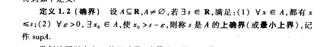

# 数学分析

# 考试

总评分 = 平时20% + 期中30% + 期末50%

周五交换作业本

作业要求独立完成, 抄袭被发现分数会很低.

答疑和质疑有关于平时分.

# 联系方式

fhjcq@nju.edu.cn

匡亚明学院C302

# 高等数学

* 微积分
* 线性代数
* 概率论与数理统计

## 和初等数学的区别

初等数学研究对象是**有限的**

高等数学研究对象是**无限的**

## 例子

### 例一

1 + 2 = 2 + 1

反映了加法交换律

那么, 加法都可以交换吗?

1 + 2 + ··· + 100 = ?

涉及到了级数

$\sum {a_i} = 1 - \frac{1}{2} + \frac{1}{3} + \dots = \quad ?$

这时候, 加法交换律不一定成立, 结果可能等于任何数

### 例二

有限集合:

$S = \{a_1, ...,a_i\}$ 与 $S = \{a_1, ...,a_m \}$ 且i>m, 则前者元素个数多于后者

无限集合:

S = {1, 2, 3, ... } 与 s = {1, 3, 5, ...} 元素个数是一样的

可以参考无限旅馆问题

### 例三

将一个有限圆的半径变成无限, 那么就近似成了一条直线,  
并且将圆上一点定为原点, 那么-∞和+∞就是相交于同一点的原点对面一点.

# 数学分析的基础

## 基础: 实数的连续性

## 错误看法

> 万物皆数也  
>  -- 毕达哥拉斯

毕达哥拉斯认为一定存在一个最小的公尺l

一切数都可以表达为 $l_1 = ml$ 和 $l_2 = nl$ 这样的形式

## 数系

数系有封闭性

自然数 => 整数 => 有理数(趋于停滞) => 实数

拓展到有理数后趋于停滞原因: **稠密性**

即任意两个有理数之间都可以找到另一个有理数

### 两个无理数啊a,b之间找一个无理数c

$$
c =
\begin{cases}
\displaystyle \frac{a+b}{2}, & \text{if } \frac{a+b}{2} \text{ is 无理数} \\
\displaystyle\frac{a + \frac{a+b}{2}}{2}, & \text{if } \frac{a+b}{2} \text{ is 有理数}
\end{cases}
$$

# 数学的基础--集合论

物理学寻找宇宙间第一推动力

数学也会寻找数学的基础理论

即是***集合论***

(集合论的主要贡献者是Cantor)

> 克尔凯郭尔说: 上帝给了我们自然数, 我们创造出了整个世界

集合论是数学的本源, 需要定义, 无法再深入追究

## 集合论

### 集合相等

要说集合$A$和集合$B$相等,   
即是说明 $A \subset B \ \& \ B \subset A$

### 交集运算律

交换律: $A \cap B = B \cap A$

结合律: $A \cap B \cap C = A \cap (B \cap C)$

诸如此类...

### 笛卡尔集合

$A \times B = \{ (x, y) ; x \in A, y \in B \}$

## 无限集合

* 可数集合 (可按照一定规则列出来的集合)
  * 自然数$\mathbb Q$
* 不可数集合 (不可按照一定规则列出来的结合)

### 无限可数集合
$A = B = \mathbb Q$  
$C = A \times B = \{ (x, y) ; x \in A, y \in B \}$  

则$C$也是一个无限可数集合

因为:

## 数集的有界性

$S = \{ a_1, \dotsb \}$

$S$有界  
<=> 存在一个存在一个常数M>0使对任意X∈S都存在|X|≤M  
<=> $\exists M>0, \forall X∈S => |X|≤M$

$S \text{无界} <=> \forall M > 0, \exists X \in S => |X| > M$

最大下界和最小上界称为*确界*

# 问题

怎么用数学分析的语言描述*确界*

Ans:

$\forall X∈S ,\forall X \leq N\ 都 \ \exist M \in \mathbb{R}\ ,\ X \leq M \leq N$, 则 $M$ 称为 $S$ 的 *上确界*

Error: 不能连用两个$\forall$

S = {1,2,3}

$\forall X \in S, 恒有 N \geq X, 则N的范围$

$X = 1, N \geq 1$

$X = 2, N \geq 2$

$X = 3, N \geq 3$

$3 \leq N \leq 4$