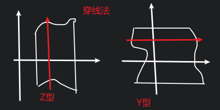

# 余项

$y=f(x)$

## 皮昂诺余项

$若y=f(x)在x_0处有n阶导数, 则$

$\displaystyle f(x)=f(x_0)+f'(x_0)(x-x_0)+\cdots +o((x-x_0)^n)$

$这种余项是未定性的$

## 拉格朗日余项

$若y=f(x)在x_0处有n+1阶导数, 则$

$\displaystyle f(x)=\sum_{i=0}^n\frac{f^{(k)}(x)^{k}}{k!}(x-x_0)^{k}+\frac{f^{(n+1)}(\xi)^{n+1}}{(n+1)!}(x-x_0)^{n+1}$

$这种余项是未定量的$

## 柯西余项

$\displaystyle 令\varphi(x)=\sum_{i=0}^n\frac{f^{(k)}(x)^{k}}{k!}(x-x_0)^{k}$

$我们可知\varphi(x)与f(x)在x=x_0处的1到n阶导数是一样的$

$令R_n(x)=f(x)-\varphi(x)$

$我们可知R_n'(x)到R_n^{(n)}(x)=0, 但是R_n^{(n+1)}(x)=f^{(n+1)}(x)$

$
\begin{aligned}
我们令R_n(x)&=\displaystyle\int_{x_0}^xR_n'(t){\rm d}t \\
&=\int_{x_0}^xR_n'(t){\rm d}t \\
&=\int_{x_0}^xR_n'(t){\rm d}(t-x) \\
&=R_n'(t)(t-x)|_{x_0}^x-\int_{x_0}^x(t-x){\rm d}R_n'(t) \\
&=-\int_{x_0}^x(t-x)R_n''(t){\rm d}t \\
&=-\frac{1}{2}\int_{x_0}^xR_n''(t){\rm d}(t-x)^2 \\
&=-\frac{1}{2}R_n''(t)(t-x)^2|_{x_0}^x+\frac{1}{2}\int_{x_0}^x(t-x)^2{\rm d}R_n''(t) \\
&=\frac{1}{2}\int_{x_0}^x(t-x)^2R_n'''(t){\rm d}t \\
&=\cdots \\
&=\frac{(-1)^{n}}{n!}\int_{x_0}^x(t-x)^nR_n^{n+1}(t){\rm d}t \\
&=\frac{(-1)^{n}}{n!}\int_{x_0}^x(t-x)^nf^{n+1}(t){\rm d}t \\
&=\frac{1}{n!}\int_{x_0}^x(x-t)^nf^{n+1}(t){\rm d}t \\
\end{aligned}
$

$这种余项是定量的, 可求的$

$回忆一下具体的思路: 将R_n(x)变为变上限积分的形式, 然后用分部积分法$

# 定积分的应用 (几何上的应用)

$主要思路是微元法$

## 平面图形的面积

### 直角坐标系

$最基础的, 求曲边梯形的面积$

$设上方函数为y=f(x), 下方函数为y=g(x), 则$

$面积S=\displaystyle\int_a^b[f(x)-g(x)]{\rm d}x$

$设右边函数为x=\gamma(y), 左边函数为x=\varphi(y), 则$

$面积S=\displaystyle\int_a^b[\gamma(y)-\varphi(y)]{\rm d}y$

### 极坐标系

$对于\theta=\alpha, \theta=\beta, r=r_1(\theta), r=r_2(\theta)$

$这里的微元是用射线切出的许多小扇形$

$S=\displaystyle\int_\alpha^\beta\frac{1}{2}r^2(\theta){\rm d}\theta$

#### 思考

$把r当作自变量, \theta当作函数, 如何微元求面积?$

### 例题

$r=a(1-\cos\theta)$

$
\begin{aligned}
S&=\displaystyle\int_0^\pi a^2(1-\cos\theta)^2{\rm d}\theta \\
\end{aligned}
$

$椭圆面积S=\pi ab$

## 立体的体积 (平行截面面积已知的)

$对于每一个点x, 若已知S(x), x\in [a,b]$

$V=\displaystyle\int_a^bS(x){\rm d}x$

$比如说旋转体的半径已知为r(x)$

$此时V=\displaystyle\int_a^b\pi r^2(x){\rm d}x$

## 曲线的研究

$
对于\begin{cases}
x=x(t) \\
y=y(t) \\
\end{cases}, t\in(\alpha, \beta)
$

$\therefore\displaystyle \sum_{i=1}^n\widehat{A_{i}A_{i+1}}\approx\sum_{i=1}^n\overline{A_{i}A_{i+1}}$

$
\begin{aligned}
\therefore\overline{A_{i}A_{i+1}}
&=\sqrt{[x(t_i)-x(t_{i+1})]^2+[y(t_i)-y(t_{i+1})]^2} \\
&=\sqrt{[x'(\xi_i)\Delta t_i]^2+[y'(\eta_i)\Delta t_i]^2} \\
&=\sqrt{x'(\xi_i)^2+y'(\eta_i)^2}\Delta t_i \\
\end{aligned}
$

$证明|\sqrt{x'(\xi_i)^2+y'(\eta_i)^2}-\sqrt{x'(\xi_i)^2+y'(\xi_i)^2}|<\varepsilon$

$
\begin{aligned}
|\sqrt{a^2+b^2}-\sqrt{a^2+c^2}|&=\frac{|b+c||b-c|}{\sqrt{a^2+b^2}+\sqrt{a^2+c^2}}\\
&\leq |b-c|=|y'(\eta_i)-y'(\xi_i)|\\
&<\varepsilon \\
\end{aligned}
$

$因为一致连续, 所以成立$

$\therefore \displaystyle\sum_{i=1}^n\overline{A_{i}A_{i+1}}=\int_\alpha^\beta\sqrt{x'(t)^2+y'(t)^2}{\rm d}t$

### 例

#### (1)

$对于y=f(x)$

$
\begin{cases}
x=x \\
y=f(x) \\
\end{cases}
\Rightarrow
S=\int_a^b\sqrt{1+f'(x)^2}{\rm d}x
$

#### (2)

$对于r=r(\theta), \theta\in(\alpha, \beta)$

$$
\begin{cases}
x=r\cos\theta \\
y=r\sin\theta \\
\end{cases}
$$

$$
\begin{aligned}
S&=\int_\alpha^\beta\sqrt{r'(\theta)^2+r(\theta)^2}{\rm d}\theta \\
\end{aligned}
$$

### 曲线导数与积分

$S(t)=\displaystyle \int_\alpha^t\sqrt{x'(u)^2+y'(u)^2}{\rm d}u$

$S'(t){\rm d}t=\sqrt{x'(t)^2+y'(t)^2}{\rm d}t=\sqrt{(x'(t){\rm d}t)^2+(y'(t){\rm d}t)^2}$

${\rm d}S(t)=\sqrt{({\rm d}x)^2+({\rm d}y)^2}$

$({\rm d}S(t))^2=({\rm d}x)^2+({\rm d}y)^2$

$微分勾股定理$

$椭圆积分\displaystyle\int\sqrt{a^2\sin^2\theta+b^2\cos^2\theta}是积不出来的, 但是是存在的$
