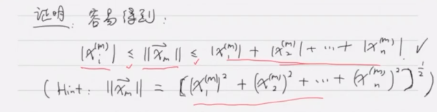

# $\mathbb{R}^n$ 中点列的收敛

## 开球与闭球

### 开球

$\vec{a}\in\mathbb{R}^n,r>0$

称集合 $\{\vec{x}\in\mathbb{R}^n:||\vec{x}-\vec{a}||<r\}$ 为球心, 以 $r$ 为半径的开球(球), 记为 $B_r(\vec{a})$.

### 闭球

称集合 $\{\vec{x}\in\mathbb{R}^n:||\vec{x}-\vec{a}||\leq r\}$ 为球心, 以 $r$ 为半径的闭球, 记为 $\overline{B_r}(\vec{a})$.

## 收敛

如果任意 $\varepsilon>0$, 都有 $M\in\mathbb{N}$, 凡是 $m>M$, 都有 $||\vec{x}_m-\vec{a}||<\varepsilon$, 我们称点 $\vec{a}$ 为 $\{\vec{x}_m\}$ 的极限.

记为 $\displaystyle\lim_{m\to \infty}\vec{x}_m=\vec{a}$, 或 $\vec{x}_m\to \vec{a}, m\to\infty$

其他表述: $\forall\varepsilon>0,\exist M\in\mathbb{N}, s.t.\ \text{for all}\ m>M, \vec{x}_m\in B_{\varepsilon}(\vec{a})$

### 有界集合

称为 $\mathbb{R}^n$ 中的一个子集 $B$ 有界, 如果 $\exist R>0, s.t. B\subset B_R(\vec{0})$.

### 性质

* $\{\vec{x}_m\}_{m=1}^\infty$ 收敛, 则极限唯一.
* $\{\vec{x}_m\}_{m=1}^\infty$ 收敛, 则必有界.
* $\vec{x}_m\to \vec{a}, \vec{y}_m\to\vec{b}, m\to\infty \Rightarrow \vec{x}_m\pm\vec{y}\to\vec{a}\pm\vec{b}, m\to\infty$
* $\vec{x}_m\to\vec{a}, m\to\infty \Rightarrow \lambda\vec{x}_m\to\lambda\vec{a}, \forall \lambda\in\mathbb{R}$

## 基本列

如果 $\forall\varepsilon>0, \exist M\in\mathbb{N},$ 凡是 $k,l>M$, 都有 $||\vec{x}_k,\vec{x}_l||<\varepsilon$, 我们称 $\{\vec{x}_m\}$ 为**基本列**(Cauchy 列).

### 按分量收敛

记 $\{\vec{x}_m\}_{m=1}^m$ 为 $\mathbb{R}^n$ 中的一个点列, 并记 $\vec{x}_m=(x_1^{(m)},x_2^{(m)},\cdots,x_n^{(m)})$.

如果对任意 $i=1,2,\cdots ,n$, 都有 $\displaystyle\lim_{m\to \infty}x_i^{(m)}=a_i$, 则称 $\{\vec{x}_m\}_{m=1}^m$ 按分量收敛到 $\vec{a}=(a_1,a_2,\cdots,a_n)$

定理: $\displaystyle\lim_{m\to \infty}\vec{x}_m=\vec{a}$ 当且仅当 $\{\vec{x}_m\}$ 按分量收敛到 $\vec{a}$.

证明:

$|x_i^{(m)}|\leq ||\vec{x}_m||\leq|x_1^{(m)}|+|x_2^{(m)}|+\cdots +|x_n^{(m)}|$

