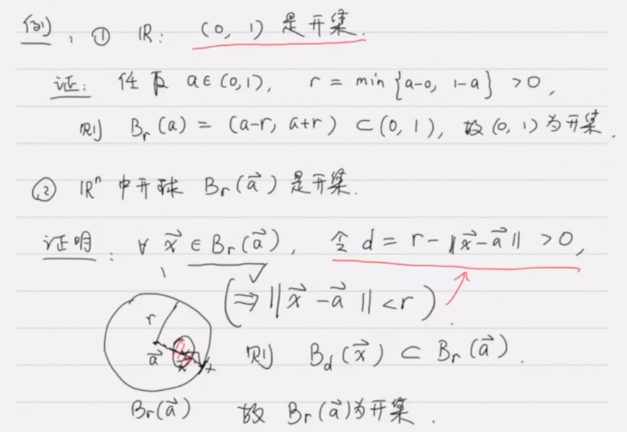
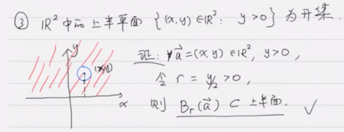
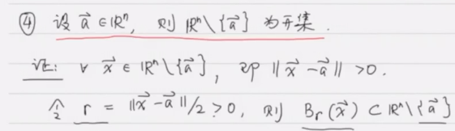
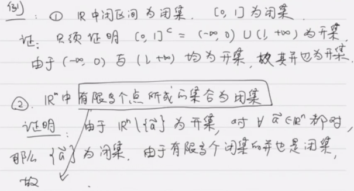
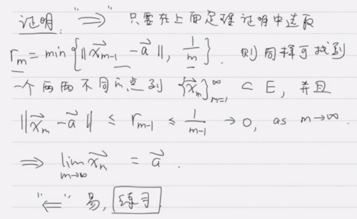
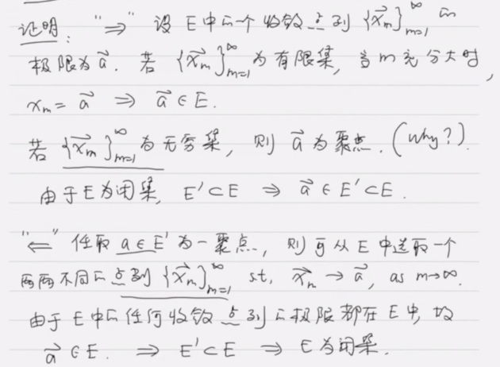
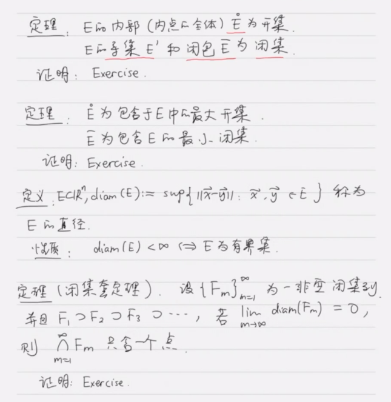
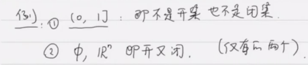

# $\mathbb{R}^n$ 中的开集和闭集

## 开集

### 开集定义

设  $E\subset \mathbb{R}^n$, 若对 $\forall\vec{a}\in R$, 都存在 $r>0$, s.t. $B_r(\vec{a})\subset E$, 我们称 $E$ 为 $\mathbb{R}^n$ 中的一个开集.

### 内点

设  $E\subset \mathbb{R}^n$, 如果 $\forall\vec{a}\in R$ 满足 $\exist r>0$, s.t. $B_r(\vec{a})\subset E$, 则称 $\vec{a}$ 为 $E$ 中的一个内点, 所有 $E$ 的内点的集合记为 $\mathring{E}$.

### 内点与开集

$E$ 是开集 $\Leftrightarrow \mathring{E}=E$.

### 例

### 约定

由于 $\mathring{\empty}=\empty$, 故称空集也是开集.

### 定理

* $\mathbb{R}^n, \empty$ 都是开集.
* **任意多**个开集的并是开集.
* **有 限多**个开集的交是开集.

## 闭集

$E\subset \mathbb{R}^n$ 为闭集, 如果 $E^c = \mathbb{R}^n\setminus E$ 为开集.

### 定理

* $\empty, \mathbb{R}^n$ 都是闭集.
* **任意多**个闭集的交是闭集.
* **有限多**个闭集的并是闭集.

$(\displaystyle\bigcap_{\alpha\in I}F_{\alpha})^c=\bigcup_{\alpha\in I} F_{\alpha}^c, (\displaystyle\bigcup_{k=1}^mF_{\alpha})^c=\bigcap_{k=1}^m F_{\alpha}^c$

### 空心开球

$\overset{\vee}{B_r}(\vec{a}):=\{\vec{x}\in \mathbb{R}^n: 0<||\vec{x}-\vec{a}||<r\}=B_r(\vec{a})\setminus \{\vec{a}\}$

### 聚点

设 $E\subset \mathbb{R}^n$, 称 $\vec{a}$ 为 $E$ 的聚点, 如果: 对 $\forall r>0, \overset{\vee}{B_r}(\vec{a})\cap E\neq \empty$

聚点 $\vec{a}$ 可能在 $E$ 中, 也可能不在.

### 聚点定理

点 $\vec{a}$ 为 $E$ 的聚点, 当且仅当以 $\vec{a}$ 为球心的任意开球中都有 $E$ 中的无穷多个点.

### 聚点定理二

点 $\vec{a}$ 为 $E$ 聚点当且仅当可以从 $E$ 中选取互不相同的点组成点列 $\{\vec{x}_m\}_{m=1}^{\infty}$ s.t. $\lim_{m\to \infty}\vec{x}_m=\vec{a}$

### 闭集定理

$E\subset \mathbb{R}^n$ 的所有聚点的全体称为 $E$ 的导集, 记为 $E'$. 并记 $\overline{E}=E'\cup E$ 为 $E$ 的闭包.

$E$ 为闭集的充要条件是 $E'\subset E$. (即 $\overline{E}=E$).

### 推论

$E$ 为闭集 $\Leftrightarrow$ $E$ 中的任何收敛点列的极限都在 $E$ 中.

## 其他定理

