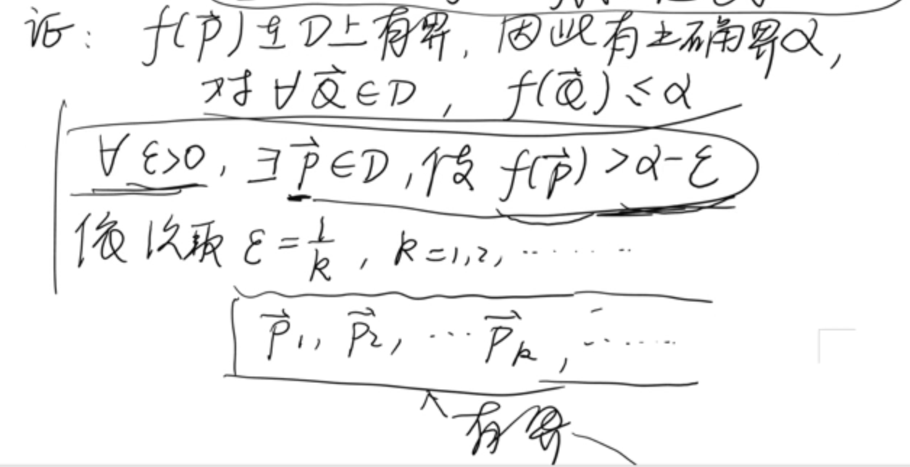

# 多元函数的连续性

## 连通性

$\mathbb{R}^n$ 中点集 $D$, 定义 $f:D\to \mathbb{R}$, 设 $\boldsymbol{x^0}$ 是 $D$ 的聚点.

定义连续: 若 $\boldsymbol{x^0}\in D$, 且 $\displaystyle\lim_{x\to x^0}f(\boldsymbol{x})=f(\boldsymbol{x^0})$

$\varepsilon-\delta$: $\forall\varepsilon>0,\exist\delta>0$, 对于 $D$ 中所有满足 $||\boldsymbol{x}-\boldsymbol{x^0}||<\delta$ $\Rightarrow$ $|f(\boldsymbol{x}-f(\boldsymbol{x^0}))|<\varepsilon$

$\delta=f(x,y)$ 有对 $x, y$ 分别连续的说法.

## 区域

对集合 $S$ 中任意两点 $\boldsymbol{x},\boldsymbol{y}$ 都可以用包含于 $S$ 中的折线相连, 则称 $S$ 具有(折线)连通性.

具有折线连通性的开集称为**区域**.

而区域+边界 $S\cup \partial S$ 称为闭区域.

## 零点定理

若 $f(x,y)$ 在区域 $G$ 内连续, 且在 $G$ 中两点 $M_1(x_1,y_1),M_2(x_2,y_2)$ 处函数值异号.

$f_1(x_1,y_1)\cdot f(x_2,y_2)<0$, 则在 $G$ 中存在点 $M_0(x_0,y_0)$, 使得 $f(x_0,y_0)=0$

## 介值定理

若 $f(x,y)$ 在区域 $G$ 中连续, $(x_1,y_1),(x_2,y_2)$ 是 $G$ 中任意的两个点, 则介于 $f(x_1,y_1)$ 与 $f(x_2,y_2)$ 是 $G$ 中任意的两个点, 则介于 $f(x_1,y_1)$ 与 $f(x_2,y_2)$ 之间的一切实数都属于 $f(x,y)$ 的值域.

## 连续有界定理

有界闭集 $D$ 上的连续函数是有界的.

## 连续最值定理

有界闭集 $D$ 上的连续函数可取到最值.

## 一致连续

$\forall\varepsilon>0,\exist\delta>0$ 对于 $D$ 中任意两点 $\vec{P}',\vec{P}''$, 只要 $||\vec{P}'-\vec{P}''||<\delta$, 
有 $|f(\vec{P}')-f(\vec{P}'')|<\varepsilon$, 则称 $f(\vec{P})$ 在 $D$ 上一致连续.

## 闭集一致连续性

有界闭集 $D$ 上的连续函数是一致连续的.

