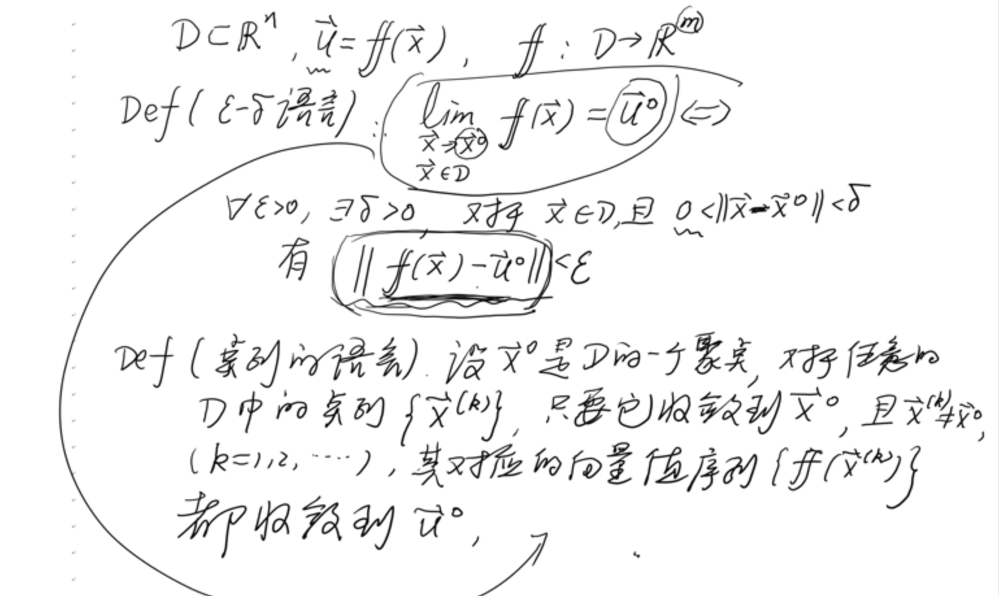

# 向量值函数

## 定义

$D\subset \mathbb{R}^n, f:D\to\mathbb{R}^m$

$\vec{u}=\mathcal{F}(x)$, 其中 $\vec{x}=(x_1,x_2,\cdots,x_n)\in D,\vec{u}=(u_1,u_2,\cdots,u_m)\in\mathbb{R}^m$

值域: $\{\vec{u}|\vec{u}=\mathcal{F}(\vec{x}), \vec{x}\in D\}$

$\begin{pmatrix}u_1\\u_2\\\vdots\\u_m\end{pmatrix}=\begin{pmatrix}u_1(x_1,x_2,\cdots,x_n)\\u_2(x_1,x_2,\cdots,x_n)\\\vdots\\u_m(x_1,x_2,\cdots,x_n)\end{pmatrix}=\begin{pmatrix}f_1(x_1,x_2,\cdots,x_n)\\f_2(x_1,x_2,\cdots,x_n)\\\vdots\\f_m(x_1,x_2,\cdots,x_n)\end{pmatrix}$

$\Leftrightarrow u_i=f_i(x_1,x_2,\cdots,x_n), \quad i=1,2,\cdots,m$

$m=n=1$ 时, 为一元纯函数

### 球坐标系

### 向量值函数的极限

### 向量值函数的连续

### 向量值函数的复合

