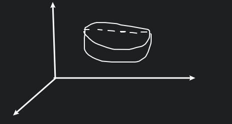
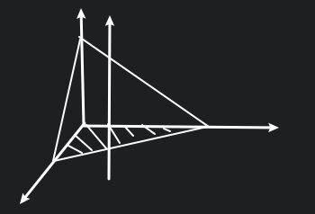
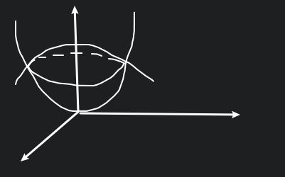

# 多元函数积分学

## 三重积分

$\displaystyle \iiint_{\Omega_{xyz}}f(x,y,z)\Delta V_i$

## 物理意义

求一个密度不均匀物体质量的问题.

## 直角坐标

${\rm d}V={\rm d}x{\rm d}y{\rm d}z$

有两种想法:

* 先一后二 (先单后重) (先求一个定积分, 再求一个重积分)
* 先二后一 (先重后单) (先求一个重积分, 再求一个定积分)

### 先一后二

$\displaystyle I=\iiint_{\Omega}f(x,y,z){\rm d}V=\iint_{D_{xy}}{\rm d}x{\rm d}y\int_{z_1(x,y)}^{z_2(x,y)}f(x,y,z){\rm d}z$

### 先二后一

$\displaystyle I=\iiint_{\Omega}f(x,y,z){\rm d}V=\int_a^b{\rm d}z\iint_{S(z)}f(x,y,z){\rm d}x{\rm d}y$

### 例一

$\displaystyle \iiint_{\Omega}z{\rm d}x{\rm d}y{\rm d}z, \Omega:$ 三个坐标面和 $2x+y+z=1$

**先一后二:**

$\displaystyle\Sigma_1: z=0, \Sigma_2: z=1-2x-2y, D_{xy}: x=0, y=0, y+2x=0$

$\therefore\displaystyle I=\iint_{D_{xy}}{\rm d}x{\rm d}y\int_0^{1-2x-y}z{\rm d}z=\iint_{D_{xy}}\frac{1}{2}(1-2x-y)^2{\rm d}x{\rm d}y$

**先二后一:**

$S(z):$

$\therefore\displaystyle I=\int_0^1z{\rm d}z\iint_{S(z)}{\rm d}x{\rm d}y=\int_0^1\frac{1}{2}\cdot \frac{1}{2}(1-z)^2z{\rm d}z$

### 例二

$\displaystyle I=\iiint_{\Omega}z^2{\rm d}x{\rm d}y{\rm d}z, \Omega: x^2+y^2+z^2\leq R^2, x^2+y^2+z^2\leq 2Rz$ 的交集

$
\therefore
\begin{cases}
x^2+y^2+z^2=R^2 \\
x^2+y^2+z^2=2Rz \\
\end{cases}
\Rightarrow z=\frac{1}{2}R \Rightarrow D_{xy}: x^2+y^2\leq \frac{3}{4}R^2
$

$\because x^2+y^2+z^2=2Rz\Rightarrow x^2+y^2+(z-R)^2=R^2\Rightarrow z=R-\sqrt{R^2-x^2-y^2}$

$\therefore\displaystyle I=\iint_{D_{xy}}{\rm d}x{\rm d}y\int_{R-\sqrt{R^2-x^2-y^2}}^{\sqrt{R^2-x^2-y^2}}z^2{\rm d}z$

有点复杂, 换另一种方式

采用先二后一的方式,

划分为两部分:

$\Omega_1: z=0$ 到 $\displaystyle z=\frac{R}{2}$

$\Omega_2: \displaystyle z=\frac{R}{2}$ 到 $z=R$

$
\begin{aligned}
\therefore I
&=\iiint_{\Omega_1}z^2{\rm d}V+\iiint_{\Omega_2}z^2{\rm d}V \\
&=\int_0^{\frac{R}{2}}z^2{\rm d}z\iint_{S(z)}{\rm d}x{\rm d}y+\int_{\frac{R}{2}}^Rz^2{\rm d}z\iint_{S(z)}{\rm d}x{\rm d}y \\
&=\int_0^{\frac{R}{2}}\pi(R^2-(R-z)^2)z^2{\rm d}z+\int_{\frac{R}{2}}^R\pi(R^2-z^2)z^2{\rm d}z \\
\end{aligned}
$

## 换元

### 一重二重积分换元

$\displaystyle \int_a^bf(x){\rm d}x=\int_\alpha^\beta f(\varphi(t))\varphi'(t){\rm d}t=\int_\alpha^\beta f(\varphi(t))|J|{\rm d}t$

$\displaystyle \iint_{D_{xy}}f(x,y){\rm d}x{\rm d}y=\iint_{D_{uv}}f(x(u, v), y(u, v))|J|{\rm d}u{\rm d}v$

其中 $\displaystyle J=\frac{\partial (x, y)}{\partial (u, v)}=\begin{vmatrix}\frac{\partial x}{\partial u}&\frac{\partial x}{\partial v}\\\frac{\partial y}{\partial u}&\frac{\partial y}{\partial v}\end{vmatrix}$

### 三重积分换元

$
\begin{cases}
x=x(u,v,w) \\
y=y(u,v,w) \\
z=z(u,v,w) \\
\end{cases}
$

$\displaystyle \iiint_{\Omega_{xyz}}f(x,y,z){\rm d}x{\rm d}y{\rm d}z=\iiint_{\Omega_{u,v,w}}f(x(u,v,w),y(u,v,w),z(u,v,w))|J|{\rm d}u{\rm d}v{\rm d}w$

$\displaystyle J=\frac{\partial (x,y,z)}{\partial (u,v,w)}=\begin{vmatrix}\frac{\partial x}{\partial u}&\frac{\partial x}{\partial v}&\frac{\partial x}{\partial u}\\\frac{\partial y}{\partial u}&\frac{\partial y}{\partial v}&\frac{\partial y}{\partial u}\\\frac{\partial z}{\partial u}&\frac{\partial z}{\partial v}&\frac{\partial z}{\partial u}\end{vmatrix}$

## 柱面坐标

$
\begin{cases}
x=r\cos\theta \\
y=r\sin\theta \\
z=z \\
\end{cases}
$

$\therefore\displaystyle J=\begin{vmatrix}\cos\theta&-r\sin\theta&0\\\sin\theta&r\cos\theta&0\\0&0&1\end{vmatrix}=r$

### 例一

$\displaystyle I=\iiint_{\Omega}z{\rm d}x{\rm d}y{\rm d}z, \Omega: x^2+y^2+z^2\leq 4, x^2+y^2\leq 3z$

其中 $x^2+y^2\leq 3z$ 是一个由 $x^2=3z$ 旋转而成的旋转抛物面, $x^2+y^2+z^2\leq 4$ 为球面

$D_{xy}: x^2+y^2\leq 3$

$\displaystyle I=\iint_{D_{xy}}{\rm d}x{\rm d}y
\int_{\frac{x^2+y^2}{3}}^{\sqrt{4-x^2-y^2}}z{\rm d}z$

令 $
\begin{cases}
x=r\cos\theta \\
y=r\sin\theta \\
z=z \\
\end{cases}
$

$\displaystyle I=\int_0^{2\pi}{\rm d}\theta\int_0^{\sqrt{3}}r{\rm d}r\int_{\frac{r^2}{3}}^{\sqrt{4-r^2}}z{\rm d}z$

## 球面坐标

$\theta$ 对应经度, $\varphi$ 对应维度

$
\begin{cases}
x=\rho\sin\varphi\cos\theta \\
y=\rho\sin\varphi\sin\theta \\
z=\rho\cos\varphi \\
\end{cases}
$

$
\begin{aligned}
J
&=\frac{\partial (x,y,z)}{\partial (\rho,\varphi,\theta)} \\
&=\begin{vmatrix}\sin\varphi\cos\theta&\rho\cos\varphi\cos\theta&-\rho\sin\varphi\sin\theta\\\sin\varphi\sin\theta&\rho\cos\varphi\sin\theta&\rho\sin\varphi\cos\theta\\\cos\varphi&-\rho\sin\varphi&0\end{vmatrix} \\
&=\rho^2\sin^3\varphi\sin^2\theta+\rho^2\sin\varphi\cos^2\varphi\cos^2\theta+\rho^2\sin\varphi\cos^2\varphi\sin^2\theta+\rho^2\sin^3\varphi\cos^2\theta \\
&=\rho^2\sin\varphi \\
\end{aligned}
$

$\displaystyle I=\iiint_{\Omega_{xyz}}f(x,y,z){\rm d}x{\rm d}y{\rm d}z=\iiint_{\Omega_{\rho\varphi\theta}}f(x(\rho,\varphi,\theta),y(\rho,\varphi,\theta),z(\rho,\varphi,\theta))\rho^2\sin\varphi{\rm d}\rho{\rm d}\varphi{\rm d}\theta$

### 例一

$\displaystyle I=\iiint_{\Omega}\sqrt{x^2+y^2}{\rm d}x{\rm d}y{\rm d}z, \Omega: x^2+y^2+z^2\leq 1, z\geq 0$

$\therefore\displaystyle I=\int_0^{2\pi}{\rm d}\theta\int_0^{\frac{\pi}{2}}{\rm d}\varphi\int_0^1\rho\sin\varphi\cdot \rho^2\sin\varphi{\rm d}\rho=\int_0^{2\pi}{\rm d}\theta\int_0{\frac{\pi}{2}}\sin^2\varphi{\rm d}\varphi\int_0^1\rho^3{\rm d}\rho$

变量完全分离开了, 相当于求三个定积分.

## 例二

**广义球面坐标变换:**

$\displaystyle I=\iiint_{\Omega}(y^2+z^2){\rm d}x{\rm d}y{\rm d}z, \Omega: \frac{x^2}{a^2}+\frac{y^2}{b^2}+\frac{z^2}{c^2}\leq 1$

$\therefore J=\rho^2abc\sin\varphi$

