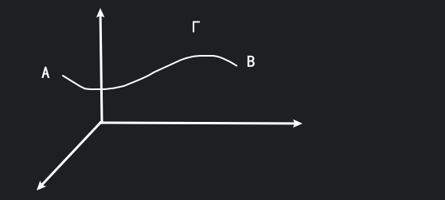

# 第Ⅰ型曲线积分

## 思路

其中 $
\Gamma:
\begin{cases}
x=x(t) \\
y=y(t) \\
z=z(t) \\
\end{cases},
t\in [\alpha,\beta]
$, $\forall M(x,y,z)\in\Gamma$ 有密度 $f(x,y,z)$,
求 $\overgroup{AB}$ 的质量.

弧长 $\displaystyle \int_0^t\sqrt{x'(t)^2+y'(t)^2+z'(t)^2}{\rm d}t$

弧微分 $\displaystyle {\rm d}s=\sqrt{({\rm d}x)^2+({\rm d}y)^2+({\rm d}z)^2}$

$\displaystyle\int_\Gamma f(x,y,z){\rm d}s=\int_\alpha^\beta f(x(t),y(t),z(t))\sqrt{x'(t)^2+y'(t)^2+z'(t)^2}{\rm d}t$

要注意应该保证 $\alpha<\beta$

## 例一

$\displaystyle \oint_\Gamma(4x^2+3y^2+2xy){\rm d}s, \Gamma:\frac{x^2}{3}+\frac{y^2}{4}=1$, 且 $\Gamma$ 的周长为 $A$

因为是在曲线上进行积分, 而不是对面积进行积分, 所以我们可以直接将 $4x^2+3y^2=12$ 带入

$\displaystyle I=\oint_\Gamma(12+2xy){\rm d}s=12\oint_\Gamma{\rm d}s+0=12A$

椭圆积分存在, 但积不出来, 所以我们需要周长 $A$.

即 $\displaystyle\int\sqrt{1+k^2\sin^2\theta}{\rm d}\theta$ 形式的积分是积不出来的.

## 极坐标

$\displaystyle \int_\Gamma f(x,y){\rm d}s=I, \Gamma: r=r(\theta)$, $
\begin{cases}
x=r\cos\theta=r(\theta)\cos\theta \\
y=r\sin\theta=r(\theta)\sin\theta \\
\end{cases}
$, $\theta\in[\alpha,\beta]$

$\displaystyle I=\int_\alpha^\beta f(r(\theta)\cos\theta, r(\theta)\sin\theta)\sqrt{r(\theta)^2+r'(\theta)^2}{\rm d}\theta$

## 例二

$\displaystyle I=\oint_\Gamma(x^2+y^2){\rm d}s, \Gamma: x^2+y^2=ax, (a>0)$

令 $
\begin{cases}
x=a\cos\theta=a\cos^2\theta \\
y=a\sin\theta=a\cos\theta\sin\theta \\
\end{cases}
$

$\displaystyle I=\int_{-\frac{\pi}{2}}^{+\frac{\pi}{2}}a^2\cos^2\theta\cdot \sqrt{(2a\sin\theta\cos\theta)^2+(a\cos 2\theta)^2}{\rm d}\theta=2a^3\int_0^\frac{\pi}{2}\cos^2\theta{\rm d}\theta$

