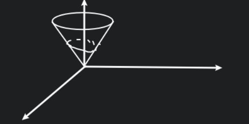
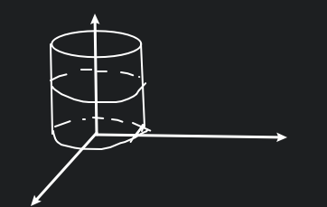

# 第Ⅰ形曲面积分

## 定义

$\displaystyle \Sigma: z=f(x,y)$ 即 $\displaystyle \Sigma: z-f(x,y)=F(x,y,z)=0$

切平面法向量 $\displaystyle \vec{n}=\displaystyle \{F_x, F_y, F_z\}=\{-f_x, -f_y, 1\}\to \{\frac{-f_x}{\sqrt{1+f_x^2+f_y^2}}, \frac{-f_y}{\sqrt{1+f_x^2+f_y^2}}, \frac{1}{\sqrt{1+f_x^2+f_y^2}}\}$

$\displaystyle \therefore\cos r=\frac{1}{\sqrt{1+f_x^2+f_y^2}}$

$\quad\displaystyle \Delta\sigma=\Delta S\cdot \cos r$

$\quad\displaystyle\iint_{\Sigma}\cos r{\rm d}S=\iint_{D_{xy}}{\rm d}\sigma$

$\therefore\displaystyle \iint_{\Sigma}{\rm d}S=\iint_{D_{xy}}\frac{1}{\cos r}{\rm d}\sigma=\iint_{D_{xy}}\sqrt{1+f_x^2+f_y^2}{\rm d}x{\rm d}y$

**对于:**

$
\Sigma:
\begin{cases}
x=x(u,v) \\
y=y(u,v) \\
z=z(u,v) \\
\end{cases}
, \vec{r}=\vec{r}(u,v)=\{x(u,v),y(u,v),z(u,v)\}
$

由叉乘的几何意义是面积可得

${\rm d}S=|\vec{r}_u\cdot \Delta u\times\vec{r}_v\cdot \Delta v|=|\vec{r}_u\times\vec{r}_v|\Delta u\cdot \Delta v$

$\therefore\displaystyle S=\iint_{\Sigma}|\vec{r}_u\times\vec{r}_v|\Delta u\Delta v$

$\because |\vec{r}_u\times\vec{r}_v|^2=|\vec{r}_u|^2|\vec{r}_v|^2(1-\cos^2\theta)=|\vec{r}_u|^2|\vec{r}_v|^2-(\vec{r}_u\cdot \vec{r}_v)^2$

记 $\vec{r}_u^2=E, \vec{r}_u\cdot \vec{r}_v=F, \vec{r}_v^2=G$

$\therefore\displaystyle S=\iint_{\Sigma}\sqrt{EG-F^2}{\rm d}u{\rm d}v$

$\because\displaystyle \vec{r}_u=(\frac{\partial x}{\partial u}, \frac{\partial y}{\partial u}, \frac{\partial z}{\partial u}), \vec{r}_v=(\frac{\partial x}{\partial v}, \frac{\partial y}{\partial v}, \frac{\partial z}{\partial v}), \vec{r}_u\times\vec{r}_v=\begin{vmatrix}i&j&k\\\frac{\partial x}{\partial u}&\frac{\partial y}{\partial u}&\frac{\partial z}{\partial u}\\\frac{\partial x}{\partial v}&\frac{\partial y}{\partial v}&\frac{\partial z}{\partial v}\end{vmatrix}$

记 $\displaystyle J_1=\frac{\partial (y, z)}{\partial (u, v)}, J_2=\frac{\partial (z, x)}{\partial (u, v)}, J_3=\frac{\partial (x, y)}{\partial (u, v)}$

那么 $\displaystyle |\vec{r}_u\times\vec{r}_v|=\sqrt{J_1^2+J_2^2+J_3^2}$

若有 $z=z(x,y)$, 则 $|\vec{r}_u\times\vec{r}_v|=\sqrt{1+z_{x}^{2}+z_{y}^{2}}$

若有 $\vec{r}=(a\sin \varphi\cos\theta, a\sin \varphi\sin \theta, a\cos\theta)$,
则 $|\vec{r}_u\times\vec{r}_v|=a^{2}\sin \varphi$

## 例题

### (1)

求半径为 $R$ 的球面的面积.

$x^2+y^2+z^2=R^2, D_{xy}: x^2+y^2\leq R^2$

$z=f(x,y)=\sqrt{R^2-x^2-y^2}$

$
\begin{aligned}
S
&=2\iint_{D_{xy}}\sqrt{1+f_x^2+f_y^2}{\rm d}x{\rm d}y \\
&=2\iint_{D_{xy}}\sqrt{1+\frac{x^2}{R^2-x^2-y^2}+\frac{y^2}{R^2-x^2-y^2}}{\rm d}x{\rm d}y \\
&=2R\iint_{D_{xy}}\frac{{\rm d}x{\rm d}y}{\sqrt{R^2-x^2-y^2}} \\
&=\int_0^{2\pi}2R\int_0^R\frac{-\frac{1}{2}{\rm d}(R^2-r^2)}{\sqrt{R^2-r^2}} \\
&=4\pi R
\end{aligned}
$

## (2)

求 $\displaystyle\frac{1}{4}z^2=x^2+y^2$ 与 $y+z=3$ 所围成的立体的表面积.

这是一个旋转面中的锥面和平面围成的立体.

**对于底面** $
\begin{cases}
\frac{1}{4}z^2=x^2+y^2 \\
y+z=3 \\
\end{cases}
$, 把 $z$ 消掉可得投影面的方程

$\displaystyle D_{xy}: \frac{1}{4}(3-y)^2=x^2+y^2 \Rightarrow 4x^2+3(y+1)^2=1$

$\because S_{\Sigma}: z=3-y$

$\therefore\displaystyle S_{\Sigma}=\iint_{D_{xy}}\sqrt{1+0+1}{\rm d}x{\rm d}y=\sqrt{2}\cdot \pi\cdot \sqrt{3}\cdot 2=2\sqrt{6}\pi$

**对于侧面** $S_c: z=2\sqrt{x^2+y^2}$

$\displaystyle S_c=\iint_{D_{xy}}\sqrt{1+\frac{4x^2}{x^2+y^2}+\frac{4y^2}{x^2+y^2}}{\rm d}x{\rm d}y=\sqrt{5}\cdot \pi\cdot \sqrt{3}\cdot 2$

## 曲面质量

已知曲面上一点的密度为 $f(x,y,z), \Sigma: z=z(x,y)$

$\displaystyle \iint_{\Sigma}f(x,y,z){\rm d}S=\iint_{D_{xy}}f(x,y,z(x,y))\sqrt{1+z_x^2+z_y^2}{\rm d}x{\rm d}y$

### 例一

$\displaystyle I=\iint_{\Sigma}\frac{{\rm d}S}{x^2+y^2+z^2}, \Sigma: x^2+y^2=R^2$ 介于 $z=a$ 和 $z=b$ 之间, $0<a<b$

把 $\Sigma$ 投影到 $yOz$ 平面: $D_{yz}: -R\leq y\leq R, a\leq z\leq b$

$\Sigma_q: x=\sqrt{R^2-y^2}, \Sigma_h: x=-\sqrt{R^2-y^2}$

$
\begin{aligned}
\iint_{\Sigma_q}\frac{{\rm d}S}{x^2+y^2+z^2}
&=\iint_{\Sigma_q}\frac{\sqrt{1+\frac{y^2}{R^2-y^2}+0}}{(\sqrt{R^2-y^2})^2+y^2+z^2}{\rm d}y{\rm d}z \\
&=\iint_{D_{yz}}\frac{R}{(R^2+z^2)\sqrt{R^2-y^2}} \\
&=R\int_a^b\frac{{\rm d}z}{R^2+z^2}\int_{-R}^R\frac{{\rm d}y}{\sqrt{R^2-y^2}}
\end{aligned}
$

