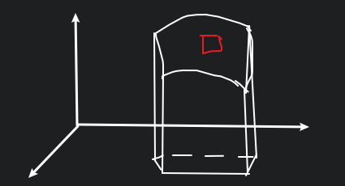
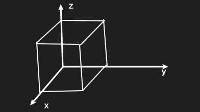

# 第Ⅱ型曲面积分

## 思路

一般有双侧曲面和单侧曲面.

$\Sigma: z=z(x,y)$ 即 $z-z(x,y)=0$ 或 $z(x,y)-z=0$

分别对应上侧 $\vec{n}=\{-z_x,-z_y,1\}$ 或下侧 $\vec{n}=\{z_x,z_y,-1\}$

|     | $z$ | $x$ | $y$ | 封闭 |
| --- | --- | --- | --- | ---- |
| $+$ | 上  | 前  | 右  | 外   |
| $-$ | 下  | 后  | 左  | 内   |

$\vec{F}=\{P(x,y,z),Q(x,y,z),R(x,y,z)\}$, 法向量 $\vec{n}$

令 $
\Sigma:
\begin{cases}
x=x(u,v) \\
y=y(u,v) \\
z=z(u,v) \\
\end{cases}
$

则 $\displaystyle \vec{n}=\frac{\vec{r}_u\times\vec{r_v}}{|\vec{r}_u\times\vec{r_v}|}=\frac{1}{\sqrt{EG-F^2}}\{\frac{\partial (y,z)}{\partial (u,v)},\frac{\partial (z,x)}{\partial (u,v)},\frac{\partial (x,y)}{\partial (u,v)}\}$

${\rm d}S=\sqrt{T_1^2+T_2^2+T_3^2}{\rm d}u{\rm d}v=\sqrt{EG-F^2}{\rm d}u{\rm d}v$

$\displaystyle I=\iint_{\Sigma}\vec{F}\cdot \vec{n}{\rm d}S=\iint_{\Sigma}\vec{F}\cdot {\rm d}\vec{S}=\iint_{D_{uv}}[P(x(u,v),y(u,v),z(u,v))\frac{\partial (y,z)}{\partial (u,v)}+Q(x(u,v),y(u,v),z(u,v))\frac{\partial (z,x)}{\partial (u,v)}+R(x(u,v),y(u,v),z(u,v))\frac{\partial (x,y)}{\partial (u,v)}]{\rm d}u{\rm d}v$

或者说

$\displaystyle\vec{n}=\frac{\pm 1}{\sqrt{F_x^2+F_y^2+F_z^2}}\{F_x,F_y,F_z\}=\{\cos\alpha,\cos\beta,\cos\gamma\}$

$\displaystyle I=\iint_{\Sigma}[P\cos\alpha+Q\cos\beta+R\cos\gamma]{\rm d}S$

即

$\displaystyle I=\iint P{\rm d}y\land{\rm d}z+Q{\rm d}z\land{\rm d}x+R{\rm d}x\land{\rm d}y$

${\rm d}x\land{\rm d}y$ 和 ${\rm d}x{\rm d}y$ 的区别是, 前者是有向的.

令 $z=z(x,y)$, 则 $\displaystyle\cos\gamma=\frac{\pm 1}{\sqrt{1+z_x^2+z_y^2}}, {\rm d}S=\sqrt{1+z_x^2+z_y^2}{\rm d}x{\rm d}y$

$\displaystyle \iint_{\Sigma}R\cos\gamma{\rm d}S=\iint_{D_{xy}}R(x,y,z)\cos\gamma{\rm d}S=\pm\iint_{D_{xy}}R(x,y,z(x,y)){\rm d}x{\rm d}y$

上侧就是正的, 下侧就是负的.

## 例题

### 1.

$\displaystyle I=\iint_{\Sigma}y(x-z){\rm d}y\land{\rm d}z+x^2{\rm d}z\land{\rm d}x+(y^2+xz){\rm d}x\land{\rm d}y$

其中 $\Sigma$ 是正方体的表面, 即六个面, 边长为 $a$.

$
\begin{aligned}
I_{1}&=\iint_{\Sigma_{\text{top}}}+\iint_{\Sigma_{\text{bottom}}}+\iint_{\Sigma_{\text{front}}}+\iint_{\Sigma_{\text{back}}}+\iint_{\Sigma_{\text{left}}}+\iint_{\Sigma_{\text{right}}} \\
&=0+0+\iint_{D_{yz}}y(a-z){\rm d}y{\rm d}z-\iint_{D_{yz}}y(0-z){\rm d}y{\rm d}z+0+0
\end{aligned}
$

### 2.

$\displaystyle I=\iint_\Sigma xyz\mathrm{d}x\land \mathrm{d}y, \Sigma: x^{2}+y^{2}+z^{2}=1$ 的外侧, 在第 $1,5$ 卦限

$
\begin{aligned}
I   &= \iint_{\Sigma_1}+\iint_{\Sigma_5} \\
    &= \iint_{D_{xy}}xy\sqrt{1-x^{2}-y^{2}}\mathrm{d}x \mathrm{d}y-\iint_{D_{xy}}xy(-\sqrt{1-x^{2}-y^{2}})\mathrm{d}x \mathrm{d}y \\
    &= 2\iint_{D_{xy}}xy\sqrt{1-x^{2}-y^{2}}\mathrm{d}x \mathrm{d}y\\
    &= 2\int_{0}^{\frac{\pi}{2}}\mathrm{d}\theta\int_{0}^{1}r^{2}\cos\sin \theta\sqrt{1-r^{2}}\cdot r\mathrm{d}r \\
    &= \frac{2}{15} \\
\end{aligned}
$

### 3.

$\therefore\displaystyle I=\iint_\Sigma x\mathrm{d}y\mathrm{d}z+y\mathrm{d}z\mathrm{d}x+z\mathrm{d}x\mathrm{d}y, \Sigma:\frac{x^2}{a^{2}}+\frac{y^{2}}{b^2}+\frac{z^{2}}{c^{2}}=1$ 的外侧

写成参数方程

$
\Sigma:
\begin{cases}
    x=a\sin \varphi\cos\theta  \\
    y=b\sin\varphi\sin \theta \\
    z=c\cos\varphi
\end{cases}
$

$\displaystyle \frac{\partial (y,z)}{\partial (\varphi, \theta)}=\begin{vmatrix}	b\cos\varphi\sin \theta &b\sin\varphi\cos\theta \\	-c\sin\varphi &0 \\\end{vmatrix}=bc\sin^{2}\varphi\cos\theta$

$\therefore \displaystyle I=\iint_{D_{\varphi\theta}}\left( a\sin\varphi\cos\theta \frac{\partial (y, z)}{\partial (\varphi,\theta)}+b\sin\varphi\sin\theta \frac{\partial (z,x)}{\partial (\varphi,\theta)} +c\cos\varphi \frac{\partial (x,y)}{\partial (\varphi,\theta)}  \right)\mathrm{d}\varphi\mathrm{d}\theta=\varphi\pi abc$

### 4.

$\displaystyle I=\iint_\Sigma(f(x,y,z)+x)\mathrm{d}y\mathrm{d}z+(2f(x,y,z)+y)\mathrm{d}z\mathrm{d}x+(f(x,y,z)+z)\mathrm{d}x\mathrm{d}y=\iint \vec{F}\cdot \vec{n}\cdot \mathrm{d}S$

$\displaystyle \Sigma: x-y+z=1$ 位于第四卦限的上侧, 其中 $f(x,y,z)\in C(\Sigma)$

$\vec{F}=\{f+x,2f+y,f+z\}, \vec{n}=\frac{1}{\sqrt{3}}\{1,-1,1\}=\{\cos\alpha,\cos\beta,\cos\gamma\}$

$\therefore \displaystyle (f,2f,f)\cdot \vec{n}=0$, $f(x,y,z)$ 其实是干扰项, 没有影响

$
\begin{aligned}
I   &=\iint_\Sigma x\mathrm{d}y\mathrm{d}z+y\mathrm{d}z\mathrm{d}x+z\mathrm{d}x\mathrm{d}y \\
    &=\iint_\Sigma(x\cos\alpha+y\cos\beta+z\cos\gamma)\mathrm{d}S \\
    &=\frac{1}{\sqrt{3}}\iint_\Sigma(x-y+z)\mathrm{d}S \\
    &=\frac{1}{\sqrt{3}}\iint_\Sigma\mathrm{d}S \\
    &=\frac{1}{\sqrt{3}}\iint_{D_{xy}}\sqrt{1+1+1}\mathbb{d}x\mathbb{d}y \\
\end{aligned}
$

其中 $z=1-x+y$
