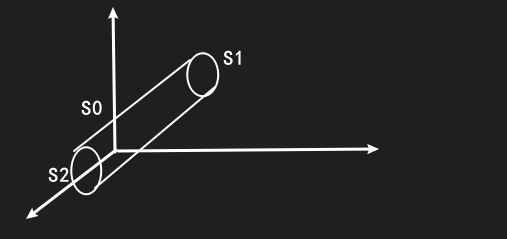

# Gauss 公式

## 形式

$\displaystyle \oiint_\Sigma P\mathrm{d}y\land\mathrm{d}z+Q\mathrm{d}z\land\mathrm{d}x+R\mathrm{d}x\land\mathrm{d}y=\iiint_{\Omega} \left( \frac{\partial P}{\partial x} +\frac{\partial Q}{\partial y} +\frac{\partial R}{\partial z}  \right)\mathrm{d}V$

在封闭的曲面上的曲面积分, 可以化为一个三重积分.

## 证明

只需证明一部分: $\displaystyle \iint_\Sigma P\mathrm{d}y\land\mathrm{d}z=\iiint_{\Omega}\frac{\partial P}{\partial x} \mathrm{d}V$

投影到 $yOz$ 平面, 只需看前侧和后侧.

我们已知 $\displaystyle \iint_\Sigma f(x,y,z)\mathrm{d}y\land\mathrm{d}z=\pm \iint_{D_{yz}}f(x(y,z),y,z)\mathrm{d}y\mathrm{d}z$

在前侧为正, 在后侧为负.

$\Sigma=S_0\cup S_1\cup S_2$

$
\begin{aligned}
\oiint_{\Sigma_{\text{外}}}
&=\oiint_{\Sigma_{S_0}}+\oiint_{\Sigma_{S\text{1后}}}+\oiint_{\Sigma_{S\text{2前}}} \\
&=0-\iint_{D_{yz}}P(x_{1}(y,z),y,z)\mathrm{d}y\mathrm{d}z+\iint_{D_{yz}}P(x_{2}(y,z),y,z)\mathrm{d}y\mathrm{d}z \\
&=\iint_{D_{yz}}[P(x_{2}(y,z),y,z)-P(x_{1}(y,z),y,z)]\mathrm{d}y\mathrm{d}z
\end{aligned}
$

我们再看

$
\begin{aligned}
\iint_{u}\frac{\partial P}{\partial x}\mathrm{d}x\mathrm{d}y\mathrm{d}z
&=\iint_{D_{yz}}\left[ \int_{x_1(y,z)}^{x_{2}(y,z)}\frac{\partial P}{\partial x}\mathrm{d}x \right]\mathrm{d}y\mathrm{d}z \\
&=\iint_{D_{yz}}[P(x_{2}(y,z),y,z)-P(x_{1}(y,z),y,z)]\mathrm{d}y\mathrm{d}z
\end{aligned}
$

可以看出两者是一样的, 原式得证.

## 体积

取 $P=x, Q=y, R=z$

$\displaystyle \oiint_{\Sigma}x\mathrm{d}y\land \mathrm{d}z+y\mathrm{d}z\land \mathrm{d}x+z\mathrm{d}x\land \mathrm{d}y=3 \iiint_{\Omega}\mathrm{d}x\mathrm{d}y\mathrm{d}z$

$\displaystyle V=\frac{1}{3}\oiint_{\Sigma}x\mathrm{d}y\land \mathrm{d}z+y\mathrm{d}z\land \mathrm{d}x+z\mathrm{d}x\land \mathrm{d}y$

## 例题

### 1.

$\displaystyle  I=\oiint_{\Sigma}(x+1)\mathrm{d}y\mathrm{d}z+(y+1)\mathrm{d}z\mathrm{d}x+(z+1)\mathrm{d}x\mathrm{d}y, \Sigma: x+y+z=1, x=0,y=0,z=0$

如果直接算, 要算 $12$ 个二重积分, 很麻烦.

如果我们用 Gauss 公式, 可得

$\displaystyle I=\iiint_{\Omega}[1+1+1]\mathrm{d}x\mathrm{d}y\mathrm{d}z=3\cdot \frac{1}{3}\cdot \frac{1}{2}\cdot 1=\frac{1}{2}$

### 2.

$\displaystyle I=\iint_{\Omega}yz\mathrm{d}z\mathrm{d}x+2\mathrm{d}x\mathrm{d}y, \Sigma: x^{2}+y^{2}+z^{2}=4$ 在 $z\geqslant 0$ 的部分, 取上侧

**解:**

$\Sigma$ 在 $xOy$ 面上的投影: $D_{xy}: x^{2}+y^{2}\leqslant 4$

$\because \mathrm{d}x\land \mathrm{d}y=\cos r\mathrm{d}S$

一直在上侧, 为正.

$\therefore \displaystyle \iint_{\Omega}2\mathrm{d}x\land \mathrm{d}y=2\iint_{D_{xy}}\mathrm{d}x\mathrm{d}y=2\cdot \pi\cdot 2^{2}$

$\Sigma$ 在 $xOz$ 面上的投影: $D_{xz}: x^{2}+z^{2}\leqslant 4, z\geqslant 0$

$
\begin{aligned}
\therefore\iint_{\Omega}yz\mathrm{d}z\mathrm{d}x
&=\iint_{\Omega_{\text{左}}}+\iint_{\Omega_{\text{右}}} \\
&=-\iint_{D_{zx}}\left( -\sqrt{4-x^{2}-z^{2}} \right)\cdot z\mathrm{d}z\mathrm{d}x+\iint_{D_{zx}}\sqrt{4-x^{2}-z^{2}}\cdot z\mathrm{d}z\mathrm{d}x \\
&=2\iint_{D_{zx}}z\sqrt{4-x^{2}-z^{2}}\mathrm{d}z\mathrm{d}x
\end{aligned}
$

将两者加起来就行.

**我们再用 Gauss 公式:**

现在只是一个上半球面, 并不封闭, 我们要给他补上一块面, 例如补上一块圆片平面, 给他形成一个两面包夹芝士的碗状立体.

即 $\Sigma: x^{2}+y^{2}+z^{2}=4, S:z=0, x^{2}+y^{2}\leqslant 4$ 取下侧.

$
\begin{aligned}
I
&=\iint_{\Sigma} \\
&=\oiint_{(\Omega+S)}-\iint_{S} \\
&=\iint_{\Omega}(z+0)\mathrm{d}x\mathrm{d}y\mathrm{d}z-(0-\iint_{D_{xy}2\mathrm{d}x\mathrm{d}y}) \\
&=\int_{0}^{2\pi}\mathrm{d}\theta\int_{0}\frac{\pi}{2}\mathrm{d}\varphi\int_{0}^{2}\rho\cos \rho\cdot \rho^{2}\sin \varphi\mathrm{d}\rho+2\cdot \pi\cdot 2^{2}
\end{aligned}
$

