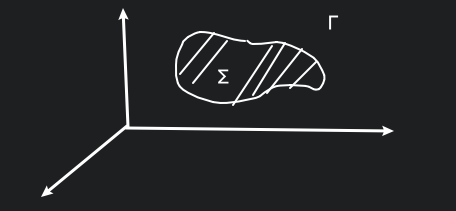
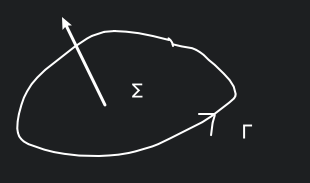
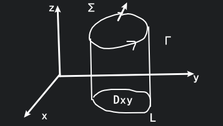

# 斯托克斯公式

## 形式

$\displaystyle \iint_\Sigma \begin{vmatrix}	\cos\alpha &\cos\beta &\cos\gamma \\\frac{\partial }{\partial x}  &\frac{\partial }{\partial y}  &\frac{\partial }{\partial z}  \\	P &Q &R \end{vmatrix}\mathrm{d}S=\oint_\Gamma P\mathrm{d}x+Q\mathrm{d}y+R\mathrm{d}z$

在空间中有几条封闭的曲线, 可以先看一条曲线, 这条曲线对应有一个第Ⅱ形的曲面积分:

$
\begin{aligned}
&\quad\ \oint_{\Gamma}P(x,y,z)\mathrm{d}x+Q(x,y,z)\mathrm{d}y+R(x,y,z)\mathrm{d}z \\
&=\iint_{\Sigma}\left[ \frac{\partial R}{\partial y}-\frac{\partial Q}{\partial z} \right]\mathrm{d}y\land \mathrm{d}z+\left[ \frac{\partial P}{\partial z}-\frac{\partial R}{\partial x} \right]\mathrm{d}z\land \mathrm{d}x+\left[ \frac{\partial Q}{\partial x}-\frac{\partial P}{\partial y} \right]\mathrm{d}x\land \mathrm{d}y  \\
&=\iint_\Sigma \begin{vmatrix}	\mathrm{d}y\land \mathrm{d}z &\mathrm{d}z\land \mathrm{d}x &\mathrm{d}x\land \mathrm{d}y \\\frac{\partial }{\partial x}  &\frac{\partial }{\partial y}  &\frac{\partial }{\partial z}  \\	P &Q &R \end{vmatrix} \\
&=\iint_\Sigma \begin{vmatrix}	\cos\alpha &\cos\beta &\cos\gamma \\\frac{\partial }{\partial x}  &\frac{\partial }{\partial y}  &\frac{\partial }{\partial z}  \\	P &Q &R \end{vmatrix}\mathrm{d}S \\
\end{aligned}
$

其中 $\Gamma$ 的取向与 $\Sigma$ 的侧满足右手规则.

## 证明

只需证明: $\displaystyle \oint_{\Gamma}P(x,y,z)\mathrm{d}x=\iint_{\Sigma}\frac{\partial P}{\partial z}\mathrm{d}z\land \mathrm{d}x-\iint_{\Sigma}\frac{\partial P}{\partial y}\mathrm{d}x\land \mathrm{d}y$

证明:

$\Sigma: z=z(x,y)$ 其投影为 $D_{xy}$, $L$ 是 $\Gamma$ 在 $xOy$ 面的投影

$L: \begin{cases}
    x=x(t) \\
    y=y(t) \\
    z=0 \\
\end{cases},
\Gamma: \begin{cases}
    x=x(t) \\
    y=y(t) \\
    z=z(x(t),y(t)) \\
\end{cases},
t\in (\alpha,\beta)$

这个过程中用参数方程, 将空间上的方程转成了平面上的方程, 再用 Green 公式.

$
\begin{aligned}
P_{\text{left}} &=\oint_{\Gamma}P(x,y,z)\mathrm{d}x \\
&=\int_{\alpha}^{\beta}P(x(t),y(t),z(x(t),y(t)))x'(t)\mathrm{d}t \\
&=\oint_{L}P(x,y,z(x,y))\mathrm{d}x \\
&=\oint_{L}P(x,y,z(x,y))\mathrm{d}x+0\mathrm{d}y \\
&=\iint_{D_{xy}}\left[ 0-\frac{\partial P}{\partial y} \right]\mathrm{d}x\land\mathrm{d}y \\
&=-\iint_{D_{xy}}\left[ \frac{\partial P}{\partial x}\frac{\partial x}{\partial y}+\frac{\partial P}{\partial y}\frac{\partial y}{\partial y}+\frac{\partial P}{\partial z}\frac{\partial z}{\partial y} \right]\mathrm{d}x\land\mathrm{d}y \\
&=-\iint_{D_{xy}}\left[ \frac{\partial P}{\partial y}+\frac{\partial P}{\partial z}\cdot z_{y} \right]\mathrm{d}x\land\mathrm{d}y \\
&=\iint_{D_{xy}}\frac{\partial P}{\partial z}\cdot (-z_{y})\mathrm{d}x\land\mathrm{d}y-\iint_{D_{xy}}\frac{\partial P}{\partial y}\mathrm{d}x\land\mathrm{d}y \\
&=\iint_{\Sigma}\frac{\partial P}{\partial z}\mathrm{d}z\land \mathrm{d}x-\iint_{D_{xy}}\frac{\partial P}{\partial y}\mathrm{d}x\land\mathrm{d}y \\
\end{aligned}
$

多元复合函数求偏导容易错, 例如:

$z=f(x,xy,x+y)$

$\displaystyle \frac{\partial z}{\partial x}=\frac{\partial f}{\partial x}\cdot \frac{\partial x}{\partial x}+\frac{\partial f}{\partial (xy)}\cdot \frac{\partial (xy)}{\partial x}+\frac{\partial f}{\partial (x+y)}\cdot \frac{\partial (x+y)}{\partial x}=\frac{\partial f}{\partial x}+f_2y+f_3$

注意这里的 $\displaystyle \frac{\partial z}{\partial x}$ 和 $\displaystyle \frac{\partial f}{\partial x}$ 并不一样, 要注意, 上文的两个 $\displaystyle \frac{\partial P}{\partial y}$ 就不一样.

而对于 $\Sigma: z-z(x,y)=0$, $\displaystyle \frac{\{-z_{x},-z_{y},1\}}{\sqrt{1+z_{x}^{2}+z_{y}^{2}}}$

$\displaystyle \frac{-z_{y}}{\sqrt{1+z_{x}^{2}+z_{y}^{2}}}=\cos \beta, \frac{1}{\sqrt{1+z_{x}^{2}+z_{y}^{2}}}=\cos \gamma$

$\displaystyle \iint_{\Sigma}\frac{\partial P}{\partial z}\mathrm{d}z\land \mathrm{d}x=\iint_{\Sigma}\frac{\partial P}{\partial z}\cos \beta\mathrm{d}S=\iint_{\Sigma} \frac{\partial P}{\partial z}\frac{\cos \beta}{\cos \gamma}\cos\gamma\mathrm{d}S=\iint_{\Sigma} \frac{\partial P}{\partial z}\frac{\cos \beta}{\cos \gamma}\mathrm{d}x\land \mathrm{d}y=\iint_{\Sigma} \frac{\partial P}{\partial z}(-z_{y})\mathrm{d}x\land \mathrm{d}y$

## 例题

### 1.

$\displaystyle I=\iint_{S}yz\mathrm{d}y\mathrm{d}z+zx\mathrm{d}z\mathrm{d}x+xy\mathrm{d}x\mathrm{d}y, S: x^{2}+y^{2}+z^{2}=1$ 的外侧

对于 $D_{xy}: x^{2}+y^{2}\leqslant 1$

$\displaystyle \oiint_{S}xy\mathrm{d}x\mathrm{d}y=\iint_{S_\text{上}}+\iint_{S_{\text{下}}}=\iint_{D_{xy}}xy\mathrm{d}x\mathrm{d}y-\iint_{D_{xy}}xy\mathrm{d}x\mathrm{d}y=0$

对于每一个部分, 我们发现均等于 $0$

如何把 $\displaystyle \oiint_{S}yz\mathrm{d}y\mathrm{d}z$ 投到 $xOy$ 面上

$\displaystyle \oiint_{S}yz\mathrm{d}y\mathrm{d}z=\oiint_{S}yz\cos\alpha\mathrm{d}S=\oiint_{S}yz\frac{\cos\alpha}{\cos\gamma}\mathrm{d}x\mathrm{d}y$

而对于 $S: F(x,y,z)=0$, 有 $\displaystyle \frac{\{F_{x}, F_{y}, F_{z}\}}{\sqrt{F_{x}^{2}+F_{y}^{2}+F_{z}^{2}}}$

另一种常见的情况 $S: z=z(x,y)$, 就有 $\displaystyle  \frac{F_{x}}{F_{z}}=-z_{x}$

或者这题我们也可以用 Gauss 公式来做

$\displaystyle I=\iiint_{\Omega}(0+0+0)\mathrm{d}x\mathrm{d}y\mathrm{d}z=0$

### 2.

$p$ 表示从原点到 $\displaystyle S: \frac{x^{2}}{a^{2}}+\frac{y^{2}}{b^{2}}+\frac{z^{2}}{c^{2}}=1$ 上 $M(x,y,z)$ 点的切平面的距离. 

求 $\displaystyle \oiint_{S}pdS$

**解:**

使用 $\displaystyle \vec{n}=\{\frac{x}{a^{2}}, \frac{y}{b^{2}}, \frac{z}{c^{2}}\}$ 作为法向量, 则有切平面

$\displaystyle \frac{x}{a^{2}}(X-x)+\frac{y}{b^{2}}(Y-y)+\frac{z}{c^{2}}(Z-z)=0$

则可求出

$\displaystyle p=\frac{\displaystyle \left|\frac{x^{2}}{a^{2}}+\frac{y^{2}}{b^{2}}+\frac{y^{2}}{c^{2}}\right|}{\displaystyle \sqrt{\frac{x^{2}}{a^{4}}+\frac{y^{2}}{b^{4}}+\frac{z^{2}}{c^{4}}}}=\left(\frac{x^{2}}{a^{4}}+\frac{y^{2}}{b^{4}}+\frac{z^{2}}{c^{4}}\right)^{-\frac{1}{2}}$

然后有

$\displaystyle  I=\oiint_{S}\left(\frac{x^{2}}{a^{4}}+\frac{y^{2}}{b^{4}}+\frac{z^{2}}{c^{4}}\right)^{-\frac{1}{2}}\mathrm{d}S$

看起来不太好做

实际上我们可以用另一种方式求 $p$

$\displaystyle p=\frac{\{x,y,z\}\cdot \vec{n}}{|\vec{n}|}$

那么原来的 $\displaystyle I=\oiint_{S}\{x,y,z\}\cdot \vec{n}\mathrm{d}S=\oiint_{S}x\mathrm{d}y\mathrm{d}z+y\mathrm{d}z\mathrm{d}x+z\mathrm{d}x\mathrm{d}y=\iint_{\Omega}3\mathrm{d}x\mathrm{d}y\mathrm{d}z=3\cdot \frac{4}{3}\pi abc=4\pi abc$

### 3.

若 $S$ 是封闭曲面, $\vec{l}$ 是一个固定方向, 求证: $\displaystyle  \oiint_{S}\cos(\vec{n},\vec{l})\mathrm{d}S=0, \vec{n}$ 是 $S$ 的外流方向.

**证:**

$\displaystyle \vec{n}=\{\cos\alpha, \cos\beta, \cos \gamma\}, \vec{l}=\{a,b,c\}, \cos \langle \vec{n}, \vec{l}\rangle=\frac{\vec{n}\cdot \vec{l}}{||\vec{n}||\cdot ||\vec{l}||}=\frac{a\cos\alpha+b\cos \beta+\cos\gamma}{\sqrt{a^{2}+b^{2}+c^{2}}}$

那么就有

$\displaystyle \oiint_{S}\cos\langle \vec{n},\vec{l}\rangle\mathrm{d}S=\oiint_{S}\frac{a}{\sqrt{a^{2}+b^{2}+c^{2}}}\mathrm{d}y\mathrm{d}z+\frac{b}{\sqrt{a^{2}+b^{2}+c^{2}}}\mathrm{d}z\mathrm{d}x+\frac{c}{\sqrt{a^{2}+b^{2}+c^{2}}}\mathrm{d}x\mathrm{d}y=\iiint_{\Omega}0\mathrm{d}x\mathrm{d}y\mathrm{d}z=0$

### 4.

$\displaystyle I=\oint_{\Gamma}y\mathrm{d}x+z\mathrm{d}y+x\mathrm{d}z, \Gamma: \begin{cases} x^{2}+y^{2}+z^{2}=R^{2} \\ x+z=R \end{cases}$

沿着 $x$ 轴的正向看去, $\Gamma$ 是顺时针方向.

参数方程有点难求, 尝试使用 Stokes 公式.

对于平面 $x+z=R$ 的单位法向量是 $\{\frac{1}{\sqrt{2}},0,\frac{1}{\sqrt{2}}\}$,

$\displaystyle I=\iint_{S}\begin{vmatrix}\frac{1}{\sqrt{2}} &0 &\frac{1}{\sqrt{2}} \\ \frac{\partial }{\partial x} &\frac{\partial }{\partial y} &\frac{\partial}{\partial z} \\y &z &x \\\end{vmatrix}\mathrm{d}S=\iint_{S}\left(-\frac{1}{\sqrt{2}}-\frac{1}{\sqrt{2}}\right)\mathrm{d}S=-\sqrt{2}\iint_{S}\mathrm{d}S=-\sqrt{2}\cdot \pi(\frac{\sqrt{2}}{2}R)^{2}=- \frac{\sqrt{2} \pi R^{2}}{2}$

