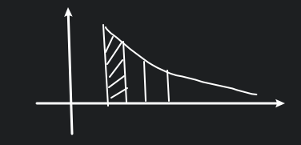

# 级数

- 数项级数
- 幂级数 (泰勒展开到无限次)
- 傅里叶级数 (三角级数)

## 引入

有一个数列, $a_1, a_2,\cdots ,a_n,\cdots$

然后**逐项**相加 (无限次加法不能用交换律)

对于级数 $\displaystyle 1+(-\frac{1}{2})+\frac{1}{3}+(-\frac{1}{4})+\cdots$

我们有 $\displaystyle \sum_{n=1}^{\infty} (-1)^{n+1}\frac{1}{n}=\ln 2$, 不能乱用交换律.

## 数项级数

$\displaystyle \sum_{n=1}^{\infty} a_n=a_1,a_2,\cdots,a_n, \cdots$

定义: 称 $\displaystyle S_{n}=\sum_{n=1}^{n} \alpha_1+\alpha_2+\cdots+\alpha_n$ 为级数 $\sum a_n$ 部分和, 即部分和数列 $\{S_n\}$

若 $\{S_n\}$ 收敛, 则称 $\displaystyle \sum_{n=1}^{\infty} a_n$ 收敛, $S_1,S_2,\cdots,S_n,\cdots$

$S_n\to S$, 则 $\sum a_n=S$.

## 例题

### 1.

$\displaystyle \sum_{n=1}^{\infty} \frac{1}{n(n+1)}$

$\displaystyle S_n=\sum_{n=1}^{\infty} \frac{1}{i(i+1)}=\frac{1}{1\cdot 2}+\frac{1}{2\cdot 3}+\cdots +\frac{1}{n(n+1)}=1-\frac{1}{n+1}\to 1$

### 2.

$\displaystyle \sum_{n=1}^{\infty} q^{n}$

$\displaystyle S_n=q+q^{2}+\cdots +q^{n}=\frac{q(1-q^{n})}{1-q}$

当 $|q|<1$ 时, $\displaystyle S_n\to \frac{q}{1-q}$

### 3.

证明调和数列 $\displaystyle \sum_{n=1}^{\infty} \frac{1}{n}=1+\frac{1}{2}+\cdots$

$
\begin{aligned}
\sum_{n=1}^{\infty} \frac{1}{n}
&=1+\frac{1}{2}+(\frac{1}{3}+\frac{1}{4})+(\frac{1}{5}+\frac{1}{6}+\frac{1}{7}+\frac{1}{8})+\cdots \\
&>1+\frac{1}{2}+(\frac{1}{4}+\frac{1}{4})+(\frac{1}{8}+\frac{1}{8}+\frac{1}{8}+\frac{1}{8})+\cdots \\
&=1+\frac{1}{2}+\frac{1}{2}+\cdots \\
&=1+\frac{1}{2}k \to \infty
\end{aligned}
$

## 性质

1. 改变级数的有限项, 不改变其敛散性.
2. 数列通项 $a_n=S_n-S_{n-1}$, 若 $\sum a_n$ 收敛, 则 $a_n\to 0$, 反之则不然, 如调和数列 $\sum \frac{1}{n}=1+\frac{1}{2}+\cdots$.
3. 由逆否命题可知 $a_n\not\to 0$, 则 $\sum a_n$ 发散.
4. Cauchy 准则: $\sum a_{n}$ 收敛 $\Leftrightarrow$ $\forall \varepsilon>0, \exists N$, 当 $n>N$ 时, $|a_{n}+a_{n+1}+\cdots +a_{n+p}|<\varepsilon$, 对 $\forall p\in \mathbb{N}$
5. 若 $\sum a_n, \sum b_n$ 都收敛, 且 $\sum a_{n}=A, \sum b_{n}=B$, 则 $\sum(a_{n}\pm b_{n})=\sum a_{n}\pm \sum b_{n}=A \pm B$. 
   1. 注意这里涉及到了级数次序的交换性.
   2. 而一个收敛一个发散的级数相加不能这样交换的.

**PS:**

$\{S_n\}$ 收敛的 Cauchy 数列：

$\forall \varepsilon>0, \exists N$, 当 $m, n > N$, $|S_m-S_n|<\varepsilon$

**例题:**

$\displaystyle \sum_{n=1}^{\infty} \frac{1}{n^{2}}, \forall \varepsilon>0$

$
\begin{aligned}
&\quad\ |a_{n}+a_{n+1}+\cdots +a_{n+p}| \\
&=\frac{1}{n^{2}}+\frac{1}{(n+1)^{2}}+\cdots +\frac{1}{(n+p)^{2}} \\
&< \frac{1}{(n-1)n}+\frac{1}{n(n+1)}+\cdots +\frac{1}{(n+p-1)(n+p)} \\
&=\frac{1}{n-1}-\frac{1}{n+p} \\
&< \frac{1}{n-1} \\
&< \varepsilon
\end{aligned}
$

## 乘法

有很多种定义, 我们使用柯西乘法.

我们定义 $\displaystyle \left( \sum_{n=1}^{\infty} a_n \right) \left( \sum_{n=1}^{\infty} b_n \right)=\sum_{n=1}^{\infty} c_n$

其中 $\displaystyle c_{n}=a_{1}b_{n}+a_{2}b_{n-1}+\cdots +a_{n}b_{1}+\cdots$

或者使用三角形法则:

$a_{1}b_{1} \quad a_{1}b_{2} \quad \cdots \quad a_{1}b_{n} \quad \cdots$
$a_{2}b_{1} \quad a_{2}b_{2} \quad \cdots \quad a_{2}b_{n} \quad \cdots$
$\cdots \qquad \cdots \quad \cdots \qquad \cdots \quad \cdots$
$a_{n}b_{1} \quad a_{n}b_{2} \quad \cdots \quad a_{n}b_{n} \quad \cdots$
$\cdots \qquad \cdots \quad \cdots \qquad \cdots \quad \cdots$

**性质:**

若 $\sum a_{n}$ 收敛, 则可以任意加括号.

$\sum a_{n}=a_1+a_2+a_3+a_4+a_5+a_6+\cdots=(a_1+a_2+a_3)+a_4+(a_5+a_6)+\cdots$

我们思考: 一个发散的数列, 我们把其括号拆掉, 那它是收敛的还是发散的?

答案是发散的. 反证法, 如果它拆掉括号是收敛的, 那么把括号重新加进去就还是收敛的, 与该数列是发散的矛盾.

## 正项级数的判别法

正项级数意思是每一项都是非负数的级数. 相似的, 还有任意项级数, 指正项和负项都是无穷多的.

### 有界收敛定理

若 $\displaystyle \sum_{n=1}^{\infty} a_n, a_n\geqslant 0, \{S_{n}\}↑$, 当 $\{S_{n}\}$ 上有界时, $\sum_{n=1}^{\infty} a_n$ 收敛.

### 比较判别法

比较判别法是很多其他方法的基础.

$\displaystyle \sum_{n=1}^{\infty} a_n$ 和 $\displaystyle \sum_{n=1}^{\infty} b_n$ 都是正向级数, 且 $a_{n}\leqslant b_{n}$, 则

1. $\displaystyle \sum_{n=1}^{\infty} b_{n}$ 收敛 $\Rightarrow$ $\displaystyle \sum_{n=1}^{\infty} a_n$ 收敛
2. $\displaystyle \sum_{n=1}^{\infty} a_{n}$ 发散 $\Rightarrow$ $\displaystyle \sum_{n=1}^{\infty} b_n$ 发散

这两个结论是逆否命题.

**例题:**

我们已知 $\displaystyle \sum_{n=1}^{\infty} \frac{1}{n}$ 发散, 也知道 $\displaystyle \tan \frac{1}{n}>\frac{1}{n}$, 则 $\displaystyle \sum_{n=1}^{\infty} \tan \frac{1}{n}$ 发散.

### 极限形式的比较判别法

$\displaystyle \sum_{n=1}^{\infty} a_n$ 和 $\displaystyle \sum_{n=1}^{\infty} b_n$ 都是正向级数, $\displaystyle \lim_{n \to \infty} \frac{a_{n}}{b_{n}}=\lambda$

当 $0<\lambda<+\infty$ 时, $\displaystyle \sum_{n=1}^{\infty} a_{n}$ 与 $\displaystyle \sum_{n=1}^{\infty} b_{n}$ 有着相同的敛散性.

当 $\lambda=0$ 时, 若 $\displaystyle \sum_{n=1}^{\infty} b_{n}$ 收敛 $\Rightarrow$ $\displaystyle \sum_{n=1}^{\infty} a_{n}$ 收敛, (若 $\displaystyle \sum_{n=1}^{\infty} a_{n}$ 发散 $\Rightarrow$ $\displaystyle \sum_{n=1}^{\infty} b_{n}$ 发散)

当 $\lambda=+\infty$ 时, 若 $\displaystyle \sum_{n=1}^{\infty} a_{n}$ 收敛 $\Rightarrow$ $\displaystyle \sum_{n=1}^{\infty} b_{n}$ 收敛, (若 $\displaystyle \sum_{n=1}^{\infty} b_{n}$ 发散 $\Rightarrow$ $\displaystyle \sum_{n=1}^{\infty} a_{n}$ 发散)

**证明:**

$\displaystyle \lambda-\varepsilon<\frac{a_{n}}{b_{n}}<\lambda+\varepsilon$

$\displaystyle (\lambda-\varepsilon)b_{n}<a_{n}<(\lambda+\varepsilon)b_{n}$

**例题:**

$\because \displaystyle \frac{\sin \frac{1}{n}}{\frac{1}{n}}\to 1$, $\displaystyle \sum_{n=1}^{\infty} \frac{1}{n}$ 发散

$\therefore \displaystyle \sum_{n=1}^{\infty} \sin \frac{1}{n}$ 发散.

### 例题

有三个级数, $\displaystyle \sum_{n=1}^{\infty} a_{n}, \sum_{n=1}^{\infty} b_{n}, \sum_{n=1}^{\infty} c_{n}$, 满足 $a_{n}\leqslant b_{n}\leqslant c_{n}$.

若有 $\displaystyle \sum_{n=1}^{\infty} a_{n}, \sum_{n=1}^{\infty} c_{n}$ 都收敛, 那么 $\displaystyle \sum_{n=1}^{\infty} b_{n}$ 收敛吗?

答案是收敛的.

**证明:**

我们只需要 $0\leqslant b_{n}-a_{n}\leqslant c_{n}-a_{n}$

由收敛级数加法可知 $\displaystyle \sum_{n=1}^{\infty} c_{n}-a_{n}$ 收敛.

那么由比较判别法可知 $\displaystyle \sum_{n=1}^{\infty} b_{n}-a_{n}$ 也收敛.

则由收敛级数加法可知 $\displaystyle \sum_{n=1}^{\infty} b_{n}$ 收敛.

### 积分判别法

已知 $a_{n}\geqslant 0$, 令 $f(n)=a_{n}$

$\displaystyle \int_{1}^{+\infty}f(x)\mathrm{d}x=\int_{1}^{2}+\int_{2}^{3}+\cdots +\int_{n}^{n+1}+\cdots=\sum_{n=1}^{\infty}\int_{n}^{n+1}f(x)\mathrm{d}x$

对于其中一项 $\displaystyle \int_{n}^{n+1}$, 里面的值介于 $\displaystyle a_{n+1}<\int_{n}^{n+1}f(x)\mathrm{d}x<a_{n}$

那么我们就可以将原来的级数转化为一个积分, 有着相同的敛散性.

**例一:**

对于 $p$-级数: $\displaystyle \sum_{n=1}^{\infty} \frac{1}{n^{p}}$

我们可以转化为 $\displaystyle \int_{1}^{+\infty}\frac{1}{x^{p}}\mathrm{d}x$ 的敛散性.

**例二:**

对于 $\displaystyle  \sum_{n=1}^{\infty} \frac{1}{n\ln^{p} n}$, 判断其收敛性.

当 $p=1$ 时,

$\displaystyle \int_{2}^{+\infty}\frac{\mathrm{d}x}{x\ln x}=\ln \ln x|_2^\infty\to \infty$

当 $p>1$ 时,

$\displaystyle \int_{2}^{+\infty}\frac{\mathrm{d}x}{x\ln^{p} x}=\int_{2}^{+\infty}\frac{\mathrm{d}\ln x}{\ln^{p} x}=\frac{1}{-p+1}(\ln x)^{-p+1}|_2^\infty$ 收敛

### 阶估法

若 $\displaystyle \sum_{n=1}^{\infty} a_{n}$ 是正项级数.

$\displaystyle \lim_{n \to \infty} n^{p}a_{n}=\lim_{n \to \infty} \frac{a_{n}}{\frac{1}{n^{p}}}=\lambda$

当 $0<\lambda<+\infty$ 时,

若 $p>1$, 则有 $\displaystyle \sum_{n=1}^{\infty} a_{n}$ 是收敛的.

若 $p\leqslant 1$, 则有 $\displaystyle \sum_{n=1}^{\infty} a_{n}$ 是发散的.

所以很多时候, 用 taylor 展开就可以知道它的敛散性, 就是靠阶估法.

如 Taylor 展开 $\displaystyle \sum_{n=1}^{\infty} \ln \left( 1+\frac{3}{n} \right)=\frac{3}{n}+\cdots$, 明显是一阶的, 发散.

### D' Alembert (达朗贝尔) 比值法

还有一个经常拿来做比较的级数: $\displaystyle \sum_{n=1}^{\infty} q^{n}$

已知 $\displaystyle \sum_{n=1}^{\infty} a_n$ 是正项级数, $\displaystyle \lim_{n \to \infty} \frac{a_{n+1}}{a_{n}}=\lambda$

若 $\lambda<1$, 则 $\displaystyle \sum_{n=1}^{\infty} a_n$ 是收敛的. 

若 $\lambda>1$, 则 $\displaystyle \sum_{n=1}^{\infty} a_n$ 是发散的.

若 $\lambda=1$, 则 $\displaystyle \sum_{n=1}^{\infty} a_n$ 暂时无法判断.

**证:**

$\forall \varepsilon>0, \exists N, n>N$,

对于第一种情况:

$\because \displaystyle \lambda-\varepsilon<\frac{a_{n+1}}{a_{n}}<\lambda+\varepsilon=q<1$

$\therefore \displaystyle a_{n+1}< qa_{n}< q^{2} a_{n-1} <\cdots <q^{n-N}a_{N+1}$

对于第二种情况:

$\because \displaystyle 1<\lambda-\varepsilon=q<\frac{a_{n+1}}{a_{n}}<\lambda+\varepsilon$

$\therefore \displaystyle a_{n+1}> qa_{n}> q^{2} a_{n-1} >\cdots >q^{n-N}a_{N+1}$

**例:**

$\displaystyle \sum_{n=1}^{\infty} \frac{2^{n}}{n!}$

$\displaystyle \frac{a_{n+1}}{a_{n}}=\frac{2^{n+1}\cdot n!}{(n+1)!\cdot 2^{n}}=\frac{2}{n+1}\to 0$, 收敛.

### Cauchy 根值法

已知 $\displaystyle \sum_{n=1}^{\infty} a_n$ 是正项级数

$\displaystyle \lim_{n \to \infty} \sqrt[n]{a_{n}}=\lambda$

若 $\lambda<1$, 则 $\displaystyle \sum_{n=1}^{\infty} a_n$ 是收敛的. 

若 $\lambda>1$, 则 $\displaystyle \sum_{n=1}^{\infty} a_n$ 是发散的.

若 $\lambda=1$, 则 $\displaystyle \sum_{n=1}^{\infty} a_n$ 暂时无法判断.

根值判别法和比值判别法本质上是一样的. 但是根值法比比值法更为常用.

**证:**

$\forall \varepsilon>0$,

$\displaystyle \lambda-\varepsilon<\sqrt[n]{a_{n}}<\lambda+\varepsilon=q<1$

$a_{n}<q^{n}$

**例:**

$\displaystyle \sum_{n=1}^{\infty} \frac{n^{\ln n}}{(\ln n)^{n}}$

我们有 $\displaystyle \frac{(\ln n)^{2}}{n}\to 0$

$\displaystyle \sqrt[n]{a_{n}}=\frac{n^{\frac{\ln n}{n}}}{\ln n}=\frac{e^{\frac{\ln n}{n}\cdot \ln n}}{\ln n}\to 0$

所以是收敛的.
