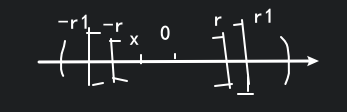

# 幂级数

## 定义

$\displaystyle \sum_{n=0}^{\infty}u_{n}(x)=\sum_{n=0}^{\infty} a_n(x-x_0)^{n}=a_0+a_1(x-x_0)+\cdots+a_n(x-x_0)^{n}+\cdots$

令 $x-x_0=t$

$\displaystyle \sum_{n=0}^{\infty}u_{n}(x)=\sum_{n=0}^{\infty}a_{n}t^{n}$

可以化作最简的形式, 所以我们可以直接研究

$\displaystyle \sum_{n=0}^{\infty}u_{n}(x)=a_0+a_1x+\cdots+a_{n}x^{n}+\cdots \quad (*)$

## Abel 第一定理

若 $(*)$ 在 $x=\overline{x}$ 处收敛, 则对 $|x|<|\overline{x}|$ 的 $x$, $(*)$ 是绝对收敛的.

若 $(*)$ 在 $x=\overline{x}$ 处发散, 则对 $|x|>|\overline{x}|$ 的 $x$, $(*)$ 都发散.

**证明:**

当 $|x|<|\overline{x}|$ 时, $\displaystyle \sum_{n=0}^{\infty} a_{n}x^{n}$

$\displaystyle |a_{n}x^{n}|=|a_{n}\overline{x}^{n}|\left| \frac{x}{\overline{x}} \right|^{n}\leqslant M\cdot q^{n}$ 收敛

其中 $a_{n}\overline{x}^{n}$ 收敛于 $0$, 所以有界 $M$, 而 $\displaystyle q=\left| \frac{x}{\overline{x}} \right|<1$

而证明 $|x|>|\overline{x}|$ 时发散, 只需要用反证法就好. (应用上面的结论)

假设 $x$ 处收敛, 因此 $|\overline{x}|<|x|$, 可推出 $x=\overline{x}$ 处也收敛, 矛盾.

收敛域一般呈形 $\left<-R,R\right>$, 其中端点要单独讨论, $R$ 称为收敛半径.

## 例题

### 1.

$\displaystyle \sum_{n=0}^{\infty}\frac{x^{n}}{n}=\sum_{n=0}^{\infty} a_{n}x^{n}=\sum_{n=0}^{\infty} u_{n}(x)$

由达朗贝尔判别法

$\displaystyle \left| \frac{u_{n+1}(x)}{u_{n}(x)} \right|=\left| \frac{x^{n+1}}{n+1}\cdot \frac{n}{x^{n}} \right|=\frac{n}{n+1}|x|\to |x|$

经过判断可知收敛域为 $[-1,1)$

### 2.

$\displaystyle \sum_{n=0}^{\infty} \frac{2^{n}x^{n}}{n!}$

由达朗贝尔判别法

$\displaystyle \left| \frac{u_{n+1}(x)}{u_{n}(x)} \right|=\left| \frac{2^{n+1}x^{n+1}}{(n+1)!}\cdot\frac{n!}{2^{n}x^{n}} \right|=\frac{2x}{n+1}\to 0$ 收敛

### 总结

$\displaystyle \sum_{n=0}^{\infty}a_{n}x^{n}$

$\displaystyle \lim_{n \to \infty}\left| \frac{a_{n+1}x^{n+1}}{a_{n}x^{n}} \right|=\lim_{n \to \infty}\left|\frac{a_{n+1}}{a_{n}} \right||x|=\gamma|x|<1$

当 $\displaystyle |x|<\frac{1}{\gamma}$ 时, 收敛

当 $\displaystyle |x|>\frac{1}{\gamma}$ 时, 发散

收敛半径 $\displaystyle R=\lim_{n \to \infty}\left| \frac{a_{n}}{a_{n+1}} \right|$ 或 $\displaystyle R=\lim_{n \to \infty}\frac{1}{\sqrt[n]{a_{n}}}$

### 3.

$\displaystyle \sum_{n=0}^{\infty} n!x^{n}$

收敛半径 $\displaystyle R=\lim_{n \to \infty}\frac{n!}{(n+1)!}=0$

### 4.

$\displaystyle \sum_{n=0}^{\infty} \frac{n(x-2)^{2n}}{2^{n}}$

注意这里只有偶数次的 $(x-2)^{2n}$, 没有奇数次的 $(x-2)^{2n-1}$, 换言之, 奇数次的系数为 $0$.

$\displaystyle \sum_{n=0}^{\infty} \frac{n(x-2)^{2n}}{2^{n}}=0+0\cdot (x-2)+\frac{(x-2)^{2}}{2}+0\cdot(x-2)^{3}+\cdots$

令 $(x-2)^{2}=t$

$\displaystyle \sum_{n=0}^{\infty} \frac{n(x-2)^{2n}}{2^{n}}=\sum_{n=0}^{\infty}\frac{nt^{n}}{2^{n}}$

$\therefore \displaystyle R=\lim_{n \to \infty}\frac{1}{\sqrt[n]{a_{n}}}=\lim_{n \to \infty}\frac{2}{\sqrt[n]{n}}=2$

可以得知关于 $t$ 的收敛域为 $[0,2)$

进而可以求出关于 $x$ 的收敛域为 $(2-\sqrt{2},2+\sqrt{2})$

### 5.

已知 $\displaystyle \sum_{n=0}^{\infty} a_{n}(x-2)^{n}$ 在 $x=-1$ 处条件收敛, 求该级数的收敛域.

$\because \displaystyle \sum_{n=0}^{\infty} a_{n}(x-2)^{n}$ 在 $x=-1$ 处条件收敛, 所以这个点一定是端点, 收敛半径 $R=3$

$\therefore \displaystyle \displaystyle \sum_{n=0}^{\infty} a_{n}(x-2)^{n}$ 收敛域为 $[-1,5)$
 

## 连续性相关的思考

若在 $\left<-R,R\right>$ 中, $\displaystyle \sum_{n=0}^{\infty} a_nx^{n}=S(x)$

对 $\forall x_0\in\left<-R,R\right>, \lim_{x \to x_0}S(x)=S(x_0)$, 即

$\displaystyle \lim_{x \to x_0}\sum_{n=0}^{\infty} a_{n}x^{n}=S(x_0)=\sum_{n=0}^{\infty} a_nx_0^{n}=\sum_{n=0}^{\infty} \lim_{x \to x_0}(a_{n}x^{n})$

则称拥有连续性. 我们可以用一致收敛来判断是连续的, 但是不一致收敛却不能说它不是连续的.

**例题:**

$\displaystyle \sum_{n=0}^{\infty} x^{n}=S(x)=\frac{1}{1-x}$ 的收敛域为 $(-1,1)$

在端点 $x=1$ 处, 我们可以看出它不是一致收敛的, 但是它的和函数 $S(x)$ 仍然是连续的.

也就是说, 我们不能仅凭一致收敛这个充分条件来判断连续性.

## 内闭一致收敛

若 $\displaystyle \sum_{n=0}^{\infty} u_{n}(x)$ 在 $\left<a,b\right>$ 上收敛, 

对于 $\forall a_1,b_1, [a_1,b_1]\subset \left<a,b\right>$, $\displaystyle \sum_{n=0}^{\infty} u_{n}(x)$ 在 $[a_1,b_1]$ 上是一致收敛的, 

则称 $\displaystyle \sum_{n=0}^{\infty} u_{n}(x)$ 在 $\left<a,b\right>$ 上是内闭一致收敛的.

设 $(*)$ 的收敛半径为 $R$, 不妨令 $R>0$ ($R=0$ 的情况很简单)

则 $\displaystyle \sum_{n=0}^{\infty} a_nx^{n}$ 在 $(-R,R)$ 上是内闭一致收敛的.

**下面证明幂级数内闭一致收敛:**

要证对 $\forall [a,b]\subset (-R,R)$ 成立,

即证 $\forall [-a,a]\subset(-R,R), (0<a<R)$ 成立

取 $a<r<R$, 对 $\forall x\in[-a,a]$, 

有 $|a_{n}x^{n}|<|a_{n}r^{n}|$

后者绝对收敛, 也是收敛的, 由 M 判别法可知 $\displaystyle \sum_{n=1}^{\infty}a_{n}x^{n}$ 是一致收敛的.

则 $\displaystyle \sum_{n=0}^{\infty} a_nx^{n}$ 在 $(-R,R)$ 上是内闭一致收敛的.

## 连续性

若 $\displaystyle \sum_{n=1}^{\infty}a_{n}$ 的收敛半径为 $R$, 在 $(-R,R)$ 内, $\displaystyle \sum_{n=0}^{\infty}a_{n}x^{n}=S(x)$,

则 $S(x)\in C(-R,R)$

**证明:**

对 $\forall x_0\in (-R,R), \exists r$ 使得 $x_0\in[-r,r]\subset(-R,R)$

所以对于 $(-R,R)$ 里的每个点都是一致收敛的.

注意这里用的是内部的一个闭区间, 因此是可行的.

## 可积性

若 $\displaystyle \sum_{n=1}^{\infty}a_{n}$ 的收敛半径为 $R$, 在 $(-R,R)$ 内, $\displaystyle \sum_{n=0}^{\infty}a_{n}x^{n}=S(x)$,

则 $\displaystyle \int_0^{x}S(x)\mathrm{d}x=\sum_{n=0}^{\infty}\left( \int_0^{x}a_{n}x^{n}\mathrm{d}x \right)=\sum_{n=0}^{\infty}\frac{1}{n+1}a_{n}x^{n+1}=\int_0^{x}\left( \sum_{n=0}^{\infty}a_{n}x^{n} \right)$

在 $(-R,R)$ 内随便找两个点, 都是可以积分的, 且这个积分是可以交换的.

(第一步到第二步称为逐项积分)

其中 $\displaystyle \sum_{n=0}^{\infty}a_{n}x^{n}$ 的收敛半径至少比 $\displaystyle \sum_{n=1}^{\infty}\frac{1}{n+1}a_{n}x^{n+1}$ 的收敛半径小.

比值和根值只是一个充分性的办法, 不能直接用 $\displaystyle \sum_{n=1}^{\infty}\left| \frac{a_{n}}{a_{n+1}} \right|$ 证明相等, 但是可以用来证明前者较小.

## 可导性

$\displaystyle \sum_{n=0}^{\infty}a_{n}x^{n}$ 的收敛半径为 $R$, 当 $x\in (-R,R)$

是否有 $\displaystyle S'(x)=\left( \sum_{n=0}^{\infty}a_{n}x^{n} \right)'=\sum_{n=0}^{\infty}(a_{n}x^{n})'=\sum_{n=0}^{\infty}na_{n}x^{n-1}$

(逐项求导)

我们回忆之前的级数可导性的判断法则:

当 $\displaystyle \sum_{n=0}^{\infty}u_{n}(x)=S(x), \sum_{n=0}^{\infty}u_{n}'(x)\rightrightarrows S^*(x)$, 则有可导性.

对于幂级数来说, 只需要证明

$\displaystyle \sum_{n=1}^{\infty}na_{n}x^{n-1}$ 是一致收敛的.

我们可以用内闭一致收敛概念来证明.

**证明:**

$\displaystyle |na_{n}x^{n-1}|<|na_{n}r^{n}|=|n\left( \frac{r}{r_1} \right)^{n}|\cdot|a_{n}r_1^{n}|\leqslant M|a_{n}r_1^{n}|$ 一致收敛

可以用洛必达法则知 $\displaystyle n\left( \frac{r}{r_1} \right)\to 0$, 收敛则有界 $M$, 而 $|a_{n}r_1^{n}|$ 是绝对收敛的.

在联系上文的收敛半径的大小, 我们可以得出:

不管是积分, 还是求导, 收敛半径都是一样的.

我们还可以得到一个**更厉害** (老范原话) 的结论:

**幂级数的积分和求导可以无限制地做下去!**

(这么厉害啊.jpg)

## 例题

$\displaystyle \sum_{n=1}^{\infty}\frac{n\cdot x^{n}}{2^{n}}=S(x)$

确定收敛半径.

$\displaystyle R=\lim_{n \to \infty}\frac{1}{\sqrt[n]{\frac{n}{2^{n}}}}=2$ 可知 $(-2,2)$

当 $x=-2$ 时, $\displaystyle \sum_{n=1}^{\infty}\frac{n\cdot (-2)^{n}}{2^{n}}=\sum_{n=1}^{\infty}(-1)^{n}\cdot n$ 发散

当 $x=2$ 时, $\displaystyle \sum_{n=1}^{\infty}\frac{n\cdot 2^{n}}{2^{n}}=\sum_{n=1}^{\infty}n$ 发散

所以收敛范围是 $(-2,2)$

我们令 $\displaystyle \sum_{n=1}^{\infty}\frac{n\cdot x^{n}}{2^{n}}=S(x)=xg(x)$, 即 $\displaystyle g(x)=\sum_{n=1}^{\infty}\frac{n\cdot x^{n-1}}{2^{n}}$

$\therefore \displaystyle \int_{0}^{x}g(x)\mathrm{d}x=\sum_{n=1}^{\infty}\int_{0}^{x}\frac{n\cdot x^{n-1}}{2^{n}}\mathrm{d}x=\sum_{n=1}^{\infty}\frac{x^{n}}{2^{n}}=\frac{\frac{x}{2}}{1-\frac{x}{2}}=\frac{x}{2-x}$

$\therefore \displaystyle g(x)=\left( \frac{x}{2-x} \right)'=\frac{2}{\left(x - 2\right)^{2}}$

$\therefore \displaystyle S(x)=\frac{2x}{(2-x)^{2}}, x\in(-1,1)$ ?, 可能是 $(-2,2)$