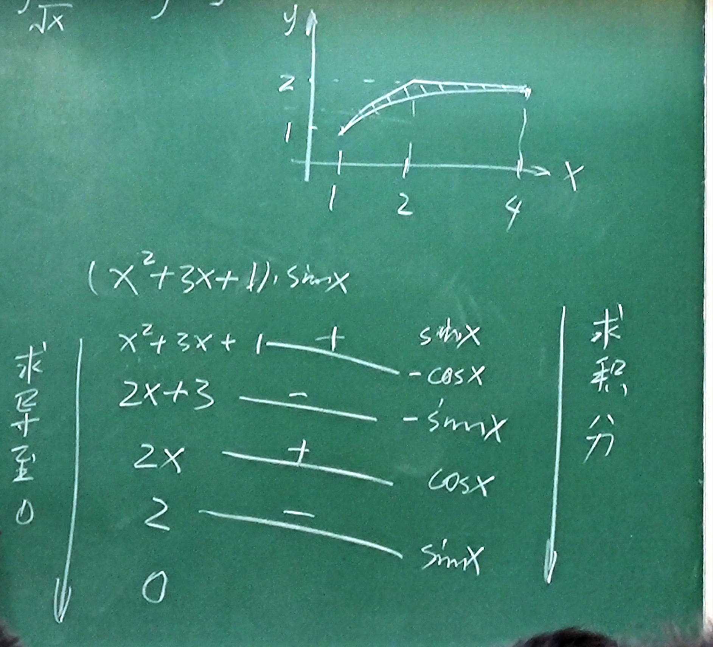
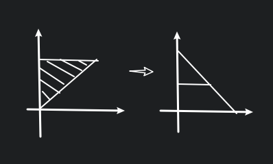

# Exam

## 2.

$
\begin{cases}
x^2+y^2+z^2=6 \\
x+y+z=0 \\
\end{cases},
M(1,-2,1)
$

$\vec{n}_1=(x,y,z)=(1,-2,1), \vec{n}_2=(1,1,1)$

$\therefore \vec{n}=\vec{n}_1\times\vec{n}_2=3(-1,0,1)$

$\therefore (x-1,y-2,z-1)=k(-1,0,1)$

$
\therefore
\begin{cases}
x-1=-k \\
y+z=0 \\
z-1=k \\
\end{cases}
$

法平面 $-(x-1)+(z-1)=0$

## 3.

### (1)

先代入后求 $f(x,0)=\begin{cases}\displaystyle x^2\sin\frac{1}{x^2}, &x\neq 0 \\ 0, &x=0\end{cases}$

$\displaystyle 0\leq |\frac{\partial f}{\partial x}|_{(0,0)}|=\lim_{x\to 0}|\frac{x^2\sin\frac{1}{x^2}-0}{x}|=\lim_{x\to 0}|x\sin\frac{1}{x^2}|\leq \lim_{x\to 0}|x|=0$

$\therefore\displaystyle\frac{\partial f}{\partial x}|_{(0,0)}=0, \frac{\partial f}{\partial y}|_{(0,0)}=0$

### (2)

$\displaystyle \frac{\partial f}{\partial x}=2x\sin\frac{1}{x^2+y^2}-\frac{2x}{(x^2+y^2)^2}\cdot \cos\frac{1}{x^2+y^2}$

令 $g(x,y)=2x\sin\frac{1}{x^2+y^2}$

可知 $\displaystyle\lim_{(x,y)\to (0,0)}g(x,y)=0$

令 $\displaystyle h(x,y)=-\frac{2x}{(x^2+y^2)^2}\cdot \cos\frac{1}{x^2+y^2}$

令 $x=r\cos\theta, y=r\sin\theta$

则 $\displaystyle\lim_{(x,y)\to (0,0)}h(x,y)=\lim_{r\to 0}-\frac{2r\sin\theta}{r^4}\cos\frac{1}{r^2}=\lim_{r\to 0}-\frac{2\sin\theta}{r^3}\cos\frac{1}{r^2}$ 不存在

### (3)

$\because \Delta f(x_0,y_0)=A\Delta x+B\Delta y+o(\sqrt{x^2+y^2})$

$
\begin{aligned}
\therefore 0
&\leq \lim_{(x,y)\to (0,0)}|\frac{f(x,y)-f(0,0)-Ax-By}{\sqrt{x^2+y^2}}| \\
&= \lim_{(x,y)\to (0,0)}|\frac{(x^2+y^2)\sin\frac{1}{x^2+y^2}}{\sqrt{x^2+y^2}}| \\
&= \lim_{(x,y)\to (0,0)}|\sqrt{x^2+y^2}\sin\frac{1}{x^2+y^2}| \\
&\leq \lim_{(x,y)\to (0,0)}|\sqrt{x^2+y^2}| \\
&=0
\end{aligned}
$

$\therefore$ 可微.

## 4.

略.

## 5.

### (1)

求 $\displaystyle\int_1^2{\rm d}x\int_{\sqrt{x}}^x\sin\frac{\pi x}{2y}{\rm d}y+\int_2^4{\rm d}x\int_{\sqrt{x}}^2\sin\frac{\pi x}{2y}{\rm d}y$

$
\begin{aligned}
I&=\int_1^2{\rm d}y\int_y^{y^2}\sin\frac{\pi x}{2y}{\rm d}x \\
&=\int_1^2-\frac{2y}{\pi}(\cos\frac{\pi x}{2y})|_{y}^{y^2}{\rm d}y \\
&=\int_1^2-\frac{2y}{\pi}(y\cos\pi y){\rm d}y \\
&=-\int_1^2\frac{2y^2}{\pi}\cos\pi y{\rm d}y \\
\end{aligned}
$

### (2)

$\displaystyle \iint_Dxy^2{\rm d}x{\rm d}y, D:x^2+y^2\leq ax$

$
\begin{aligned}
I&=2\int_0^{\frac{\pi}{2}}{\rm d}\theta\int_0^{a\cos\theta}r^4\cos\theta\sin^2\theta{\rm d}r \\
&=\frac{2}{5}\int_0^{\frac{\pi}{2}}a^5[\cos^6\theta-\cos^8\theta]{\rm d}\theta \\
\end{aligned}
$

由区间再现公式 $\displaystyle I_n=\int_0^{\frac{\pi}{2}}\sin^nx{\rm d}x=\int_0^\frac{\pi}{2}\cos^nx{\rm d}x, \int_a^bf(x){\rm d}x=\int_a^bf(x){\rm d}x=\int_a^bf(a+b-x){\rm d}x$

$\because\displaystyle I_n'=\int\sin^nx{\rm d}x=\frac{1}{n}\cos x\sin^{n-1}x+\frac{n-1}{n}I_{n-2}', \quad n\geq 2$

$\therefore\displaystyle I_n=\frac{n-1}{n}I_{n-2}, I_0=\frac{\pi}{2}, I_1=1$

华里兹公式

$
\therefore I_n=
\begin{cases}
\displaystyle\frac{(n-1)!!}{n!!}=\frac{(n-1)(n-3)\times 2}{n(n-2)\times 1}, &n \text{ is odd} \\
\displaystyle\frac{(n-1)!!}{n!!}\times\frac{\pi}{2}=\frac{(n-1)(n-3)\times 1}{n(n-2)\times 2}\times\frac{\pi}{2}, &n \text{ is even} \\
\end{cases}
$

### (3)

$\displaystyle\iiint_{\Omega}z^2{\rm d}v, \Omega: x^2+y^2+z^2\leq a^2, x^2+y^2+(z-a)^2\leq a^2$

$
\begin{aligned}
I&=\int_0^{\frac{a}{2}}z^2\pi(z(2a-z)){\rm d}z+\int_{\frac{a}{2}}^az^2\pi(a^2-z^2){\rm d}z \\
&=\int_0^{\frac{a}{2}}z^2\pi(z(2a-z)){\rm d}z+\int_{\frac{a}{2}}^az^2\pi(a^2-z^2){\rm d}z \\
&=\pi(\int_0^{\frac{a}{2}}2az^3{\rm d}z+\int_{\frac{a}{2}}^aa^2z^2{\rm d}z-\int_{\frac{a}{2}}^az^4{\rm d}z) \\
&=\frac{59}{480}\pi a^5 \\
\end{aligned}
$

### (4)

$\displaystyle\oint(x^2+y^2){\rm d}s, \Gamma:x^2+y^2=3x$

$
\begin{cases}
x=r\cdot \cos\theta=3\cos^2\theta \\
y=r\cdot \cos\theta=3\cos\theta\sin\theta\\
\end{cases}
$

$\displaystyle{\rm d}s=\sqrt{x_\theta^2+y_\theta^2}{\rm d}\theta=3{\rm d}\theta$

$\therefore\displaystyle 2\int_0^\frac{\pi}{2}3\times3\cdot \cos^2\theta{\rm d}\theta=2\times27\times\frac{1}{2}\times\frac{\pi}{2}=\frac{27}{2}\pi$

### (5)

$\displaystyle\iint_D|\sin(x-y)|{\rm d}\sigma, D:0\leq x\leq y\leq 2\pi$

令 $
\begin{cases}
u=y-x \\
v=x \\
\end{cases}
\Rightarrow
\begin{cases}
x=v \\
y=u+v \\
\end{cases}
$

$\displaystyle I=-\int_0^\pi{\rm d}u\int_0^{2\pi-u}\sin u{\rm d}v+\int_0^\pi{\rm d}v\int_0^{2\pi-v}\sin u{\rm d}u=4\pi$

### (6)

$\displaystyle \iint_{\Sigma}\frac{{\rm d}S}{x^2+y^2+z^2}, \Sigma:x^2+y^2=R^2$

$\displaystyle I=\displaystyle \iint_{\Sigma}\frac{{\rm d}S}{R^2+z^2}=\displaystyle \iint_{\Sigma}\frac{2\pi\cdot R\cdot {\rm d}z}{R^2+z^2}$

**曲面积分换元:**

**欧拉积分:**

$\Gamma$ 函数: $\displaystyle\Gamma(s)=\int_0^{+\infty}x^se^{-x}{\rm d}x$

1. $\Gamma(s+1)=s\cdot \Gamma(s)$
2. $\Gamma(1)=1$
3. $\Gamma(n)=n!$
4. $\displaystyle x=t^2, \Gamma(s)=2\int_0^{+\infty}t^{2s-1}\cdot e^{-t^2}{\rm d}t, \Gamma(\frac{1}{2})=\frac{\pi}{2}$
5. $\displaystyle x=p\cdot t, \Gamma(s)=p^s\cdot \int_0^{+\infty}t^{s-1}e^{-pt}{\rm d}t$

$\displaystyle \int x^4e^{-x^2}{\rm d}x$

$B$ 函数: $\displaystyle B(p,q)=\int_0^1x^{p-1}\cdot (1-x)^{q-1}{\rm d}x$

1. $B(p,q)=B(q,p)$
2. $\displaystyle B(p,q)=\frac{p-1}{p+q-1}\cdot B(p-1,q)$

$\displaystyle B(p,q)=\frac{\Gamma(p)\Gamma(q)}{\Gamma(p+q)}$

或者说

令 $x=\cos\theta$, 则 $\displaystyle B(p,q)=2\int_0^{\frac{\pi}{2}}\cos^{2p-1}\theta\cdot\sin^{2q-1}\theta\mathrm{d}\theta$

## 6.

$\displaystyle \frac{\partial^2u}{\partial x^2}+\frac{\partial^2u}{\partial y^2}=0$

$
\begin{cases}
x=r\cos\theta \\
y=r\sin\theta \\
\end{cases}
$

$\displaystyle \frac{\partial u}{\partial r}=\frac{\partial u}{\partial x}\cdot \cos\theta+\frac{\partial u}{\partial y}\cdot \sin\theta$

$\displaystyle \frac{\partial u}{\partial \theta}=-r\cdot \frac{\partial u}{\partial x}\cdot \sin\theta+r\cdot \frac{\partial u}{\partial y}\cdot \cos\theta$

$\displaystyle \frac{\partial^2u}{\partial r^2}=\cos\theta(\frac{\partial^2u}{\partial x^2}\cdot \cos\theta+\frac{\partial^2u}{\partial x\partial y})+\sin\theta(\frac{\partial^2u}{\partial x\partial y}\cdot \cos\theta+\frac{\partial^2u}{\partial y^2})$

<!-- $\displaystyle\frac{\partial^2u}{\partial \theta^2}=r^2(\frac{\partial^2u}{\partial x^2}\cdot \sin^2\theta+\frac{\partial^2u}{\partial y^2}\cdot \cos^2\theta)$ -->

