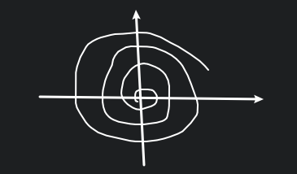

# 考试范围

## 积分

期中考过的会少一些, 不超过 30%, 20%.

主要是涉及到重积分, 曲线曲面积分那部分. 这部分以各种各样的计算, 几大积分公式为主. 还有可能有含有参变量的积分, 以及它的连续性, 可导性, 可积性.

## 数项级数

数项级数.

正项级数的判别法.

任意项级数的判别法.

## 函数项级数

连续, 可积, 可导的可交换性.

一致收敛性的分析.

## 幂级数

收敛范围的特殊性.

内闭一致收敛性

## 复习题

### 1.

$\displaystyle I=\iiint_{\Omega}(x+y+z)\mathrm{d}x\mathrm{d}y\mathrm{d}z, \Omega: \sqrt{x^{2}+y^{2}}\leqslant z\leqslant h$

$
\begin{aligned}
I&=\iint_{S}\mathrm{d}x\mathrm{d}y\int_{\sqrt{x^{2}+y^{2}}}^{h}(x+y+z)\mathrm{d}z \\
&=\iint_{S}\left[\frac{h^{2}}{2} + h \left(x + y\right) - \frac{x^{2}}{2} - \frac{y^{2}}{2} - \left(x + y\right) \sqrt{x^{2} + y^{2}}\right]\mathrm{d}x\mathrm{d}y \\
&=\int_{0}^{2\pi}\mathrm{d}\theta\int_{0}^{h}\left[ r(\cos\theta+\sin\theta)h+\frac{1}{2}h^{2}-r(\cos\theta+\sin\theta)r-\frac{1}{2}r^{2} \right]r\mathrm{d}r \\ 
&=2 \pi\int_{0}^{h}\left[ rh(\cos\theta+\sin\theta)+\frac{1}{2}h^{2}-r^{2}(\cos\theta+\sin\theta)-\frac{1}{2}r^{2} \right]r\mathrm{d}r \\
\end{aligned}
$

### 2.

设 $f\in C'\mathbb{R}$, 求 $\displaystyle \lim_{t \to 0} \frac{1}{t^{4}}\iiint_{\Omega}f(\sqrt{x^{2}+y^{2}+z^{2}})\mathrm{d}x\mathrm{d}y\mathrm{d}z, \Omega: x^{2}+y^{2}+z^{2}\leqslant t^{2}$

令 $\begin{cases} x=\rho\sin\varphi\cos\theta \\ y=\rho\sin\varphi\sin\theta \\ z=\rho\cos\varphi \end{cases}$

原式即

$
\begin{aligned}
&\quad\ \lim_{t \to 0}\frac{1}{t^{4}}\int_{0}^{2\pi}\mathrm{d}\theta\int_{0}^{\pi}\mathrm{d}\varphi\int_{0}^{t}f(\rho)\cdot \rho^{2}\sin\varphi\mathrm{d}\rho \\
&=\displaystyle \lim_{t \to 0}\frac{1}{t^{4}}\cdot 2\pi\cdot 2\cdot \mathrm{d}\varphi\int_{0}^{t}f(\rho)\cdot \rho^{2}\mathrm{d}\rho \\
&=\lim_{t \to 0}\frac{\displaystyle 4\pi \int_{0}^{t}\rho^{2}f(\rho)\mathrm{d}\rho}{t^{4}} \\
&=\lim_{t \to 0}\frac{4\pi\cdot t^{2}f(t)}{4t^{3}} \\
&=\lim_{t \to 0}\frac{\pi f(t)}{t} \\
\end{aligned}
$

当 $f(t)\to 0$ 时, 可以继续洛必达 $\displaystyle \lim_{t \to 0}\frac{\pi f(t)}{t}=\lim_{t \to 0} f'(t)=f'(0)$

当 $f(t)\not\to 0$ 时, $\displaystyle \lim_{t \to 0}\frac{\pi f(t)}{t}\to +\infty$

### 3.

$\displaystyle \int_{L}x\mathrm{d}s, L:r=ae^{k\theta}, a>0$ 在 $r=a$ 内部.

曲线积分公式 $\displaystyle I=\int_{a}^{b}f(x(t),y(t))\sqrt{x'(t)^{2}+y'(t)^{2}}\mathrm{d}t$

而极坐标为 $\displaystyle I=\int_{\alpha}^{\beta}f(r(\theta)\cos\theta, r(\theta)\sin\theta)\sqrt{r(\theta)^{2}+r'(\theta)^{2}}$

这是一个无穷的积分.

所以从 $0$ 积到 $+\infty$.

### 4.

$\displaystyle \int_{L}x^{2}\mathrm{d}s, L: \begin{cases} x^{2}+y^{2}+z^{2}=a^{2} \\ x+y+z=0 \end{cases}, a>0$

$\therefore \displaystyle \oint_{L}x^{2}\mathrm{d}s=\frac{1}{3}\oint_{L}(x^{2}+y^{2}+z^{2})\mathrm{d}s=\frac{1}{3}a^{2}\oint_{L}\mathrm{d}s=\frac{1}{3}\pi a^{4}$

### 5.

$\displaystyle \int_{\partial\Omega}-\frac{y}{x^{2}+y^{2}}\mathrm{d}x+\frac{x}{x^{2}+y^{2}}\mathrm{d}y$, 其中 $\partial \Omega$ 是 $\Omega$ 的边界, 逆时针方向.

我们只需要挖掉中间的一个小圆 $\delta: x^{2}+y^{2}=\delta^{2}$

然后就能用 Green 公式了.

### 6.

$\displaystyle \iint_{\Sigma}x^{2}\mathrm{d}y\land \mathrm{d}z+y^{2}\mathrm{d}z\land \mathrm{d}x+z^{2}\mathrm{d}x\land \mathrm{d}y, \Sigma: (x-a)^{2}+(y-b)^{2}+(z-c)^{2}=R^{2}$, 取外侧方向.

我们可以做一部分, 由对称性可得其他部分.

$\displaystyle \iint_{\Sigma}z^{2}\mathrm{d}x\land \mathrm{d}y, z=z(x,y), \Sigma_{\text{top}}: c+\sqrt{R^{2}-(x-a)^{2}-(y-b)^{2}}, \Sigma_{\text{bottom}}: c-\sqrt{R^{2}-(x-a)^{2}-(y-b)^{2}}, D_{xy}: (x-a)^{2}+(y-b)^{2}\leqslant R^{2}$

$
\begin{aligned}
\iint_{\Sigma}z^{2}\mathrm{d}x\land \mathrm{d}y
&=\iint_{\Sigma_{\text{top}}}+\iint_{\Sigma_{\text{bottom}}} \\
&=\iint_{D_{xy}}\left( c+\sqrt{R^{2}-(x-a)^{2}-(y-b)^{2}} \right)^{2}\mathrm{d}x\mathrm{d}y \\
&-\iint_{D_{xy}}\left( c-\sqrt{R^{2}-(x-a)^{2}-(y-b)^{2}} \right)^{2}\mathrm{d}x\mathrm{d}y \\
&=4c\iint_{D_{xy}}\sqrt{R^{2}-(x-a)^{2}-(y-b)^{2}}\mathrm{d}x\mathrm{d}y \\
&=4c\int_{0}^{2\pi}\mathrm{d}\theta\int_{0}^{R}\sqrt{R^{2}-r^{2}}\cdot r\mathrm{d}r \\
&=8\pi c\cdot \frac{1}{3}R^{3} \\ 
&=\frac{8}{3}\pi c R^{3} \\ 
\end{aligned}
$

同理有 $\displaystyle \frac{8}{3}\pi a R^{3}, \frac{8}{3}\pi b R^{3}$

**或者用另一种方法:**

$\displaystyle I=2\iiint_{\Omega}(x+y+z)\mathrm{d}x\mathrm{d}y\mathrm{d}z$

令 $x-a=u, y-b=v, z-c=w$, 则

$\displaystyle I=2\iiint_{\Omega}(u+a+v+b+w+c)\mathrm{d}u\mathrm{d}v\mathrm{d}w, u^{2}+v^{2}+w^{2}\leqslant R^{2}$

$
\begin{aligned}
I&=2\iiint_{\Omega}(u+a+v+b+w+c)\mathrm{d}u\mathrm{d}v\mathrm{d}w \\
&=2\iiint_{\Omega}(u+v+w)\mathrm{d}u\mathrm{d}v\mathrm{d}w+2\iiint_{\Omega}(a+b+c)\mathrm{d}u\mathrm{d}v\mathrm{d}w \\
&=0+2(a+b+c)\iiint_{\Omega}\mathrm{d}u\mathrm{d}v\mathrm{d}w \\
&=\frac{8}{3}\pi R^{3}(a+b+c) \\
\end{aligned}
$

**或者再换一种做法, 将其换成第一型的曲面积分:**

令 $x-a=u, y-b=v, z-c=w$, 则

$\displaystyle I=\iint_{\Sigma'}(a+u)^{2}\mathrm{d}v\mathrm{d}w+(v+b)^{2}\mathrm{d}w\mathrm{d}u+(w+c)\mathrm{d}u\mathrm{d}v, \Sigma':u^{2}+v^{2}+w^{2}=R^{2}$

$\displaystyle \frac{\{u,v,w\}}{\sqrt{u^{2}+v^{2}+w^{2}}}=\{\frac{u}{R},\frac{v}{R},\frac{w}{R}\}$

$
\begin{aligned}
I&=\iint_{\Sigma'}(a+u)^{2}\mathrm{d}v\mathrm{d}w+(v+b)^{2}\mathrm{d}w\mathrm{d}u+(w+c)\mathrm{d}u\mathrm{d}v \\
&=\iint_{\Sigma'}[(a+u)^{2}\frac{u}{R}+(v+b)^{2}\frac{v}{R}+(w+c)\frac{w}{R}]\mathrm{d}S \\
&=\frac{1}{R}\iint_{\Sigma}[(u^{3}+v^{3}+w^{3})+2(au^{2}+bv^{2}+cw^{2})+(a^{2}u+b^{2}v+c^{2}w)]\mathrm{d}S \\
&=\frac{1}{R}\iint_{\Sigma}2(au^{2}+bv^{2}+cw^{2})\mathrm{d}S \\
\end{aligned}
$

我们又知道 $\displaystyle \iint_{\Sigma'}u^{2}\mathrm{d}S=\iint_{\Sigma'}v^{2}\mathrm{d}S=\iint_{\Sigma'}w^{2}\mathrm{d}S=\frac{1}{3}\iint_{\Sigma'}(u^{2}+v^{2}+w^{2})\mathrm{d}S=\frac{4}{3}\pi R^{4}$

$\displaystyle I=\frac{1}{R}\iint_{\Sigma}2(au^{2}+bv^{2}+cw^{2})\mathrm{d}S=\frac{8}{3}\pi R^{3}(a+b+c)$

### 7.

判断 $\displaystyle \sum_{n=1}^{\infty}(-1)^{n}\tan(\sqrt{n^{2}+2})\pi$ 是否收敛, 绝对收敛还是条件收敛?

$\therefore \displaystyle \tan(\sqrt{n^{2}+2})\pi=\tan(\sqrt{n^{2}+2}-n)\pi=\tan(\frac{2}{\sqrt{n^{2}+2}+n})\pi$

$\therefore \tan(\sqrt{n^{2}+2})\pi$ 单调递减.

$\therefore \displaystyle \sum_{n=1}^{\infty}(-1)^{n}\tan(\sqrt{n^{2}+2})\pi$ 收敛.

而 $\displaystyle \tan(\frac{2}{\sqrt{n^{2}+2}+n})\pi>\frac{2\pi}{\sqrt{n^{2}+2}+n}$

后者级数发散, 因此原级数并不绝对收敛.

所以原级数条件收敛.

我们不能直接说 $\displaystyle (-1)^{n}\tan\sqrt{n^{2}+2}\pi\sim(-1)^{n}\frac{2}{\sqrt{n^{2}+2}+n}\pi\sim(-1)^{n}\frac{\pi}{n}$

因为比较判别法只能用于正项级数.

### 8.

$\displaystyle \sum_{n=1}^{\infty}u_{n}, (u_{n}>0), S_{n}=u_1+\cdots+u_{n}$, 证明若 $\displaystyle \sum_{n=1}^{\infty}u_{n}$ 发散, 则 $\displaystyle \sum_{n=1}^{\infty}\frac{u_{n}}{S_{n}}$ 发散且 $\displaystyle \sum_{n=1}^{\infty}\frac{u_{n}}{S_{n}^{2}}$ 收敛.

#### (1)

$\because \displaystyle \sum_{n=1}^{\infty}u_{n}$ 发散.

$\therefore \exists \varepsilon>0, \forall N\in \mathbb{N}^{+}, \exists n>N, \exists p>0, |u_{n+1}+\cdots+u_{n+p}|>\varepsilon$

$\because S_{n+p}>S_{n}$

$\therefore \displaystyle \left| \frac{u_{n+1}}{S_{n+1}}+\cdots+\frac{u_{n+p}}{S_{n+p}} \right|>\left| \frac{u_{n+1}}{S_{n+p}}+\cdots+\frac{u_{n+p}}{S_{n+p}} \right|=\left| \frac{S_{n+p}-S_{n}}{S_{n+p}} \right|=1-\frac{S_{n}}{S_{n+p}}>1-\frac{1}{2}=\frac{1}{2}$

其中, 取 $\displaystyle \varepsilon=\frac{1}{2}$, 然后就能有对应的 $p$.

#### (2)

$\because \displaystyle \frac{u_{n}}{S_{n}^{2}}<\frac{u_{n}}{S_{n}S_{n-1}}=\frac{S_{n}-S_{n-1}}{S_{n}S_{n-1}}=\frac{1}{S_{n-1}}-\frac{1}{S_{n}}$

而后者 $\displaystyle \sum_{n=2}^{\infty}(\frac{1}{S_{n-1}}-\frac{1}{S_{n}})=\frac{1}{u_{1}}-\lim_{n \to \infty}\frac{1}{S_{n}}=\frac{1}{u_1}$ 收敛.

因此前者也收敛.

## 9.

$\{u_{n}\}$ 是一个单调递增的正数列, 证明 $\displaystyle \sum_{n=1}^{\infty}\left( 1-\frac{u_{n}}{u_{n+1}} \right)$ 收敛 $\Leftrightarrow \{u_{n}\}$ 有界.

**$\Leftarrow$:**

$\displaystyle a_{n}=\frac{u_{n+1}-u_{n}}{u_{n+1}}$

<!-- $$
\begin{aligned}
\left| S_{n+p}-S_{n} \right|
&=\left| \frac{u_{n+1}-u_{n}}{u_{n+1}}+\cdots+\frac{u_{n+p}-u_{n+p-1}}{u_{n+p}} \right| \\
&\leqslant \frac{u_{n+1}-u_{n}+\cdots+u_{n+p}-u_{n+p-1}}{u_{n+1}} \\
&=\frac{u_{n+p}-u_{n}}{u_{n+1}} \\
\end{aligned}
$$ -->

我们可以看成 $\displaystyle \frac{1}{u_{n+1}}\cdot (u_{n+1}-u_{n})$, 使用 Abel 判别法, 就可以说明其收敛.

**$\Rightarrow$:**

我们使用 8. 的结论.

假设 $\{u_{n}\}$ 无界即 $u_{n+1}-u_{n}$ 发散, 我们令 $u_{n}=S_{n}$

则 $\displaystyle a_{n}=\frac{u_{n+1}-u_{n}}{u_{n+1}}$ 也发散.

与题设收敛矛盾.

或者也可以用:

$\displaystyle \left| \frac{u_{n+1}-u_{n}}{u_{n+1}}+\cdots+\frac{u_{n+p+1}-u_{n+p}}{u_{n+p+1}} \right|>\frac{u_{n+p+1}-u_{n}}{u_{n+p+1}}=1-\frac{u_{n}}{u_{n+p+1}}>1-\frac{1}{2}=\frac{1}{2}$

## 10.

求 $\displaystyle \sum_{n=1}^{\infty}\frac{x^{n}}{4n-3}$ 的和函数 $(x\geqslant 0)$

收敛半径 $\displaystyle R=\lim_{n \to \infty}\frac{a_{n}}{a_{n+1}}=\lim_{n \to \infty}\frac{4n+1}{4n-3}=1$

收敛范围 $[0,1)$.

令 $x=t^{4}$, 则级数变为

$\displaystyle \sum_{n=1}^{\infty}\frac{t^{4n}}{4n-3}=t^{3}\sum_{n=1}^{\infty}\frac{t^{4n-3}}{4n-3}=t^{3}\sum_{n=1}^{\infty}\left( \int_{0}^{t}t^{4n-4}\mathrm{d}t \right)=t^{3}\int_{0}^{t}\sum_{n=1}^{\infty} t^{4n-4} \mathrm{d}t$

## 11.

将 $\displaystyle f(x)=\frac{1}{x^{2}+4x+3}$ 在 $x_0=1$ 处展开.

$\because \displaystyle f(x)=\frac{1}{x^{2}+4x+3}=\frac{1}{(x+1)(x+3)}=\frac{1}{2}\cdot \frac{1}{x+1}-\frac{1}{2}\cdot \frac{1}{x+3}$

令 $t=x-1$ 即 $x=t+1$, 则 $\displaystyle f(x)=\frac{1}{4}\cdot \frac{1}{\frac{t}{2}+1}-\frac{1}{8}\cdot \frac{1}{\frac{t}{4}+1}$

$\because \displaystyle \frac{1}{1+x}=\sum_{n=0}^{\infty}(-1)^{n}x^{n}, x\in (-1,1)$

$\therefore \displaystyle \frac{1}{1+\frac{t}{2}}=\sum_{n=0}^{\infty}(-1)^{n}(\frac{t}{2})^{n}=\sum_{n=0}^{\infty}(-\frac{1}{2})^{n}t^{n}, t\in (-2,2)$

$\quad \displaystyle \frac{1}{1+\frac{t}{4}}=\sum_{n=0}^{\infty}(-1)^{n}(\frac{t}{4})^{n}=\sum_{n=0}^{\infty}(-\frac{1}{4})^{n}t^{n}, t\in (-4,4)$

$\therefore \displaystyle f(x)=\sum_{n=0}^{\infty}\left[\frac{1}{4}\cdot (-\frac{1}{2})^{n}-\frac{1}{8}\cdot (-\frac{1}{4})^{n}\right]t^{n}, x\in (-1,3)$

## 12.

$\displaystyle I=\oiint_{\Sigma}x^{2}yz^{2}\mathrm{d}y\mathrm{d}z-xy^{2}z^{2}\mathrm{d}z\mathrm{d}x+z(1+xyz)\mathrm{d}x\mathrm{d}y, \Sigma$ 是由 $\displaystyle z=a^{2}-x^{2}-y^{2}$ 与 $z=0$ 所围立体 $\Omega$ 的外侧. 其中 $\Omega$ 的体积为 $V$.

使用 Gauss 公式.

$\therefore \displaystyle I=\iiint_{\Omega}(2xyz^{2}-2xyz^{2}+1+xyz+xyz)\mathrm{d}V=\iiint_{\Omega}\mathrm{d}V=V$
