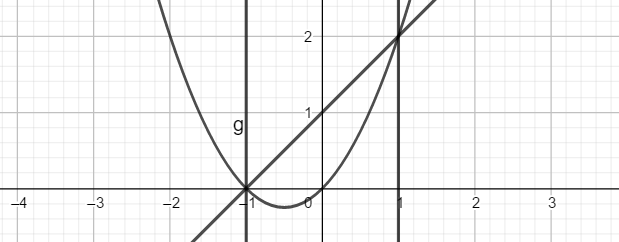
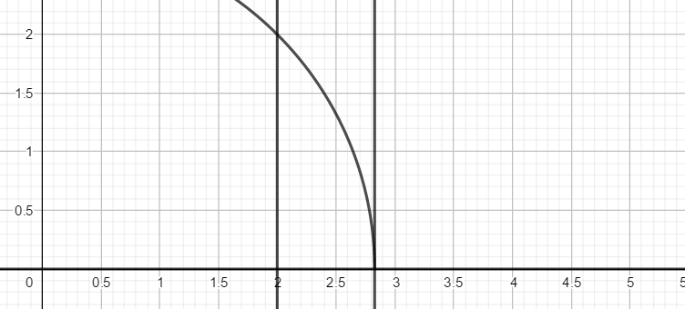
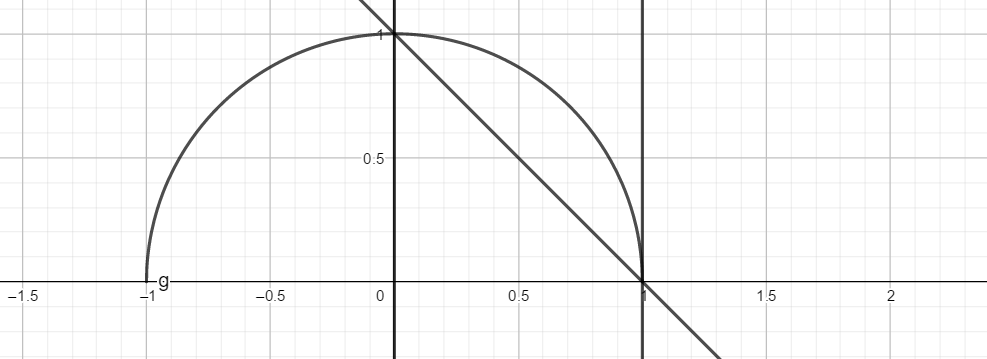
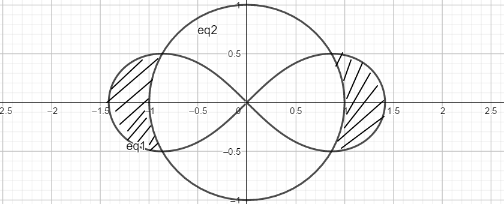
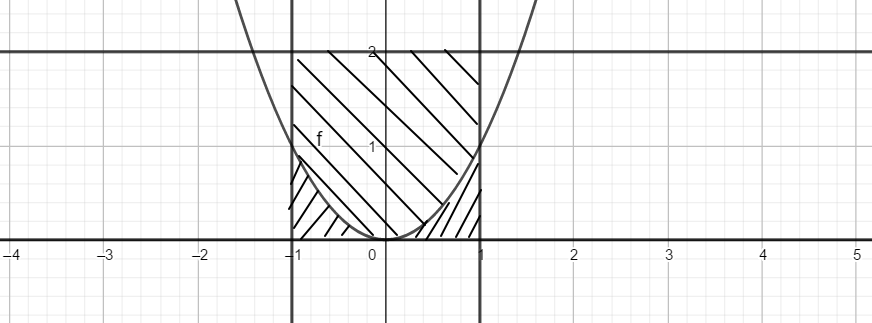
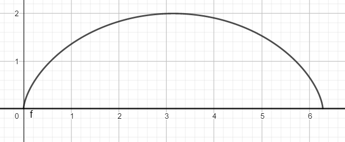
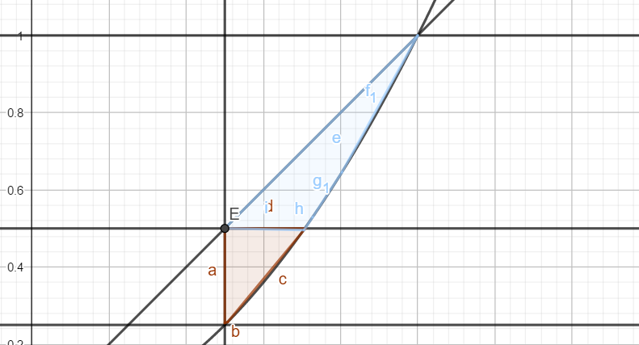
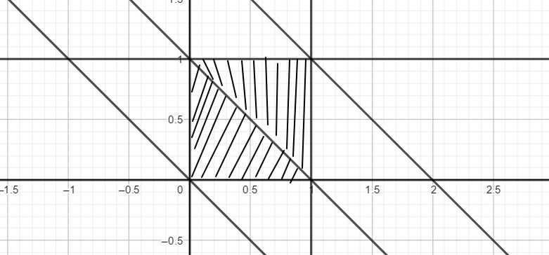
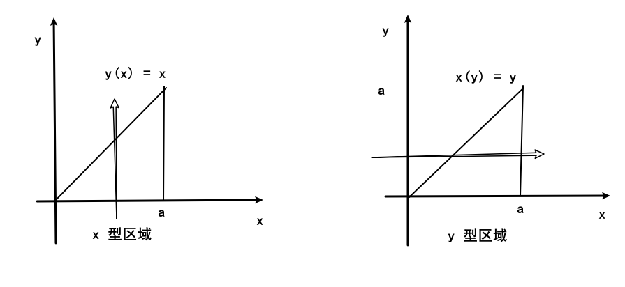

# 第六次作业

## 201300035 方盛俊

习题 6.1: (A) 5(1, 4)

习题 6.2: (A) 3(2, 6, 7, 10), 5(1, 3), 6(4), 7(2), 8(2), 9(1, 2), 13(1, 3), 14(2) (B) 1(1, 3), 2, 3, 6, 13

## 6.1 (A)

### 5.

#### (1)

当 $x\geq 0, y\geq 0, x+y\leq 1$ 时, 有 $x+y\leq (x+y)^2$, 且并不恒能取等号

$\therefore\displaystyle\iint_{(\sigma)}(x+y){\rm d}\sigma < \iint_{(\sigma)}(x+y)^2{\rm d}\sigma$

#### (4)

由区域 $(\sigma_2)=\{(x,y)|x^2+y^2\leq 1\}$ 和函数 $z(x,y)=x^2y$ 的对称性可知

$\therefore\displaystyle \iint_{(\sigma_2)}x^2=0$

又因为 $x^2y$ 在 $((\sigma_2)=\{(x,y)|x^2+y^2\leq 1, y\geq 0\})$ 上大于等于零, 且不恒为零

$\therefore\displaystyle \iint_{(\sigma_1)}x^2>0$

$\therefore\displaystyle \iint_{(\sigma_1)}x^2>\iint_{(\sigma_2)}x^2$

## 6.2 (A)

### 3.

#### (2)

对于 $x$ 型区域:

$\displaystyle \iint_{(\sigma)}\frac{x^2}{y^2}{\rm d}\sigma=\int_1^2{\rm d}x\int_{\frac{1}{x}}^{x}\frac{x^2}{y^2}{\rm d}y=\int_1^2(x^3-x){\rm d}x=\frac{9}{4}$

#### (6)

$\displaystyle \iint_{(\sigma)}e^{-y^2}{\rm d}\sigma=\int_0^1{\rm d}y\int_0^ye^{-y^2}{\rm d}x=\int_0^1ye^{-y^2}{\rm d}y=\frac{1}{2}\int_0^1e^{-y^2}{\rm d}y^2=\frac{1}{2}-\frac{1}{2}e$

#### (7)

由对称性

$
\begin{aligned}
\iint_{(\sigma)}(y+xf(x^2+y^2)){\rm d}\sigma
&=\int_0^1{\rm d}y\int_{-\sqrt{y}}^{\sqrt{y}}xf(x^2+y^2){\rm d}x+\int_{-1}^1{\rm d}x\int_{x^2}^1y{\rm d}y \\
&=\frac{1}{2}\int_0^1{\rm d}y\int_y^yf(x^2+y^2){\rm d}x^2+\int_{-1}^1(\frac{1}{2}-\frac{1}{2}x^4){\rm d}x \\
&=0+\int_{-1}^1(\frac{1}{2}-\frac{1}{2}x^4){\rm d}x \\
&=\frac{4}{5} \\
\end{aligned}
$

#### (10)

将 $y=-3x$ 带入 $y=4-x^2$ 解 $x^2-3x-4=(x-4)(x+1)=0$ 

得 $x=-1, x=4$ (舍去)

$
\begin{aligned}
&\quad\iint_{(\sigma)}x\ln(y+\sqrt{1+y^2}){\rm d}\sigma \\
&=\int_3^4{\rm d}y\int_{-\sqrt{4-y}}^{\sqrt{4-y}}x\ln(y+\sqrt{1+y^2}){\rm d}x+\int_{-1}^1x{\rm d}x\int_{-3x}^3\ln(y+\sqrt{1+y^2}){\rm d}y \\
&=\int_{-1}^1x{\rm d}x\int_{-3x}^3\ln(y+\sqrt{1+y^2}){\rm d}y \\
&=\int_{-1}^1x{\rm d}x[y\ln(y+\sqrt{1+y^2})|_{-3x}^3-\int_{-3x}^3y{\rm d}\ln(y+\sqrt{1+y^2})] \\
&=\int_{-1}^1x{\rm d}x[y\ln(y+\sqrt{1+y^2})|_{-3x}^3-\int_{-3x}^3y\frac{1+\frac{y}{\sqrt{1+y^2}}}{y+\sqrt{1+y^2}}{\rm d}y] \\
&=\int_{-1}^1x{\rm d}x[y\ln(y+\sqrt{1+y^2})|_{-3x}^3-\int_{-3x}^3y\frac{\frac{y+\sqrt{1+y^2}}{\sqrt{1+y^2}}}{y+\sqrt{1+y^2}}{\rm d}y] \\
&=\int_{-1}^1x{\rm d}x[y\ln(y+\sqrt{1+y^2})|_{-3x}^3-\int_{-3x}^3\frac{y}{\sqrt{1+y^2}}{\rm d}y] \\
&=\int_{-1}^1x{\rm d}x(y\ln(y+\sqrt{1+y^2})-\sqrt{1+y^2})|_{-3x}^3 \\
&=\int_{-1}^1x(C+3x\ln(-3x+\sqrt{1+9x^2})+\sqrt{1+9x^2}){\rm d}x \\
\end{aligned}
$

其中 $C=3\ln(3+\sqrt{10})-\sqrt{10}$, 是个常数

$\ln(-3x+\sqrt{1+9x^2})+\ln(3x+\sqrt{1+9x^2})=\ln(1+9x^2-9x^2)=0$

说明 $\ln(-3x+\sqrt{1+9x^2})$ 是奇函数

所以 $x(C+3x\ln(-3x+\sqrt{1+9x^2})+\sqrt{1+9x^2})$ 也是奇函数

$\therefore\displaystyle \iint_{(\sigma)}x\ln(y+\sqrt{1+y^2}){\rm d}\sigma=0$

### 5.

#### (1)

对于 $x^2+x$ 有最小值 $\displaystyle (-\frac{1}{2})^2-\frac{1}{2}=-\frac{1}{4}$

反解 $y=x^2+x$ 得 $\displaystyle x=\pm\sqrt{y+\frac{1}{4}}-\frac{1}{2}$

$\displaystyle \int_{-1}^1{\rm d}x\int_{x^2+x}^{x+1}f(x,y){\rm d}y=\int_{-\frac{1}{4}}^0{\rm d}y\int_{-\sqrt{y+\frac{1}{4}}-\frac{1}{2}}^{\sqrt{y+\frac{1}{4}}-\frac{1}{2}}f(x,y){\rm d}x+\int_{0}^2{\rm d}y\int_{y-1}^{\sqrt{y+\frac{1}{4}}-\frac{1}{2}}f(x,y){\rm d}x$

#### (3)

$
\begin{aligned}
&\quad\int_0^2{\rm d}x\int_0^x f(x,y){\rm d}y+\int_2^{\sqrt{8}}{\rm d}x\int_0^{\sqrt{8-x^2}}f(x,y){\rm d}y \\
&=\int_0^2{\rm d}y\int_y^2f(x,y){\rm d}x+\int_0^2{\rm d}y\int_2^{\sqrt{8-y^2}}f(x,y){\rm d}x
\end{aligned}
$

### 6. (4)

$\displaystyle \iint_{(\sigma)}\arctan\frac{y}{x}{\rm d}\sigma=\int_0^\frac{\pi}{2}{\rm d}\theta\int_0^1\arctan\frac{r\sin\theta}{r\cos\theta}\cdot r{\rm d}r=\int_0^\frac{\pi}{2}\frac{1}{2}\theta{\rm d}\theta=\frac{\pi^2}{16}$

### 7. (2)

对于 $y=1-x$, 带入 $x=r\cos\theta, y=r\sin\theta$

可得 $\displaystyle r=\frac{1}{\sin\theta+\cos\theta}$

$\displaystyle \int_0^1{\rm d}x\int_{1-x}^{\sqrt{1-x^2}}(x^2+y^2)^{-\frac{3}{2}}{\rm d}y=\int_0^\frac{\pi}{2}{\rm d}\theta\int_{\frac{1}{\sin\theta+\cos\theta}}^1r^{-3}\cdot r{\rm d}r=\int_0^\frac{\pi}{2}(\sin\theta+\cos\theta){\rm d}\theta=2$

### 8. (2)

将 $(x^2+y^2)^2=2a^2(x^2-y^2)$ 化为极坐标方程得 $r^2=2a^2(\cos^2\theta-\sin^2\theta)$

将 $x^2+y^2=a^2$ 化为极坐标方程得 $r^2=a^2$

联立两个方程得 $\displaystyle\cos^2\theta-\sin^2\theta=2\cos^2\theta-1=\frac{1}{2}$

解得 $\displaystyle \cos\theta=\pm\frac{\sqrt{3}}{2}$, 对应 $\displaystyle\theta=\pm\frac{\pi}{6},\pm\frac{5\pi}{6}$

$
\begin{aligned}
S
&=4\iint_{(\sigma)}=4\int_0^\frac{\pi}{6}{\rm d}\theta\int_a^{\sqrt{2}a\sqrt{\cos^2\theta-\sin^2\theta}}r{\rm d}r \\
&=4\int_0^\frac{\pi}{6}(a^2(\cos^2\theta-\sin^2\theta)-\frac{1}{2}a^2){\rm d}\theta \\
&=4a^2\int_0^\frac{\pi}{6}(\cos^2\theta-\sin^2\theta){\rm d}\theta-\frac{\pi}{3}a^2 \\
&=2a^2\sin(2x)|_0^\frac{\pi}{6}-\frac{\pi}{3}a^2 \\
&=(\sqrt{3}-\frac{\pi}{3})a^2 \\
\end{aligned}
$

### 9.

#### (1)

$\displaystyle V=\iint_{(\sigma)}(x^2+y^2){\rm d}\sigma=\int_0^4{\rm d}x\int_0^{4-x}(x^2+y^2){\rm d}y=\frac{88}{3}$

#### (2)

将 $x^2+y^2=2ax$ 换成极坐标方程得 $r=2a\cos\theta$

$\therefore\displaystyle V=\iint_{(\sigma)}\sqrt{x^2+y^2}{\rm d}\sigma=2\int_0^\frac{\pi}{2}{\rm d}\theta\int_0^{2a\cos\theta}r^2{\rm d}r=\frac{16a^3}{3}\int_0^1(1-\sin^2\theta){\rm d}\sin\theta=\frac{32a^3}{9}$

### 13.

#### (1)

令 $x=ar\cos\theta, y=br\sin\theta$, $\displaystyle \frac{x^2}{a^2}+\frac{y^2}{b^2}\leq 1$ 可变为 $r\leq 1$

$\therefore\displaystyle J=\begin{vmatrix}a\cos\theta&b\sin\theta\\-ar\sin\theta&br\cos\theta\end{vmatrix}=abr\cos^2\theta+abr\sin^2\theta=abr$

$
\begin{aligned}
\therefore I&=\iint_{D_{r\theta}}\sqrt{1-r^2}\cdot abr{\rm d}\sigma \\
&=4ab\int_0^\frac{\pi}{2}{\rm d}\theta\int_0^1r\sqrt{1-r^2}{\rm d}r \\
&=4ab\int_0^\frac{\pi}{2}\frac{1}{3}{\rm d}\theta \\
&=\frac{2\pi}{3}ab \\
\end{aligned}
$

#### (3)

令 $\displaystyle u=xy, v=\frac{y}{x}$, 即 $\displaystyle x=\sqrt{\frac{u}{v}}=u^\frac{1}{2}v^{-\frac{1}{2}}, y=\sqrt{uv}=u^\frac{1}{2}v^\frac{1}{2}$

$\therefore\displaystyle J=\begin{vmatrix}\frac{1}{2}u^{-\frac{1}{2}}v^{-\frac{1}{2}}&\frac{1}{2}u^{-\frac{1}{2}}v^\frac{1}{2}\\-\frac{1}{2}u^\frac{1}{2}v^{-\frac{3}{2}}&\frac{1}{2}u^\frac{1}{2}v^{-\frac{1}{2}}\end{vmatrix}=\frac{1}{2v}$

$
\begin{aligned}
\therefore I
&=\iint_{D_{uv}}u\cdot \frac{1}{2v}{\rm d}\sigma \\
&=\frac{1}{2}\int_1^4{\rm d}v\int_1^2\frac{u}{v}{\rm d}u \\
&=\frac{3}{4}\int_1^4\frac{1}{v}{\rm d}v \\
&=\frac{3}{2}\ln 2 \\
\end{aligned}
$

### 14. (2)

令 $\displaystyle u=x+y, v=\frac{y}{x}$, 即 $\displaystyle x=\frac{u}{v+1}, y=\frac{uv}{v+1}$

$\therefore\displaystyle J=\begin{vmatrix}\frac{1}{v+1}&\frac{v}{v+1}\\-\frac{u}{(v+1)^2}&\frac{u}{(v+1)^2}\end{vmatrix}=\frac{u}{(v+1)^2}$

$
\begin{aligned}
\therefore I
&=\iint_{D_{uv}}\frac{u}{(v+1)^2}{\rm d}\sigma \\
&=\frac{1}{2}\int_\alpha^\beta{\rm d}v\int_a^b\frac{u}{(v+1)^2}{\rm d}u \\
&=\frac{b^2-a^2}{4}\int_\alpha^\beta\frac{1}{(v+1)^2}{\rm d}v \\
&=\frac{b^2-a^2}{4}\int_{(\alpha+1)}^{(\beta+1)}\frac{1}{t^2}{\rm d}t \\
&=\frac{b^2-a^2}{4}(\frac{1}{\alpha+1}-\frac{1}{\beta+1}) \\
\end{aligned}
$

## 6.2 (B)

### 1.

#### (1)

令 $y-x^2\geq 0$ 可得 $y\geq x^2$

$
\begin{aligned}
\iint_{(\sigma)}\sqrt{|y-x^2|}{\rm d}\sigma
&=2\int_{0}^1{\rm d}x\int_0^{x^2}\sqrt{x^2-y}{\rm d}y+2\int_{0}^1{\rm d}x\int_{x^2}^2\sqrt{y-x^2}{\rm d}y \\
&=-2\int_{0}^1{\rm d}x\int_0^{x^2}\sqrt{x^2-y}{\rm d}(x^2-y) + 2\int_{0}^1{\rm d}x\int_{x^2}^2\sqrt{y-x^2}{\rm d}(y-x^2) \\
&=-2\int_{0}^1{\rm d}x\int_{x^2}^{0}\sqrt{t}{\rm d}t+2\int_{0}^1{\rm d}x\int_{0}^{2-x^2}\sqrt{t}{\rm d}t \\
&=\frac{4}{3}\int_{0}^1x^3{\rm d}x+\frac{4}{3}\int_{0}^1(2-x^2)^\frac{3}{2}{\rm d}x \\
&=\frac{1}{3}+\frac{4}{3}x(2-x^2)^\frac{3}{2}|_0^1-\frac{4}{3}\int_{0}^1x{\rm d}(2-x^2)^\frac{3}{2} \\
&=\frac{5}{3}+4\int_{0}^1x^2(2-x^2)^\frac{1}{2}{\rm d}x \\
&=\frac{5}{3}+2\int_{0}^1(2x^2-x^4)^\frac{1}{2}{\rm d}x^2 \\
&=\frac{5}{3}+2\int_{0}^1(1-(t-1)^2)^\frac{1}{2}{\rm d}t \\
&=\frac{5}{3}+2\int_{-1}^0(1-u^2)^\frac{1}{2}{\rm d}u \\
&=\frac{5}{3}+\frac{\pi}{2} \\
\end{aligned}
$

#### (3)

$
\begin{aligned}
\iint_{(\sigma)}y^2{\rm d}\sigma
&=\int_0^{a(2\pi-\sin 2\pi)}{\rm d}x\int_{0}^{a(1-\cos t)}y^2{\rm d}y \\
&=\int_0^{2\pi}\frac{1}{3}(a(1-\cos t))^3{\rm d}a(t-\sin t) \\
&=\frac{1}{3}a^4\int_0^{2\pi}(1-\cos t)^4{\rm d}t \\
&=\frac{32}{3}a^4\int_0^{\pi}\sin^8u{\rm d}u \\
\end{aligned}
$

**对于 $\displaystyle\int\sin^n x{\rm d}x$:**

$
\begin{aligned}
\therefore I_n&=\int \sin^nx{\rm d}x \\
&=\int \sin^{n-1}x{\rm d}(-\cos x) \\
&=-\cos x\sin^{n-1} + \int \cos x{\rm d}\sin^{n-1}x \\
&=-\cos x\sin^{n-1} + \int \cos^2 x(n-1)\sin^{n-2}x{\rm d}x \\
&=-\cos x\sin^{n-1} + (n-1)\int (1-\sin^2 x)\sin^{n-2}x{\rm d}x \\
&=-\cos x\sin^{n-1} + (n-1)(I_{n-2}-I_n) \\
\end{aligned}
$

$\therefore I_n=\displaystyle\frac{1}{n}\cos x\sin^{n-1}x+\frac{n-1}{n}I_{n-2}, \quad n\geq 2$

$
\begin{aligned}
\therefore I_8
&=\frac{1}{8}\cos x\sin^7x+\frac{7}{8}(\frac{1}{6}\cos x\sin^5x+\frac{5}{6}(\frac{1}{4}\cos x\sin^3x+\frac{3}{4}(\frac{1}{2}\cos x\sin x+\frac{1}{2}x)))+C \\
&=\frac{1}{8}\cos x\sin^7x+\frac{7}{48}\cos x\sin^5x+\frac{35}{192}\cos x\sin^3x+\frac{105}{384}\cos x\sin x+\frac{105}{384}x+C \\
\end{aligned}
$

$\displaystyle\therefore\iint_{(\sigma)}y^2{\rm d}\sigma=\frac{32}{3}a^4\int_0^{\pi}\sin^8u{\rm d}u=\frac{32}{3}a^4\cdot \frac{105}{384}\pi=\frac{35}{12}\pi a^4$

### 2.

联解 $x=\sqrt{y}$ 和 $\displaystyle y=\frac{1}{2}$ 得 $\displaystyle x=\frac{\sqrt{2}}{2}$

$
\begin{aligned}
&\quad \int_\frac{1}{4}^\frac{1}{2}{\rm d}y\int_\frac{1}{2}^{\sqrt{y}}e^{\frac{y}{x}}{\rm d}x+\int_\frac{1}{2}^1{\rm d}y\int_y^{\sqrt{y}}e^{\frac{y}{x}}{\rm d}x \\
&=\int_\frac{1}{2}^\frac{\sqrt{2}}{2}{\rm d}x\int_{x^2}^{\frac{1}{2}}e^{\frac{y}{x}}{\rm d}y+\int_\frac{1}{2}^{\frac{\sqrt{2}}{2}}{\rm d}x\int_{\frac{1}{2}}^{x}e^{\frac{y}{x}}{\rm d}y+\int_{\frac{\sqrt{2}}{2}}^{1}{\rm d}x\int_{x^2}^{x}e^{\frac{y}{x}}{\rm d}y \\
&=\int_\frac{1}{2}^\frac{\sqrt{2}}{2}(ex-xe^{x}){\rm d}x  +  \int_{\frac{\sqrt{2}}{2}}^{1}(ex-xe^{x}){\rm d}x \\
&=\int_\frac{1}{2}^1ex{\rm d}x-\int_\frac{1}{2}^1xe^{x}{\rm d}x \\
&=\frac{3}{8}e-\frac{1}{2}e^{\frac{1}{2}} \\
\end{aligned}
$

### 3.

当 $t\leq 0$ 时,

易知 $f(x,y)=0$ 在 $x+y\leq t$ 恒成立

$\therefore\displaystyle F(t)=\iint_{x+y\leq t}f(x,y){\rm d}\sigma=0$

当 $0< t\leq 1$ 时,

$\therefore\displaystyle F(t)=\iint_{x+y\leq t}f(x,y){\rm d}\sigma=\int_0^t{\rm d}x\int_0^{t-x}2x{\rm d}y=\frac{1}{3}t^3$

当 $1< t\leq 2$ 时,

$
\begin{aligned}
\therefore F(t)
&=\iint_{x+y\leq t}f(x,y){\rm d}\sigma \\
&=\frac{1}{3}+\int_0^{t-1}{\rm d}x\int_{1-x}^1 2x{\rm d}y+\int_{t-1}^1{\rm d}x\int_{1-x}^{t-x}2x{\rm d}y \\
&=\frac{1}{3}+\frac{2}{3}(t-1)^3+[(t-1)-(t-1)^3] \\
&=-\frac{1}{3}t^3+t^2-\frac{1}{3} \\
\end{aligned}
$

当 $t>2$ 时,

$\therefore F(t)=F(2)=1$

### 6.

如图所示, $\displaystyle\int_0^a{\rm d}x\int_0^x f(x,y){\rm d}y$ 对应的 $x$ 型区域为 $y=x, x=0, x=1, y=0$ 围成的区域. 

而 $\displaystyle\int_0^a{\rm d}x\int_y^a f(x,y){\rm d}y$ 对应的 $y$ 型区域为 $y=x, x=0, x=1, y=0$ 围成的区域. 

两者所对应的区域一模一样, 并且我们知道 $f$ 在该区域内连续.

所以我们有 $\displaystyle\int_0^a{\rm d}x\int_0^x f(x,y){\rm d}y=\int_0^a{\rm d}x\int_y^a f(x,y){\rm d}y$.

同理有 $\displaystyle\int_0^a{\rm d}x\int_x^a f(x,y){\rm d}y=\int_0^a{\rm d}x\int_0^y f(x,y){\rm d}y$.

$\therefore\displaystyle \int_0^a{\rm d}y\int_0^y f(x){\rm d}x=\int_0^a{\rm d}x\int_x^a f(x){\rm d}y=\int_0^a{\rm d}x [yf(x)]|_x^a=\int_0^a(a-x)f(x){\rm d}x$

### 13.

$
\begin{aligned}
\therefore f(t)
&=e^{4\pi t^2}+\iint_{x^2+y^2\leq 4t^2}f(\frac{1}{2}\sqrt{x^2+y^2}){\rm d}\sigma \\
&=e^{4\pi t^2}+4\int_0^\frac{\pi}{2}{\rm d}\theta\int_0^{2t}f(\frac{1}{2}\rho)\rho{\rm d}\rho \\
&=e^{4\pi t^2}+2\pi\int_0^{2t}f(\frac{1}{2}\rho)\rho{\rm d}\rho \\
\end{aligned}
$

$\therefore f'(t)-8\pi tf(t)=8\pi te^{4\pi t^2}$

将其变为齐次线性微分方程 $f'(t)-8\pi tf(t)=0$

对这个方程解得 $\displaystyle y=C_1e^{\int 8\pi t {\rm d}t}=C_1e^{4\pi t^2}$

对于原方程的解, 解得

$\therefore\displaystyle f(t)=e^{4\pi t^2}(\int (8\pi te^{4\pi t^2})e^{-4\pi t^2}{\rm d}t+C)=e^{4\pi t^2}(4\pi t^2+C)$

当 $t=0$ 时, $f(t)=1$, 带入可得 $f(0)=C=1$

解得 $f(t)=(4\pi t^2+1)e^{4\pi t^2}$